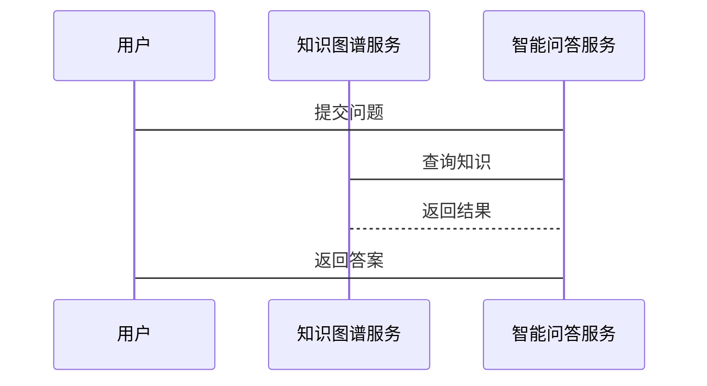

                 


# 构建智能企业知识管理平台：知识图谱与智能问答

> 关键词：知识图谱，智能问答，企业知识管理，自然语言处理，知识管理平台

> 摘要：本文详细探讨了构建智能企业知识管理平台的核心技术，包括知识图谱的构建与应用，智能问答系统的原理与实现，以及两者在企业知识管理中的协同作用。通过系统化的分析和实践案例，本文为读者提供了从理论到实践的全面指导，帮助企业在数字化转型中提升知识管理效率和智能化水平。

---

## 第1章: 企业知识管理平台的背景与挑战

### 1.1 问题背景

#### 1.1.1 企业知识管理的现状与痛点

企业的知识管理通常面临以下问题：
- **知识分散**：企业中的知识分布在不同的部门、系统和员工的头脑中，形成“知识孤岛”。
- **信息碎片化**：缺乏统一的结构化知识体系，导致知识检索困难。
- **知识更新不及时**：知识的生成、存储和更新过程不够自动化，容易过时。
- **知识利用效率低**：员工难以快速获取所需知识，影响工作效率。

#### 1.1.2 知识孤岛与信息碎片化问题

知识孤岛指的是不同团队或系统之间缺乏有效的知识共享和协同，导致资源浪费和效率低下。信息碎片化则使得知识难以被系统化利用，员工需要花费大量时间在多个系统中查找信息。

#### 1.1.3 传统知识管理的局限性

传统知识管理通常依赖文件存储和简单的搜索功能，难以应对复杂的知识关联和动态变化的需求。此外，传统方法缺乏智能化，无法主动提供知识支持。

### 1.2 问题描述

#### 1.2.1 知识管理的目标与需求

企业知识管理的目标是通过构建统一的知识体系，实现知识的高效存储、检索和应用，提升企业的决策能力和竞争力。

#### 1.2.2 知识图谱与智能问答的核心问题

- 知识图谱：如何从非结构化数据中提取知识，并构建语义网络。
- 智能问答：如何基于知识图谱实现自然语言问答，提供准确的知识支持。

#### 1.2.3 企业知识管理平台的构建目标

构建一个智能化的知识管理平台，整合企业内外部知识资源，提供高效的问答服务，支持企业的日常运营和决策。

### 1.3 问题解决

#### 1.3.1 知识图谱技术的引入

知识图谱通过构建语义网络，将分散的知识点连接起来，提供结构化的知识表示，方便后续的智能处理。

#### 1.3.2 智能问答系统的应用

智能问答系统基于知识图谱，通过自然语言处理技术，实现用户的自然语言查询，并返回准确的答案。

#### 1.3.3 企业知识管理平台的新模式

结合知识图谱和智能问答，构建一个智能化的知识管理平台，实现知识的自动化处理和智能化服务。

### 1.4 问题的边界与外延

#### 1.4.1 知识图谱的边界

知识图谱的构建范围通常包括企业的核心业务领域，如产品、客户、供应链等。

#### 1.4.2 智能问答的边界

智能问答主要应用于企业内部的知识查询，不涉及外部网络搜索。

#### 1.4.3 企业知识管理平台的外延

平台可以扩展到客户支持、培训、合规管理等多个领域。

### 1.5 概念结构与核心要素

#### 1.5.1 知识图谱的核心要素

- 实体：企业中的关键概念，如产品、客户、员工。
- 关系：实体之间的联系，如“属于”、“关联”。
- 属性：实体的描述信息，如产品类型、客户等级。

#### 1.5.2 智能问答的核心要素

- 问答模型：基于知识图谱的问答算法。
- 自然语言处理：文本理解和生成技术。
- 知识库：结构化的知识存储。

#### 1.5.3 企业知识管理平台的整体架构

- 知识图谱构建模块：负责知识抽取和图谱构建。
- 智能问答模块：实现自然语言问答。
- 知识管理模块：提供知识的存储、更新和维护功能。

### 1.6 本章小结

本章介绍了企业知识管理的背景和挑战，提出了构建智能知识管理平台的目标，并分析了知识图谱和智能问答的核心作用。

---

## 第2章: 知识图谱与智能问答的核心概念

### 2.1 知识图谱的原理

#### 2.1.1 知识图谱的定义与特点

知识图谱是一种用于描述实体及其关系的语义网络，具有结构化、语义化和动态更新的特点。

#### 2.1.2 知识图谱的构建过程

1. **知识抽取**：从文本中提取实体、关系和属性。
2. **实体识别**：识别文本中的具体实体。
3. **关系抽取**：识别实体之间的关系。

#### 2.1.3 知识图谱的表示方法

使用图数据库（如Neo4j）或RDF（Resource Description Framework）进行存储和表示。

### 2.2 智能问答的原理

#### 2.2.1 智能问答的定义与特点

智能问答是一种基于自然语言处理技术，通过理解用户意图，从知识库中检索答案的技术。

#### 2.2.2 智能问答的关键技术

- **意图理解**：识别用户的查询意图。
- **知识检索**：基于意图从知识库中检索相关信息。
- **答案生成**：根据检索结果生成自然语言回答。

#### 2.2.3 智能问答的应用场景

- 企业内部问答：员工查询公司政策、产品信息。
- 客户支持：为客户提供产品咨询和问题解答。

### 2.3 知识图谱与智能问答的关系

#### 2.3.1 知识图谱在智能问答中的作用

知识图谱提供结构化的知识存储，支持智能问答的高效检索。

#### 2.3.2 智能问答对知识图谱的依赖

智能问答依赖知识图谱的结构化知识来实现准确的回答。

#### 2.3.3 两者结合的优势

- 提高问答的准确性和效率。
- 实现知识的深度理解和应用。

### 2.4 核心概念对比分析

| 概念 | 知识图谱 | 智能问答 |
|------|----------|----------|
| 核心目标 | 表示知识 | 回答问题 |
| 主要技术 | 实体识别、关系抽取 | 意图理解、知识检索 |
| 应用场景 | 企业知识管理 | 客户支持、内部咨询 |

### 2.5 ER实体关系图

```mermaid
erd
    title 实体关系图
    rectangle 实体 {
        类别：产品、客户、员工
    }
    rectangle 关系 {
        关系：属于、关联
    }
    rectangle 属性 {
        属性：产品类型、客户等级
    }
    实体 - 关系
    实体 - 属性
```

---

## 第3章: 知识图谱与智能问答的算法原理

### 3.1 知识图谱的构建算法

#### 3.1.1 知识抽取算法

使用自然语言处理技术从文本中提取实体、关系和属性。

#### 3.1.2 实体识别算法

基于机器学习的实体识别模型，如CRF（条件随机场）。

#### 3.1.3 关系抽取算法

基于规则或深度学习的关系抽取模型，如双向LSTM。

### 3.2 智能问答的算法

#### 3.2.1 基于知识图谱的问答算法

- **意图理解**：使用词嵌入模型（如Word2Vec）进行意图分类。
- **知识检索**：基于意图在知识图谱中进行语义匹配。
- **答案生成**：使用模板生成回答。

#### 3.2.2 基于深度学习的问答算法

- **模型选择**：使用预训练的大语言模型（如BERT）进行问答。
- **微调模型**：在企业知识库上进行微调，提升回答准确性。

#### 3.2.3 基于规则的问答算法

- **规则定义**：根据知识图谱中的关系定义回答规则。
- **规则匹配**：根据用户问题匹配相关规则，生成回答。

### 3.3 算法原理的数学模型

#### 3.3.1 知识图谱的表示学习模型

使用图嵌入技术（如Node2Vec）将实体和关系表示为向量。

#### 3.3.2 智能问答的匹配模型

基于余弦相似度计算用户问题与知识图谱中的节点相似度。

#### 3.3.3 算法的数学公式推导

1. **实体表示**：使用向量表示法，$e_i = [e_{i1}, e_{i2}, ..., e_{in}]^T$。
2. **关系表示**：使用关系向量表示法，$r_j = [r_{j1}, r_{j2}, ..., r_{jn}]^T$。
3. **问答匹配**：计算用户问题向量与知识节点向量的相似度，公式为：
   $$ \text{similarity}(q, e_i) = \frac{q \cdot e_i}{\|q\| \cdot \|e_i\|} $$

### 3.4 算法实现的Python代码

#### 3.4.1 知识图谱构建的Python代码

```python
import networkx as nx

G = nx.Graph()
G.add_nodes_from(["产品", "客户", "员工"])
G.add_edges_from([("产品", "客户"), ("客户", "员工")])
print(G.nodes())
print(G.edges())
```

#### 3.4.2 智能问答系统的Python代码

```python
from sentence_transformers import SentenceTransformer
import numpy as np

model = SentenceTransformer('bert-base-nli-mean-tokens')
embedding = model.encode("用户问题")
```

### 3.5 算法的优缺点分析

- **知识图谱构建**：
  - 优点：结构化存储，支持语义查询。
  - 缺点：构建成本高，需要大量标注数据。
- **智能问答**：
  - 优点：提供自然语言交互，提高用户体验。
  - 缺点：依赖知识图谱的质量，回答可能不够灵活。

---

## 第4章: 系统分析与架构设计方案

### 4.1 问题场景介绍

#### 4.1.1 企业知识管理的典型场景

- 员工咨询公司政策。
- 客户咨询产品信息。

### 4.2 系统功能设计

#### 4.2.1 知识图谱构建模块

- 数据抽取：从文档中提取实体、关系和属性。
- 数据存储：将知识图谱存储在图数据库中。

#### 4.2.2 智能问答模块

- 用户输入：支持自然语言输入。
- 智能回答：基于知识图谱生成回答。

#### 4.2.3 知识管理模块

- 知识更新：支持知识的动态更新。
- 权限管理：控制知识的访问权限。

### 4.3 系统架构设计

#### 4.3.1 分层架构设计

- **数据层**：知识图谱的存储和管理。
- **业务逻辑层**：处理用户的查询请求。
- **用户界面层**：提供友好的用户界面。

#### 4.3.2 微服务架构设计

- **知识图谱服务**：负责知识图谱的构建和存储。
- **智能问答服务**：提供自然语言问答功能。

### 4.4 系统接口设计

- **知识查询接口**：用户输入问题，系统返回答案。
- **知识更新接口**：支持知识的动态更新。

### 4.5 系统交互序列图



---

## 第5章: 项目实战

### 5.1 环境安装

- **Python**：安装Python 3.8及以上版本。
- **依赖库**：安装`networkx`、`numpy`、`sentence-transformers`等库。

### 5.2 核心代码实现

#### 5.2.1 知识图谱构建

```python
import networkx as nx

G = nx.Graph()
G.add_nodes_from(["产品", "客户", "员工"])
G.add_edges_from([("产品", "客户"), ("客户", "员工")])
```

#### 5.2.2 智能问答实现

```python
from sentence_transformers import SentenceTransformer

model = SentenceTransformer('bert-base-nli-mean-tokens')
embedding = model.encode("用户问题")
```

### 5.3 案例分析

#### 5.3.1 案例1：员工查询公司政策

- **用户输入**：公司有哪些部门？
- **系统处理**：智能问答服务查询知识图谱，返回部门信息。

#### 5.3.2 案例2：客户咨询产品信息

- **用户输入**：产品的功能是什么？
- **系统处理**：智能问答服务查询知识图谱，返回产品功能。

### 5.4 项目小结

通过实际案例，展示了知识图谱与智能问答在企业知识管理中的应用，验证了平台的有效性和实用性。

---

## 第6章: 最佳实践与扩展阅读

### 6.1 最佳实践

- **数据质量管理**：确保知识图谱的数据质量。
- **模型优化**：定期更新问答模型，提升回答准确性。
- **用户体验优化**：提供多语言支持和多渠道访问。

### 6.2 小结

本文详细介绍了构建智能企业知识管理平台的核心技术，包括知识图谱和智能问答的原理、算法实现以及系统架构设计。

### 6.3 注意事项

- 知识图谱的构建需要持续投入，定期更新。
- 智能问答的准确性依赖于知识图谱的质量。

### 6.4 拓展阅读

- 推荐阅读《知识图谱实战：方法、工具与案例》。
- 参考自然语言处理领域的最新研究成果。

---

## 作者

**作者：AI天才研究院/AI Genius Institute & 禅与计算机程序设计艺术/Zen And The Art of Computer Programming**

---

这篇文章系统地介绍了构建智能企业知识管理平台的核心技术，从理论到实践，为读者提供了全面的指导。

