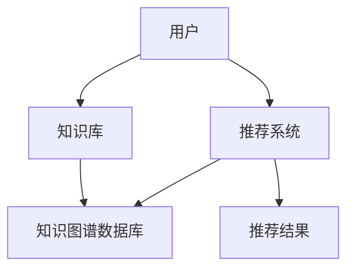

                 


# 建构智能企业知识管理系统：个性化推荐与知识图谱集成

## 关键词：知识管理系统，个性化推荐，知识图谱，推荐算法，企业信息化

## 摘要：
本文系统地探讨了构建智能企业知识管理系统的理论基础与实践方法，重点分析了个性化推荐与知识图谱在系统中的集成与应用。文章首先阐述了企业知识管理的现状与挑战，详细分析了个性化推荐和知识图谱的核心概念与原理。随后，从算法角度深入探讨了协同过滤、矩阵分解等推荐算法，以及知识图谱的构建与表示方法。接着，通过系统分析与架构设计，结合实际案例，详细讲解了系统的功能设计与实现方案。最后，本文总结了系统构建的关键经验与未来发展方向。

---

# 第1章: 企业知识管理的现状与挑战

## 1.1 问题背景
### 1.1.1 企业知识管理的现状
企业在信息化建设中，面临着数据分散、知识孤岛、信息检索效率低下的问题。传统知识管理系统通常依赖简单的关键词检索，难以满足用户个性化、深度化的知识需求。

### 1.1.2 知识管理系统的核心目标
构建智能知识管理系统的目标是通过技术手段，实现知识的高效存储、组织、检索与共享，同时提供个性化的知识推荐服务，提升企业员工的知识获取效率。

### 1.1.3 个性化推荐与知识图谱的结合意义
个性化推荐能够基于用户行为和偏好，提供精准的知识推送；知识图谱则能够构建企业知识的语义网络，帮助系统理解知识之间的关联关系。两者的结合能够显著提升知识管理系统的智能性与实用性。

## 1.2 问题描述
### 1.2.1 传统知识管理系统的局限性
- 知识存储分散，缺乏统一的组织结构。
- 信息检索依赖关键词匹配，无法理解语义。
- 缺乏个性化服务，知识推荐缺乏针对性。

### 1.2.2 智能化知识管理的需求
- 实现知识的语义化存储与组织。
- 提供个性化的知识推荐服务。
- 支持跨部门的知识共享与协作。

### 1.2.3 个性化推荐在知识管理中的作用
通过分析用户的知识需求、行为偏好，提供精准的知识推送，帮助用户快速找到所需信息，提升工作效率。

## 1.3 问题解决思路
### 1.3.1 知识图谱的核心概念
知识图谱是一种以图结构表示知识的语义网络，能够描述实体之间的关系，支持语义检索与推理。

### 1.3.2 个性化推荐算法的基本原理
基于用户行为数据和知识图谱中的语义信息，利用推荐算法生成个性化的内容推荐。

### 1.3.3 知识图谱与推荐系统的结合方式
通过知识图谱构建语义网络，利用推荐算法在语义网络中进行知识推理，生成个性化的推荐结果。

## 1.4 系统的边界与外延
### 1.4.1 知识管理系统的边界
系统的边界包括知识的采集、存储、组织、检索与推荐功能。

### 1.4.2 知识图谱的构建范围
知识图谱的构建范围包括企业内部实体、关系、属性的定义与关联。

### 1.4.3 推荐系统的应用范围
推荐系统的应用范围包括用户行为分析、知识关联推理、个性化推荐生成。

## 1.5 核心概念结构与组成
### 1.5.1 知识图谱的组成要素
- 实体：知识的基本单元。
- 关系：实体之间的关联。
- 属性：实体的特征描述。

### 1.5.2 推荐系统的组成要素
- 用户：推荐的目标对象。
- 物品：推荐的内容。
- 算法：推荐的核心引擎。

### 1.5.3 两者的关联与协同
知识图谱为推荐系统提供语义信息，推荐系统基于知识图谱进行推理，生成个性化推荐结果。

---

# 第2章: 知识图谱原理与实现

## 2.1 知识图谱的基本原理
### 2.1.1 知识图谱的定义与特点
知识图谱是一种语义网络，能够表示实体之间的关系，支持语义检索与推理。

### 2.1.2 知识图谱的构建流程
1. 数据采集：从企业知识库、文档、数据库中采集数据。
2. 数据清洗：去除噪声数据，确保数据质量。
3. 实体识别：识别文本中的实体。
4. 关系抽取：提取实体之间的关系。
5. 知识融合：整合多源数据，构建统一的知识图谱。
6. 知识存储：将知识图谱存储于数据库中。

### 2.1.3 知识图谱的存储与表示
知识图谱通常采用图数据库（如Neo4j）进行存储，使用节点和边表示实体与关系。

## 2.2 知识图谱的属性特征对比
### 2.2.1 实体与关系的属性特征
| 特性 | 实体 | 关系 |
|------|------|------|
| 类型 | 表示具体事物或概念 | 表示实体之间的关联 |
| 属性 | 包括名称、类型、描述等 | 包括关系类型、关系描述等 |
| 示例 | 书籍、作者、出版社 | 作者撰写书籍 |

### 2.2.2 实体类型与关系类型的对比
- 实体类型：类别化的实体，如“人”、“书籍”。
- 关系类型：描述实体间关系的类型，如“作者”、“出版”。

### 2.2.3 知识图谱的可扩展性分析
知识图谱通过增加新的实体和关系，能够方便地扩展知识库，适应企业发展的需求。

## 2.3 知识图谱的ER实体关系图
```mermaid
er
actor: 用户
class: 实体类型
relation: 关系类型
actor --> class: 实体实例
class --> relation: 关系实例
```

---

## 2.4 知识图谱的存储与表示
### 2.4.1 知识图谱的存储方式
知识图谱通常存储于图数据库中，支持高效的查询与推理。

### 2.4.2 知识图谱的表示形式
知识图谱可以用RDF（资源描述框架）或JSON-LD等格式表示。

---

# 第3章: 个性化推荐算法原理

## 3.1 推荐算法的基本原理
### 3.1.1 基于协同过滤的推荐算法
协同过滤是一种基于用户行为相似性的推荐方法，包括基于用户的协同过滤和基于物品的协同过滤。

### 3.1.2 基于内容的推荐算法
内容推荐算法基于物品的属性特征，通过计算相似度进行推荐。

### 3.1.3 混合推荐算法的基本原理
混合推荐算法结合多种推荐算法的优势，通过加权融合生成最终的推荐结果。

## 3.2 推荐算法的数学模型
### 3.2.1 协同过滤的数学公式
$$相似度计算公式：sim(i,j) = \frac{\sum_{k} (r_{ik} - \bar{r}_i)(r_{jk} - \bar{r}_j)}{\sqrt{\sum_{k} (r_{ik} - \bar{r}_i)^2} \sqrt{\sum_{k} (r_{jk} - \bar{r}_j)^2}}$$

### 3.2.2 矩阵分解的数学模型
$$X = U \cdot V^T$$
其中，X是用户-物品的评分矩阵，U是用户特征矩阵，V是物品特征矩阵。

### 3.2.3 基于图嵌入的推荐模型
通过知识图谱中的实体和关系进行图嵌入，生成用户和物品的向量表示，用于推荐计算。

## 3.3 推荐算法的实现步骤
### 3.3.1 数据预处理
- 数据清洗：去除噪声数据。
- 特征提取：提取用户行为特征。

### 3.3.2 模型训练
- 选择合适的推荐算法，进行模型训练。
- 调参优化，提升推荐效果。

### 3.3.3 推荐结果生成
- 基于训练好的模型，生成推荐列表。

---

## 3.4 推荐系统的优缺点分析
### 3.4.1 协同过滤的优点
- 简单易实现，能够捕捉用户的偏好。
- 对冷启动问题的处理较为困难。

### 3.4.2 基于内容的推荐的优点
- 能够理解物品的内容特征，推荐结果更具相关性。
- 对数据稀疏性问题的处理能力较弱。

### 3.4.3 混合推荐的优点
- 结合多种推荐方法，推荐效果更优。
- 实现复杂度较高，需要处理多模型的融合问题。

---

# 第4章: 知识图谱与推荐系统集成

## 4.1 知识图谱在推荐系统中的应用
### 4.1.1 基于知识图谱的推荐模型
通过构建知识图谱，利用图结构中的语义信息，提升推荐的准确性与相关性。

### 4.1.2 知识图谱的特征表示
将实体和关系表示为向量，用于推荐系统的特征计算。

## 4.2 推荐系统与知识图谱的结合方式
### 4.2.1 基于知识图谱的用户建模
通过知识图谱中的用户特征，构建更精准的用户画像。

### 4.2.2 基于知识图谱的物品推荐
利用知识图谱中的语义关系，进行物品的关联推荐。

### 4.2.3 知识图谱的语义增强
通过知识图谱的语义信息，增强推荐系统的理解能力，提升推荐质量。

## 4.3 知识图谱与推荐系统集成的实现步骤
### 4.3.1 知识图谱的构建与存储
构建企业知识图谱，存储于图数据库中。

### 4.3.2 推荐算法的改进与优化
在传统推荐算法中引入知识图谱的语义信息，优化推荐效果。

### 4.3.3 推荐结果的语义增强
基于知识图谱的语义信息，生成更精准的推荐结果。

---

# 第5章: 系统分析与架构设计

## 5.1 系统功能设计
### 5.1.1 知识采集与存储
- 数据采集模块：从企业知识库、文档、数据库中采集数据。
- 数据存储模块：将知识存储于知识图谱数据库中。

### 5.1.2 知识组织与管理
- 实体识别模块：识别文本中的实体。
- 关系抽取模块：提取实体之间的关系。

### 5.1.3 个性化推荐服务
- 用户行为分析模块：分析用户的知识需求与行为偏好。
- 推荐算法模块：基于知识图谱与用户行为，生成个性化推荐结果。

## 5.2 系统架构设计
### 5.2.1 系统架构图


### 5.2.2 接口设计
- 用户接口：提供知识查询与推荐结果展示。
- 知识库接口：提供知识数据的读写接口。
- 推荐系统接口：提供推荐服务的调用接口。

## 5.3 系统交互流程
### 5.3.1 知识查询流程
1. 用户提交查询请求。
2. 系统基于知识图谱进行语义检索。
3. 返回相关知识结果。

### 5.3.2 个性化推荐流程
1. 系统采集用户的行为数据。
2. 基于知识图谱与推荐算法生成推荐列表。
3. 推送推荐结果给用户。

---

# 第6章: 项目实战与优化

## 6.1 项目环境与工具安装
### 6.1.1 开发环境
- 操作系统：Windows/Linux/

