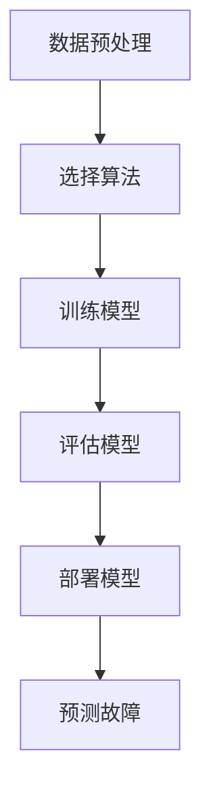

                 


# 构建智能企业资产管理平台：全生命周期优化与预测性维护系统

> 关键词：智能资产管理、预测性维护、全生命周期管理、物联网、机器学习、大数据分析

> 摘要：智能企业资产管理平台通过整合物联网、大数据分析和机器学习等技术，实现了对企业资产的全生命周期管理与预测性维护。本文从背景与概述出发，详细阐述了智能资产管理的核心概念、算法原理、系统架构设计、项目实战及最佳实践，为读者提供了一套完整的解决方案。

---

# 第一部分：智能企业资产管理平台的背景与概述

## 第1章：企业资产管理的现状与挑战

### 1.1 企业资产管理的定义与重要性

#### 1.1.1 资产管理的基本概念
资产是指企业在运营过程中所拥有或控制的资源，包括设备、工具、建筑物、土地等有形资产，以及专利、商标、软件等无形资产。资产管理的目标是通过科学的管理方法，最大化资产的使用效率和价值。

#### 1.1.2 企业资产管理的重要性
企业资产管理是企业运营的核心环节之一。有效的资产管理可以降低运营成本、提高设备利用率、延长资产寿命，并为企业创造更大的经济效益。此外，资产管理还能帮助企业更好地应对突发事件，例如设备故障，从而减少停机时间。

#### 1.1.3 企业资产管理的常见挑战
尽管资产管理的重要性不言而喻，但在实际操作中，企业仍面临诸多挑战：
- 数据分散：资产数据分布在不同的部门和系统中，难以实现统一管理。
- 数据不准确：由于人为操作或系统问题，资产数据可能存在错误。
- 维护成本高：传统资产管理方式依赖人工操作，效率低且成本高。
- 预测性维护不足：企业难以准确预测设备故障，导致维修成本增加。

### 1.2 传统资产管理的局限性

#### 1.2.1 传统资产管理的流程
传统资产管理通常采用手工记录或简单的信息化工具，流程包括资产登记、日常维护、定期检查和报废处理等。这种方式效率低下，容易出现数据错误和管理不善的问题。

#### 1.2.2 传统管理中的效率问题
传统资产管理方式依赖人工操作，容易出现以下问题：
- 数据更新不及时：资产信息可能 outdated，导致决策失误。
- 维护计划不合理：缺乏数据支持，难以制定科学的维护计划。
- 成本控制困难：由于缺乏数据分析，难以有效降低维护成本。

#### 1.2.3 数据孤岛与信息不透明
在传统资产管理中，数据往往分散在不同的部门和系统中，导致信息孤岛现象。这种状况使得资产管理人员难以获取全面的数据，影响管理决策的准确性。

### 1.3 智能化资产管理的必要性

#### 1.3.1 智能化资产管理的定义
智能化资产管理是指利用先进的技术手段，如物联网、大数据分析和人工智能，对资产进行实时监控、预测性维护和优化管理。这种方式能够提高资产管理的效率和准确性，降低成本。

#### 1.3.2 智能化管理的优势
智能化资产管理相比传统方式具有显著优势：
- 实时监控：通过物联网技术，可以实时采集资产运行数据，及时发现潜在问题。
- 数据驱动决策：利用大数据分析，可以科学制定维护计划，优化资产利用率。
- 预测性维护：通过机器学习算法，可以预测设备故障，减少停机时间。

#### 1.3.3 数字化转型的驱动力
数字化转型是企业提升竞争力的重要手段。通过智能化资产管理，企业可以实现资产的全生命周期管理，提高运营效率，降低成本，并增强市场竞争力。

### 1.4 全生命周期管理的概念

#### 1.4.1 资产全生命周期的定义
资产全生命周期管理是指从资产的规划、采购、使用、维护到报废的全过程进行管理。这种方式能够全面掌握资产的生命周期，优化资产的使用效率。

#### 1.4.2 各阶段的管理重点
资产全生命周期管理包括以下几个阶段：
- 规划与采购：根据企业需求制定采购计划，选择合适的资产。
- 使用与维护：对资产进行日常维护和管理，确保其正常运行。
- 更新与淘汰：根据资产状态和企业需求，进行更新或淘汰。

#### 1.4.3 生命周期管理的整合与优化
通过整合资产全生命周期管理，企业可以实现资产的高效利用。例如，通过数据分析，可以优化采购计划，减少库存积压；通过预测性维护，可以延长设备寿命，降低维护成本。

### 1.5 预测性维护的意义

#### 1.5.1 预测性维护的定义
预测性维护是指通过分析设备运行数据，预测设备可能出现的故障，并提前采取维护措施。这种方式可以减少设备故障的发生，降低维修成本。

#### 1.5.2 预测性维护的优势
预测性维护相比传统维护方式具有以下优势：
- 减少停机时间：通过提前预测故障，可以及时进行维护，避免设备突然故障导致的停机。
- 降低维护成本：预测性维护可以减少不必要的维护操作，降低维护成本。
- 提高设备利用率：通过科学的维护计划，可以延长设备的使用寿命。

#### 1.5.3 预测性维护的应用场景
预测性维护适用于各种设备的管理，尤其是那些对生产连续性要求较高的设备。例如，制造业中的生产线设备、电力设备等。

### 1.6 本章小结
本章详细介绍了企业资产管理的现状与挑战，分析了传统管理方式的局限性，并提出了智能化资产管理的必要性和优势。通过资产全生命周期管理和预测性维护，企业可以实现资产的高效利用，降低成本，提高竞争力。

---

## 第2章：智能企业资产管理平台的核心概念

### 2.1 资产管理平台的定义与组成

#### 2.1.1 平台的定义
智能企业资产管理平台是一个基于物联网、大数据分析和人工智能技术的综合性管理平台。它能够实现资产的实时监控、预测性维护和优化管理。

#### 2.1.2 平台的组成部分
智能资产管理平台主要包括以下几个部分：
- 数据采集层：通过物联网设备采集资产运行数据。
- 数据处理层：对采集的数据进行清洗、转换和存储。
- 数据分析层：利用大数据分析和机器学习技术，对数据进行分析和预测。
- 用户界面层：为用户提供直观的管理界面，展示分析结果和维护建议。

#### 2.1.3 平台的核心功能
智能资产管理平台的核心功能包括：
- 实时监控：对资产运行状态进行实时监控，及时发现潜在问题。
- 数据分析：利用大数据技术对资产数据进行分析，提供决策支持。
- 预测性维护：通过机器学习算法，预测设备故障，制定维护计划。
- 维护管理：对维护计划的执行情况进行记录和跟踪。

### 2.2 资产管理平台的核心概念与联系

#### 2.2.1 核心概念原理
智能资产管理平台的核心原理是通过物联网设备采集资产数据，利用大数据分析和机器学习技术对数据进行分析，预测设备故障，并制定维护计划。这种方式能够实现资产的全生命周期管理，提高管理效率。

#### 2.2.2 核心概念属性特征对比表
以下是一个核心概念属性特征对比表：

| 概念 | 特征 | 描述 |
|------|------|------|
| 数据采集 | 实时性 | 数据采集必须实时进行，确保数据的准确性。 |
| 数据分析 | 精准性 | 数据分析需要精准，能够准确预测设备故障。 |
| 预测性维护 | 及时性 | 预测性维护需要及时执行，避免设备故障。 |

#### 2.2.3 ER实体关系图
以下是资产管理平台的ER实体关系图：

```mermaid
er
    %% ER Entity Relationship Diagram for Asset Management Platform
    %% Entities:
    entity Asset {
        key AssetID
        string Name
        string Description
        date PurchaseDate
        date WarrantyExpiryDate
        decimal Cost
    }

    entity MaintenancePlan {
        key PlanID
        date PlanStartDate
        date PlanEndDate
        string PlanType
        Asset -> MaintenancePlan: is_planned_for
    }

    entity MaintenanceRecord {
        key RecordID
        date RecordDate
        string RecordDescription
        Asset -> MaintenanceRecord: has_record
    }

    entity SensorData {
        key DataID
        datetime Timestamp
        decimal Value
        Asset -> SensorData: generates_data
    }
```

---

## 第3章：预测性维护算法原理与实现

### 3.1 预测性维护算法原理

#### 3.1.1 算法原理概述
预测性维护算法主要是利用机器学习技术，对设备运行数据进行分析，预测设备可能出现的故障。常用的算法包括回归分析、分类算法和时间序列分析等。

#### 3.1.2 机器学习算法的选择
在预测性维护中，回归分析和分类算法是常用的机器学习算法。例如，回归分析可以用于预测设备的剩余寿命，分类算法可以用于预测设备是否会出现故障。

#### 3.1.3 算法流程
以下是预测性维护算法的流程图：



---

## 第4章：系统架构设计与实现

### 4.1 系统架构设计

#### 4.1.1 系统功能模块设计
智能资产管理平台的功能模块包括：
- 数据采集模块：负责采集资产运行数据。
- 数据存储模块：对数据进行存储和管理。
- 数据分析模块：对数据进行分析和预测。
- 用户界面模块：为用户提供管理界面。

#### 4.1.2 系统架构图
以下是系统架构图：


---

## 第5章：项目实战与案例分析

### 5.1 项目环境安装与配置

#### 5.1.1 安装Python环境
在开始开发之前，需要安装Python环境。推荐使用Anaconda，因为它集成了常用的Python库和工具。

#### 5.1.2 安装数据库
选择一个合适的数据库，例如MySQL或MongoDB，并安装相应的驱动程序。

#### 5.1.3 安装物联网设备
如果需要，可以购买一些物联网设备，例如传感器、智能卡等。

---

## 第6章：最佳实践与小结

### 6.1 最佳实践

#### 6.1.1 系统设计注意事项
在设计智能资产管理平台时，需要注意系统的可扩展性、可维护性和安全性。例如，系统需要能够支持多种设备和数据格式，同时具备强大的数据安全保护措施。

#### 6.1.2 项目实施中的注意事项
在项目实施过程中，需要注意以下几点：
- 数据质量：确保采集的数据准确、完整。
- 系统集成：确保系统能够与其他企业系统（如ERP、CRM）无缝集成。
- 用户培训：对系统用户进行充分的培训，确保系统能够顺利上线。

### 6.2 小结

通过本章的介绍，我们详细讲解了智能企业资产管理平台的构建过程，包括背景与概述、核心概念与技术、算法原理、系统架构设计、项目实战和最佳实践。希望读者能够通过本文，全面了解如何构建一个高效的智能企业资产管理平台。

---

## 作者信息

作者：AI天才研究院/AI Genius Institute & 禅与计算机程序设计艺术 /Zen And The Art of Computer Programming

---

以上是文章的完整内容，涵盖了从背景到技术实现再到项目实战的全过程，帮助读者全面了解如何构建智能企业资产管理平台。

