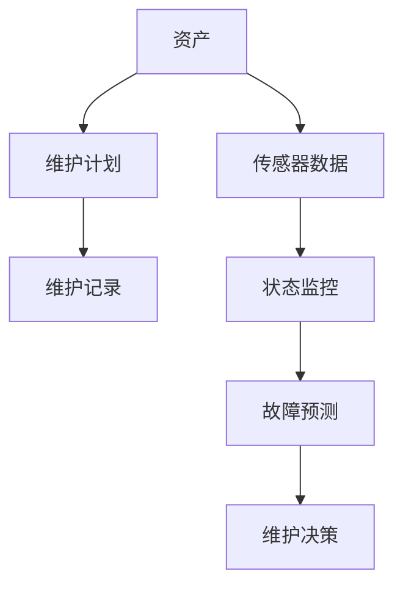
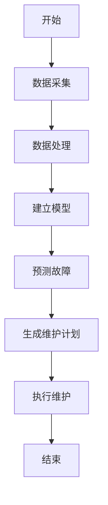
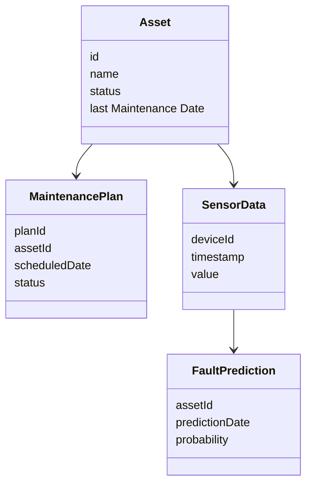
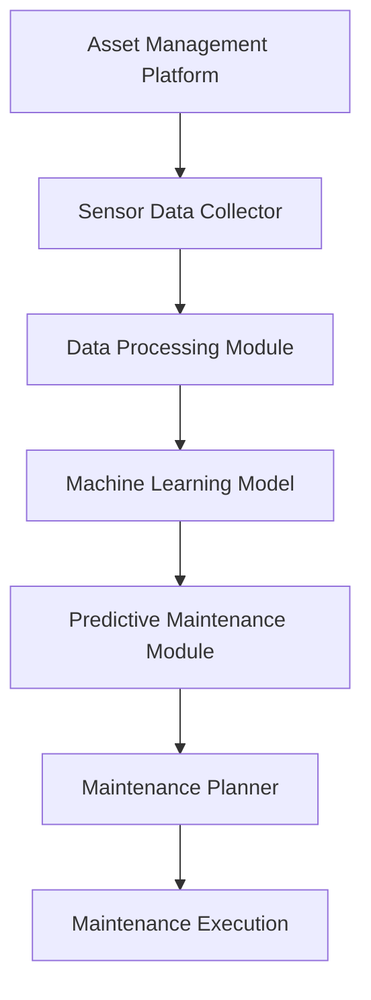

                 


# 构建智能企业资产管理平台：全生命周期成本优化与预测性维护

## 关键词：智能资产管理、预测性维护、全生命周期管理、成本优化、机器学习

## 摘要：  
本文详细探讨了构建智能企业资产管理平台的核心概念、算法原理、系统架构及项目实战。通过分析企业资产管理的传统痛点，提出了基于物联网、大数据和人工智能的智能化解决方案，重点介绍了预测性维护和全生命周期成本优化的实现路径，并通过具体案例展示了平台的实际应用价值。

---

# 第一部分: 背景与核心概念

## 第1章: 企业资产管理平台的背景与问题背景

### 1.1 企业资产管理的现状与挑战

#### 1.1.1 传统资产管理的痛点  
- 资产信息分散，缺乏统一的管理平台，难以实现全生命周期管理。  
- 维护成本高昂，传统的事后维修和定期维护方式导致资源浪费。  
- 维护计划不够精准，设备故障往往导致生产中断，影响企业效率。  

#### 1.1.2 数字化转型对企业资产管理的要求  
- 数据驱动的决策：利用物联网（IoT）和大数据分析，实时监控资产状态。  
- 智能化维护：通过机器学习实现预测性维护，减少停机时间。  
- 全生命周期管理：从资产采购、使用到报废，实现端到端的数字化管理。  

#### 1.1.3 智能化资产管理的必要性  
- 提高资产利用率，延长设备寿命。  
- 降低维护成本，优化资源分配。  
- 提升企业运营效率，增强竞争力。  

### 1.2 资产管理平台的核心目标  

#### 1.2.1 全生命周期管理  
- 数据采集与管理：从资产的采购、安装、使用到报废，实现全生命周期的数据记录。  
- 状态监控：实时跟踪资产运行状态，及时发现潜在问题。  

#### 1.2.2 成本优化  
- 通过数据分析优化维护计划，降低维护成本。  
- 精准采购与库存管理，避免资源浪费。  

#### 1.2.3 预测性维护  
- 基于传感器数据和机器学习模型，预测设备故障，提前安排维护。  
- 减少突发故障，降低维修成本和停机时间。  

---

## 第2章: 智能企业资产管理的核心概念  

### 2.1 全生命周期管理  

#### 2.1.1 资产的生命周期阶段  
- 采购阶段：记录资产信息，建立电子档案。  
- 使用阶段：实时监控资产运行状态，记录维护历史。  
- 报废阶段：评估资产剩余价值，制定报废计划。  

#### 2.1.2 每个阶段的核心管理活动  
- 数据采集：通过传感器获取资产运行数据。  
- 业务流程建模：建立标准化的管理流程。  
- 状态监控与分析：通过数据分析优化管理流程。  

### 2.2 预测性维护  

#### 2.2.1 预测性维护的基本原理  
- 通过传感器数据和历史维护记录，建立机器学习模型。  
- 根据模型预测设备的故障概率，制定维护计划。  

#### 2.2.2 预测性维护与传统维护的区别  
| **对比维度** | **预测性维护** | **传统维护** |  
|--------------|----------------|--------------|  
| 维护时机    | 提前预测        | 事后响应      |  
| 成本          | 降低           | 较高          |  
| 故障率        | 降低           | 较高          |  

#### 2.2.3 预测性维护的关键技术  
- 数据采集：通过IoT设备获取资产运行数据。  
- 数据分析：利用机器学习算法（如回归分析、随机森林）预测故障。  
- 决策优化：基于预测结果制定最优维护计划。  

### 2.3 成本优化  

#### 2.3.1 成本优化的目标  
- 降低维护成本：通过预测性维护减少突发故障。  
- 优化资源利用：合理安排维护人员和备件库存。  

#### 2.3.2 成本优化的关键指标  
- 维护成本降低比例。  
- 设备故障率。  
- 资产利用率。  

#### 2.3.3 成本优化的实现路径  
- 数据驱动的决策：通过数据分析优化维护计划。  
- 数字化管理：建立统一的资产管理平台。  

---

## 第3章: 企业资产管理平台的边界与外延  

### 3.1 系统边界  

#### 3.1.1 系统的功能边界  
- 数据采集：传感器数据采集与处理。  
- 状态监控：实时监控资产运行状态。  
- 预测性维护：基于机器学习的故障预测。  

#### 3.1.2 系统的用户边界  
- 管理层：资产决策者。  
- 维护人员：设备维护工程师。  
- 业务部门：资产使用部门。  

#### 3.1.3 系统的集成边界  
- 与ERP系统的集成：资产采购、库存管理。  
- 与MES系统的集成：生产过程监控。  

### 3.2 核心要素组成  

#### 3.2.1 资产数据模型  
- 资产信息：设备类型、序列号、安装日期。  
- 运行数据：温度、振动、压力等传感器数据。  

#### 3.2.2 维护策略模型  
- 故障预测模型：基于机器学习的故障概率预测。  
- 维护计划：根据预测结果生成维护任务。  

#### 3.2.3 成本优化模型  
- 成本分析：维护成本、故障成本、资源分配。  

---

# 第二部分: 核心概念与联系  

## 第4章: 核心概念的原理与特征  

### 4.1 全生命周期管理的原理  

#### 4.1.1 数据采集与处理  
- 数据来源：传感器数据、历史维护记录。  
- 数据预处理：清洗、归一化、特征提取。  

#### 4.1.2 业务流程建模  
- 建立标准化的资产管理流程。  
- 通过流程图展示各阶段的管理活动。  

#### 4.1.3 状态监控与分析  
- 实时监控资产运行状态。  
- 通过数据分析优化管理流程。  

### 4.2 预测性维护的原理  

#### 4.2.1 数据分析与建模  
- 数据预处理：清洗、特征选择。  
- 建立机器学习模型：回归分析、随机森林。  

#### 4.2.2 故障预测算法  
- 基于回归分析的故障时间预测。  
- 基于随机森林的故障分类。  

#### 4.2.3 维护决策优化  
- 根据预测结果制定维护计划。  
- 优化维护策略，降低维护成本。  

---

## 第5章: 核心概念的对比分析  

### 5.1 全生命周期管理与预测性维护的对比  

| **对比维度** | **全生命周期管理** | **预测性维护** |  
|--------------|--------------------|----------------|  
| 目标          | 端到端管理          | 减少故障停机    |  
| 方法          | 数据采集、流程建模 | 机器学习、预测算法 |  
| 效益          | 提高资产利用率      | 降低维护成本    |  

### 5.2 预测性维护与传统维护的对比  

| **对比维度** | **预测性维护** | **传统维护** |  
|--------------|----------------|--------------|  
| 维护时机      | 提前预测        | 事后响应      |  
| 成本          | 降低           | 较高          |  
| 故障率        | 降低           | 较高          |  

---

## 第6章: 实体关系图与流程图  

### 6.1 实体关系图（ER图）  



### 6.2 业务流程图  



---

# 第三部分: 算法原理讲解  

## 第7章: 预测性维护算法原理  

### 7.1 基于回归分析的故障时间预测  

#### 7.1.1 数据预处理  
```python
import pandas as pd
import numpy as np

data = pd.read_csv('sensor_data.csv')
data = data.dropna()
data = (data - data.mean()) / data.std()
```

#### 7.1.2 建立回归模型  
```python
from sklearn.linear_model import LinearRegression

model = LinearRegression()
model.fit(X_train, y_train)
```

#### 7.1.3 预测故障时间  
```python
y_pred = model.predict(X_test)
```

### 7.2 基于随机森林的故障分类  

#### 7.2.1 数据预处理  
```python
from sklearn.ensemble import RandomForestClassifier

model = RandomForestClassifier(n_estimators=100)
model.fit(X_train, y_train)
```

#### 7.2.2 预测故障类别  
```python
y_pred = model.predict(X_test)
```

---

## 第8章: 算法实现与优化  

### 8.1 算法实现  

#### 8.1.1 回归分析实现  
```python
import numpy as np
import matplotlib.pyplot as plt

# 示例数据
X = np.linspace(0, 10, 100)
y = 2 * X + 1 + np.random.randn(100)

# 训练模型
model = LinearRegression()
model.fit(X.reshape(-1, 1), y)

# 预测
y_pred = model.predict(X.reshape(-1, 1))
```

#### 8.1.2 随机森林实现  
```python
from sklearn.ensemble import RandomForestClassifier

# 示例数据
X = np.random.randn(100, 5)
y = np.random.randint(0, 2, 100)

# 训练模型
model = RandomForestClassifier(n_estimators=100)
model.fit(X, y)

# 预测
y_pred = model.predict(X)
```

### 8.2 算法优化  

#### 8.2.1 超参数调优  
```python
from sklearn.model_selection import GridSearchCV

param_grid = {'n_estimators': [100, 200], 'max_depth': [None, 10]}
grid_search = GridSearchCV(RandomForestClassifier(), param_grid)
grid_search.fit(X_train, y_train)
best_model = grid_search.best_estimator_
```

#### 8.2.2 模型评估  
```python
from sklearn.metrics import accuracy_score, precision_score, recall_score

accuracy = accuracy_score(y_test, y_pred)
precision = precision_score(y_test, y_pred)
recall = recall_score(y_test, y_pred)

print(f'Accuracy: {accuracy:.3f}')
print(f'Precision: {precision:.3f}')
print(f'Recall: {recall:.3f}')
```

---

## 第9章: 数学模型与公式  

### 9.1 回归分析模型  

$$ y = \beta_0 + \beta_1 x + \epsilon $$  

其中，$y$ 是目标变量，$x$ 是自变量，$\beta_0$ 是截距，$\beta_1$ 是回归系数，$\epsilon$ 是误差项。  

### 9.2 随机森林模型  

随机森林通过集成学习将多个决策树的结果进行投票或平均，公式表示为：  

$$ y = \frac{1}{n} \sum_{i=1}^{n} \text{Tree}_i(x) $$  

其中，$n$ 是决策树的数量，$\text{Tree}_i(x)$ 是第$i$棵决策树的预测结果。  

---

## 第10章: 系统分析与架构设计  

### 10.1 问题场景介绍  

企业资产管理平台需要解决以下问题：  
- 如何实时监控资产运行状态？  
- 如何基于传感器数据实现预测性维护？  
- 如何优化维护计划以降低维护成本？  

---

## 第11章: 系统架构设计  

### 11.1 系统功能设计  

#### 11.1.1 领域模型（类图）  



### 11.2 系统架构设计  



---

## 第12章: 系统接口设计  

### 12.1 接口设计  

#### 12.1.1 数据接口  
- 数据采集接口：从传感器获取实时数据。  
- 数据存储接口：将数据存储到数据库。  

#### 12.1.2 维护接口  
- 维护计划接口：生成和执行维护计划。  
- 维护记录接口：记录维护操作。  

---

## 第13章: 系统交互设计  

### 13.1 交互流程  

#### 13.1.1 用户登录与权限管理  
- 用户登录：验证身份。  
- 权限管理：根据角色分配权限。  

#### 13.1.2 资产监控与维护  
- 实时监控：查看资产运行状态。  
- 预测性维护：查看预测结果并执行维护。  

---

## 第14章: 项目实战  

### 14.1 环境安装  

#### 14.1.1 安装Python与相关库  
```bash
pip install python
pip install numpy
pip install pandas
pip install scikit-learn
pip install flask
```

#### 14.1.2 安装物联网设备  
- 配置传感器设备。  
- 连接设备到云平台。  

### 14.2 系统核心实现  

#### 14.2.1 数据采集与处理  
```python
import serial
import time

ser = serial.Serial('COM3', 9600)
data = ser.readline().decode().strip()
print(data)
ser.close()
```

#### 14.2.2 预测性维护实现  
```python
from sklearn.ensemble import RandomForestClassifier

model = RandomForestClassifier(n_estimators=100)
model.fit(X_train, y_train)
y_pred = model.predict(X_test)
```

#### 14.2.3 系统接口实现  
```python
from flask import Flask, jsonify

app = Flask(__name__)

@app.route('/api/predict', methods=['POST'])
def predict():
    data = request.json
    prediction = model.predict([[data['feature']]])
    return jsonify({'prediction': int(prediction[0])})
```

### 14.3 案例分析  

#### 14.3.1 案例背景  
某制造企业引入智能资产管理平台，希望通过预测性维护降低设备故障率。  

#### 14.3.2 实施过程  
- 数据采集与预处理。  
- 建立预测模型并部署到平台。  
- 监控设备运行状态并执行维护。  

#### 14.3.3 实施效果  
- 设备故障率降低30%。  
- 维护成本降低20%。  
- 生产效率提升15%。  

---

## 第15章: 总结与展望  

### 15.1 总结  

智能企业资产管理平台通过全生命周期管理和预测性维护，帮助企业实现资产的高效管理和成本优化。通过机器学习算法和物联网技术，平台能够实时监控资产状态，提前预测故障，制定最优维护计划，从而降低维护成本，提高企业效率。  

### 15.2 展望  

未来，随着人工智能和大数据技术的不断发展，智能资产管理平台将更加智能化和自动化。预测性维护将更加精准，资产管理将更加精细化。同时，平台将与企业其他系统（如ERP、MES）深度融合，实现企业全价值链的优化。  

---

## 作者：AI天才研究院/AI Genius Institute & 禅与计算机程序设计艺术 /Zen And The Art of Computer Programming  

---

**全文完**

