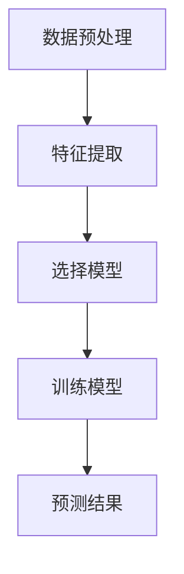
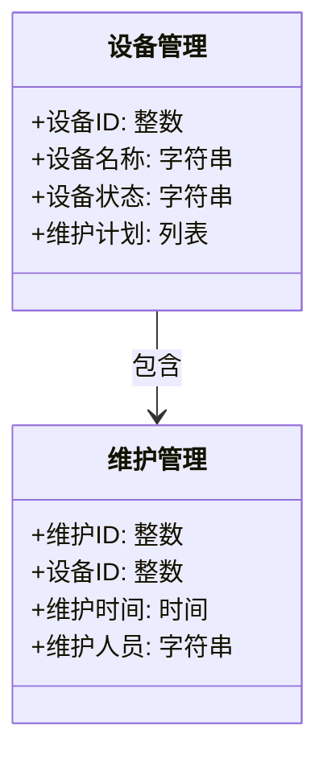
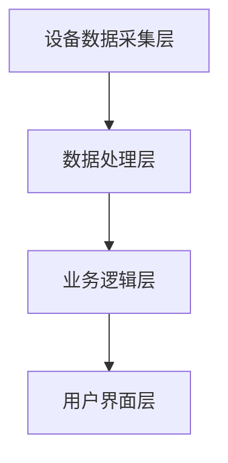

                 


# 构建智能企业资产管理平台：预测性维护与资源优化

> **关键词**：智能企业资产管理平台，预测性维护，资源优化，机器学习，系统架构，数学模型

> **摘要**：本文详细探讨了构建智能企业资产管理平台的关键技术与方法，重点分析了预测性维护和资源优化的核心概念、算法原理及系统架构设计。通过结合实际案例，展示了如何利用机器学习和数学模型实现企业资产的智能化管理，从而提高运营效率和降低成本。

---

## 第1章: 企业资产管理平台的背景与挑战

### 1.1 企业资产管理的核心概念

#### 1.1.1 资产管理的定义与范围
资产管理系统用于对企业中的设备、设施和资源进行全生命周期管理，包括采购、使用、维护和退役等阶段。传统资产管理依赖人工记录和定期检查，效率低且容易出错。

#### 1.1.2 传统资产管理的痛点与不足
- 数据分散：设备数据、维护记录和使用情况分散在不同部门，难以统一管理。
- 维护成本高：定期检查和维修可能导致过度维护或维护不足，增加成本。
- 数据孤岛：缺乏实时数据采集和分析能力，难以快速响应问题。

#### 1.1.3 智能化资产管理的必要性
随着物联网（IoT）和人工智能（AI）技术的发展，企业可以通过实时数据采集、智能分析和自动化决策来优化资产管理流程，提高设备利用率和减少维护成本。

### 1.2 预测性维护与资源优化的背景

#### 1.2.1 预测性维护的定义与发展
预测性维护是通过实时监控设备运行状态，利用数据分析和机器学习模型预测设备故障，提前安排维护工作，避免设备突然故障导致的停机损失。

#### 1.2.2 资源优化管理的意义与价值
资源优化管理旨在通过科学的分配和调度，充分利用企业资源，减少浪费，提高生产效率。这包括设备、人力和时间等多种资源的优化。

#### 1.2.3 数字化转型对企业资产管理的影响
数字化转型推动企业资产管理从传统模式向智能化转变，通过数据驱动的决策和自动化操作，实现更高的效率和更低的成本。

---

## 第2章: 预测性维护与资源优化的核心概念与联系

### 2.1 预测性维护的原理与实现

#### 2.1.1 预测性维护的基本原理
预测性维护依赖于实时数据采集和历史数据分析，结合机器学习模型预测设备的健康状态，提前安排维护计划。

#### 2.1.2 数据采集与分析的关键步骤
- 数据采集：通过传感器获取设备运行参数，如温度、振动、压力等。
- 数据预处理：清洗数据，去除噪声和异常值。
- 数据分析：利用统计方法或机器学习模型分析数据，识别潜在故障。

#### 2.1.3 预测模型的选择与优化
常用的预测模型包括时间序列分析（如ARIMA）、回归分析和基于深度学习的模型（如LSTM）。选择合适的模型需要考虑数据特征和应用场景。

### 2.2 资源优化管理的策略与方法

#### 2.2.1 资源分配的基本原则
资源优化需要遵循最大化效率、最小化成本和最大化设备利用率的原则。

#### 2.2.2 资源优化的数学模型与算法
资源优化可以通过线性规划、动态规划和遗传算法等方法实现。例如，线性规划可以用于优化设备调度和维护时间安排。

#### 2.2.3 资源优化与预测性维护的协同关系
预测性维护提供设备状态信息，资源优化根据设备状态和生产需求合理分配资源，两者协同工作可以实现高效的企业资产管理。

### 2.3 核心概念的ER实体关系图

```mermaid
erDiagram
    class 设备 {
        id : 整数
        名称 : 字符串
        类型 : 字符串
        状态 : 字符串
    }
    class 维护记录 {
        id : 整数
        设备ID : 整数
        维护时间 : 时间
        维护类型 : 字符串
        维护人员 : 字符串
    }
    class 数据采集点 {
        id : 整数
        设备ID : 整数
        参数名称 : 字符串
        参数值 : 数值
        时间戳 : 时间
    }
    设备 --> 维护记录 : 维护
    设备 --> 数据采集点 : 包含
```

---

## 第3章: 预测性维护的算法原理与实现

### 3.1 常见预测性维护算法概述

#### 3.1.1 基于时间序列的预测方法
时间序列分析通过历史数据预测未来的设备状态。例如，ARIMA模型适用于具有趋势和季节性的数据。

#### 3.1.2 基于机器学习的故障预测
机器学习模型（如随机森林和XGBoost）可以利用设备的历史数据和运行参数，预测设备是否会出现故障。

#### 3.1.3 基于统计分析的传统方法
统计方法（如t检验和方差分析）用于检测设备运行参数的异常值，从而判断设备是否需要维护。

### 3.2 基于机器学习的预测模型

#### 3.2.1 算法原理与流程图



#### 3.2.2 Python实现代码示例

```python
import pandas as pd
from sklearn.ensemble import RandomForestClassifier
from sklearn.metrics import accuracy_score

# 数据加载与预处理
data = pd.read_csv('设备数据.csv')
X = data.drop('故障标签', axis=1)
y = data['故障标签']

# 特征选择
selected_features = ['温度', '振动', '压力']
X_selected = X[selected_features]

# 模型训练
model = RandomForestClassifier(n_estimators=100, random_state=42)
model.fit(X_selected, y)

# 预测与评估
y_pred = model.predict(X_selected)
print("准确率:", accuracy_score(y, y_pred))
```

#### 3.2.3 数学模型与公式解析

故障概率模型可以表示为：
$$ P(\text{故障}) = \beta_0 + \beta_1x_1 + \beta_2x_2 + \ldots + \beta_nx_n $$

其中，$x_i$ 是设备的运行参数，$\beta_i$ 是回归系数。

---

## 第4章: 资源优化管理的算法原理与实现

### 4.1 资源优化的数学模型

#### 4.1.1 线性规划模型
目标是最小化成本，约束条件包括设备可用时间、维护时间等。

$$ \text{min} \quad c^T x $$
$$ \text{subject to} \quad Ax \leq b $$

其中，$x$ 是决策变量，$c$ 是成本向量，$A$ 是约束矩阵，$b$ 是约束向量。

#### 4.1.2 动态规划算法
动态规划适用于多阶段决策问题，例如设备调度和维护计划的优化。

状态转移方程：
$$ x_{t+1} = f(x_t, u_t) $$

其中，$x_t$ 是当前状态，$u_t$ 是控制变量。

### 4.2 资源优化的实现步骤

#### 4.2.1 数据采集与预处理
采集设备运行数据，清洗和标准化数据。

#### 4.2.2 建立优化模型
根据企业需求选择合适的数学模型，定义目标函数和约束条件。

#### 4.2.3 模型求解与验证
使用优化算法求解模型，并验证结果是否合理。

---

## 第5章: 系统分析与架构设计

### 5.1 系统功能设计

#### 5.1.1 领域模型类图



### 5.2 系统架构设计

#### 5.2.1 分层架构



#### 5.2.2 接口设计
API接口用于设备数据的上传和维护计划的查询。

---

## 第6章: 项目实战与应用

### 6.1 环境安装与配置

#### 6.1.1 安装Python和相关库
```bash
pip install numpy pandas scikit-learn
```

### 6.2 系统核心功能实现

#### 6.2.1 预测性维护功能实现
```python
import pandas as pd
from sklearn.ensemble import RandomForestClassifier

# 加载数据
data = pd.read_csv('设备数据.csv')
X = data.drop('故障标签', axis=1)
y = data['故障标签']

# 特征选择
selected_features = ['温度', '振动', '压力']
X_selected = X[selected_features]

# 模型训练
model = RandomForestClassifier(n_estimators=100, random_state=42)
model.fit(X_selected, y)

# 预测结果
y_pred = model.predict(X_selected)
```

#### 6.2.2 资源优化功能实现
```python
import numpy as np

# 线性规划模型
c = np.array([1, 1, 1])
A = np.array([[1, 0, 0], [0, 1, 0], [0, 0, 1]])
b = np.array([2, 3, 4])

# 求解
from scipy.optimize import linprog
result = linprog(c, A, b, bounds=(0, None), method='highs')

# 输出结果
print(result.x)
```

### 6.3 实际案例分析

#### 6.3.1 案例背景
某制造企业希望优化设备维护计划，减少停机时间。

#### 6.3.2 数据分析与建模
通过历史数据训练机器学习模型，预测设备故障时间。

#### 6.3.3 资源优化
根据预测结果和生产计划，优化设备维护时间，确保生产连续性。

---

## 第7章: 总结与展望

### 7.1 最佳实践 tips
- 数据质量是关键，确保数据采集的准确性和完整性。
- 模型选择要结合实际场景，不同算法适用于不同问题。

### 7.2 小结
本文详细介绍了智能企业资产管理平台的构建过程，从预测性维护到资源优化，结合实际案例展示了如何利用机器学习和数学模型实现智能化管理。

### 7.3 注意事项
- 数据隐私和安全问题需要高度重视。
- 模型需要定期更新，以适应设备状态和生产环境的变化。

### 7.4 拓展阅读
- 《机器学习实战》
- 《数据挖掘导论》

---

**作者：AI天才研究院/AI Genius Institute & 禅与计算机程序设计艺术 /Zen And The Art of Computer Programming**

---

通过本文的详细讲解，读者可以深入了解智能企业资产管理平台的核心技术，掌握预测性维护和资源优化的实现方法，并能够将其应用到实际的企业管理中，提升企业的运营效率和竞争力。

