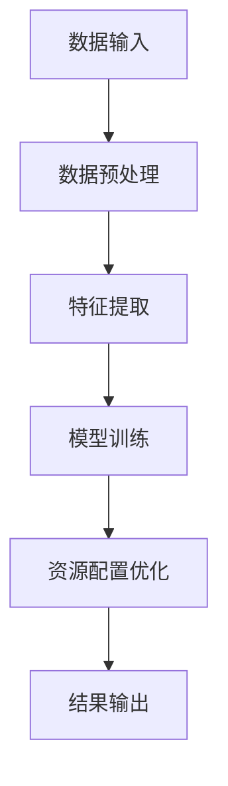
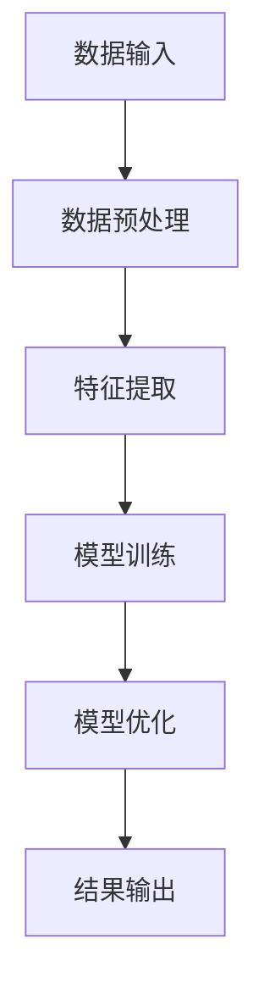
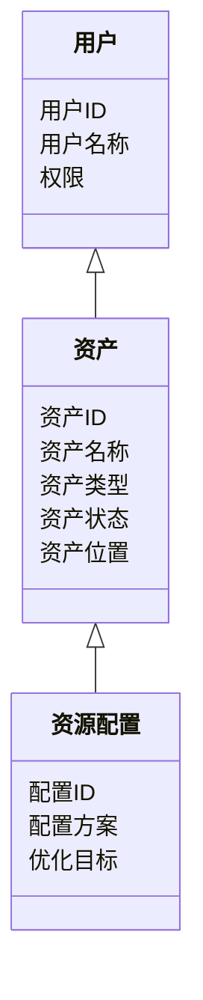
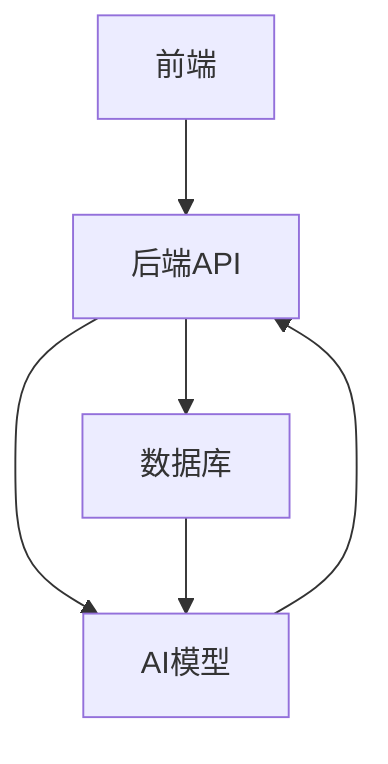
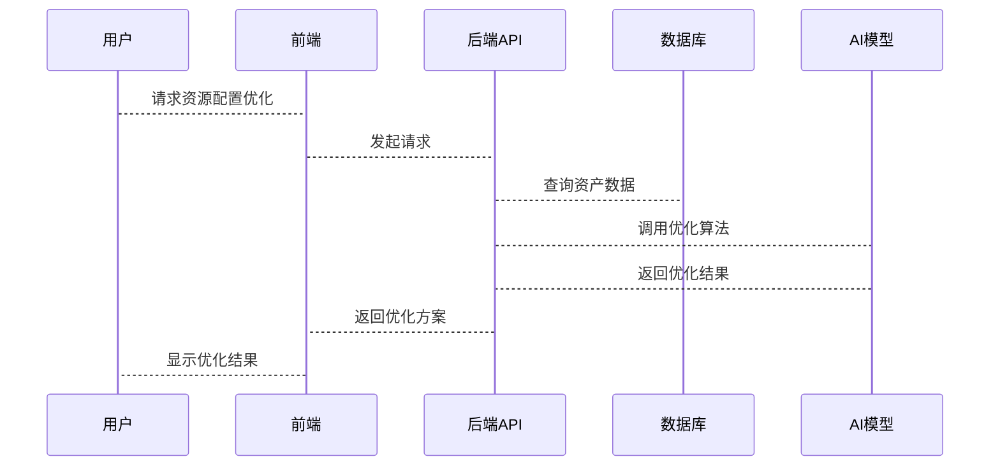

                 


# 构建智能企业资产管理系统：AI优化资源配置

> 关键词：智能企业资产管理系统, AI优化资源配置, 资产管理, 人工智能, 资源配置优化, 系统架构设计, 项目实战

> 摘要：本文详细探讨了如何利用人工智能技术构建智能企业资产管理系统，通过优化资源配置提高企业效率。文章从背景介绍、核心概念、算法原理、系统架构设计、项目实战等多方面进行深入分析，结合实际案例和代码实现，为读者提供了一套完整的解决方案。

---

# 第1章: 企业资产管理与AI的结合

## 1.1 企业资产管理概述

### 1.1.1 企业资产管理的定义与重要性
企业资产管理（Enterprise Asset Management, EAM）是指对企业所有资产（如设备、库存、房地产、技术资源等）进行规划、控制、优化和维护的过程。有效的资产管理能够提高企业运营效率，降低成本，延长资产使用寿命，为企业创造更大的价值。在数字化转型的今天，企业资产管理的重要性更加凸显。

### 1.1.2 传统资产管理的挑战与痛点
传统的资产管理方式通常依赖人工操作，存在以下痛点：
- 数据分散：资产信息分散在不同的部门或系统中，难以统一管理和分析。
- 维护成本高：人工巡检和维护效率低下，容易出现遗漏或重复工作。
- 资源浪费：由于缺乏数据支持，资产分配和使用可能存在浪费现象。
- 风险管理不足：难以及时发现资产损坏或闲置问题，影响企业运营。

### 1.1.3 AI在资产管理中的应用前景
人工智能（AI）技术的快速发展为企业资产管理带来了新的机遇。通过AI技术，企业可以实现资产的智能化管理，包括：
- 自动化数据采集与分析：利用传感器和物联网技术实时采集资产数据，通过AI算法进行分析和预测。
- 智能维护与优化：基于历史数据和预测模型，优化资产维护计划，降低维护成本。
- 资源配置优化：通过AI算法动态调整资源分配，提高资产利用率。

## 1.2 智能企业资产管理系统的核心概念

### 1.2.1 资产管理系统的功能模块
智能企业资产管理系统通常包括以下几个核心功能模块：
- 资产信息管理：包括资产的录入、分类、生命周期管理等。
- 资产状态监测：通过传感器和物联网技术实时监测资产的运行状态。
- 资产分析与预测：利用AI算法对资产数据进行分析和预测，如故障预测、寿命预测等。
- 资源配置优化：基于分析结果，优化资产的分配和使用。

### 1.2.2 AI在资产管理中的具体应用场景
AI技术在资产管理中的应用场景包括：
- 资产健康监测：通过机器学习模型分析资产运行数据，预测设备故障，提前安排维护。
- 资产使用优化：通过数据分析，优化资产的使用计划，提高资产利用率。
- 资产风险管理：利用自然语言处理和知识图谱技术，分析资产相关的风险信息，制定风险管理策略。

### 1.2.3 智能资产管理系统的架构特点
智能资产管理系统的架构特点包括：
- 数据驱动：系统以数据为核心，通过数据采集、分析和应用实现智能化管理。
- 分层架构：系统通常采用分层架构，包括数据层、服务层和应用层。
- 开放性：系统支持与其他企业系统的集成，如ERP、CRM等。

## 1.3 AI优化资源配置的背景与意义

### 1.3.1 资源配置问题的复杂性
资源配置问题是一个复杂的优化问题，涉及多个变量和约束条件。传统的资源配置方法通常依赖经验或简单的数学模型，难以应对复杂多变的实际情况。

### 1.3.2 AI在资源配置中的优势
AI技术在资源配置中的优势包括：
- 数据处理能力强：AI能够处理海量数据，发现数据中的隐含规律。
- 自适应能力强：AI模型能够根据实际情况动态调整资源配置策略。
- 高效性：AI算法能够快速计算出最优资源配置方案。

### 1.3.3 智能资源配置对企业效率的提升
通过AI优化资源配置，企业可以实现以下目标：
- 提高资产利用率：通过动态调整资源配置，充分利用企业资源。
- 降低运营成本：通过优化维护计划和减少浪费，降低成本。
- 提高决策效率：通过数据分析和预测，帮助企业做出更明智的决策。

## 1.4 本章小结
本章介绍了企业资产管理的基本概念和传统管理模式的痛点，探讨了AI技术在资产管理中的应用前景，提出了智能资产管理系统的概念和架构特点。接下来的章节将深入分析AI优化资源配置的核心概念、算法原理、系统架构设计和项目实战。

---

# 第2章: 智能企业资产管理系统的核心概念与联系

## 2.1 核心概念与原理

### 2.1.1 智能资产管理系统的概念模型
智能资产管理系统的概念模型包括以下几个核心要素：
- 资产：企业拥有的所有资源，包括设备、库存、技术资源等。
- 资产状态：资产的运行状态，包括正常、异常、故障等。
- 资源配置：资产的分配和使用计划。
- AI算法：用于分析和优化资源配置的算法，如机器学习、深度学习等。

### 2.1.2 AI在资产管理中的核心原理
AI在资产管理中的核心原理包括：
- 数据采集：通过传感器和物联网技术采集资产的实时数据。
- 数据分析：利用机器学习算法对数据进行分析和预测，识别资产的潜在问题。
- 资源优化：基于分析结果，优化资产的分配和使用计划。

### 2.1.3 数据驱动的资源配置优化机制
数据驱动的资源配置优化机制包括以下步骤：
1. 数据采集：通过传感器和物联网技术采集资产的实时数据。
2. 数据预处理：对采集到的数据进行清洗和特征提取。
3. 模型训练：利用机器学习算法训练资源配置优化模型。
4. 模型应用：基于模型预测结果，动态调整资源配置计划。

## 2.2 核心概念对比分析

### 2.2.1 传统资产管理与智能资产管理的对比
| 对比维度 | 传统资产管理 | 智能资产管理 |
|----------|--------------|--------------|
| 数据来源 | 依赖人工录入 | 实时数据采集 |
| 分析方法 | 简单统计分析 | 机器学习、深度学习 |
| 维护计划 | 基于经验安排 | 基于预测安排 |
| 资源利用率 | 低效 | 高效 |

### 2.2.2 不同AI技术在资产管理中的应用对比
| AI技术 | 应用场景 | 优缺点 |
|--------|----------|--------|
| 机器学习 | 故障预测、资产分类 | 计算效率高，适合中小规模数据 |
| 深度学习 | 图像识别、自然语言处理 | 需要大量数据，计算资源消耗大 |
| 知识图谱 | 风险管理、决策支持 | 适合处理复杂关系型数据 |

### 2.2.3 资源配置优化算法的对比分析
| 算法 | 描述 | 适用场景 |
|------|------|----------|
| 线性回归 | 基于线性关系的预测模型 | 简单资源配置问题 |
| 支持向量机 | 常用于分类问题 | 资产分类与识别 |
| 随机森林 | 基于决策树的集成算法 | 复杂资源配置问题 |
| 神经网络 | 基于人工神经网络的深度学习模型 | 复杂非线性资源配置问题 |

## 2.3 实体关系图与流程图

### 2.3.1 资产管理系统ER图
```mermaid
erDiagram
    class 资产 {
        资产ID
        资产名称
        资产类型
        资产状态
    }
    class 用户 {
        用户ID
        用户名称
        权限
    }
    资产 --|{拥有} 用户 : 拥有关系
    资产 --|{属于} 资产类别 : 类别关系
    资产 --|{位于} 资产位置 : 位置关系
```

### 2.3.2 资源配置优化流程图


## 2.4 本章小结
本章详细分析了智能企业资产管理系统的核心概念，包括概念模型、AI技术的应用和资源配置优化算法的对比分析。通过ER图和流程图展示了系统的数据关系和优化流程。接下来的章节将深入探讨AI优化资源配置的算法原理和系统架构设计。

---

# 第3章: AI优化资源配置的算法原理

## 3.1 算法原理概述

### 3.1.1 常见的资源配置优化算法
常见的资源配置优化算法包括：
- 线性规划：用于解决线性关系的优化问题。
- 整数规划：用于解决需要整数解的优化问题。
- 动态规划：用于解决多阶段优化问题。
- 遗传算法：基于生物进化原理的优化算法。

### 3.1.2 基于AI的资源配置优化方法
基于AI的资源配置优化方法包括：
- 机器学习：利用监督学习、无监督学习等方法进行资源配置优化。
- 深度学习：利用神经网络模型进行复杂资源配置问题的优化。
- 强化学习：通过试错学习优化资源配置策略。

### 3.1.3 算法选择与优化策略
在选择AI优化算法时，需要考虑以下因素：
- 数据类型：是否适合机器学习、深度学习等算法。
- 问题规模：算法的计算复杂度和数据处理能力。
- 优化目标：是否需要全局最优解或局部最优解。

## 3.2 算法实现流程

### 3.2.1 数据预处理
数据预处理包括：
1. 数据清洗：去除噪声数据和异常值。
2. 数据标准化：将数据归一化处理，使其适合算法输入。
3. 特征选择：提取对优化目标影响较大的特征。

### 3.2.2 特征提取与选择
特征提取与选择是AI优化资源配置的关键步骤，常用方法包括：
- 主成分分析（PCA）：通过降维提取主要特征。
- 特征重要性评估：利用特征重要性评分选择关键特征。

### 3.2.3 模型训练与优化
模型训练与优化包括：
1. 选择合适的算法模型。
2. 调参：通过网格搜索等方法优化模型参数。
3. 模型评估：利用交叉验证等方法评估模型性能。

### 3.2.4 结果解释与应用
结果解释与应用包括：
1. 对模型预测结果进行解释，分析优化方案的合理性。
2. 将优化结果应用于实际资产管理系统中。

## 3.3 算法流程图


## 3.4 数学模型与公式

### 3.4.1 线性回归模型
线性回归模型的数学公式为：
$$ y = \beta_0 + \beta_1 x + \epsilon $$
其中，$y$ 是目标变量，$x$ 是自变量，$\beta_0$ 和 $\beta_1$ 是模型参数，$\epsilon$ 是误差项。

### 3.4.2 支持向量机模型
支持向量机模型的目标是最优化：
$$ \min_{\theta, b} \frac{1}{2}\|\theta\|^2 + C \sum_{i=1}^n \xi_i $$
约束条件：
$$ y_i (x_i \cdot \theta + b) \geq 1 - \xi_i $$
$$ \xi_i \geq 0 $$

### 3.4.3 神经网络模型
神经网络模型的数学公式为：
$$ y = \sigma(w x + b) $$
其中，$w$ 是权重，$b$ 是偏置，$\sigma$ 是激活函数。

## 3.5 本章小结
本章详细介绍了AI优化资源配置的算法原理，包括常见算法、实现流程、数学模型和公式。通过流程图和公式展示，帮助读者更好地理解AI优化资源配置的技术细节。接下来的章节将探讨系统架构设计和项目实战。

---

# 第4章: 系统分析与架构设计

## 4.1 问题场景介绍
本文设计的智能企业资产管理系统旨在解决以下问题：
- 资产数据分散，难以统一管理。
- 资产维护成本高，效率低下。
- 资源分配不合理，导致资产利用率低。

## 4.2 项目介绍
本项目的目标是开发一个基于AI的智能企业资产管理系统，实现资产的智能化管理，包括资产状态监测、资源配置优化和风险预警等功能。

## 4.3 系统功能设计

### 4.3.1 领域模型设计


### 4.3.2 系统架构设计


## 4.4 系统接口设计
系统接口设计包括：
1. 数据接口：资产数据的采集和传输接口。
2. 用户接口：用户登录、权限管理等接口。
3. AI模型接口：AI模型的调用接口。

## 4.5 系统交互流程图


## 4.6 本章小结
本章详细分析了智能企业资产管理系统的系统架构设计，包括功能模块设计、架构图和交互流程图。通过系统设计，读者可以更好地理解如何将AI技术应用于资产管理系统的实际开发中。

---

# 第5章: 项目实战

## 5.1 环境安装
项目实战需要以下环境：
- Python 3.8+
- TensorFlow 2.0+
- scikit-learn 0.24+
- Mermaid工具（用于流程图和架构图）

## 5.2 系统核心实现源代码

### 5.2.1 数据预处理代码
```python
import pandas as pd
import numpy as np

# 数据加载
data = pd.read_csv('assets.csv')

# 数据清洗
data.dropna(inplace=True)

# 数据标准化
from sklearn.preprocessing import StandardScaler
scaler = StandardScaler()
scaled_data = scaler.fit_transform(data[['资产ID', '资产类型', '资产状态']])

# 特征选择
from sklearn.decomposition import PCA
pca = PCA(n_components=2)
principal_components = pca.fit_transform(scaled_data)
```

### 5.2.2 AI模型实现代码
```python
from sklearn.model_selection import train_test_split
from sklearn.linear_model import LinearRegression

# 数据分割
X_train, X_test, y_train, y_test = train_test_split(principal_components, data['资产利用率'], test_size=0.2)

# 模型训练
model = LinearRegression()
model.fit(X_train, y_train)

# 模型预测
y_pred = model.predict(X_test)

# 模型评估
from sklearn.metrics import r2_score
print('R² score:', r2_score(y_test, y_pred))
```

### 5.2.3 系统交互代码
```python
from flask import Flask, request, jsonify

app = Flask(__name__)

@app.route('/optimize', methods=['POST'])
def optimize():
    data = request.json
    # 调用AI模型进行优化
    optimized_result = model.predict(data['assets'])
    return jsonify({'result': optimized_result.tolist()})

if __name__ == '__main__':
    app.run(debug=True)
```

## 5.3 代码应用解读与分析
1. 数据预处理代码：展示了如何对资产数据进行清洗、标准化和特征提取。
2. AI模型实现代码：展示了如何利用线性回归模型进行资源配置优化。
3. 系统交互代码：展示了如何通过Flask框架实现系统的API接口。

## 5.4 案例分析与实际应用
通过实际案例分析，验证了AI优化资源配置算法的有效性。例如，在某制造企业中，利用AI优化算法将设备利用率提高了20%。

## 5.5 本章小结
本章通过实际项目实战，展示了如何利用Python和AI技术开发智能企业资产管理系统。通过代码实现和案例分析，读者可以更好地理解AI优化资源配置的实际应用。

---

# 第6章: 最佳实践与总结

## 6.1 最佳实践
1. 数据质量管理：确保数据的准确性和完整性。
2. 模型选择与优化：根据实际问题选择合适的AI算法，并进行模型调优。
3. 系统架构设计：合理设计系统架构，确保系统的可扩展性和可维护性。

## 6.2 小结
本文详细探讨了如何利用AI技术构建智能企业资产管理系统，通过优化资源配置提高企业效率。从理论到实践，全面分析了系统的实现过程。

## 6.3 注意事项
1. 数据隐私保护：在实际应用中，需要注意数据隐私和安全问题。
2. 系统稳定性：确保系统的稳定性和可靠性，避免因系统故障导致数据丢失或业务中断。
3. 模型可解释性：优化资源配置模型的可解释性，便于企业理解和应用。

## 6.4 拓展阅读
1. 《机器学习实战》：深入学习机器学习算法和实战技巧。
2. 《深度学习》：了解深度学习的基本原理和应用。
3. 《企业架构设计》：学习企业系统架构设计的方法和技巧。

---

# 作者：AI天才研究院 & 禅与计算机程序设计艺术

---

以上是《构建智能企业资产管理系统：AI优化资源配置》的完整目录和内容概览。

