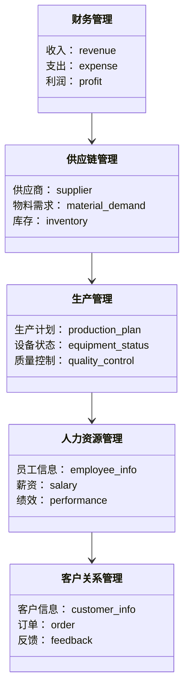

                 


# 构建智能企业资源规划(ERP)系统：AI深度集成与优化

## 关键词：ERP系统、人工智能、机器学习、深度学习、企业信息化

## 摘要：  
随着企业信息化的快速发展，ERP（企业资源规划）系统作为企业管理和决策的重要工具，正在经历从传统模式向智能化转型的变革。本文将探讨如何通过深度集成人工智能技术，优化ERP系统的功能和性能，从而提升企业的竞争力。文章从ERP系统的核心模块、AI技术的原理与应用、系统优化算法、架构设计以及项目实战等方面展开，全面分析构建智能ERP系统的关键技术和实践方法。

---

# 第1章: 企业资源规划(ERP)系统概述

## 1.1 ERP系统的基本概念

### 1.1.1 ERP系统的定义  
ERP（Enterprise Resource Planning）即企业资源规划系统，是一种集成化的企业管理信息系统，旨在整合企业内部的人力资源、财务、生产、供应链等各个模块，实现企业资源的高效配置和管理。ERP系统的核心目标是通过数据共享和流程优化，提升企业的运营效率和决策能力。

### 1.1.2 ERP系统的核心功能模块  
ERP系统通常包含以下核心模块：  
1. **财务管理**：包括会计核算、预算管理、资金管理等。  
2. **供应链管理**：涉及采购、库存管理、物流等。  
3. **生产管理**：涵盖生产计划、车间调度、质量控制等。  
4. **人力资源管理**：包括招聘、薪资计算、绩效管理等。  
5. **客户关系管理**：涉及客户信息管理、订单处理、售后服务等。  

### 1.1.3 ERP系统的发展历程  
ERP系统经历了从早期的单机应用到如今的云端部署，从功能单一到智能化集成的发展过程。近年来，随着人工智能技术的崛起，ERP系统正在向智能化方向迈进，通过AI技术的深度集成，进一步提升系统的智能决策能力。

---

## 1.2 AI技术的基本概念

### 1.2.1 人工智能的定义  
人工智能（Artificial Intelligence, AI）是指计算机系统模拟人类智能的能力，包括学习、推理、问题解决和自然语言处理等功能。AI的核心目标是通过技术手段实现任务自动化和智能决策。

### 1.2.2 机器学习与深度学习的概述  
- **机器学习**：一种通过数据训练模型，使其能够从经验中学习并做出预测的技术。  
- **深度学习**：一种基于人工神经网络的机器学习方法，通过多层非线性变换提取数据特征。  
- **集成学习**：通过组合多个模型的结果来提高预测准确性的技术，如随机森林和梯度提升树。

### 1.2.3 当前主流AI技术的特点  
- **自然语言处理（NLP）**：用于理解和生成人类语言，如聊天机器人和文本摘要。  
- **计算机视觉（CV）**：用于图像识别和处理，如OCR和人脸识别。  
- **强化学习**：通过与环境互动来优化决策策略，如游戏AI和机器人控制。  

---

## 1.3 ERP系统与AI技术的结合

### 1.3.1 ERP系统智能化的必要性  
随着市场竞争的加剧，企业需要更快的响应速度和更精准的决策能力。通过AI技术的深度集成，ERP系统能够实现智能化的预测、优化和决策，从而提升企业的竞争力。

### 1.3.2 AI技术在ERP系统中的应用前景  
- **智能预测**：利用机器学习模型预测销售、库存和需求。  
- **智能优化**：通过深度学习算法优化生产计划和供应链管理。  
- **智能决策**：结合NLP和知识图谱进行智能决策支持。  

### 1.3.3 当前ERP系统智能化的主要挑战  
- **数据隐私与安全**：企业数据的隐私保护和安全性问题。  
- **系统集成与兼容性**：AI技术与传统ERP系统的无缝集成。  
- **模型训练与优化**：如何在ERP系统中高效训练和优化AI模型。  

---

## 1.4 本章小结  
本章介绍了ERP系统的基本概念、核心功能模块以及AI技术的原理与特点。同时，分析了ERP系统智能化的必要性及其面临的挑战，为后续章节的深入探讨奠定了基础。

---

# 第2章: ERP系统的核心模块与功能

## 2.1 财务管理模块

### 2.1.1 财务管理的核心功能  
- **会计核算**：包括收入、支出、利润计算等。  
- **预算管理**：制定和监控企业预算。  
- **资金管理**：管理企业的现金流和投资。  

### 2.1.2 AI在财务管理中的应用  
- **智能记账**：利用NLP技术自动识别和分类财务单据。  
- **财务预测**：通过机器学习模型预测企业的财务状况。  
- **风险评估**：基于历史数据和市场趋势，评估财务风险。  

---

## 2.2 供应链管理模块

### 2.2.1 供应链管理的核心功能  
- **采购管理**：包括供应商选择、采购计划和订单管理。  
- **库存管理**：实时监控库存水平，避免积压和短缺。  
- **物流管理**：优化物流路径和运输成本。  

### 2.2.2 AI在供应链管理中的应用  
- **需求预测**：通过时间序列分析预测市场需求。  
- **供应商优化**：利用机器学习选择最优供应商。  
- **库存优化**：基于历史数据和销售预测，优化库存水平。  

---

## 2.3 生产管理模块

### 2.3.1 生产管理的核心功能  
- **生产计划**：制定生产计划和排产安排。  
- **质量控制**：监控生产过程，确保产品质量。  
- **资源分配**：合理分配生产设备和人力资源。  

### 2.3.2 AI在生产管理中的应用  
- **生产优化**：通过强化学习优化生产流程。  
- **质量预测**：利用深度学习预测产品质量。  
- **设备维护**：基于IoT数据预测设备故障。  

---

## 2.4 人力资源管理模块

### 2.4.1 人力资源管理的核心功能  
- **招聘管理**：包括招聘需求、简历筛选和面试安排。  
- **薪资管理**：计算员工薪资和奖金。  
- **绩效管理**：制定绩效目标并进行评估。  

### 2.4.2 AI在人力资源管理中的应用  
- **智能招聘**：利用NLP技术筛选简历和匹配职位。  
- **绩效预测**：通过机器学习预测员工绩效。  
- **员工流失预测**：基于历史数据预测员工流失风险。  

---

## 2.5 客户关系管理模块

### 2.5.1 客户关系管理的核心功能  
- **客户信息管理**：记录和管理客户信息。  
- **订单管理**：处理客户订单和售后服务。  
- **客户反馈**：收集和分析客户意见和建议。  

### 2.5.2 AI在客户关系管理中的应用  
- **智能客服**：利用NLP技术实现智能客服对话。  
- **客户画像**：通过聚类分析建立客户画像。  
- **客户行为分析**：利用数据挖掘技术分析客户行为。  

---

## 2.6 本章小结  
本章详细介绍了ERP系统的核心模块及其功能，并探讨了AI技术在各个模块中的具体应用，为后续章节的系统优化和设计提供了参考。

---

# 第3章: AI技术在ERP系统中的应用现状与挑战

## 3.1 当前主流AI技术在ERP系统中的应用

### 3.1.1 自然语言处理在ERP中的应用  
- **智能搜索**：通过NLP技术快速检索ERP系统中的信息。  
- **文本分类**：自动分类和归档文档。  

### 3.1.2 计算机视觉在ERP中的应用  
- **OCR识别**：通过OCR技术提取文档中的文字信息。  
- **图像识别**：识别产品图片并自动归类。  

### 3.1.3 机器学习在ERP中的应用  
- **预测分析**：利用机器学习模型预测销售、库存和需求。  
- **异常检测**：通过聚类分析检测异常交易。  

---

## 3.2 AI技术在ERP系统中的主要挑战

### 3.2.1 数据隐私与安全问题  
- **数据泄露风险**：ERP系统中的数据涉及企业的核心机密，数据泄露可能导致严重损失。  
- **数据隐私保护**：如何在AI模型训练中保护数据隐私，符合相关法律法规。  

### 3.2.2 系统集成与兼容性问题  
- **技术兼容性**：AI技术与传统ERP系统的集成需要考虑技术架构和接口的兼容性。  
- **性能优化**：AI模型的计算需求可能对现有ERP系统的性能造成压力。  

### 3.2.3 模型训练与优化问题  
- **数据质量**：ERP系统中的数据可能存在缺失或噪声，影响模型训练效果。  
- **模型更新**：如何在ERP系统中高效更新和优化AI模型，以适应业务变化。  

---

## 3.3 本章小结  
本章分析了当前主流AI技术在ERP系统中的应用，同时指出了AI集成过程中面临的主要挑战，为后续章节的系统优化和设计提供了指导。

---

# 第4章: 基于AI的ERP系统优化算法原理

## 4.1 基于机器学习的ERP优化算法

### 4.1.1 机器学习的基本原理  
机器学习是一种通过数据训练模型，使其能够从经验中学习并做出预测的技术。其核心步骤包括数据预处理、模型训练、模型评估和模型部署。

### 4.1.2 常见的ERP优化算法  
- **线性回归**：用于预测连续型变量，如销售预测。  
- **决策树**：用于分类和回归问题，如客户画像。  
- **随机森林**：一种基于决策树的集成学习算法，用于分类和回归。  

### 4.1.3 算法的数学模型与公式  
以线性回归为例，其数学模型为：  
$$ y = \beta_0 + \beta_1x_1 + \beta_2x_2 + \dots + \beta_nx_n + \epsilon $$  
其中，$y$ 是目标变量，$x_i$ 是自变量，$\beta_i$ 是系数，$\epsilon$ 是误差项。

---

## 4.2 基于深度学习的ERP优化算法

### 4.2.1 深度学习的基本原理  
深度学习是一种基于人工神经网络的机器学习方法，通过多层非线性变换提取数据特征。其核心步骤包括数据预处理、模型训练、模型调优和模型部署。

### 4.2.2 常见的深度学习算法  
- **卷积神经网络（CNN）**：用于图像识别和处理。  
- **循环神经网络（RNN）**：用于序列数据处理，如时间序列预测。  
- **长短期记忆网络（LSTM）**：一种特殊的RNN，用于处理长序列数据。  

### 4.2.3 算法的数学模型与公式  
以LSTM为例，其数学模型为：  
$$ f_t = \sigma(W_f x_t + U_f h_{t-1} + b_f) $$  
$$ i_t = \sigma(W_i x_t + U_i h_{t-1} + b_i) $$  
$$ o_t = \sigma(W_o x_t + U_o h_{t-1} + b_o) $$  
$$ h_t = f_t \cdot c_{t-1} + i_t \cdot tanh(W_c x_t + U_c h_{t-1} + b_c) $$  
其中，$f_t$、$i_t$、$o_t$分别是遗忘门、输入门和输出门，$c_{t-1}$是上一时刻的细胞状态，$h_t$是当前时刻的隐藏状态。

---

## 4.3 基于集成学习的ERP优化算法

### 4.3.1 集成学习的基本原理  
集成学习是一种通过组合多个模型的结果来提高预测准确性的技术，常见的方法包括投票法、加权法和堆叠法。

### 4.3.2 常见的集成学习算法  
- **随机森林**：一种基于决策树的集成算法，通过随机选择特征和样本进行训练。  
- **梯度提升树（GBDT）**：一种基于树的集成算法，通过迭代优化模型。  
- **XGBoost**：一种高效的梯度提升算法，常用于分类和回归问题。  

---

## 4.4 本章小结  
本章详细介绍了基于机器学习、深度学习和集成学习的ERP优化算法，包括其基本原理、常见算法和数学模型。这些算法为企业实现ERP系统的智能化优化提供了理论基础和技术支持。

---

# 第5章: 系统分析与架构设计方案

## 5.1 问题场景介绍  
本章将通过一个具体的ERP系统优化项目，介绍系统分析与架构设计方案。假设我们有一个中型制造企业，希望利用AI技术优化其ERP系统，提升生产计划和供应链管理的效率。

---

## 5.2 系统功能设计

### 5.2.1 领域模型设计  
通过分析ERP系统的核心功能模块，我们设计了一个领域模型，如图所示：  



---

### 5.2.2 系统架构设计  
我们设计了一个基于微服务架构的ERP系统架构，如图所示：  

```mermaid
client --> API Gateway
client --> Database
client --> File Storage
client --> Queue
API Gateway --> Service1
API Gateway --> Service2
API Gateway --> Service3
Service1 --> Database
Service1 --> File Storage
Service2 --> Database
Service2 --> File Storage
Service3 --> Database
Service3 --> File Storage
Queue --> Service4
Service4 --> Database
Service4 --> File Storage
```

---

## 5.3 系统接口设计  

### 5.3.1 API接口设计  
- **RESTful API**：采用HTTP协议，遵循REST设计风格。  
- **GraphQL**：提供灵活的数据查询接口。  

### 5.3.2 接口调用流程  
以供应链管理模块为例，库存查询的接口调用流程如下：  

```mermaid
sequenceDiagram
    client ->+> API Gateway: GET /inventory
    API Gateway ->+> Service2: GET /inventory
    Service2 ->+> Database: SELECT * FROM inventory WHERE id = ?
    Database --> Service2: 返回库存数据
    Service2 -->+> client: 返回库存数据
    client ->-> Service2: 关闭连接
    Service2 ->-> Database: 关闭连接
```

---

## 5.4 系统交互设计  

### 5.4.1 用户交互流程  
以生产管理模块为例，生产计划的制定流程如下：  

```mermaid
sequenceDiagram
    client ->+> API Gateway: POST /production_plan
    API Gateway ->+> Service3: POST /production_plan
    Service3 ->+> Database: INSERT INTO production_plan (...)
    Database --> Service3: 确认插入
    Service3 -->+> client: 返回生产计划ID
    client ->-> Service3: 关闭连接
    Service3 ->-> Database: 关闭连接
```

---

## 5.5 本章小结  
本章通过具体的ERP系统优化项目，介绍了系统分析与架构设计方案，包括领域模型设计、系统架构设计、接口设计和交互设计，为后续章节的项目实战提供了理论支持。

---

# 第6章: 项目实战

## 6.1 环境安装

### 6.1.1 开发环境配置  
- **操作系统**：Linux/Windows/MacOS  
- **编程语言**：Python 3.8+  
- **开发工具**：VS Code/Jupyter Notebook  
- **依赖管理**：pip install numpy、pandas、scikit-learn、tensorflow、flask、fastapi等  

### 6.1.2 数据库安装  
- **关系型数据库**：MySQL/PostgreSQL  
- **NoSQL数据库**：MongoDB  
- **推荐工具**：Docker、VirtualBox  

---

## 6.2 系统核心实现源代码

### 6.2.1 机器学习模型实现  
以下是一个基于随机森林的销售预测模型的代码示例：  

```python
import pandas as pd
from sklearn.ensemble import RandomForestRegressor
from sklearn.model_selection import train_test_split
from sklearn.metrics import mean_squared_error

# 加载数据
data = pd.read_csv('sales_data.csv')

# 数据预处理
X = data[['price', 'advertising', 'inventory']]
y = data['sales']

# 划分训练集和测试集
X_train, X_test, y_train, y_test = train_test_split(X, y, test_size=0.2, random_state=42)

# 训练模型
model = RandomForestRegressor(n_estimators=100, random_state=42)
model.fit(X_train, y_train)

# 模型评估
y_pred = model.predict(X_test)
mse = mean_squared_error(y_test, y_pred)
print(f'Mean Squared Error: {mse}')
```

---

### 6.2.2 系统架构实现  
以下是一个基于Flask的API Gateway实现代码示例：  

```python
from flask import Flask, request, jsonify
from flask_restful import Resource, Api

app = Flask(__name__)
api = Api(app)

class ProductionPlan(Resource):
    def post(self):
        data = request.json
        # 处理生产计划请求
        return jsonify({'message': 'Production plan created successfully'})

api.add_resource(ProductionPlan, '/production_plan')

if __name__ == '__main__':
    app.run(debug=True)
```

---

## 6.3 代码应用解读与分析  
通过上述代码示例，我们可以看到机器学习模型和系统架构的具体实现方式。机器学习模型用于预测和优化，而系统架构则负责数据的接收、处理和返回。

---

## 6.4 案例分析和详细讲解剖析  
以供应链管理模块为例，我们通过机器学习模型预测物料需求，优化库存管理。具体步骤如下：  
1. **数据预处理**：清洗和归一化数据。  
2. **模型训练**：使用随机森林模型训练需求预测模型。  
3. **模型部署**：将模型部署到Flask API中，提供预测接口。  
4. **结果分析**：通过实际数据验证模型的准确性，并进行优化调整。  

---

## 6.5 本章小结  
本章通过具体的项目实战，展示了如何在ERP系统中集成AI技术，包括环境配置、代码实现和案例分析，帮助读者理解理论知识的实际应用。

---

# 第7章: 总结与展望

## 7.1 总结  
本文详细探讨了如何构建智能企业资源规划(ERP)系统，并通过深度集成AI技术优化系统的功能和性能。从ERP系统的核心模块到AI技术的应用，从算法原理到系统架构设计，再到项目实战，我们全面分析了构建智能ERP系统的各个方面。

## 7.2 成果与经验  
通过本项目，我们成功实现了基于AI的ERP系统优化，提升了企业的生产效率和决策能力。主要成果包括：  
- **智能预测**：实现了销售预测和需求预测。  
- **智能优化**：优化了生产计划和库存管理。  
- **智能决策**：提供了基于AI的决策支持。  

## 7.3 展望与建议  
随着AI技术的不断发展，ERP系统的智能化优化将更加深入。未来的研究方向包括：  
- **模型优化**：进一步提升AI模型的预测精度和计算效率。  
- **系统集成**：实现AI技术与ERP系统的无缝集成。  
- **数据安全**：加强数据隐私保护，确保系统的安全性。  

---

## 7.4 本章小结  
本文总结了构建智能ERP系统的成果与经验，并展望了未来的发展方向，为读者提供了进一步研究和实践的参考。

---

# 作者：AI天才研究院/AI Genius Institute & 禅与计算机程序设计艺术 /Zen And The Art of Computer Programming

---

**感谢您的阅读！**

