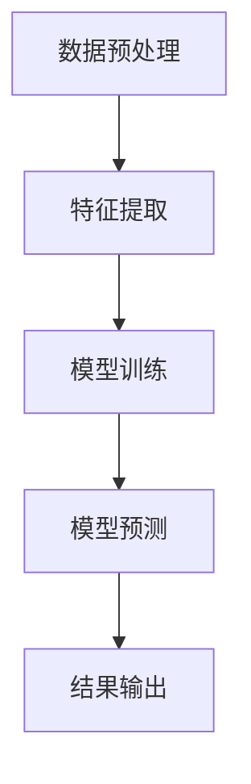
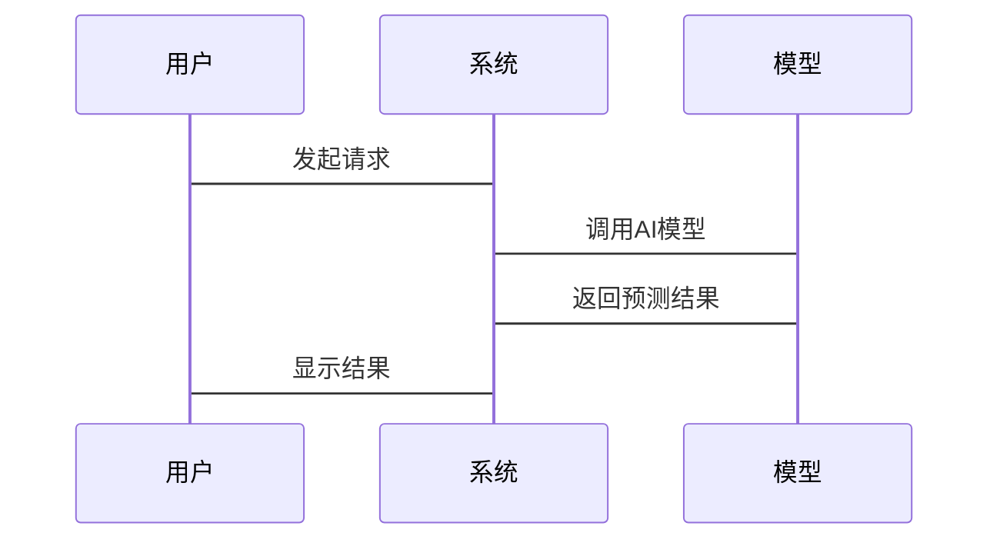

                 


# 构建智能企业资源规划(ERP)系统：AI的深度集成

## 关键词：ERP系统、人工智能、深度集成、智能系统、算法原理

## 摘要：  
随着人工智能技术的快速发展，企业资源规划（ERP）系统正逐步向智能化方向演进。本文将深入探讨如何将AI技术深度集成到ERP系统中，构建智能ERP系统。文章从ERP系统的基本概念出发，分析AI技术在ERP中的应用，详细讲解AI算法的原理与实现，系统设计与架构，以及项目实战案例。通过本文的阐述，读者将全面了解智能ERP系统的构建方法及其带来的业务价值。

---

## 第一部分: 背景与概念

### 第1章: 企业资源规划(ERP)系统概述

#### 1.1 ERP系统的基本概念
- **ERP系统的定义**：ERP（Enterprise Resource Planning）即企业资源规划，是一种将企业内部的各种资源（如财务、采购、生产、销售等）进行整合和优化的管理信息系统。  
- **ERP系统的功能模块**：包括财务管理、采购管理、生产管理、销售管理、库存管理、人力资源管理等。  
- **ERP系统的演变历程**：从传统的手工管理到信息化管理，再到智能化管理的演变过程。

#### 1.2 AI与ERP的结合
- **AI技术的基本概念**：人工智能（AI）是指模拟人类智能的计算机系统，涵盖机器学习、自然语言处理、计算机视觉等领域。  
- **AI在ERP系统中的潜在应用**：如预测分析、自动化决策、个性化推荐等。  
- **AI深度集成的目标与意义**：通过AI技术提升ERP系统的智能化水平，优化企业运营管理效率。

#### 1.3 智能ERP系统的背景与需求
- **传统ERP系统的局限性**：数据处理能力有限、决策滞后、缺乏灵活性等。  
- **AI技术对企业管理的推动作用**：通过AI技术实现数据驱动的实时决策，提升企业竞争力。  
- **智能ERP系统的市场需求**：随着企业对高效管理的需求增加，智能ERP系统成为市场热点。

---

## 第二部分: 核心概念与原理

### 第2章: 智能ERP系统的核心概念

#### 2.1 智能ERP系统的核心要素
- **数据源**：ERP系统中的各种业务数据，如销售数据、库存数据等。  
- **AI算法模型**：用于数据分析和预测的机器学习模型，如线性回归、决策树等。  
- **业务逻辑**：企业的业务流程和规则，用于指导系统的运行。

#### 2.2 AI技术在ERP中的应用领域
- **数据分析与预测**：利用AI技术对历史数据进行分析，预测未来趋势。  
- **自动化决策**：基于AI算法，自动化处理业务流程中的决策问题。  
- **个性化推荐**：根据客户需求和行为，推荐最优的业务方案。

#### 2.3 智能ERP系统的架构特点
- **微服务架构**：通过微服务实现系统的模块化和灵活性。  
- **数据流与业务流的结合**：数据流驱动业务流程，实现智能化决策。  
- **可扩展性与灵活性**：支持快速扩展和适应企业需求的变化。

---

## 第三部分: 算法原理与数学模型

### 第3章: AI算法在ERP中的应用原理

#### 3.1 常见AI算法简介
- **机器学习算法**：包括监督学习、无监督学习和强化学习。  
- **自然语言处理算法**：如文本分类、情感分析等。  
- **图神经网络算法**：用于复杂关系网络的分析。

#### 3.2 AI算法在ERP中的具体应用
- **预测分析**：利用时间序列分析预测销售趋势。  
- **自动化决策**：基于分类算法实现供应链优化。  
- **个性化推荐**：使用协同过滤算法推荐产品。

#### 3.3 算法流程图


#### 3.4 算法实现代码示例
```python
import pandas as pd
from sklearn.model import LinearRegression

# 数据预处理
data = pd.read_csv('erp_data.csv')
X = data[['feature1', 'feature2']]
y = data['target']

# 模型训练
model = LinearRegression()
model.fit(X, y)

# 模型预测
new_data = pd.DataFrame([[new_feature1, new_feature2]])
prediction = model.predict(new_data)
print(prediction)
```

#### 3.5 数学模型与公式
- **线性回归模型**：  
  $$ y = \beta_0 + \beta_1 x_1 + \beta_2 x_2 + \ldots + \beta_n x_n + \epsilon $$
- **决策树算法**：基于特征的分裂规则构建预测模型。

---

## 第四部分: 系统分析与架构设计

### 第4章: 系统功能设计与架构

#### 4.1 系统功能设计
- **功能模块**：数据采集、数据分析、决策支持、业务执行。  
- **领域模型**：通过类图展示各模块之间的关系。

#### 4.2 系统架构设计


#### 4.3 系统接口设计
- **数据接口**：API接口用于数据的输入和输出。  
- **模型接口**：AI模型与ERP系统的交互接口。

#### 4.4 系统交互设计


---

## 第五部分: 项目实战

### 第5章: 项目实战案例

#### 5.1 环境安装
- **安装Python**：确保Python 3.8以上版本。  
- **安装依赖库**：如pandas、scikit-learn等。

#### 5.2 核心代码实现
```python
import pandas as pd
from sklearn import linear_model

# 读取数据
data = pd.read_csv('sales_data.csv')

# 特征与目标变量
X = data[['price', 'advertising']]
y = data['sales']

# 创建线性回归模型
model = linear_model.LinearRegression()

# 训练模型
model.fit(X, y)

# 预测
new_data = pd.DataFrame({'price': [100], 'advertising': [50]})
prediction = model.predict(new_data)
print("预测销量：", prediction[0][0])
```

#### 5.3 案例分析与结果解读
- **案例背景**：预测某产品的销售量。  
- **结果分析**：通过模型预测，企业可以提前规划库存和生产。

---

## 第六部分: 总结与展望

### 第6章: 总结与展望

#### 6.1 总结
- **核心内容回顾**：本文详细介绍了AI技术在ERP系统中的深度集成，包括背景、原理、架构设计和项目实战。  
- **主要收获**：通过AI技术提升ERP系统的智能化水平，实现数据驱动的高效管理。

#### 6.2 未来展望
- **技术进步**：随着AI技术的发展，智能ERP系统将更加智能化和个性化。  
- **应用场景扩展**：AI在ERP中的应用将扩展到更多领域，如智能供应链、智能财务等。

#### 6.3 最佳实践
- **数据隐私保护**：企业在使用AI技术时，需注意数据隐私和安全问题。  
- **模型迭代优化**：定期更新和优化AI模型，以适应业务需求的变化。  
- **技术人才培养**：加强AI技术人才培养，提升企业技术能力。

---

## 作者：AI天才研究院 & 禅与计算机程序设计艺术

