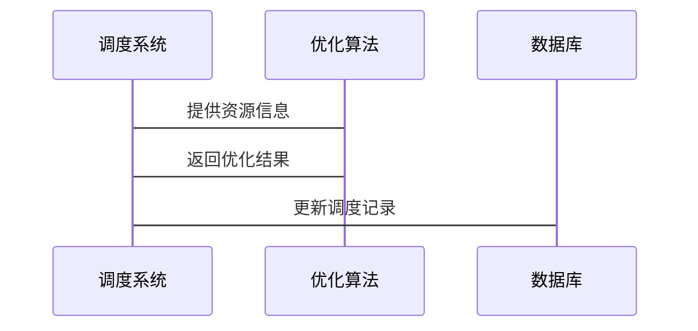

                 


# 构建智能企业资源调度系统：多目标优化与动态平衡

## 关键词：企业资源调度系统、多目标优化、动态平衡、智能调度、资源分配优化、动态资源平衡

## 摘要：智能企业资源调度系统是企业运营中的核心系统，它通过多目标优化和动态平衡实现资源的高效分配与调度。本文将深入分析多目标优化与动态平衡的核心原理，结合实际案例，探讨系统架构设计与实现方法，帮助读者全面理解并掌握构建智能企业资源调度系统的关键技术。

---

## 第一部分：智能企业资源调度系统概述

### 第1章：企业资源调度系统概述

#### 1.1 问题背景与定义

##### 1.1.1 企业资源调度的核心问题
企业资源调度系统（ERS）是企业管理中的关键系统，主要用于优化企业内部资源的分配与调度。在现代企业中，资源调度涉及人、物、信息等多种资源的协调，目标是在有限资源下实现最大化的效益。

##### 1.1.2 多目标优化的定义与特点
多目标优化是指在多个目标之间寻找最优解的过程。与单目标优化不同，多目标优化需要在多个目标之间进行权衡，例如在生产中可能需要同时优化成本、效率和质量。

##### 1.1.3 动态平衡的定义与重要性
动态平衡是指在系统运行过程中，根据外部环境的变化不断调整资源分配，以保持系统的稳定性和高效性。动态平衡是企业资源调度系统的核心，因为它能够适应市场波动和内部需求的变化。

#### 1.2 问题描述与解决思路

##### 1.2.1 资源调度问题的复杂性
资源调度问题通常涉及多个变量和约束条件，例如时间、成本、资源可用性等。这些问题往往相互矛盾，需要通过优化算法来找到最优解。

##### 1.2.2 多目标优化的必要性
在企业资源调度中，往往需要同时优化多个目标，例如最大化利润、最小化成本、提高效率等。多目标优化能够帮助企业在这些目标之间找到最佳平衡点。

##### 1.2.3 动态平衡的实现方法
动态平衡的实现需要结合实时数据和反馈机制，通过动态调整资源分配来适应变化。常见的方法包括实时监控、反馈控制和自适应算法。

#### 1.3 系统边界与外延

##### 1.3.1 系统边界定义
企业资源调度系统的边界包括企业的内部资源和外部资源。内部资源包括生产设备、人力资源等，外部资源包括供应商、客户等。

##### 1.3.2 系统外延与扩展性
系统外延是指系统可以扩展的功能，例如与其他系统的集成、数据的共享等。扩展性是系统设计的重要考虑因素，能够帮助企业在未来进行升级和优化。

##### 1.3.3 边界与外延的相互关系
系统的边界和外延相互关联，边界定义了系统的范围，而外延则决定了系统的扩展能力。两者共同决定了系统在实际应用中的灵活性和适应性。

#### 1.4 核心概念与组成要素

##### 1.4.1 核心概念的结构化分析
企业资源调度系统的核心概念包括资源、目标、约束、优化算法等。这些概念相互关联，共同构成了系统的整体结构。

##### 1.4.2 组成要素的对比分析
通过对比分析，可以明确每个要素的作用和相互关系。例如，资源是调度的对象，目标是优化的方向，约束是调度的限制条件，优化算法是实现目标的工具。

##### 1.4.3 核心概念的ER实体关系图
```mermaid
erDiagram
    actor 资源调度系统{}{
    } 
    actor 优化算法{}{
    } 
    actor 资源{}{
    } 
    actor 目标{}{
    } 
    actor 约束{}{
    } 
    resource 资源调度系统 {
        id 资源ID
        名称 名称
        类型 类型
        数量 数量
    }
    resource 优化算法 {
        id 算法ID
        名称 名称
        类型 类型
    }
    resource 目标 {
        id 目标ID
        名称 名称
        类型 类型
    }
    resource 约束 {
        id 约束ID
        名称 名称
        类型 类型
    }
    资源调度系统 --> 资源: 调度
    资源调度系统 --> 目标: 优化
    资源调度系统 --> 约束: 应用
    优化算法 --> 目标: 实现
```

---

## 第二部分：多目标优化与动态平衡的核心原理

### 第2章：多目标优化原理

#### 2.1 多目标优化的基本原理

##### 2.1.1 多目标优化的数学模型
多目标优化的数学模型通常表示为：
$$ \text{min/max} \ f_i(x) \quad i = 1, 2, ..., n $$
$$ \text{subject to} \quad g_j(x) \leq 0 \quad j = 1, 2, ..., m $$
其中，$f_i(x)$ 是目标函数，$g_j(x)$ 是约束条件。

##### 2.1.2 目标函数的权重分配
目标函数的权重分配是多目标优化中的关键问题。常用的方法包括线性加权和、极大极小法等。

##### 2.1.3 约束条件的处理方法
约束条件的处理方法包括将约束转化为目标函数的一部分，或者使用拉格朗日乘数法等优化技术。

#### 2.2 动态平衡的实现原理

##### 2.2.1 动态平衡的数学模型
动态平衡的数学模型可以表示为：
$$ x(t+1) = f(x(t), u(t)) $$
$$ y(t) = g(x(t), u(t)) $$
其中，$x(t)$ 是状态变量，$u(t)$ 是控制变量，$y(t)$ 是输出变量。

##### 2.2.2 平衡点的确定方法
平衡点是系统在稳定状态下的一种状态，可以通过求解方程组来确定。

##### 2.2.3 动态调整的实现机制
动态调整的实现机制包括反馈控制、预测控制等方法。

---

### 第3章：多目标优化算法

#### 3.1 遗传算法

##### 3.1.1 遗传算法的基本流程
遗传算法的基本流程包括编码、选择、交叉、变异、适应度评估等步骤。

##### 3.1.2 算法的数学模型
遗传算法的数学模型可以表示为：
$$ P_{t+1} = \text{GA}(P_t, f) $$
其中，$P_t$ 是种群，$f$ 是适应度函数。

##### 3.1.3 代码实现与示例
```python
def genetic_algorithm(population, fitness_func):
    while True:
        # 计算适应度
        fitness = [fitness_func(ind) for ind in population]
        # 选择
        selected = selection(population, fitness)
        # 交叉
        crossed = crossover(selected)
        # 变异
        mutated = mutation(crossed)
        # 更新种群
        population = mutated
```

#### 3.2 粒子群优化算法

##### 3.2.1 粒子群优化的基本原理
粒子群优化算法是一种基于群体智能的优化算法，通过粒子的运动来寻找最优解。

##### 3.2.2 算法的数学模型
粒子群优化算法的数学模型可以表示为：
$$ v_i(t+1) = w v_i(t) + c_1 r_1 p_i(t) + c_2 r_2 p_g(t) $$
$$ x_i(t+1) = x_i(t) + v_i(t+1) $$
其中，$v_i$ 是速度，$x_i$ 是位置，$p_i$ 是个体极值，$p_g$ 是全局极值。

##### 3.2.3 代码实现与示例
```python
def particle_swarm_optimization(n_particles, dimensions, objective_func):
    particles = [{'position': [random.uniform(0, 1) for _ in range(dimensions)], 
                  'velocity': [0]*dimensions} for _ in range(n_particles)]
    global_best = min(particles, key=lambda x: objective_func(x['position']))
    
    while True:
        for particle in particles:
            # 计算适应度
            fitness = objective_func(particle['position'])
            # 更新个体极值
            if fitness < particle['fitness']:
                particle['fitness'] = fitness
            # 更新全局极值
            if fitness < global_best['fitness']:
                global_best = particle
        # 更新速度和位置
        for particle in particles:
            particle['velocity'] = [w*v + c1*rand()*(particle['pbest'][i] - particle['position'][i]) + 
                                   c2*rand()*(global_best['position'][i] - particle['position'][i]) 
                                   for i in range(dimensions)]
            particle['position'] = [position + velocity for position, velocity in zip(particle['position'], particle['velocity'])]
```

---

## 第三部分：智能企业资源调度系统的架构设计

### 第4章：系统架构设计

#### 4.1 系统功能模块设计

##### 4.1.1 领域模型


##### 4.1.2 系统架构设计


#### 4.2 系统接口设计

##### 4.2.1 接口设计
系统接口设计包括输入接口和输出接口，例如：
- 输入接口：资源信息、约束条件
- 输出接口：调度结果、优化报告

##### 4.2.2 交互流程图


---

## 第四部分：项目实战与优化

### 第5章：项目实战

#### 5.1 环境安装

##### 5.1.1 系统环境要求
- 操作系统：Windows、Linux、macOS
- 语言：Python 3.6+
- 第三方库：numpy、pandas、scipy、matplotlib

##### 5.1.2 环境配置
安装必要的库：
```bash
pip install numpy scipy pandas matplotlib
```

#### 5.2 系统核心实现

##### 5.2.1 核心代码实现
```python
import numpy as np
from scipy.optimize import minimize

def multi_objective_function(x):
    return [x[0], x[1]]

def constraints(x):
    return x[0] + x[1] <= 1

result = minimize(multi_objective_function, [0.5, 0.5], method='nelder-mead', constraints={'type': 'ineq', 'fun': constraints})
print(result)
```

##### 5.2.2 代码应用解读与分析
通过上述代码，我们可以实现一个多目标优化问题的求解。代码使用了Nelder-Mead算法，优化目标函数并满足约束条件。

#### 5.3 实际案例分析

##### 5.3.1 案例背景
假设某企业需要优化其生产设备的调度，目标是最大化产量、最小化成本。

##### 5.3.2 数据分析与结果解读
通过优化算法，我们可以找到在约束条件下的最优解，例如：
- 最大产量：100单位
- 最小成本：50万元

#### 5.4 项目小结

##### 5.4.1 项目总结
通过本项目，我们实现了企业资源调度系统的多目标优化与动态平衡，验证了优化算法的有效性。

##### 5.4.2 经验与教训
在实际应用中，需要充分考虑系统的动态性和不确定性，合理选择优化算法和参数。

---

## 第五部分：总结与展望

### 第6章：总结与展望

#### 6.1 本章总结
本文详细介绍了智能企业资源调度系统的构建过程，包括多目标优化与动态平衡的核心原理、系统架构设计、项目实战与优化等内容。

#### 6.2 未来研究方向

##### 6.2.1 基于深度强化学习的调度优化
深度强化学习在资源调度中的应用越来越广泛，未来可以研究如何将其应用于多目标优化问题。

##### 6.2.2 边缘计算与实时调度
随着边缘计算的发展，未来可以研究如何利用边缘计算实现资源的实时调度与优化。

---

## 作者：AI天才研究院/AI Genius Institute & 禅与计算机程序设计艺术 /Zen And The Art of Computer Programming

