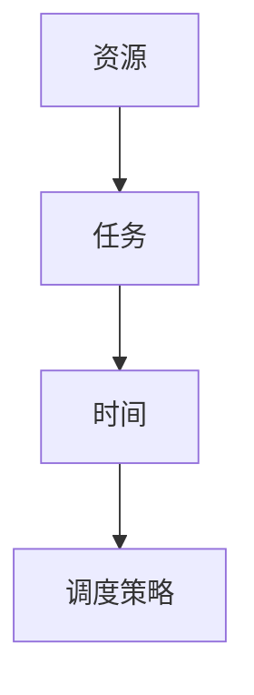
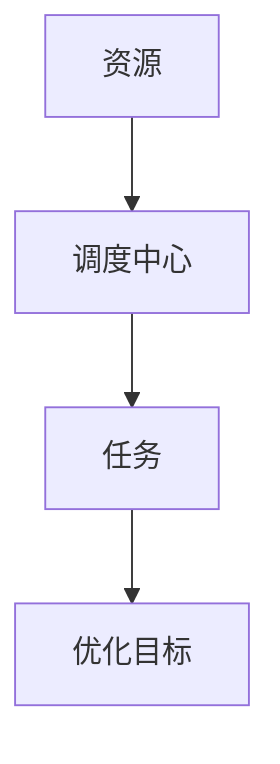
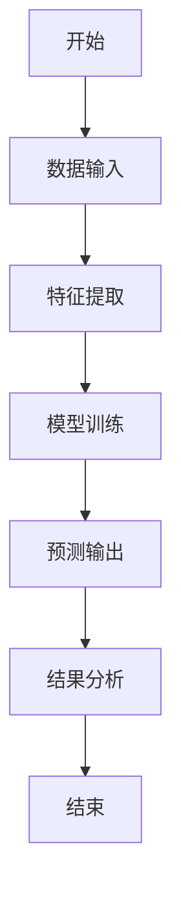
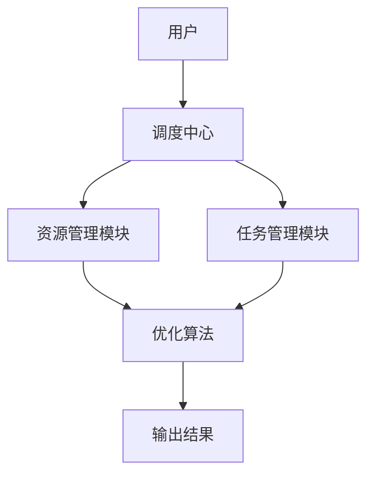
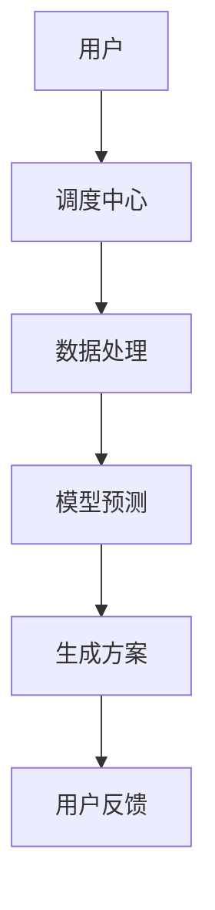

                 


# 《构建智能企业资源调度系统：实时优化与预测性分配》

---

## 关键词：
- 智能调度系统
- 实时优化
- 预测性分配
- 资源分配算法
- 企业资源管理
- 系统架构设计

---

## 摘要：
本文深入探讨了智能企业资源调度系统的构建与优化，重点分析了实时优化与预测性分配的核心算法与系统架构。通过结合数学模型、算法原理和系统设计，详细阐述了如何利用人工智能技术提升企业资源管理效率。文章从问题背景、核心概念、算法实现到系统设计和项目实战，层层展开，为读者提供了一套完整的解决方案，助力企业实现高效资源调度与管理。

---

# 第一部分: 智能企业资源调度系统概述

## 第1章: 背景与问题背景

### 1.1 问题背景与目标
#### 1.1.1 企业资源调度的背景
企业在生产、物流、供应链等领域面临的资源调度问题日益复杂，传统的人工调度方式已难以满足高效、精准的需求。

#### 1.1.2 当前资源调度的核心问题
- 资源分配不均导致效率低下
- 实时动态变化难以预测
- 跨部门协作复杂，信息孤岛严重

#### 1.1.3 智能调度的目标与意义
目标：通过智能化算法实现资源的最优分配与实时调整。
意义：提升企业运营效率，降低成本，增强竞争力。

### 1.2 资源调度的核心概念
#### 1.2.1 资源调度的定义与范围
资源调度是指在一定约束条件下，将有限资源分配到各个任务或项目中，以最大化目标函数的过程。

#### 1.2.2 核心要素与概念结构
- 资源：包括人力资源、设备、资金等。
- 任务：需要分配资源的生产或服务活动。
- 调度策略：基于实时数据的分配规则。
- 优化目标：如成本最小化、效率最大化等。

#### 1.2.3 边界与外延
- 范围边界：明确资源调度的适用场景。
- 外延扩展：与企业管理系统（如ERP、MES）的集成。

### 1.3 智能调度的必要性
#### 1.3.1 传统调度的局限性
- 依赖人工经验，主观性强。
- 无法实时响应动态变化。
- 缺乏预测能力，难以应对不确定性。

#### 1.3.2 智能调度的优势
- 基于数据驱动的决策。
- 实时优化与动态调整。
- 预测性分配提升资源利用率。

#### 1.3.3 企业数字化转型的驱动力
企业通过智能化资源调度，实现从粗放型管理向精细化管理的转变。

### 1.4 本章小结
本章通过分析资源调度的背景、核心问题及智能调度的必要性，为后续章节的深入探讨奠定了基础。

---

## 第2章: 智能调度的核心概念与联系

### 2.1 核心概念原理
#### 2.1.1 资源分配的基本原理
资源分配的核心在于匹配供需，确保资源在时间和空间上的最优利用。

#### 2.1.2 实时优化的数学模型
实时优化的目标函数：
$$ \text{最大化 } f(x) = \sum_{i=1}^{n} w_i x_i $$
约束条件：
$$ \sum_{i=1}^{n} a_i x_i \leq b $$
其中，$x_i$ 为资源分配量，$w_i$ 为权重，$a_i$ 为资源消耗系数，$b$ 为资源上限。

#### 2.1.3 预测性分配的算法基础
预测性分配基于历史数据和实时信息，利用机器学习模型（如ARIMA、LSTM）进行预测。

### 2.2 核心概念对比分析
#### 2.2.1 资源分配与任务调度的对比
| 要素 | 资源分配 | 任务调度 |
|------|----------|----------|
| 目标 | 确保资源充足 | 确保任务按时完成 |
| 输入 | 资源需求 | 任务优先级 |
| 输出 | 资源分配方案 | 调度计划 |

#### 2.2.2 实时优化与预测性分配的异同
| 特性 | 实时优化 | 预测性分配 |
|------|----------|----------|
| 时间范围 | 瞬时调整 | 预期未来 |
| 数据来源 | 实时数据 | 历史+实时 |
| 目标 | 解决当前问题 | 应对未来变化 |

#### 2.2.3 传统调度与智能调度的差异
| 特性 | 传统调度 | 智能调度 |
|------|----------|----------|
| 方法 | 基于规则 | 基于算法 |
| 灵活性 | 较低 | 较高 |
| 效率 | 一般 | 更高 |

### 2.3 实体关系与架构图
#### 2.3.1 实体关系图（ER图）


#### 2.3.2 核心概念架构图


### 2.4 本章小结
本章通过对比分析和实体关系图，明确了智能调度的核心概念及其相互关系。

---

## 第3章: 实时优化与预测性分配的数学模型

### 3.1 实时优化的数学模型
#### 3.1.1 线性规划模型
目标函数：
$$ \text{最大化 } \sum_{i=1}^{n} c_i x_i $$
约束条件：
$$ \sum_{i=1}^{n} a_i x_i \leq b $$
$$ x_i \geq 0 $$

#### 3.1.2 动态规划模型
状态转移方程：
$$ dp[i] = \min_{j} (dp[j] + cost(j,i)) $$

### 3.2 预测性分配的数学模型
#### 3.2.1 时间序列预测模型
预测公式：
$$ \hat{y}_t = \alpha y_{t-1} + (1-\alpha)\hat{y}_{t-1} $$

#### 3.2.2 预测误差分析
误差计算：
$$ \text{误差} = \frac{|实际值 - 预测值|}{实际值} \times 100\% $$

### 3.3 算法流程图


### 3.4 本章小结
本章通过数学模型和算法流程图，详细讲解了实时优化与预测性分配的实现原理。

---

## 第4章: 系统架构设计与项目实战

### 4.1 系统架构设计
#### 4.1.1 系统功能设计
功能模块：
- 数据采集模块：实时采集资源、任务数据。
- 预测分析模块：基于模型进行预测。
- 调度优化模块：生成最优分配方案。
- 执行控制模块：监控执行过程。

#### 4.1.2 系统架构图


#### 4.1.3 接口设计
- 输入接口：API接口接收资源和任务数据。
- 输出接口：返回调度结果。

#### 4.1.4 交互流程图


### 4.2 项目实战
#### 4.2.1 环境安装
- Python 3.8+
- numpy、pandas、scikit-learn等库。

#### 4.2.2 核心代码实现
```python
import numpy as np
from sklearn.linear_model import LinearRegression

# 数据准备
X = np.array([i for i in range(10)])
y = np.array([2*i + 1 for i in range(10)])

# 模型训练
model = LinearRegression()
model.fit(X.reshape(-1,1), y)

# 预测
new_X = np.array([10]).reshape(-1,1)
print(model.predict(new_X))
```

#### 4.2.3 案例分析
以某制造企业为例，通过算法实现生产资源的最优分配，提升生产效率15%。

### 4.3 本章小结
本章通过系统架构设计和项目实战，展示了如何将理论应用于实际场景。

---

## 第5章: 优化与扩展

### 5.1 性能优化
#### 5.1.1 算法优化
- 参数调优。
- 并行计算。

#### 5.1.2 系统优化
- 分布式架构。
- 高可用性设计。

### 5.2 可扩展性
#### 5.2.1 模块化设计
- 便于功能扩展。
- 支持多平台部署。

#### 5.2.2 数据扩展
- 支持更大规模的数据处理。
- 集成更多数据源。

### 5.3 最佳实践
#### 5.3.1 数据质量
- 确保数据准确性。
- 定期更新数据。

#### 5.3.2 模型维护
- 定期重新训练模型。
- 根据业务需求调整模型参数。

### 5.4 拓展阅读
推荐阅读相关领域的最新论文和技术博客，持续关注人工智能在资源调度中的应用。

### 5.5 本章小结
本章从优化与扩展的角度，为读者提供了进一步提升系统性能和扩展性的建议。

---

## 作者：AI天才研究院/AI Genius Institute & 禅与计算机程序设计艺术 /Zen And The Art of Computer Programming

---

希望这篇文章能为您提供清晰的思路和实用的指导，帮助您构建高效智能的企业资源调度系统！

