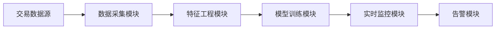

                 


# 构建智能企业风控系统：实时交易监控与欺诈检测

## 关键词：智能风控系统、实时交易监控、欺诈检测、机器学习、数据科学、系统架构

## 摘要：  
本文将详细探讨如何构建一个智能企业风控系统，重点聚焦于实时交易监控与欺诈检测的核心技术与实现。通过系统化的分析与设计，结合实际案例，深入讲解从数据采集到模型部署的完整流程。内容涵盖系统架构设计、算法原理、代码实现及实际应用，为读者提供一套可参考的解决方案，助力企业有效防范金融风险。

---

# 第一部分: 企业风控系统概述

## 第1章: 企业风控系统背景与目标

### 1.1 企业风控系统背景

#### 1.1.1 企业风控的概念与重要性
企业风控（Risk Control）是企业为了降低经营风险而采取的一系列管理措施。在数字化转型的今天，企业风控不仅需要关注传统风险（如信用风险、市场风险），还需要应对新兴的网络风险和欺诈风险。  
**核心目标**包括：  
- **保护企业资产**：防止因欺诈、误操作或系统漏洞导致的经济损失。  
- **合规性要求**：满足监管机构对企业风控的强制要求。  
- **提升信任度**：通过降低风险，增强客户和合作伙伴对企业的信任。  

#### 1.1.2 当前企业风控的主要挑战
随着互联网和金融业务的快速发展，企业风控面临以下主要挑战：  
1. **数据量大**：实时交易数据呈指数级增长，传统的批量处理方式已难以满足需求。  
2. **欺诈手段多样化**：欺诈者不断进化，传统的规则-based风控系统逐渐失效。  
3. **实时性要求高**：企业需要在交易发生的实时或接近实时的情况下完成风险评估。  
4. **数据隐私与安全**：如何在满足隐私保护的前提下进行风险分析，是一个重要课题。  

#### 1.1.3 智能化风控的必要性
智能化风控通过引入人工智能（AI）和大数据技术，能够实时分析交易数据，快速识别异常行为，显著提升风控效率和准确性。其必要性体现在：  
- **提升检测精度**：通过机器学习算法，可以发现传统规则难以识别的复杂欺诈模式。  
- **降低误报率**：智能系统能够根据历史数据自适应调整检测阈值，减少误报。  
- **支持快速响应**：实时监控系统能够在欺诈行为发生前或发生时及时采取措施。  

---

## 第2章: 实时交易监控与欺诈检测的核心概念

### 2.1 实时交易监控的关键要素

#### 2.1.1 交易数据的实时采集
实时交易监控的第一步是采集交易数据。数据来源包括：  
- **数据库**：结构化数据，如订单表、交易表。  
- **API接口**：通过API实时获取交易信息。  
- **日志文件**：非结构化数据，如服务器日志、用户操作日志。  

#### 2.1.2 交易行为的特征提取
特征提取是将原始交易数据转化为模型可以理解的特征。常见的交易特征包括：  
- **交易金额**：金额大小是否异常。  
- **交易时间**：交易时间是否集中在特定时间段。  
- **用户IP地址**：是否存在多个IP地址短时间内多次交易。  
- **设备信息**：设备类型、操作系统、浏览器版本等。  

#### 2.1.3 异常交易的识别机制
异常交易识别机制是实时监控的核心。常见的识别方法包括：  
- **阈值检测**：设定交易金额或频率的阈值，超出阈值则触发警报。  
- **行为分析**：通过机器学习模型分析用户行为，识别异常交易模式。  

### 2.2 欺诈检测的核心原理

#### 2.2.1 欺诈行为的模式识别
欺诈行为通常具有一定的模式。例如：  
- **批量小额交易**：短时间内多次小额交易，可能是洗钱行为。  
- **虚假账户创建**：通过虚假信息创建多个账户进行欺诈交易。  
- **社交工程攻击**：利用钓鱼网站、诈骗电话等手段获取用户信息。  

#### 2.2.2 用户行为分析与风险评估
用户行为分析是欺诈检测的重要手段。通过分析用户的交易行为、登录行为、设备行为等，可以识别潜在的欺诈风险。例如：  
- **登录频率**：短时间内多次登录可能是账户被盗。  
- **交易地点**：同一订单的交易地点分散在不同地区。  

#### 2.2.3 模型的训练与优化
欺诈检测模型需要不断优化，以应对欺诈手段的变化。优化方法包括：  
- **数据增强**：通过生成合成数据来增强模型的泛化能力。  
- **模型调优**：通过调整模型参数，提升检测精度。  
- **持续学习**：实时更新模型，适应新的欺诈模式。  

---

## 第3章: 系统架构设计与实现

### 3.1 系统整体架构设计

#### 3.1.1 系统功能模块划分
智能企业风控系统的功能模块包括：  
1. **数据采集模块**：负责实时采集交易数据。  
2. **特征工程模块**：提取交易特征并进行数据预处理。  
3. **模型训练模块**：训练欺诈检测模型。  
4. **实时监控模块**：对实时交易进行风险评估。  
5. **告警模块**：根据风险评估结果触发告警。  

#### 3.1.2 系统架构图


---

## 第4章: 算法实现与代码解读

### 4.1 机器学习算法选择

#### 4.1.1 监督学习算法
常用的监督学习算法包括：  
- **逻辑回归（Logistic Regression）**：适用于二分类问题，可以用来判断交易是否为欺诈。  
- **随机森林（Random Forest）**：适用于高维数据，能够处理非线性关系。  

#### 4.1.2 无监督学习算法
常用的无监督学习算法包括：  
- **K-Means聚类**：用于将交易数据分成不同的类别，识别异常类别。  
- **Isolation Forest**：专门用于异常检测，适合处理高维数据。  

---

## 第5章: 项目实战与案例分析

### 5.1 实战环境配置

#### 5.1.1 环境搭建
- **Python版本**：建议使用Python 3.8及以上。  
- **依赖库安装**：`pandas`, `numpy`, `scikit-learn`, `xgboost`。  

#### 5.1.2 数据集准备
- 数据集来源：公开数据集（如Kaggle上的欺诈交易数据）。  

### 5.2 代码实现与解读

#### 5.2.1 数据预处理
```python
import pandas as pd
import numpy as np

# 加载数据集
data = pd.read_csv('fraud_dataset.csv')

# 基本信息
print(data.head())
print(data.info())
print(data.describe())
```

#### 5.2.2 特征工程
```python
# 提取特征
features = ['amount', 'time', 'user_id', 'device_id']
target = 'is_fraud'

X = data[features]
y = data[target]
```

#### 5.2.3 模型训练
```python
from sklearn.model_selection import train_test_split
from sklearn.metrics import classification_report
from sklearn.ensemble import RandomForestClassifier

# 划分训练集和测试集
X_train, X_test, y_train, y_test = train_test_split(X, y, test_size=0.2, random_state=42)

# 训练模型
model = RandomForestClassifier()
model.fit(X_train, y_train)

# 预测结果
y_pred = model.predict(X_test)

# 评估指标
print(classification_report(y_test, y_pred))
```

#### 5.2.4 实时监控与告警
```python
import joblib
import time

# 保存模型
joblib.dump(model, 'fraud_detection_model.pkl')

# 实时监控
def monitor_transaction(transaction):
    # 加载模型
    model = joblib.load('fraud_detection_model.pkl')
    # 提取特征
    features = [transaction['amount'], transaction['time'], transaction['user_id'], transaction['device_id']]
    # 预测结果
    prediction = model.predict([features])
    # 触发告警
    if prediction[0] == 1:
        print("检测到欺诈交易！")
    else:
        print("交易正常。")

# 示例
transactions = [
    {'amount': 100, 'time': 162000, 'user_id': 123, 'device_id': 'abc123'},
    {'amount': 500, 'time': 162001, 'user_id': 456, 'device_id': 'def456'}
]

for transaction in transactions:
    monitor_transaction(transaction)
    time.sleep(1)
```

---

## 第6章: 系统优化与注意事项

### 6.1 系统优化建议

#### 6.1.1 数据预处理优化
- **特征选择**：使用特征重要性分析，去除无关特征。  
- **数据增强**：通过数据增强技术，提升模型的泛化能力。  

#### 6.1.2 模型优化
- **超参数调优**：使用网格搜索（Grid Search）优化模型参数。  
- **集成学习**：将多个模型的结果进行集成，提升检测精度。  

#### 6.1.3 系统性能优化
- **分布式架构**：通过分布式计算提升系统的处理能力。  
- **实时优化**：通过流数据处理技术，提升实时监控的效率。  

---

## 第7章: 结语与展望

### 7.1 本章小结
本文详细介绍了智能企业风控系统的核心概念、算法原理、系统架构和实现方法。通过实际案例的分析，展示了如何利用机器学习技术实现实时交易监控与欺诈检测。

### 7.2 未来展望
随着人工智能和大数据技术的不断发展，智能风控系统将更加智能化和自动化。未来的优化方向包括：  
- **引入深度学习**：利用神经网络模型处理更复杂的欺诈模式。  
- **结合区块链技术**：通过区块链技术提升系统的安全性和可信度。  
- **实时性优化**：通过边缘计算等技术进一步提升系统的实时性。  

---

## 作者：AI天才研究院/AI Genius Institute & 禅与计算机程序设计艺术 /Zen And The Art of Computer Programming

