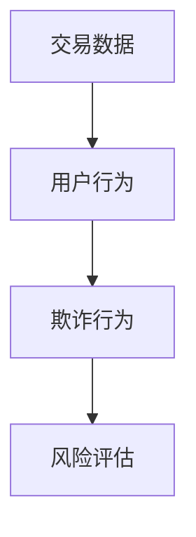
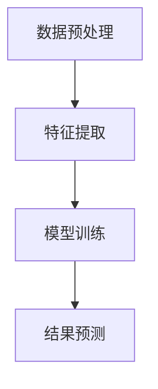
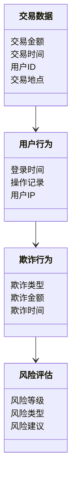
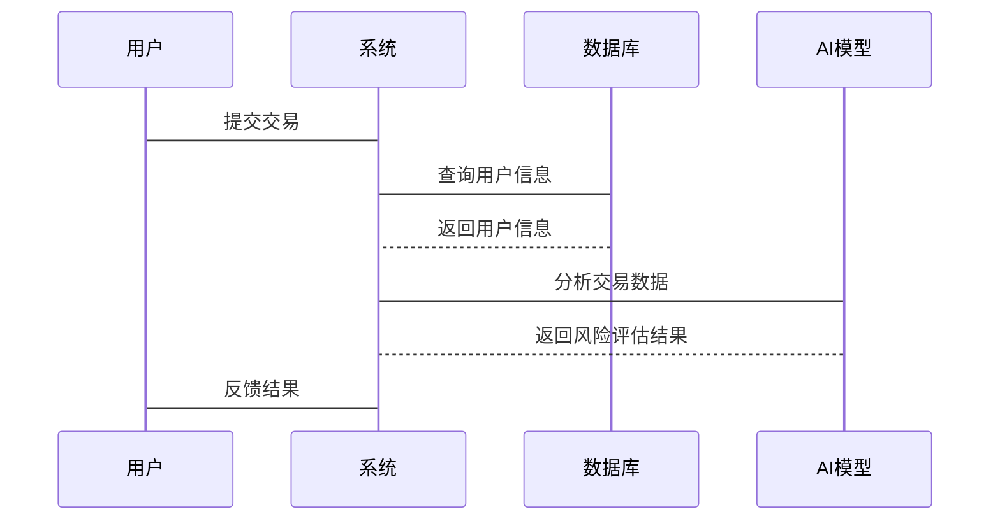

                 


# 构建智能企业风控系统：实时交易监控与欺诈模式识别

> 关键词：企业风控系统，实时交易监控，欺诈模式识别，智能风控，机器学习

> 摘要：本文详细探讨了构建智能企业风控系统的各个方面，包括实时交易监控和欺诈模式识别的核心概念、算法原理、系统架构设计以及实际案例分析。通过结合理论与实践，本文为读者提供了从基础理论到系统实现的全面指南。

---

# 第一部分: 企业风控系统概述

## 第1章: 智能企业风控系统背景与目标

### 1.1 企业风控系统的重要性

#### 1.1.1 企业风控的核心概念

企业风控（风险控制系统）是指通过技术手段对企业运营中的各种风险进行识别、评估、预警和控制的系统。其核心目标是通过实时监控和数据分析，降低企业面临的风险，确保业务的稳定性和安全性。

#### 1.1.2 智能风控系统的定义与目标

智能风控系统是一种基于人工智能和大数据分析的风控系统，能够实时监控企业的各项业务活动，识别潜在风险，并采取相应的控制措施。其目标包括：

1. **实时监控**：对企业的各项交易和操作进行实时监控，及时发现异常行为。
2. **风险预警**：通过数据分析和模型预测，提前预警潜在风险。
3. **欺诈识别**：识别欺诈行为，防止经济损失。
4. **决策支持**：为企业的风险管理决策提供数据支持和建议。

#### 1.1.3 实时交易监控与欺诈模式识别的必要性

在企业运营中，交易监控和欺诈模式识别是风控系统的重要组成部分。实时交易监控能够及时发现异常交易行为，防止潜在的经济损失；欺诈模式识别则能够通过分析历史数据，识别出欺诈行为的特征和模式，从而提高欺诈检测的准确性。

### 1.2 欺诈模式识别的挑战与机遇

#### 1.2.1 欺诈行为的类型与特点

欺诈行为多种多样，常见的类型包括：

1. **信用欺诈**：通过虚假信息获取信用额度。
2. **交易欺诈**：通过虚构交易或 manipulate 交易数据进行非法获利。
3. **身份盗用**：盗用他人身份进行非法交易。
4. **洗钱**：通过多次交易将非法资金合法化。

欺诈行为的特点包括：

1. **隐蔽性**：欺诈行为通常隐藏在正常交易中，难以被察觉。
2. **多样性**：欺诈行为的形式和手段多种多样，且不断演变。
3. **高成本**：发现和处理欺诈行为需要投入大量的资源。

#### 1.2.2 实时交易监控的难点

实时交易监控的难点主要在于如何在高速、大量的交易数据中快速识别异常行为。具体挑战包括：

1. **数据量大**：实时交易数据通常以海量形式出现，需要高效的数据处理能力。
2. **实时性要求高**：监控系统需要在交易发生的同时进行分析和决策，不能有延迟。
3. **模型复杂性**：需要复杂的算法和模型来识别异常行为，同时保证计算效率。

#### 1.2.3 智能风控系统的创新与突破

智能风控系统的创新主要体现在以下几个方面：

1. **人工智能技术的应用**：利用机器学习、深度学习等技术，提高欺诈检测的准确性和效率。
2. **大数据分析**：通过大数据技术，实时处理和分析海量交易数据，发现潜在风险。
3. **动态调整模型**：根据实时数据和反馈，动态调整风控模型，提高适应性。

### 1.3 本章小结

本章主要介绍了企业风控系统的重要性、智能风控系统的定义与目标，以及欺诈模式识别的挑战与机遇。通过这些内容，读者可以理解智能风控系统在企业运营中的关键作用，以及其在实时交易监控和欺诈识别中的重要性。

---

# 第二部分: 核心概念与联系

## 第2章: 智能风控系统的核心概念

### 2.1 交易监控与欺诈模式识别的关联

#### 2.1.1 交易监控的定义与作用

交易监控是指对企业的各项交易活动进行实时或定期的监控，以发现异常交易行为。其作用包括：

1. **风险预警**：通过监控交易数据，及时发现潜在风险。
2. **欺诈识别**：识别异常交易行为，防止欺诈发生。
3. **合规性检查**：确保交易活动符合相关法规和企业政策。

#### 2.1.2 欺诈模式识别的原理

欺诈模式识别是通过对历史交易数据和行为数据的分析，识别出欺诈行为的特征和模式。其原理包括：

1. **特征提取**：从交易数据中提取与欺诈相关的特征，例如交易金额、时间、地点、用户行为等。
2. **模型训练**：利用机器学习算法，训练模型识别欺诈行为。
3. **实时检测**：将实时交易数据输入模型，进行实时检测。

#### 2.1.3 两者结合的必要性

交易监控和欺诈模式识别的结合是智能风控系统的核心。通过实时监控交易活动，并结合历史数据分析，可以更准确地识别欺诈行为，提高风控系统的效率和准确性。

### 2.2 实时交易监控的关键要素

#### 2.2.1 数据采集与处理

实时交易监控的第一步是数据采集与处理。需要从各种渠道采集交易数据，并进行清洗、转换和存储。关键点包括：

1. **数据源多样化**：交易数据可能来自多个渠道，如线上支付、线下交易、银行转账等。
2. **数据处理高效性**：需要对海量数据进行快速处理，确保实时监控的及时性。
3. **数据存储安全性**：交易数据通常包含敏感信息，需要确保数据存储的安全性。

#### 2.2.2 风险评估模型

风险评估模型是实时交易监控的核心部分。通过模型评估交易的风险等级，决定是否需要采取进一步的措施。关键点包括：

1. **模型选择**：根据具体业务需求选择合适的模型，例如决策树、随机森林、神经网络等。
2. **模型训练**：利用历史交易数据训练模型，确保模型的准确性和稳定性。
3. **模型优化**：根据实时反馈优化模型，提高检测的准确性和效率。

#### 2.2.3 监控策略与阈值

监控策略与阈值是实时交易监控的重要组成部分。通过设定合适的策略和阈值，可以有效减少误报和漏报。关键点包括：

1. **策略制定**：根据企业的风险承受能力和业务特点制定监控策略。
2. **阈值设定**：根据历史数据和业务需求设定阈值，确保监控的敏感性和稳定性。
3. **动态调整**：根据实时数据和反馈动态调整策略和阈值，提高监控的适应性。

### 2.3 欺诈模式识别的特征分析

#### 2.3.1 用户行为特征

用户行为特征是欺诈模式识别的重要依据。通过分析用户的交易行为，可以发现异常行为。关键点包括：

1. **交易频率**：异常交易频率可能高于或低于正常水平。
2. **交易金额**：异常交易金额可能显著偏离正常范围。
3. **交易时间**：异常交易可能集中在特定时间段或非正常时间段。

#### 2.3.2 交易特征分析

交易特征分析是欺诈模式识别的另一个重要方面。通过分析交易的特征，可以识别出异常交易行为。关键点包括：

1. **交易类型**：不同类型的交易可能具有不同的风险特征。
2. **交易地点**：异常交易可能集中在特定地点或分布在多个地点。
3. **交易时间序列**：异常交易可能在时间序列上表现出一定的规律性。

#### 2.3.3 时间序列分析

时间序列分析是欺诈模式识别的重要方法。通过分析交易的时间序列数据，可以发现异常行为。关键点包括：

1. **趋势分析**：通过分析交易金额和频率的趋势，发现异常变化。
2. **周期性分析**：通过分析交易的周期性，发现异常波动。
3. **异常检测**：通过统计方法或机器学习方法检测时间序列中的异常点。

### 2.4 核心概念对比表

表2.1 交易监控与欺诈模式识别的对比

| 对比维度 | 交易监控 | 欺诈模式识别 |
|----------|-----------|--------------|
| 监控对象 | 实时交易  | 历史交易数据 |
| 数据来源 | 实时数据流 | 历史数据 |
| 监控目标 | 发现异常交易 | 识别欺诈行为 |
| 分析方法 | 实时分析 | 离线分析 |
| 应用场景 | 银行、支付平台 | 企业风控、金融行业 |

### 2.5 ER实体关系图



---

## 第3章: 算法原理与实现

### 3.1 监督学习与无监督学习

#### 3.1.1 监督学习的定义与应用

监督学习是一种机器学习方法，通过训练数据中的标签，学习输入与输出之间的映射关系。在欺诈检测中，监督学习可以用于分类任务，例如将交易分为正常和欺诈两类。

#### 3.1.2 无监督学习的定义与应用

无监督学习是一种机器学习方法，通过数据的内在结构，发现数据中的模式和关系。在欺诈检测中，无监督学习可以用于聚类任务，例如将交易分为正常和异常两类。

#### 3.1.3 混合学习的优缺点

混合学习是结合监督学习和无监督学习的一种方法。在欺诈检测中，可以先使用无监督学习发现异常交易，再使用监督学习对异常交易进行分类。混合学习的优点是可以结合两种方法的优势，缺点是实现复杂度较高。

### 3.2 欺诈检测的经典算法

#### 3.2.1 基于决策树的欺诈检测

决策树是一种常用的机器学习算法，适用于分类任务。在欺诈检测中，决策树可以通过特征选择和树的构建，实现交易的分类。

#### 3.2.2 基于聚类的异常检测

聚类是一种无监督学习方法，适用于发现数据中的异常点。在欺诈检测中，聚类算法可以将交易分为正常和异常两类，帮助识别欺诈行为。

#### 3.2.3 基于神经网络的深度学习

深度学习是一种基于神经网络的机器学习方法，适用于复杂的数据模式识别。在欺诈检测中，深度学习可以通过多层神经网络，学习交易数据中的复杂特征，提高检测的准确性。

### 3.3 算法流程图



### 3.4 Python代码实现

```python
import pandas as pd
from sklearn.tree import DecisionTreeClassifier
from sklearn.metrics import accuracy_score

# 数据预处理
data = pd.read_csv('transaction_data.csv')
X = data.drop('is_fraud', axis=1)
y = data['is_fraud']

# 模型训练
model = DecisionTreeClassifier()
model.fit(X, y)

# 模型预测
y_pred = model.predict(X)

# 模型评估
print('Accuracy:', accuracy_score(y, y_pred))
```

### 3.5 数学模型与公式

#### 3.5.1 监督学习的损失函数

$$ L(y, y_{pred}) = \frac{1}{n}\sum_{i=1}^{n} (y_i - y_{pred_i})^2 $$

#### 3.5.2 无监督学习的聚类评估

$$ Silhouette Score = \frac{a + b}{c} $$

其中：
- $a$ 是样本与其所属聚类的平均距离。
- $b$ 是样本与相邻聚类的平均距离。
- $c$ 是样本与其所属聚类的中位数距离。

---

# 第三部分: 系统分析与架构设计

## 第4章: 系统分析与架构设计

### 4.1 问题场景介绍

在企业风控系统中，实时交易监控和欺诈模式识别是核心功能。为了实现这一功能，需要设计一个高效的系统架构，确保系统的实时性、准确性和可扩展性。

### 4.2 系统功能设计

#### 4.2.1 领域模型图



#### 4.2.2 系统架构设计


#### 4.2.3 接口设计与交互流程



---

# 第四部分: 项目实战

## 第5章: 项目实战

### 5.1 环境安装

为了实现智能风控系统，需要安装以下工具和库：

1. **Python**：用于编程和数据分析。
2. **Pandas** 和 **NumPy**：用于数据处理和分析。
3. **Scikit-learn**：用于机器学习算法。
4. **Mermaid**：用于绘制图表。
5. **Jupyter Notebook**：用于代码实现和测试。

### 5.2 系统核心实现源代码

```python
import pandas as pd
from sklearn.ensemble import RandomForestClassifier
from sklearn.metrics import classification_report

# 数据加载
data = pd.read_csv('transaction_data.csv')

# 特征选择
X = data[['amount', 'time', 'user_id', 'location']]
y = data['is_fraud']

# 模型训练
model = RandomForestClassifier(n_estimators=100)
model.fit(X, y)

# 模型预测
y_pred = model.predict(X)

# 模型评估
print(classification_report(y, y_pred))
```

### 5.3 代码应用解读与分析

上述代码实现了基于随机森林算法的欺诈检测系统。首先，加载交易数据，选择相关特征，训练模型，然后进行预测，并输出分类报告。通过这种方式，可以评估模型的准确率、召回率和F1分数。

### 5.4 实际案例分析

假设我们有一个交易数据集，其中包含正常交易和欺诈交易。通过上述代码，我们可以训练模型，并对新的交易进行分类。例如：

```python
# 示例交易数据
new_transaction = pd.DataFrame({
    'amount': [1000],
    'time': ['2023-10-01 12:00:00'],
    'user_id': ['U001'],
    'location': ['New York']
})

# 模型预测
prediction = model.predict(new_transaction[['amount', 'time', 'user_id', 'location']])
print('Prediction:', prediction)
```

通过上述代码，我们可以得到新交易的欺诈预测结果。

### 5.5 项目小结

本章通过实际案例分析，展示了如何使用Python和机器学习算法构建智能风控系统。通过代码实现和案例分析，读者可以理解如何将理论应用于实际项目。

---

# 第五部分: 最佳实践与总结

## 第6章: 最佳实践与总结

### 6.1 最佳实践 tips

1. **数据预处理**：在进行模型训练之前，需要对数据进行清洗和预处理，确保数据质量。
2. **特征选择**：选择合适的特征对模型性能至关重要，可以通过特征重要性分析选择关键特征。
3. **模型调优**：通过网格搜索等方法，优化模型参数，提高模型性能。
4. **实时监控**：确保系统的实时性，通过分布式架构和高效的队列管理实现。
5. **日志记录与反馈**：记录系统的运行日志，及时发现和解决问题，并根据反馈优化模型。

### 6.2 小结

本文详细探讨了构建智能企业风控系统的各个方面，包括实时交易监控和欺诈模式识别的核心概念、算法原理、系统架构设计以及实际案例分析。通过结合理论与实践，本文为读者提供了从基础理论到系统实现的全面指南。

### 6.3 注意事项

1. **数据安全**：在处理交易数据时，需要注意数据的敏感性，确保数据安全。
2. **模型解释性**：在实际应用中，模型的解释性非常重要，需要能够解释模型的决策过程。
3. **系统稳定性**：确保系统的稳定性和可靠性，避免因系统故障导致监控中断。

### 6.4 拓展阅读

1. **机器学习经典书籍**：《机器学习实战》、《Python机器学习》。
2. **大数据技术**：Hadoop、Spark等技术的学习与应用。
3. **风控系统设计**：深入学习风控系统的架构设计和最佳实践。

---

# 作者：AI天才研究院/AI Genius Institute & 禅与计算机程序设计艺术/Zen And The Art of Computer Programming

