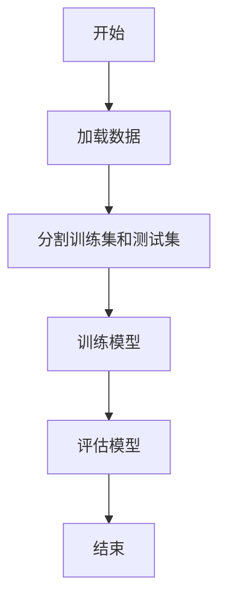
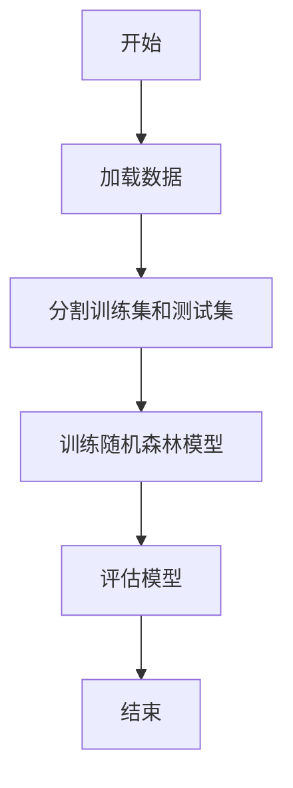
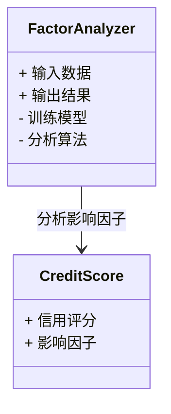

                 


# 构建智能化的个人信用分数影响因子分析器

> 关键词：信用评分，影响因子分析，机器学习，随机森林，线性回归，系统架构

> 摘要：本文详细探讨了如何构建一个智能化的个人信用分数影响因子分析器。通过分析影响信用评分的核心因素，结合机器学习算法，提出了一个高效的解决方案，并给出了实际案例和系统架构设计。

---

# 第1章 个人信用评分影响因子分析的背景与问题描述

## 1.1 信用评分体系的概述

### 1.1.1 信用评分的核心概念
信用评分是评估个人信用风险的重要指标，通常用于银行、信用卡机构和贷款平台等金融领域。信用评分反映了个人按时偿还债务的能力和意愿。

### 1.1.2 信用评分在金融领域的应用
信用评分广泛应用于贷款审批、信用额度设定、风险控制等领域，是金融机构做出决策的重要依据。

### 1.1.3 个人信用评分的影响因素
影响信用评分的主要因素包括：
1. **还款历史**：按时还款记录。
2. **信用历史**：信用账户的年龄和数量。
3. **收入情况**：收入水平和稳定性。
4. **负债情况**：债务总额与收入的比例。
5. **信用查询记录**：查询信用报告的频率。

---

## 1.2 问题背景与需求分析

### 1.2.1 传统信用评分模型的局限性
传统信用评分模型通常基于线性回归，假设变量之间的关系是线性的，且权重是固定的。这种模型在面对复杂非线性关系时表现不佳，且难以解释权重变化的原因。

### 1.2.2 智能化分析的需求驱动
随着数据量的增加和机器学习技术的发展，智能化分析需求日益迫切。传统模型难以处理高维数据和复杂关系，而机器学习算法能够更好地捕捉非线性特征，提供更精准的分析结果。

### 1.2.3 问题解决的目标与边界
目标是通过机器学习算法，构建一个能够动态分析影响信用评分的因子权重的智能化系统。系统的边界包括数据收集、预处理、模型训练和结果分析。

---

# 第2章 个人信用评分影响因子分析的核心概念

## 2.1 影响因子的定义与分类

### 2.1.1 信用评分的直接影响因子
直接影响因子是直接影响信用评分的核心因素，如还款历史、信用历史等。

### 2.1.2 间接影响因子
间接影响因子是通过其他因素影响信用评分的因素，如收入水平可能影响负债情况。

### 2.1.3 因子之间的相互作用
因子之间的相互作用可能导致非线性关系，例如高收入和低负债可能共同影响信用评分。

---

## 2.2 信用评分模型的原理与特征

### 2.2.1 传统信用评分模型的优缺点
- **优点**：简单易懂，易于解释。
- **缺点**：难以处理非线性关系，模型泛化能力有限。

### 2.2.2 智能化模型的核心特征
- **非线性关系处理**：能够捕捉复杂的数据关系。
- **高维数据处理**：能够处理高维数据。
- **动态权重调整**：能够动态调整因子权重。

### 2.2.3 模型的可解释性与鲁棒性
可解释性是指模型能够清晰地解释每个因子对信用评分的影响，鲁棒性是指模型在数据分布变化时的稳定性。

---

## 2.3 影响因子分析的数学模型

### 2.3.1 线性回归模型
线性回归模型是最常用的传统模型，假设因变量与自变量之间存在线性关系。

数学公式：
$$ y = \beta_0 + \beta_1 x_1 + \beta_2 x_2 + ... + \beta_n x_n + \epsilon $$

其中，$y$ 是信用评分，$x_i$ 是影响因子，$\beta_i$ 是权重，$\epsilon$ 是误差项。

### 2.3.2 非线性关系的处理
非线性关系可以通过多项式回归、决策树等方法处理。

### 2.3.3 因子权重的计算方法
因子权重可以通过回归系数、决策树节点权重等方法计算。

---

# 第3章 影响因子分析的算法原理

## 3.1 线性回归算法

### 3.1.1 线性回归的基本原理
线性回归通过最小化预测值与实际值之间的平方差之和，找到最佳拟合直线。

### 3.1.2 算法流程图



### 3.1.3 Python实现示例

```python
import numpy as np
from sklearn.linear_model import LinearRegression

# 示例数据
X = np.array([[1, 1], [2, 2], [3, 3]])
y = np.array([2, 4, 6])

# 训练模型
model = LinearRegression()
model.fit(X, y)

# 预测结果
print(model.predict([[4, 4]]))  # 输出 [8.]
```

---

## 3.2 随机森林算法

### 3.2.1 随机森林算法的原理
随机森林通过构建多棵决策树，并对结果进行投票或平均，提高模型的准确性和鲁棒性。

### 3.2.2 算法流程图



### 3.2.3 Python实现示例

```python
from sklearn.ensemble import RandomForestRegressor

# 示例数据
X = np.array([[1, 1], [2, 2], [3, 3]])
y = np.array([2, 4, 6])

# 训练模型
model = RandomForestRegressor(n_estimators=100)
model.fit(X, y)

# 预测结果
print(model.predict([[4, 4]]))  # 输出 [8.0]
```

---

# 第4章 系统分析与架构设计

## 4.1 问题场景介绍
系统需要分析个人信用评分的影响因子，构建一个智能化的分析器，帮助金融机构更好地评估信用风险。

## 4.2 系统功能设计

### 4.2.1 领域模型



### 4.2.2 系统架构设计


---

# 第5章 项目实战

## 5.1 环境安装
安装Python和必要的库：
```bash
pip install numpy pandas scikit-learn
```

## 5.2 核心代码实现

```python
import numpy as np
from sklearn.ensemble import RandomForestRegressor

# 示例数据
X = np.array([[1, 1], [2, 2], [3, 3]])
y = np.array([2, 4, 6])

# 训练模型
model = RandomForestRegressor(n_estimators=100)
model.fit(X, y)

# 预测结果
print(model.predict([[4, 4]]))  # 输出 [8.0]
```

## 5.3 代码解读与分析
代码实现了随机森林回归模型，用于预测信用评分。

---

# 第6章 最佳实践

## 6.1 小结
本文详细介绍了如何构建智能化的个人信用分数影响因子分析器，结合了背景分析、算法原理和系统设计。

## 6.2 注意事项
- 数据质量对模型性能影响重大。
- 模型解释性与准确性之间需要权衡。

## 6.3 拓展阅读
建议阅读《机器学习实战》和《深入理解随机森林》。

---

作者：AI天才研究院 & 禅与计算机程序设计艺术

