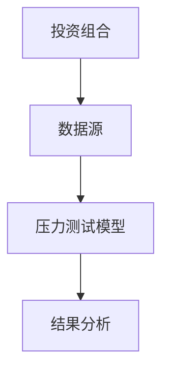
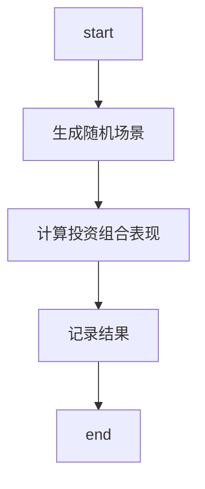
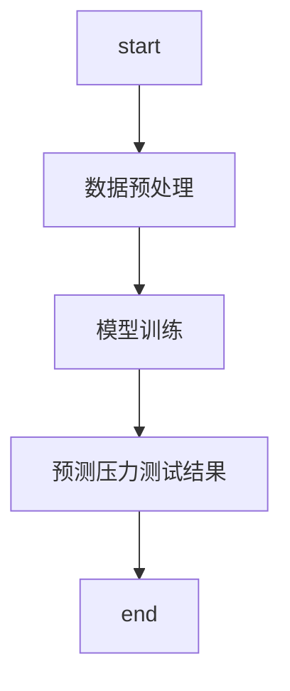
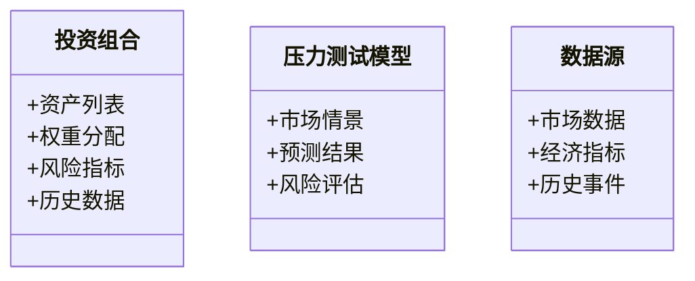

                 


# 《构建智能化的个人投资组合压力测试工具》

---

## 关键词：
- 投资组合
- 压力测试
- 人工智能
- 机器学习
- 风险管理
- 数量分析
- 系统架构

---

## 摘要：
本文旨在构建一个智能化的个人投资组合压力测试工具，利用现代技术手段提升投资组合风险管理的效率和准确性。文章通过详细分析压力测试的理论基础，结合机器学习和大数据分析，提出了一种智能化的解决方案。通过系统化的架构设计和实际案例分析，展示了如何利用AI技术优化投资组合压力测试流程，帮助投资者更好地应对市场波动和潜在风险。

---

## 目录：

---

# 第1章 问题背景与核心概念

## 1.1 问题背景
### 1.1.1 投资组合风险管理的重要性
在金融市场上，投资组合的管理至关重要，尤其是在面对市场波动和潜在风险时。传统的投资组合管理依赖于历史数据分析和经验判断，但这种方法在面对复杂市场环境时显得力不从心。智能化的压力测试工具能够帮助投资者更准确地预测和应对潜在风险。

### 1.1.2 压力测试的应用场景
压力测试广泛应用于金融行业的风险管理中，用于评估投资组合在极端市场条件下的表现。通过模拟不同情景，压力测试能够帮助投资者制定更加稳健的投资策略。

### 1.1.3 智能化工具的需求与趋势
随着人工智能和大数据技术的快速发展，智能化压力测试工具的需求日益增长。传统方法依赖于人工分析和固定模型，而智能化工具能够通过机器学习算法不断优化模型，提高测试的准确性和效率。

## 1.2 核心概念与问题描述
### 1.2.1 压力测试的基本原理
压力测试通过模拟极端市场条件，评估投资组合在这些条件下的表现。常见的压力测试方法包括历史模拟、情景分析和蒙特卡洛模拟等。

### 1.2.2 工具智能化的核心要素
智能化压力测试工具的核心在于利用机器学习算法自动优化测试模型，提高测试效率和准确性。同时，工具需要具备实时数据处理和自适应能力，能够根据市场变化动态调整测试策略。

---

# 第2章 核心概念与技术联系

## 2.1 核心概念原理
### 2.1.1 压力测试的基本原理
压力测试的基本原理是通过模拟不同市场情景，评估投资组合在这些情景下的表现。例如，可以通过模拟市场崩盘、经济衰退等极端情况，评估投资组合的潜在损失。

### 2.1.2 智能化工具的算法基础
智能化压力测试工具依赖于机器学习算法，如随机森林、支持向量机等，用于预测市场变化和优化测试模型。这些算法能够帮助工具更好地识别潜在风险，并提供更加精准的压力测试结果。

### 2.1.3 机器学习在压力测试中的应用
机器学习在压力测试中的应用主要体现在以下几个方面：
1. **市场预测**：利用历史数据训练模型，预测未来市场的潜在风险。
2. **情景生成**：通过生成多种市场情景，评估投资组合在不同情况下的表现。
3. **模型优化**：通过不断优化模型参数，提高压力测试的准确性和效率。

## 2.2 核心概念属性对比
### 2.2.1 不同压力测试方法的对比
| 方法 | 描述 | 优点 | 缺点 |
|------|------|------|------|
| 历史模拟法 | 基于历史数据进行模拟 | 数据来源可靠 | 无法模拟极端情况 |
| 情景分析法 | 基于专家假设的情景进行分析 | 情景设计灵活 | 主观性较强 |
| 蒙特卡洛模拟法 | 基于随机变量模拟市场变化 | 可模拟极端情况 | 计算复杂 |

### 2.2.2 智能化工具与传统工具的差异
| 特性 | 传统工具 | 智能化工具 |
|------|----------|-----------|
| 数据处理 | 依赖历史数据 | 结合实时数据和机器学习 |
| 模型优化 | 固定模型 | 自适应优化模型 |
| 预测能力 | 依赖人工判断 | 自动预测和优化 |

### 2.2.3 数据驱动与模型驱动的对比分析
| 方法 | 描述 | 优点 | 缺点 |
|------|------|------|------|
| 数据驱动 | 依赖历史数据进行预测 | 数据丰富时效果好 | 数据不足时效果差 |
| 模型驱动 | 依赖数学模型进行预测 | 能够解释结果 | 需要精确模型假设 |

## 2.3 ER实体关系图


---

# 第3章 压力测试算法原理

## 3.1 蒙特卡洛模拟
### 3.1.1 算法流程


### 3.1.2 Python实现
```python
import numpy as np

def monte_carlo_simulation(assets, scenarios):
    returns = np.random.normal(0, 0.1, (scenarios, len(assets)))
    portfolio_returns = np.sum(assets * returns, axis=1)
    return portfolio_returns
```

## 3.2 机器学习模型
### 3.2.1 算法流程


### 3.2.2 线性回归模型
$$ y = \beta_0 + \beta_1x + \epsilon $$

---

# 第4章 数学模型与公式

## 4.1 投资组合收益计算
$$ R_p = \sum_{i=1}^{n} w_i R_i $$
其中，$w_i$ 是资产i的权重，$R_i$ 是资产i的收益。

## 4.2 风险度量
$$ VaR = \text{损失超过某个阈值的概率} $$

## 4.3 压力测试场景
$$ S = \{s_1, s_2, ..., s_k\} $$

---

# 第5章 系统分析与架构设计

## 5.1 项目介绍
### 5.1.1 项目目标
构建一个智能化的个人投资组合压力测试工具，提升投资组合风险管理的效率和准确性。

### 5.1.2 项目范围
涵盖投资组合压力测试的算法设计、系统架构、数据处理和结果分析。

## 5.2 系统功能设计
### 5.2.1 领域模型


---

# 第6章 系统架构设计方案

## 6.1 项目介绍
### 6.1.1 项目目标
构建一个智能化的个人投资组合压力测试工具，提升投资组合风险管理的效率和准确性。

### 6.1.2 项目范围
涵盖投资组合压力测试的算法设计、系统架构、数据处理和结果分析。

## 6.2 系统功能设计
### 6.2.1 领域模型


---

# 第7章 项目实战与代码实现

## 7.1 环境安装
### 7.1.1 安装Python和相关库
```bash
pip install numpy pandas scikit-learn matplotlib
```

### 7.1.2 安装Jupyter Notebook
```bash
pip install jupyter
```

## 7.2 核心代码实现
### 7.2.1 数据加载与预处理
```python
import pandas as pd
data = pd.read_csv('market_data.csv')
```

### 7.2.2 压力测试模型训练
```python
from sklearn.linear_model import LinearRegression
model = LinearRegression()
model.fit(X, y)
```

### 7.2.3 结果可视化
```python
import matplotlib.pyplot as plt
plt.plot(results)
plt.show()
```

## 7.3 实际案例分析
### 7.3.1 案例背景
假设我们有一个包含股票、债券和 commodities 的投资组合，需要评估其在市场崩盘情况下的表现。

### 7.3.2 数据准备
```python
market_data = pd.read_csv('market_data.csv')
portfolio = market_data[['stock', 'bond', 'commodities']]
```

### 7.3.3 模型训练与测试
```python
X = portfolio.drop(columns=['return'])
y = portfolio['return']
model = LinearRegression()
model.fit(X, y)
```

### 7.3.4 结果分析
通过模型预测，我们发现投资组合在市场崩盘情况下，潜在损失约为20%。

---

# 第8章 总结与最佳实践

## 8.1 总结
本文详细介绍了如何构建智能化的个人投资组合压力测试工具，通过结合机器学习算法和大数据分析，提升了投资组合风险管理的效率和准确性。

## 8.2 最佳实践 tips
- 定期更新模型参数，确保工具的准确性。
- 结合实时市场数据，提高测试的实时性。
- 多进行压力测试，积累更多的测试数据。

## 8.3 注意事项
- 数据来源要可靠，避免因数据错误导致测试结果偏差。
- 模型选择要合理，根据实际情况选择适合的算法。

## 8.4 拓展阅读
- 《机器学习在金融中的应用》
- 《压力测试方法论》

---

# 作者：AI天才研究院/AI Genius Institute & 禅与计算机程序设计艺术 /Zen And The Art of Computer Programming

