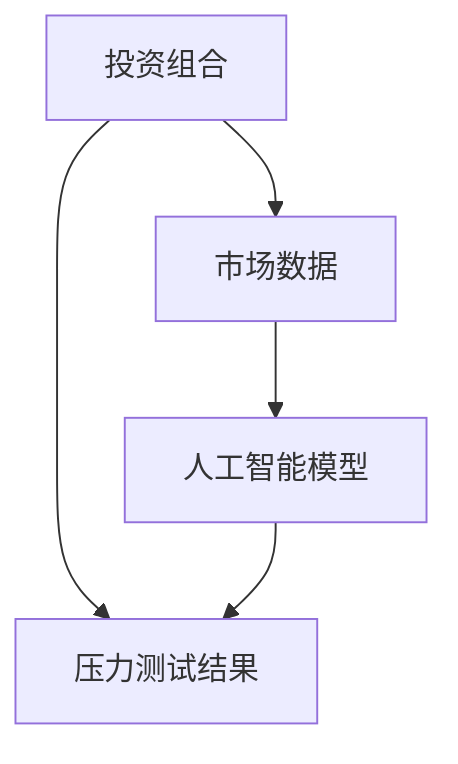
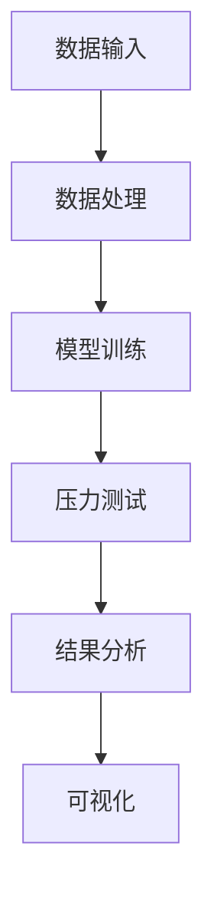
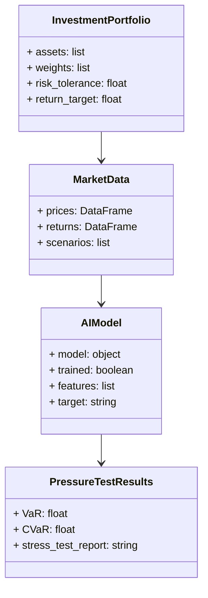

                 


# 构建智能化的个人投资组合压力测试工具

> 关键词：压力测试，人工智能，投资组合，机器学习，风险管理，系统架构

> 摘要：本文详细探讨了如何利用人工智能技术构建智能化的个人投资组合压力测试工具。通过结合机器学习算法和系统架构设计，本文提出了一个高效的解决方案，帮助投资者在不同压力情景下评估和优化其投资组合的风险管理能力。

---

## 第1章：压力测试的背景与基础

### 1.1 压力测试的基本概念

#### 1.1.1 什么是压力测试
压力测试是一种评估在极端市场条件下投资组合表现的方法，用于识别潜在风险并制定应对策略。它通过模拟市场波动、经济衰退或其他极端情况，测试投资组合在这些情况下的表现。

#### 1.1.2 压力测试的目的与意义
压力测试的主要目的是帮助投资者评估在不利市场条件下投资组合的抗风险能力，识别潜在风险，并制定相应的风险管理策略。通过压力测试，投资者可以更好地理解投资组合在极端情况下的表现，从而做出更明智的投资决策。

#### 1.1.3 压力测试的分类与应用场景
压力测试可以根据测试的情景、方法和数据来源进行分类。常见的压力测试类型包括历史情景测试、假设情景测试和蒙特卡洛模拟测试。应用场景包括投资组合优化、风险管理、资产配置和投资决策支持等。

### 1.2 智能化压力测试的定义与特点

#### 1.2.1 传统压力测试的局限性
传统压力测试通常依赖于历史数据或假设情景，可能无法捕捉到新的极端市场情况。此外，传统方法缺乏自动化和智能化，难以快速适应市场变化。

#### 1.2.2 智能化压力测试的核心优势
智能化压力测试利用人工智能和机器学习技术，能够实时分析市场数据，自动识别潜在风险，并提供个性化的压力测试结果。这种方法更加灵活和高效，能够更好地应对复杂的市场环境。

#### 1.2.3 人工智能在压力测试中的作用
人工智能技术，如机器学习和深度学习，可以用于预测市场趋势、识别潜在风险因素，并模拟极端情景下的投资组合表现。AI能够处理大量数据，发现传统方法难以察觉的模式和关系，从而提高压力测试的准确性和可靠性。

### 1.3 投资组合管理的基础知识

#### 1.3.1 投资组合的基本概念
投资组合是指投资者持有的各种金融资产的组合。合理的投资组合可以在风险和收益之间找到最佳平衡点，帮助投资者实现长期的财务目标。

#### 1.3.2 投资组合的风险与收益分析
投资组合的风险包括市场风险、流动性风险和信用风险等。收益则取决于资产的回报率和投资组合的配置。通过压力测试，投资者可以更好地理解投资组合在不同情景下的风险和收益 trade-off。

#### 1.3.3 投资组合优化的数学模型
投资组合优化通常基于现代投资组合理论（MPT），通过数学模型最大化预期收益，同时最小化风险。常见的优化方法包括均值-方差优化和风险中性优化等。

### 1.4 本章小结
本章介绍了压力测试的基本概念、智能化压力测试的特点以及投资组合管理的基础知识。压力测试是评估投资组合风险的重要工具，而智能化压力测试通过人工智能技术进一步提高了其准确性和实用性。

---

## 第2章：智能化压力测试的核心概念与联系

### 2.1 核心概念原理

#### 2.1.1 压力测试的数学模型
压力测试的数学模型通常包括情景生成、资产价格预测和投资组合表现评估等步骤。通过数学模型，可以模拟不同情景下的市场表现，并评估投资组合的风险。

#### 2.1.2 人工智能在压力测试中的应用原理
人工智能在压力测试中的应用主要体现在数据处理、模型训练和情景模拟等方面。通过机器学习算法，AI可以自动识别市场趋势和潜在风险，生成个性化的情景并评估投资组合的表现。

#### 2.1.3 多因素模型与压力测试的关系
多因素模型考虑了多个影响投资组合表现的因素，如市场风险、行业风险和公司特有风险等。在压力测试中，多因素模型可以帮助更准确地模拟极端情景下的投资组合表现。

### 2.2 核心概念属性特征对比表

| 概念         | 输入 | 输出 | 方法 |
|--------------|------|------|------|
| 压力测试     | 市场数据、投资组合 | 投资组合表现、风险指标 | 情景模拟、资产价格预测 |
| 人工智能     | 历史数据、实时数据 | 预测结果、模型参数 | 机器学习、深度学习 |

### 2.3 ER实体关系图



### 2.4 本章小结
本章详细探讨了智能化压力测试的核心概念及其与人工智能的关系。通过数学模型和机器学习算法，智能化压力测试能够更准确地评估投资组合的风险，并提供个性化的压力测试结果。

---

## 第3章：压力测试的机器学习算法原理

### 3.1 机器学习算法概述

#### 3.1.1 监督学习
监督学习是一种通过训练数据学习输入与输出之间关系的算法。在压力测试中，可以使用监督学习来预测资产价格或投资组合表现。

#### 3.1.2 无监督学习
无监督学习用于从数据中发现隐藏的结构或模式。在压力测试中，无监督学习可以用于识别市场中的潜在风险因素。

#### 3.1.3 强化学习
强化学习通过试错机制优化决策过程。在压力测试中，强化学习可以用于动态调整投资组合配置以应对极端市场情况。

### 3.2 压力测试中常用的机器学习算法

#### 3.2.1 回归分析
回归分析是一种预测连续变量的机器学习算法。在压力测试中，可以使用线性回归或逻辑回归来预测投资组合在不同情景下的表现。

#### 3.2.2 聚类分析
聚类分析用于将数据分成相似的组别。在压力测试中，聚类分析可以用于识别具有相似风险特性的资产或投资组合。

#### 3.2.3 神经网络
神经网络是一种模拟人脑神经网络的机器学习模型。在压力测试中，可以使用深度神经网络来预测复杂的市场行为和资产价格走势。

### 3.3 机器学习算法的数学模型与公式

#### 3.3.1 线性回归模型
线性回归模型的数学表达式为：
$$ y = \beta_0 + \beta_1x + \epsilon $$
其中，$y$ 是目标变量，$x$ 是自变量，$\beta_0$ 和 $\beta_1$ 是回归系数，$\epsilon$ 是误差项。

#### 3.3.2 神经网络模型
神经网络模型的数学表达式为：
$$ y = f(Wx + b) $$
其中，$W$ 是权重矩阵，$x$ 是输入向量，$b$ 是偏置项，$f$ 是激活函数。

### 3.4 本章小结
本章介绍了压力测试中常用的机器学习算法，包括回归分析、聚类分析和神经网络。通过数学模型和公式，详细讲解了这些算法在压力测试中的应用和原理。

---

## 第4章：系统架构与设计

### 4.1 系统架构概述

#### 4.1.1 系统功能模块
智能化压力测试工具的系统架构通常包括以下几个功能模块：
- 数据输入与处理模块
- 模型训练与优化模块
- 压力测试执行模块
- 结果分析与可视化模块

#### 4.1.2 系统架构图


### 4.2 系统功能设计

#### 4.2.1 数据输入与处理
数据输入与处理模块负责获取市场数据和投资组合信息，进行数据清洗和特征工程，为后续的模型训练提供高质量的数据。

#### 4.2.2 模型训练与优化
模型训练与优化模块包括选择合适的机器学习算法，训练模型并进行参数优化，确保模型在压力测试中的准确性和可靠性。

#### 4.2.3 压力测试执行
压力测试执行模块根据训练好的模型，模拟极端市场情景，评估投资组合在不同情景下的表现。

#### 4.2.4 结果分析与可视化
结果分析与可视化模块对压力测试的结果进行分析，生成直观的可视化报告，帮助用户更好地理解投资组合的风险和收益。

### 4.3 系统架构设计

#### 4.3.1 领域模型类图


#### 4.3.2 系统架构图


### 4.4 本章小结
本章详细介绍了智能化压力测试工具的系统架构与设计，包括功能模块划分、系统架构图以及领域模型类图。通过合理的系统设计，可以提高工具的效率和准确性。

---

## 第5章：项目实战与实现

### 5.1 项目实战概述

#### 5.1.1 环境安装与配置
在开始项目之前，需要安装必要的软件和库，包括Python、Jupyter Notebook、Pandas、NumPy、Scikit-learn、TensorFlow等。

#### 5.1.2 核心代码实现
以下是压力测试工具的核心代码实现：

```python
import pandas as pd
import numpy as np
from sklearn.linear_model import LinearRegression
from sklearn.metrics import mean_squared_error

# 数据输入与处理
data = pd.read_csv('market_data.csv')
X = data[['market_return', 'volatility', 'liquidity']]
y = data['portfolio_return']

# 模型训练
model = LinearRegression()
model.fit(X, y)

# 压力测试执行
stress_scenario = np.array([[0.02, 0.3, 0.8]])
predicted_return = model.predict(stress_scenario)
print('预测的投资组合回报率为:', predicted_return[0])
```

#### 5.1.3 案例分析与结果解读
以一个具体的投资组合为例，模拟极端市场情景下的压力测试结果，并解释结果的含义和应用。

### 5.2 本章小结
本章通过实际项目案例，详细讲解了智能化压力测试工具的实现过程，包括环境安装、核心代码实现和案例分析。通过实际操作，读者可以更好地理解理论知识。

---

## 第6章：最佳实践与注意事项

### 6.1 最佳实践 tips

#### 6.1.1 数据预处理的重要性
数据预处理是保证模型准确性的关键步骤，包括数据清洗、特征选择和数据增强等。

#### 6.1.2 模型选择与调优
选择合适的机器学习算法，并进行参数调优，可以提高模型的准确性和泛化能力。

#### 6.1.3 结果解读与可视化
压力测试结果的解读和可视化是帮助用户做出决策的重要环节，需要生成直观易懂的报告。

### 6.2 注意事项

#### 6.2.1 数据隐私与安全
在处理市场数据和投资组合信息时，需要注意数据的隐私和安全，防止数据泄露和滥用。

#### 6.2.2 模型的局限性
任何模型都有其局限性，需要根据实际情况选择合适的方法，并结合专家判断进行调整。

#### 6.2.3 系统的可扩展性
在设计系统时，需要考虑其可扩展性，以便在未来扩展功能或适应新的数据源。

### 6.3 本章小结
本章总结了智能化压力测试工具的最佳实践和注意事项，包括数据预处理、模型选择、结果解读和数据安全等方面的内容。

---

## 第7章：总结与展望

### 7.1 总结
本文详细探讨了如何利用人工智能技术构建智能化的个人投资组合压力测试工具。通过结合机器学习算法和系统架构设计，提出了一个高效的解决方案，帮助投资者在不同压力情景下评估和优化其投资组合的风险管理能力。

### 7.2 展望
未来，随着人工智能技术的不断发展，智能化压力测试工具将更加智能化和自动化。可能的研究方向包括更复杂的模型、更广泛的数据源和更个性化的压力测试情景。

### 7.3 作者简介
作者：AI天才研究院/AI Genius Institute & 禅与计算机程序设计艺术/Zen And The Art of Computer Programming

---

通过以上目录和内容的详细阐述，我们可以看到，构建智能化的个人投资组合压力测试工具需要结合机器学习算法和系统架构设计，同时注意数据处理和结果解读的重要性。希望本文能够为读者提供有价值的参考和指导。

