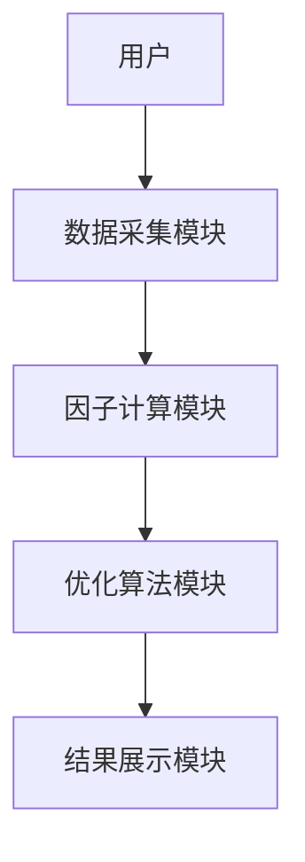

                 


---

# 构建智能化的个人投资组合因子暴露优化系统

> **关键词**：投资组合优化、因子暴露、机器学习、智能化系统、风险管理

> **摘要**：本文详细探讨了如何构建一个智能化的个人投资组合因子暴露优化系统。通过对因子暴露优化的核心原理、算法设计、系统架构及实际应用的深入分析，展示了如何利用机器学习和大数据技术提升投资组合的风险管理能力和收益潜力。本文旨在为投资者和开发人员提供一个系统化的解决方案，帮助他们在复杂多变的金融市场中实现科学化的投资决策。

---

# 第一部分: 构建智能化的个人投资组合因子暴露优化系统概述

## 第1章: 个人投资组合因子暴露优化的背景与概念

### 1.1 投资组合管理的背景与挑战

#### 1.1.1 投资组合管理的基本概念
投资组合管理是通过科学配置资产（如股票、债券、基金等）来实现投资目标的过程。其核心在于在风险可控的前提下，最大化投资收益。

#### 1.1.2 投资组合管理中的常见挑战
- 市场波动性大，难以预测。
- 各类资产之间的相关性复杂。
- 传统的人工决策效率低，容易出错。
- 数据量庞大，难以高效处理。

#### 1.1.3 因子暴露在投资组合管理中的重要性
因子暴露是指投资组合中各资产对特定风险因子的敏感程度。例如，市场波动性因子、流动性因子、信用风险因子等。优化因子暴露可以帮助投资者更好地控制风险，提高投资组合的稳定性。

---

### 1.2 因子暴露优化的核心概念

#### 1.2.1 因子暴露的定义与分类
- **定义**：因子暴露是衡量投资组合中某一资产或资产组合对特定风险因子敏感程度的指标。
- **分类**：常见的因子包括市场因子、行业因子、风格因子（如市值、流动性、价值与动量等）。

#### 1.2.2 因子暴露优化的目标与意义
- **目标**：通过调整资产配置，优化各因子的暴露程度，使投资组合在特定风险因子下的表现最优。
- **意义**：降低非系统性风险，提高投资组合的稳定性。

#### 1.2.3 智能化因子暴露优化的必要性
- 传统方法依赖人工经验，难以应对复杂市场环境。
- 机器学习等技术的应用，使得因子暴露优化更加高效、精准。

---

### 1.3 本章小结

#### 1.3.1 核心概念回顾
- 投资组合管理的核心在于资产配置和风险管理。
- 因子暴露优化是实现科学化投资决策的重要工具。

#### 1.3.2 本书的结构与目标
- 本书将从原理、算法、系统架构到实际应用，全面讲解智能化因子暴露优化系统。

---

## 第2章: 因子暴露优化的核心原理

### 2.1 因子暴露优化的数学模型

#### 2.1.1 投资组合优化的数学表达
投资组合优化的目标是最小化风险（如波动率）或最大化收益（如夏普比率）。其数学表达式如下：

$$
\text{目标函数：} \min_w \sigma^2(w) \quad \text{或} \quad \max_w E[r_p(w)]
$$

其中，$w$ 是权重向量，$\sigma^2(w)$ 是投资组合的波动率，$E[r_p(w)]$ 是投资组合的期望收益。

#### 2.1.2 因子暴露的线性回归模型
因子暴露可以通过线性回归模型估计：

$$
r_i = \beta_i^T F + \epsilon_i
$$

其中，$r_i$ 是资产$i$的收益，$F$ 是因子矩阵，$\beta_i^T$ 是因子暴露系数，$\epsilon_i$ 是回归误差。

#### 2.1.3 智能化优化的目标函数与约束条件
智能化优化的目标是最大化投资组合的夏普比率：

$$
\max_w \frac{E[r_p(w)] - r_f}{\sigma^2(w)}
$$

约束条件包括权重非负和权重之和为1：

$$
w_i \geq 0, \quad \sum_{i=1}^n w_i = 1
$$

---

### 2.2 因子暴露优化的算法原理

#### 2.2.1 常见优化算法概述
- **传统优化算法**：如拉格朗日乘数法。
- **机器学习算法**：如随机森林、神经网络。
- **量子计算算法**：未来可能的应用方向。

#### 2.2.2 基于机器学习的优化算法
- 使用机器学习模型预测因子收益，优化投资组合权重。

#### 2.2.3 深度学习在因子暴露优化中的应用
- 利用深度学习模型捕捉非线性关系，优化因子暴露。

---

### 2.3 本章小结

#### 2.3.1 核心算法回顾
- 介绍了投资组合优化的数学模型和常见算法。

#### 2.3.2 算法选择的关键因素
- 数据特征、计算效率、模型解释性等。

---

## 第3章: 智能化因子暴露优化系统的架构设计

### 3.1 系统架构概述

#### 3.1.1 系统整体架构图


#### 3.1.2 各模块的功能描述
- **数据采集模块**：收集市场数据（如股票价格、因子数据）。
- **因子计算模块**：计算各资产的因子暴露。
- **优化算法模块**：基于因子暴露优化投资组合。
- **结果展示模块**：展示优化结果和风险收益分析。

#### 3.1.3 系统的可扩展性设计
支持新增因子和优化算法的扩展。

---

### 3.2 系统功能模块设计

#### 3.2.1 数据采集模块
- 数据来源：股票市场数据、因子数据。
- 数据处理：清洗、标准化。

#### 3.2.2 因子计算模块
- 计算因子暴露：使用线性回归模型。
- 可视化因子分布。

#### 3.2.3 优化算法模块
- 实现多种优化算法：如拉格朗日乘数法、遗传算法。
- 选择最优算法。

#### 3.2.4 结果展示模块
- 展示优化后的投资组合。
- 可视化风险收益分析。

---

### 3.3 本章小结

#### 3.3.1 系统架构总结
- 各模块协同工作，实现智能化优化。

#### 3.3.2 功能模块的协同工作
- 数据采集、因子计算、优化算法和结果展示模块共同完成任务。

---

## 第4章: 项目实战与代码开发

### 4.1 环境搭建与工具安装

#### 4.1.1 开发环境的选择
- Python 3.8+，推荐使用Anaconda。

#### 4.1.2 必要工具的安装与配置
- 安装Pandas、NumPy、Scikit-learn、Plotly。

#### 4.1.3 数据库的选择与搭建
- 使用MySQL或MongoDB存储数据。

---

### 4.2 核心代码实现

#### 4.2.1 数据采集模块
```python
import pandas as pd

def collect_data(start_date, end_date):
    # 示例：从Yahoo Finance获取数据
    df = pd.DataFrame()
    return df
```

#### 4.2.2 因子计算模块
```python
import numpy as np

def calculate_factor_exposure(factor_data):
    # 示例：使用线性回归计算因子暴露
    pass
```

#### 4.2.3 优化算法模块
```python
from scipy.optimize import minimize

def optimize_portfolio(factor_exposures, returns):
    def objective(w):
        return -np.mean(w * returns)
    constraints = [{'type': 'eq', 'fun': lambda w: np.sum(w) - 1}]
    result = minimize(objective, np.ones(len(w)) / len(w), constraints)
    return result.x
```

---

### 4.3 代码解读与优化建议

#### 4.3.1 代码结构分析
- 数据采集、因子计算、优化算法模块化设计。

#### 4.3.2 代码优化的关键点
- 使用并行计算加速处理。
- 优化内存使用效率。

---

## 第5章: 案例分析与实际应用

### 5.1 案例分析

#### 5.1.1 案例背景介绍
- 使用实际市场数据进行优化。

#### 5.1.2 数据准备与处理
- 数据清洗、标准化。

#### 5.1.3 优化过程与结果展示
- 使用优化算法模块进行计算，展示优化结果。

#### 5.1.4 结果分析与总结
- 对比优化前后的投资组合收益与风险。

---

### 5.2 实际应用中的问题与解决方案

#### 5.2.1 实际应用中的常见问题
- 数据缺失、计算资源不足。

#### 5.2.2 问题解决的策略与方法
- 数据预处理、分布式计算。

---

## 第6章: 总结与展望

### 6.1 总结

#### 6.1.1 核心概念回顾
- 介绍了因子暴露优化的原理和算法。

#### 6.1.2 系统实现的关键点
- 各模块的协同工作和优化建议。

---

### 6.2 展望

#### 6.2.1 技术进步带来的新机遇
- AI与量化投资的结合。

#### 6.2.2 未来研究方向
- 更高效的优化算法、实时数据处理。

---

## 作者信息

作者：AI天才研究院/AI Genius Institute & 禅与计算机程序设计艺术 /Zen And The Art of Computer Programming

---

本文通过系统化的分析和实践，详细讲解了智能化个人投资组合因子暴露优化系统的构建过程。希望本文能为投资者和开发人员提供有价值的参考，帮助他们在复杂多变的金融市场中实现科学化的投资决策。

