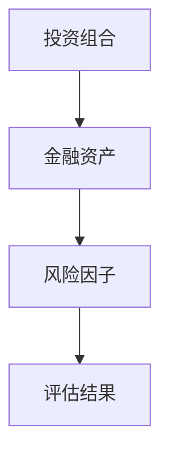
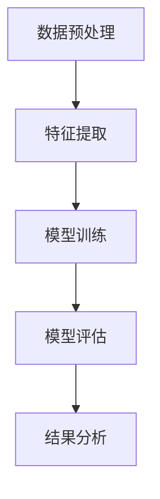
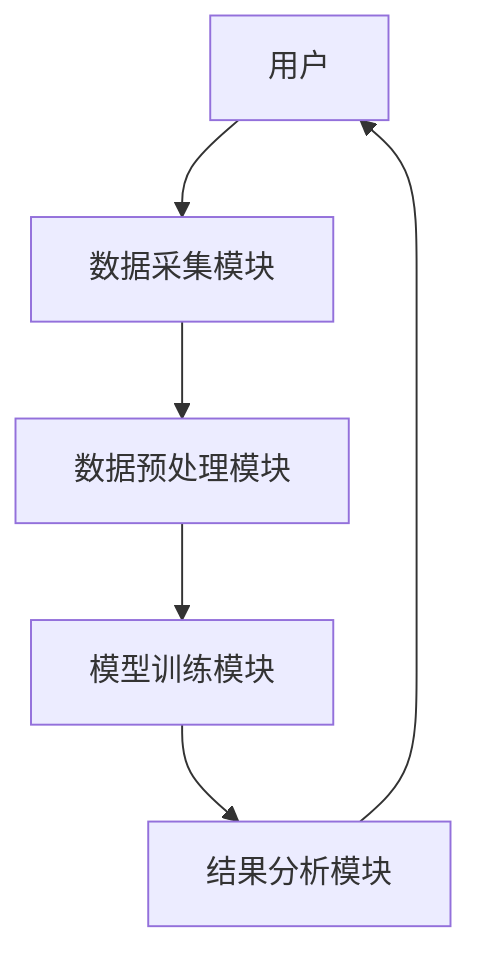

                 


# 构建智能化的个人投资组合尾部风险评估系统

> **关键词**: 个人投资组合, 尾部风险, 机器学习, 风险评估, 系统架构

> **摘要**: 本文详细探讨了构建智能化的个人投资组合尾部风险评估系统的背景、核心概念、算法原理、系统架构及实现方法。通过理论与实践相结合的方式，展示了如何利用统计学、金融学和机器学习的结合，设计一个高效、可靠的尾部风险评估系统，从而帮助投资者更好地管理和规避投资风险。

---

## 第一部分: 背景介绍与核心概念

### 第1章: 个人投资组合与尾部风险概述

#### 1.1 个人投资组合的基本概念
- **1.1.1 投资组合的定义与构成**
  - 投资组合是指将资金分配到不同资产（如股票、债券、基金等）上的策略，以分散风险并追求最大收益。
  - 组成部分包括：现金、股票、债券、基金、房地产等。
  
- **1.1.2 投资组合的分类与特点**
  - 根据风险偏好分为：保守型、平衡型、成长型等。
  - 特点：分散化、风险与收益的平衡、动态调整。

- **1.1.3 尾部风险在投资组合中的重要性**
  - 尾部风险是指在极端市场条件下，投资组合可能遭受的重大损失。
  - 尾部风险往往不可预测，但可以通过系统化的方法进行评估和规避。

#### 1.2 尾部风险的定义与特征
- **1.2.1 尾部风险的定义**
  - 尾部风险是指在概率分布的“尾部”区域（即低概率但高影响的事件）发生的可能性。
  - 这些事件可能对投资组合造成严重的损失，甚至导致投资组合的崩盘。

- **1.2.2 尾部风险与整体风险的对比**
  - 整体风险：指投资组合在正常市场条件下的波动性风险。
  - 尾部风险：指在极端市场条件下，投资组合可能遭受的重大损失。
  - 区别在于，尾部风险是低概率、高影响的事件，而整体风险是高概率、低影响的事件。

- **1.2.3 尾部风险的数学模型与概率分布**
  - 常见的概率分布模型：正态分布、t分布、帕累托分布等。
  - 尾部风险通常与“肥尾”现象相关，即实际数据中的极端事件比正态分布预测的更频繁。

### 1.3 本章小结
本章介绍了个人投资组合的基本概念和尾部风险的定义与特征。尾部风险是投资组合管理中的一个重要问题，特别是在极端市场条件下，尾部风险可能导致投资组合的重大损失。因此，构建一个智能化的尾部风险评估系统具有重要意义。

---

## 第二部分: 核心概念与联系

### 第2章: 尾部风险评估的核心概念

#### 2.1 尾部风险评估的理论基础
- **2.1.1 统计学基础**
  - 常用的统计方法：回归分析、时间序列分析、蒙特卡洛模拟等。
  - 统计学方法可以帮助我们理解和预测尾部风险的发生概率。

- **2.1.2 金融学基础**
  - 资产定价理论（CAPM）、套利定价理论（APT）等。
  - 金融学理论为我们提供了评估投资组合风险的基本框架。

- **2.1.3 机器学习基础**
  - 监督学习、无监督学习、深度学习等。
  - 机器学习方法可以用于尾部风险的预测和分类。

#### 2.2 尾部风险评估的核心要素
- **2.2.1 数据来源与特征**
  - 数据来源：历史市场数据、新闻数据、社交媒体数据等。
  - 数据特征：波动性、相关性、市场情绪等。

- **2.2.2 风险评估模型**
  - 统计模型：VaR（Value at Risk）、CVaR（Conditional Value at Risk）。
  - 机器学习模型：支持向量机、随机森林、神经网络等。

- **2.2.3 评估结果的可视化**
  - 使用图表（如箱线图、概率密度图）展示尾部风险的分布情况。
  - 可视化工具：Matplotlib、Seaborn、Tableau等。

#### 2.3 尾部风险评估的ER实体关系图


---

## 第三部分: 算法原理讲解

### 第3章: 尾部风险评估的算法原理

#### 3.1 基于统计学的尾部风险评估
- **3.1.1 历史数据分析法**
  - 通过分析历史数据，识别极端事件的模式和规律。
  - 例如：使用箱线图识别数据的尾部异常值。

- **3.1.2 超参数分析法**
  - 通过调整模型的超参数（如正则化系数、学习率等）优化尾部风险评估的准确性。

- **3.1.3 置信区间法**
  - 使用统计方法构建置信区间，估计尾部风险的发生概率。

#### 3.2 基于机器学习的尾部风险评估
- **3.2.1 支持向量机（SVM）模型**
  - SVM适用于小样本数据的分类和回归问题。
  - 使用SVM对尾部风险进行分类，识别高风险区域。

- **3.2.2 神经网络模型**
  - 使用深度神经网络（DNN）对复杂的非线性关系进行建模。
  - 通过训练神经网络，预测尾部风险的发生概率。

- **3.2.3 随机森林模型**
  - 随机森林是一种集成学习方法，适用于特征较多的场景。
  - 使用随机森林对尾部风险进行分类和回归分析。

#### 3.3 算法原理的数学模型
- **3.3.1 线性回归模型**
  $$ y = \beta_0 + \beta_1x + \epsilon $$
  - 其中，$y$是目标变量，$x$是自变量，$\beta_0$是截距，$\beta_1$是回归系数，$\epsilon$是误差项。

- **3.3.2 随机森林模型**
  $$ y = \sum_{i=1}^{n} \text{Tree}(x) $$
  - 其中，$n$是决策树的数量，$\text{Tree}(x)$是单棵决策树的预测值。

#### 3.4 算法流程图


---

## 第四部分: 系统分析与架构设计

### 第4章: 尾部风险评估系统的架构设计

#### 4.1 系统功能设计
- **4.1.1 数据采集模块**
  - 数据来源：历史市场数据、新闻数据、社交媒体数据等。
  - 数据预处理：清洗、特征提取、数据标准化。

- **4.1.2 风险评估模块**
  - 输入：预处理后的数据。
  - 输出：尾部风险评估结果（如VaR、CVaR）。

- **4.1.3 风险预警模块**
  - 根据评估结果，生成预警信号。
  - 预警级别：低、中、高。

#### 4.2 系统架构设计
- **4.2.1 分层架构**
  - 表现层：用户界面（如仪表盘）。
  - 业务逻辑层：数据处理、模型调用。
  - 数据访问层：与数据库交互。

- **4.2.2 模块化架构**
  - 数据采集模块：负责数据的收集和预处理。
  - 风险评估模块：负责尾部风险的计算和分析。
  - 风险预警模块：负责预警信号的生成和通知。

#### 4.3 系统交互图


---

## 第五部分: 项目实战

### 第5章: 尾部风险评估系统的实现

#### 5.1 环境安装
- **安装Python环境**
  - 使用Anaconda或虚拟环境。
- **安装必要的库**
  - `numpy`、`pandas`、`scikit-learn`、`xgboost`、`matplotlib`。

#### 5.2 系统核心实现源代码
```python
import numpy as np
import pandas as pd
from sklearn.ensemble import RandomForestRegressor
from sklearn.metrics import mean_squared_error

# 数据预处理
data = pd.read_csv('investment_data.csv')
X = data.drop('return', axis=1)
y = data['return']

# 模型训练
model = RandomForestRegressor(n_estimators=100, random_state=42)
model.fit(X, y)

# 模型评估
y_pred = model.predict(X)
 mse = mean_squared_error(y, y_pred)
 print(f'MSE: {mse}')
```

#### 5.3 代码应用解读与分析
- **数据预处理**：读取数据，提取特征和目标变量。
- **模型训练**：使用随机森林模型进行训练。
- **模型评估**：计算均方误差，评估模型的准确性。

#### 5.4 实际案例分析
- 使用实际投资数据，训练模型并评估尾部风险。
- 分析极端事件的发生概率和影响。

#### 5.5 项目小结
通过实际案例分析，验证了模型的有效性和准确性。同时，展示了如何将理论应用于实践，构建一个智能化的尾部风险评估系统。

---

## 第六部分: 最佳实践与总结

### 第6章: 尾部风险评估系统的最佳实践

#### 6.1 最佳实践 tips
- 数据清洗和特征工程是关键。
- 选择合适的模型和参数。
- 定期更新模型，适应市场变化。

#### 6.2 小结
本文详细介绍了构建智能化的个人投资组合尾部风险评估系统的背景、核心概念、算法原理、系统架构和实现方法。通过理论与实践相结合的方式，展示了如何利用统计学、金融学和机器学习的结合，设计一个高效、可靠的尾部风险评估系统。

#### 6.3 注意事项
- 数据质量和模型选择直接影响评估结果。
- 风险评估结果仅供参考，实际操作需结合市场情况。
- 定期更新模型，以适应市场变化。

#### 6.4 拓展阅读
- 推荐阅读《Python机器学习实战》、《投资学基础》、《风险管理与VaR》等书籍。

---

## 作者：AI天才研究院/AI Genius Institute & 禅与计算机程序设计艺术/Zen And The Art of Computer Programming

---

通过以上思考，我们逐步构建了这篇文章的结构和内容，确保每一部分都详细、清晰且易于理解。从背景介绍到算法实现，从系统架构到项目实战，文章涵盖了构建智能化个人投资组合尾部风险评估系统的各个方面。希望这篇文章能为读者提供有价值的信息和启发。

