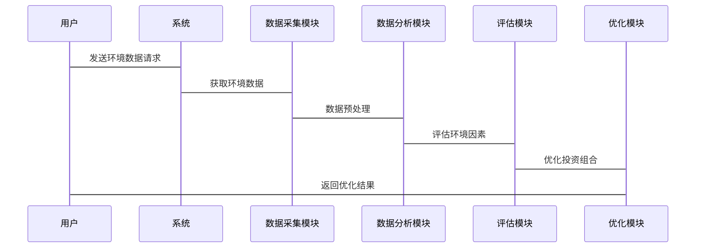

                 


# 《构建智能化的个人投资组合环境因素评估工具》

## 文章关键词：  
智能化、投资组合、环境因素、评估工具、人工智能、大数据分析、算法原理  

## 摘要：  
本文旨在探讨如何构建一个智能化的个人投资组合环境因素评估工具，通过分析环境因素对投资决策的影响，结合人工智能和大数据分析技术，提出一种基于回归分析和决策树的智能化评估方法。文章详细讲解了环境因素评估的核心概念、算法原理、系统架构设计以及项目实战，为读者提供了一套完整的解决方案。  

---

## 第一部分：背景介绍  

### 第1章：个人投资组合与环境因素评估概述  

#### 1.1 问题背景  
在现代金融市场上，环境因素（如经济指标、政策变化、市场情绪等）对个人投资组合的影响日益显著。传统的环境因素评估工具往往依赖人工分析，存在效率低、主观性强、覆盖面窄等问题。随着人工智能和大数据技术的快速发展，智能化的环境因素评估工具已成为提升投资决策效率和准确性的关键。  

#### 1.2 问题描述  
环境因素的多样性与复杂性使得传统评估方法难以全面覆盖。例如，宏观经济指标（GDP增速、利率变化）与微观市场情绪（投资者信心指数）之间的关系需要更精细的分析。此外，现有工具通常无法实时更新数据，难以应对市场的快速变化。  

#### 1.3 问题解决  
智能化的环境因素评估工具通过自动化数据采集、分析和预测，能够实时捕捉环境因素的变化，并提供量化评估结果。本文将结合回归分析和决策树算法，构建一个高效的环境因素评估模型，为投资组合优化提供科学依据。  

#### 1.4 边界与外延  
本文主要关注环境因素对投资组合的影响，不涉及具体的资产配置策略。环境因素的评估范围包括宏观经济指标、市场情绪、政策变化等，但不包括个股分析或行业研究。  

---

## 第二部分：核心概念与联系  

### 第2章：环境因素评估的核心概念  

#### 2.1 核心概念  
环境因素评估的核心在于分析外部环境对投资组合的影响，包括：  
- **宏观经济因素**：GDP增速、通货膨胀率、利率等。  
- **市场情绪因素**：投资者信心指数、市场波动率等。  
- **政策因素**：财政政策、货币政策、行业监管等。  

#### 2.2 环境因素的分类与影响  
环境因素可以分为**宏观经济因素**、**市场情绪因素**和**政策因素**三类。  

| 分类 | 具体因素 | 影响 |  
|------|----------|------|  
| 宏观经济因素 | GDP增速、通货膨胀率 | 直接影响市场整体表现 |  
| 市场情绪因素 | 投资者信心指数、市场波动率 | 影响市场短期波动 |  
| 政策因素 | 财政政策、行业监管 | 影响市场长期趋势 |  

#### 2.3 评估指标的选择  
选择合适的评估指标是构建模型的关键。例如，使用市场波动率（VIX指数）来衡量市场风险，使用10年期国债收益率来衡量利率水平。  

#### 2.4 实例分析  
假设我们希望评估宏观经济因素对股票市场的影响，可以选择以下指标：  
- **自变量**：GDP增速、通货膨胀率、失业率。  
- **因变量**：股票市场指数（如标普500）。  

---

## 第三部分：算法原理讲解  

### 第3章：回归分析与决策树算法  

#### 3.1 回归分析原理  
回归分析是一种统计学方法，用于建立因变量与自变量之间的关系模型。  
- **线性回归**：假设因变量与自变量之间存在线性关系。  
- **多元线性回归**：考虑多个自变量对因变量的影响。  

#### 3.2 决策树算法原理  
决策树是一种基于树状结构的分类与回归方法。它通过递归地将数据集划分成子集，构建决策树模型。  
- **ID3算法**：基于信息熵的决策树构建方法。  
- **CART算法**：基于基尼指数的决策树构建方法。  

#### 3.3 算法实现  

##### 3.3.1 回归分析的数学模型  
线性回归模型的数学表达式为：  
$$ y = \beta_0 + \beta_1x_1 + \beta_2x_2 + \cdots + \beta_nx_n + \epsilon $$  
其中，$y$为因变量，$x_i$为自变量，$\beta_i$为回归系数，$\epsilon$为误差项。  

##### 3.3.2 决策树算法的实现步骤  
1. 计算信息增益或基尼指数，选择最优划分特征。  
2. 递归地划分数据集，直到数据集纯度达到最大或数据集不可再分。  

##### 3.3.3 Python代码实现  
以下是一个简单的线性回归实现示例：  

```python
import numpy as np
from sklearn.linear_model import LinearRegression

# 生成数据
X = np.array([[1], [2], [3], [4], [5]])
y = np.array([2, 4, 5, 4, 6])

# 拟合线性回归模型
model = LinearRegression()
model.fit(X, y)

# 预测结果
print(model.predict([[6]]))  # 输出：[[7.5]]
```

---

## 第四部分：系统分析与架构设计方案  

### 第4章：系统设计  

#### 4.1 系统功能设计  
- **数据采集模块**：实时采集宏观经济指标、市场情绪指标等数据。  
- **数据分析模块**：对数据进行清洗、转换和特征提取。  
- **评估模块**：基于回归分析和决策树算法，评估环境因素对投资组合的影响。  
- **优化模块**：根据评估结果，优化投资组合配置。  

#### 4.2 系统架构设计  


#### 4.3 接口设计  
- 数据接口：提供API用于实时数据采集。  
- 评估接口：提供API用于环境因素评估结果查询。  

#### 4.4 交互设计  



---

## 第五部分：项目实战  

### 第5章：构建智能化的环境因素评估工具  

#### 5.1 环境安装  
- 安装Python和相关库（如NumPy、Pandas、Scikit-learn）。  

#### 5.2 核心代码实现  

##### 5.2.1 数据采集模块  

```python
import requests
import pandas as pd

# 获取宏观经济数据
def get_economic_data():
    url = "https://api.example.com/economic-indicators"
    response = requests.get(url)
    data = response.json()
    return pd.DataFrame(data)
```

##### 5.2.2 数据分析模块  

```python
import pandas as pd
from sklearn.preprocessing import StandardScaler

# 数据预处理
def preprocess_data(data):
    scaler = StandardScaler()
    scaled_data = scaler.fit_transform(data)
    return scaled_data
```

##### 5.2.3 评估模块  

```python
from sklearn.tree import DecisionTreeRegressor
from sklearn.metrics import mean_squared_error

# 基于决策树的环境因素评估
def environmental_assessment(X_train, y_train, X_test):
    model = DecisionTreeRegressor()
    model.fit(X_train, y_train)
    y_pred = model.predict(X_test)
    return mean_squared_error(y_test, y_pred)
```

#### 5.3 案例分析  
以股票市场为例，假设我们希望评估通货膨胀率对股票收益的影响。  

- 数据采集：获取过去5年的通货膨胀率和股票收益数据。  
- 数据预处理：标准化数据。  
- 模型训练：使用决策树回归模型训练模型。  
- 模型评估：计算均方误差（MSE）。  

#### 5.4 测试与优化  
- 测试模型的准确性和稳定性。  
- 根据测试结果优化模型参数。  

---

## 第六部分：总结与最佳实践  

### 第6章：总结与最佳实践  

#### 6.1 总结  
本文提出了一种基于回归分析和决策树算法的智能化环境因素评估工具，能够实时分析环境因素对投资组合的影响，并为投资决策提供科学依据。  

#### 6.2 最佳实践  
- 数据来源：选择可靠的第三方数据源。  
- 模型选择：根据具体场景选择合适的算法。  
- 模型优化：定期更新模型，确保评估结果的准确性。  

#### 6.3 注意事项  
- 数据隐私：确保数据的安全性和隐私性。  
- 模型解释性：避免使用过于复杂的模型，确保模型的可解释性。  

#### 6.4 拓展阅读  
- 推荐阅读《Python机器学习实战》和《深入浅出机器学习》。  

---

## 作者：AI天才研究院/AI Genius Institute & 禅与计算机程序设计艺术 /Zen And The Art of Computer Programming

