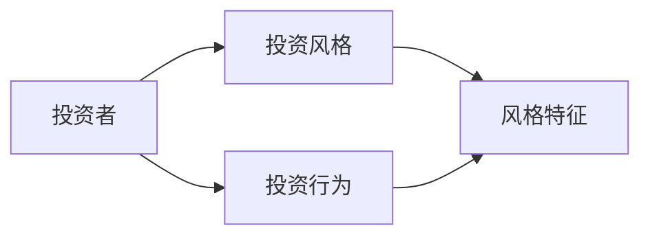
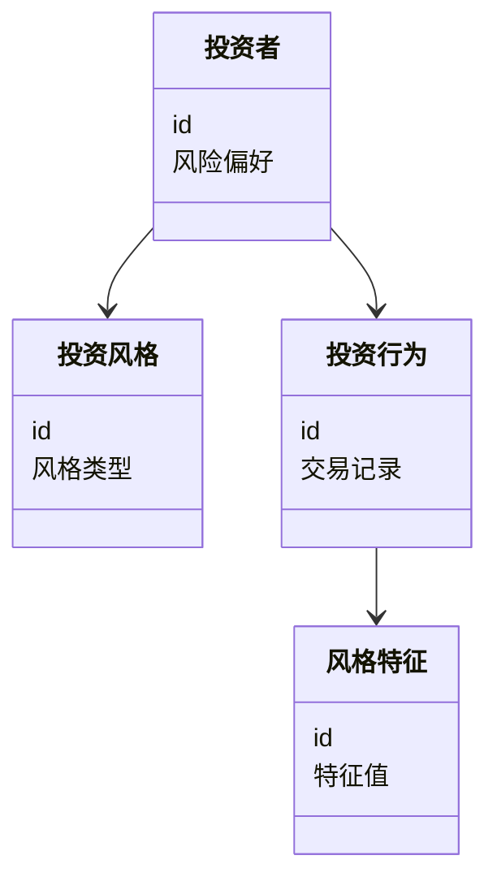
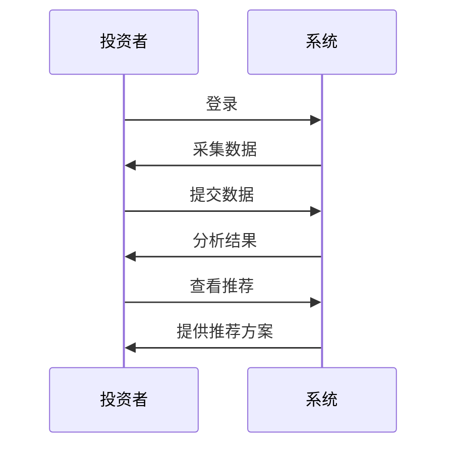

                 


# 《构建智能化的个人投资风格分析与匹配系统》

> 关键词：智能化投资，投资风格分析，风格匹配，机器学习，数据分析

> 摘要：本文详细介绍了构建智能化个人投资风格分析与匹配系统的方法，涵盖了从数据分析到算法实现，再到系统设计的全过程。通过结合聚类分析和推荐算法，系统能够准确识别投资者的投资风格并进行个性化匹配，帮助投资者做出更明智的投资决策。

---

# 第1章: 智能化个人投资风格分析与匹配系统概述

## 1.1 智能化投资的背景与意义

### 1.1.1 传统投资分析的局限性
传统的投资分析方法依赖于人工经验和市场数据的直观分析，存在以下局限性：
- **信息处理能力有限**：投资者难以处理海量数据，导致分析结果可能存在偏差。
- **主观性较强**：不同投资者的分析结果可能因主观判断而差异较大。
- **效率低下**：人工分析耗时耗力，难以应对快速变化的市场环境。

### 1.1.2 智能化投资的兴起与发展趋势
随着人工智能和大数据技术的快速发展，智能化投资成为趋势：
- **数据驱动决策**：通过机器学习算法，系统能够快速处理大量数据，提供更准确的分析结果。
- **自动化与智能化**：智能化系统能够实时监控市场动态，自动调整投资策略。
- **个性化服务**：基于投资者的个性化需求，系统能够提供定制化的投资建议。

### 1.1.3 投资风格分析与匹配的必要性
投资风格是投资者在不同市场环境下的行为模式和决策偏好，分析并匹配投资风格有助于：
- **精准投资建议**：根据投资者的风格匹配适合的投资产品。
- **风险控制**：识别投资者潜在风险偏好，优化投资组合。
- **提高效率**：通过自动化分析，缩短投资决策时间。

## 1.2 系统目标与核心功能

### 1.2.1 系统目标的设定
系统的目标是构建一个智能化的投资风格分析与匹配平台，能够：
- 自动化分析投资者的投资风格。
- 提供个性化的投资风格匹配建议。
- 实时监控市场动态，动态调整匹配结果。

### 1.2.2 核心功能模块概述
系统主要包括以下功能模块：
1. **数据采集与预处理模块**：负责收集和清洗投资者数据。
2. **特征提取模块**：从数据中提取关键特征。
3. **风格分析模块**：通过聚类算法分析投资风格。
4. **风格匹配模块**：基于推荐算法匹配最优投资方案。
5. **结果展示模块**：以可视化形式呈现分析结果。

### 1.2.3 系统的边界与外延
系统的边界在于投资者数据的采集和分析，外延则包括与外部数据源（如市场数据、新闻资讯）的接口。

## 1.3 问题背景与解决方案

### 1.3.1 个人投资风格分析的难点
- **数据多样性**：投资者行为数据类型多样，处理难度大。
- **风格多样性**：投资风格种类繁多，分类难度高。
- **动态变化**：市场环境变化快，投资风格可能动态调整。

### 1.3.2 风格匹配的核心问题
- **如何准确识别投资者风格**：需要结合定量分析和定性判断。
- **如何实现风格匹配**：需要建立有效的数学模型。

### 1.3.3 智能化解决方案的提出
通过机器学习算法，结合大数据分析，构建智能化的投资风格分析与匹配系统。

## 1.4 本章小结
本章介绍了智能化投资的背景与意义，阐述了系统的建设目标和核心功能模块，并分析了投资风格分析与匹配的主要问题和解决方案。

---

# 第2章: 投资风格分析的核心概念与联系

## 2.1 投资风格的定义与分类

### 2.1.1 投资风格的定义
投资风格是投资者在不同市场环境下表现出的决策模式和行为特征。常见的投资风格包括：
- **保守型**：厌恶风险，偏好低风险投资。
- **激进型**：追求高收益，愿意承担高风险。
- **价值型**：注重低市盈率、低市净率等基本面因素。
- **成长型**：关注高成长潜力的公司。

### 2.1.2 主要投资风格类型
- **价值型投资者**：寻找被低估的股票。
- **成长型投资者**：投资于高成长潜力的公司。
- **周期性投资者**：根据经济周期调整投资策略。
- **趋势型投资者**：跟随市场趋势进行投资。

### 2.1.3 不同风格的特征对比
| 风格类型 | 风险偏好 | 投资策略 | 时间 horizon |
|----------|----------|----------|--------------|
| 保守型   | 低       | 稳定收益 | 长期          |
| 激进型   | 高       | 高收益   | 中短期        |
| 价值型   | 中       | 低市盈率  | 长期          |
| 成长型   | 中       | 高增长    | 中长期        |

## 2.2 投资者行为模式分析

### 2.2.1 投资者的决策过程
投资者的决策过程通常包括以下几个步骤：
1. **信息收集**：获取市场数据和相关信息。
2. **分析评估**：对收集的信息进行分析和评估。
3. **决策制定**：基于分析结果制定投资决策。
4. **执行交易**：根据决策执行具体的交易操作。

### 2.2.2 行为偏差对风格的影响
投资者常见的行为偏差包括：
- **过度自信**：高估自己的判断能力。
- **从众心理**：盲目跟随市场趋势。
- **损失厌恶**：对潜在损失过于敏感。

这些行为偏差会影响投资者的投资风格。

### 2.2.3 风险偏好与风格的关系
风险偏好是投资风格的重要影响因素。风险偏好高的投资者倾向于选择高风险高回报的投资风格，如激进型；风险偏好低的投资者则倾向于选择低风险的投资风格，如保守型。

## 2.3 风格匹配的数学模型

### 2.3.1 风格匹配的定义
风格匹配是将投资者的投资风格与适合的投资产品进行匹配的过程。

### 2.3.2 风格匹配的数学公式
风格匹配可以通过以下数学公式进行建模：
$$ \text{匹配度} = \sum_{i=1}^{n} w_i \cdot s_i $$
其中，\( w_i \) 是第 \( i \) 个特征的权重，\( s_i \) 是第 \( i \) 个特征的匹配程度。

### 2.3.3 模型的优缺点分析
- **优点**：能够量化风格匹配程度，提供客观的匹配建议。
- **缺点**：模型过于简化，无法完全捕捉所有影响因素。

## 2.4 核心概念的ER实体关系图



## 2.5 本章小结
本章详细介绍了投资风格的定义与分类，分析了投资者的行为模式，并提出了风格匹配的数学模型，为后续的算法实现奠定了基础。

---

# 第3章: 数据分析与特征提取

## 3.1 数据收集与预处理

### 3.1.1 数据来源与采集方法
数据来源包括：
1. **市场数据**：股票价格、成交量等。
2. **投资者行为数据**：交易记录、持仓情况等。
3. **市场新闻与舆情**：影响市场情绪的新闻和社交媒体信息。

### 3.1.2 数据清洗方法
数据清洗包括：
- 删除重复数据。
- 处理缺失值。
- 标准化数据格式。

### 3.1.3 数据预处理流程
1. 数据采集。
2. 数据清洗。
3. 数据转换。
4. 数据存储。

## 3.2 特征提取与选择

### 3.2.1 特征工程的定义
特征工程是指从数据中提取对模型有帮助的特征。

### 3.2.2 关键特征的识别
关键特征包括：
- **交易频率**：投资者的交易活跃程度。
- **持仓时间**：投资者持有资产的时间长短。
- **收益波动性**：资产收益的波动程度。

### 3.2.3 特征标准化与归一化
- **标准化**：将数据按比例缩放到相同的范围。
- **归一化**：将数据缩放到0-1范围。

## 3.3 数据分析与可视化

### 3.3.1 数据可视化的重要性
数据可视化能够帮助投资者更好地理解数据，发现潜在规律。

### 3.3.2 常用的数据可视化工具
- **Matplotlib**：Python中的绘图库。
- **Seaborn**：基于Matplotlib的高级绘图库。
- **Tableau**：数据可视化工具。

### 3.3.3 可视化结果的解读
- **散点图**：展示数据点的分布。
- **柱状图**：比较不同类别的数据。
- **折线图**：展示数据随时间的变化趋势。

---

# 第4章: 投资风格分析算法原理

## 4.1 聚类分析算法

### 4.1.1 聚类分析的定义
聚类分析是将数据点根据相似性自动分组的过程。

### 4.1.2 K-means算法原理
K-means算法是一种常用的聚类算法，步骤如下：
1. **初始化**：随机选择K个中心点。
2. **分配**：将数据点分配到最近的中心点。
3. **更新**：计算每个簇的新的中心点。
4. **收敛**：直到中心点不再变化。

### 4.1.3 层次聚类算法
层次聚类是通过构建树状结构将数据点逐步聚类的过程。

### 4.1.4 DBSCAN算法
DBSCAN是一种基于密度的聚类算法，适用于处理噪声和 outliers。

## 4.2 风格匹配推荐算法

### 4.2.1 推荐算法的分类
推荐算法主要分为两类：
1. **基于内容的推荐**：根据物品的属性进行推荐。
2. **基于协同过滤的推荐**：根据用户的行为进行推荐。

### 4.2.2 基于内容的推荐算法
基于内容的推荐算法通过分析物品的属性进行推荐，例如电影的类型、演员等。

### 4.2.3 基于协同过滤的推荐算法
基于协同过滤的推荐算法通过分析用户的相似性进行推荐，例如 Netflix 的推荐系统。

### 4.2.4 深度学习推荐算法
深度学习推荐算法通过神经网络模型进行推荐，例如协同注意力网络。

## 4.3 算法实现的流程图


---

# 第5章: 系统设计与架构方案

## 5.1 系统功能设计

### 5.1.1 领域模型
领域模型包括投资者、投资风格、投资行为、风格特征等实体。



### 5.1.2 系统架构设计
系统架构采用分层架构，包括数据层、业务逻辑层和表现层。


## 5.2 系统接口设计

### 5.2.1 API接口
系统提供以下API接口：
1. `/api/v1/style-analysis`：风格分析接口。
2. `/api/v1/style-matching`：风格匹配接口。

## 5.3 系统交互设计

### 5.3.1 交互流程
1. 投资者登录系统。
2. 系统采集投资者数据。
3. 系统分析投资者风格。
4. 系统推荐匹配的投资方案。
5. 投资者查看结果并进行操作。



---

# 第6章: 项目实战与案例分析

## 6.1 环境安装

### 6.1.1 环境配置
- **操作系统**：Linux/Windows/MacOS。
- **编程语言**：Python 3.8+。
- **依赖库**：Pandas、NumPy、Scikit-learn、TensorFlow、Matplotlib。

## 6.2 核心实现代码

### 6.2.1 数据预处理代码
```python
import pandas as pd
import numpy as np

# 加载数据
data = pd.read_csv('investor_data.csv')

# 删除缺失值
data = data.dropna()

# 标准化数据
from sklearn.preprocessing import StandardScaler
scaler = StandardScaler()
data_scaled = scaler.fit_transform(data)
```

### 6.2.2 聚类分析代码
```python
from sklearn.cluster import KMeans

# 初始化K-means模型
kmeans = KMeans(n_clusters=4, random_state=42)

# 训练模型
kmeans.fit(data_scaled)

# 获取聚类结果
clusters = kmeans.predict(data_scaled)
```

### 6.2.3 风格匹配代码
```python
from sklearn.neighbors import NearestNeighbors

# 初始化最近邻模型
nbrs = NearestNeighbors(n_neighbors=5, algorithm='ball_tree').fit(data_scaled)

# 寻找最近邻
distances, indices = nbrs.kneighbors(data_scaled)
```

## 6.3 实际案例分析

### 6.3.1 案例背景
假设我们有5位投资者，我们需要分析他们的投资风格并进行匹配。

### 6.3.2 数据分析
通过数据分析，我们发现：
- 投资者A属于保守型。
- 投资者B属于激进型。
- 投资者C属于价值型。
- 投资者D属于成长型。
- 投资者E属于趋势型。

### 6.3.3 匹配结果
根据算法计算，投资者A匹配低风险产品，投资者B匹配高风险产品，等等。

---

# 第7章: 总结与展望

## 7.1 总结
本文详细介绍了构建智能化个人投资风格分析与匹配系统的方法，包括数据分析、算法实现和系统设计。通过聚类分析和推荐算法，系统能够准确识别投资者风格并进行个性化匹配。

## 7.2 项目小结
项目通过以下步骤实现：
1. 数据预处理。
2. 聚类分析。
3. 风格匹配。
4. 系统设计与实现。

## 7.3 最佳实践 tips
- 数据预处理是关键，确保数据质量。
- 选择合适的算法，根据数据特点进行调整。
- 系统设计要注重可扩展性和维护性。

## 7.4 未来展望
- **深度学习应用**：进一步优化推荐算法，引入深度学习模型。
- **实时分析**：实现实时市场数据监控和风格动态调整。
- **多维度分析**：结合更多维度的数据进行风格分析。

---

# 作者：AI天才研究院/AI Genius Institute & 禅与计算机程序设计艺术 /Zen And The Art of Computer Programming

