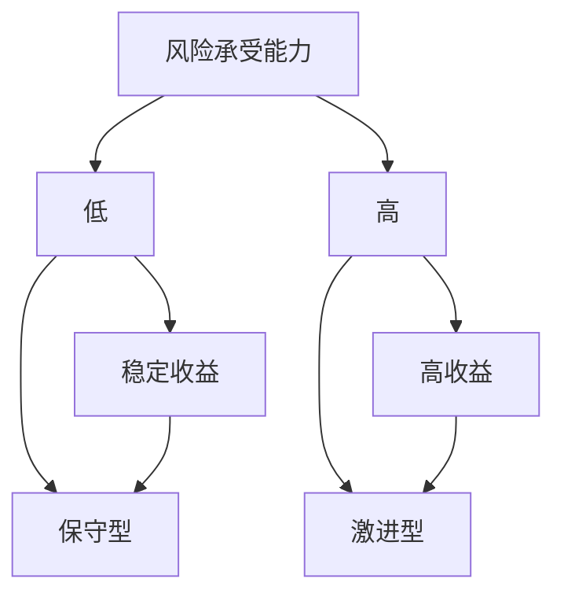

                 


# 《构建智能化的个人投资风格分析工具》

## 关键词
- 投资风格分析
- 人工智能
- 机器学习
- 投资决策
- 数据分析

## 摘要
本文旨在探讨如何构建一个智能化的个人投资风格分析工具，通过结合投资学、人工智能和数据科学的方法，帮助投资者更好地理解和优化他们的投资策略。文章详细介绍了投资风格分析的核心概念，分析了多种算法和数学模型，并通过系统架构设计和项目实战，展示了如何将理论应用于实际投资分析工具的开发。最后，本文提出了最佳实践建议和未来的发展方向，为投资者和开发者提供了有益的指导。

---

## 第1章: 投资风格分析的背景与意义

### 1.1 投资分析的基本概念

#### 1.1.1 投资分析的定义与分类
投资分析是通过对金融市场数据和投资者行为的分析，评估和预测投资标的的价值和风险，从而制定投资决策的过程。根据分析方法的不同，投资分析可以分为基本面分析、技术分析和行为分析三类。

基本面分析侧重于研究公司的财务状况、行业地位等因素，以评估其内在价值。技术分析则关注价格走势、成交量等市场数据，试图通过历史数据预测未来的价格变动。行为分析则是从投资者的心理和行为模式入手，分析市场的非理性波动。

#### 1.1.2 投资风格的定义与特点
投资风格是指投资者在选择投资标的、分配资产和管理风险时所表现出的一贯偏好和策略。投资风格具有稳定性、一致性、可测量性和可调整性的特点。稳定性指投资者在不同市场环境下的投资决策具有相似性；一致性则体现在其投资策略和行为的持续性上；可测量性使得投资风格可以通过定量方法进行分析；可调整性则意味着投资者可以根据市场变化和个人目标调整其投资风格。

#### 1.1.3 智能化投资风格分析的必要性
随着金融市场数据的爆炸式增长和复杂性的增加，传统的人工分析方法已经难以满足投资者的需求。智能化的投资风格分析工具能够帮助投资者快速识别和量化其投资风格，发现潜在的投资风险和机会，并提供个性化的投资建议。

### 1.2 个人投资行为的多样性

#### 1.2.1 投资者的决策模式
投资者的决策模式受到多种因素的影响，包括风险偏好、投资知识、市场环境和个人情绪等。不同投资者在面对相同的市场情况时，可能会做出截然不同的决策。例如，保守型投资者倾向于选择低风险、稳定收益的投资标的，而激进型投资者则更愿意承担高风险以追求更高的回报。

#### 1.2.2 不同投资风格的优缺点
不同的投资风格各有优缺点。例如，价值投资注重长期持有优质资产，能够在市场波动中实现稳健的收益，但需要投资者具备较强的耐心和长期视角。趋势投资则利用市场的短期趋势进行交易，能够在短期内获得较高的收益，但需要投资者具备较强的市场敏感性和交易技巧。

#### 1.2.3 个人投资风格与市场表现的关系
个人投资风格与市场表现密切相关。例如，在市场上涨周期中，成长型投资者可能表现较好，而在市场下跌周期中，防御型投资者可能更具优势。然而，投资风格的单一化可能导致投资者在市场环境变化时无法适应，从而影响投资收益。

### 1.3 智能化工具在投资分析中的作用

#### 1.3.1 技术进步对投资分析的影响
人工智能和大数据技术的进步为投资分析提供了新的工具和方法。智能化工具可以通过分析海量数据，识别市场趋势和投资者行为模式，从而帮助投资者做出更明智的投资决策。

#### 1.3.2 智能化工具的优势与挑战
智能化工具的优势在于其高效性、准确性和可扩展性。通过自动化数据处理和机器学习算法，智能化工具能够快速分析大量数据，发现潜在的投资机会和风险。然而，智能化工具的使用也面临一些挑战，如数据质量、模型选择和结果解释等问题。

#### 1.3.3 未来投资分析工具的发展趋势
未来的投资分析工具将更加智能化和个性化。随着人工智能和大数据技术的进一步发展，投资分析工具将能够更精准地识别投资者的投资风格，并提供个性化的投资建议。此外，随着区块链和量子计算等新技术的应用，投资分析工具的功能和性能将不断提升。

---

## 第2章: 投资风格的定义与分类

### 2.1 投资风格的定义与核心要素

#### 2.1.1 投资风格的定义
投资风格是指投资者在选择投资标的、分配资产和管理风险时所表现出的一贯偏好和策略。投资风格是投资者决策模式的体现，反映了投资者对风险和收益的偏好。

#### 2.1.2 核心要素：风险承受能力、收益目标、投资期限
风险承受能力是投资者在面对市场波动时愿意承担的最大风险程度。收益目标是投资者期望在一定时间内实现的收益水平。投资期限是投资者将资金投入市场的预期持有时间。这三个要素共同决定了投资者的投资风格。

#### 2.1.3 投资风格的分类维度
投资风格的分类可以从多个维度进行，包括资产配置、行业偏好、地域分布、交易频率等。例如，资产配置可以分为股票型、债券型和混合型；行业偏好可以分为成长型、价值型和周期型；地域分布可以分为国内投资和全球投资；交易频率可以分为长期投资和短期交易。

### 2.2 不同投资风格的特征对比

#### 2.2.1 表格：不同投资风格的核心特征对比

| 投资风格 | 风险承受能力 | 收益目标 | 投资期限 | 核心策略 |
|----------|---------------|----------|----------|----------|
| 保守型   | 低             | 稳定收益 | 长期      | 侧重固定收益资产，如债券、存款 |
| 激进型   | 高             | 高收益   | 短期      | 侧重高风险资产，如股票、期货 |
| 成长型   | 中             | 高收益   | 长期      | 侧重成长性股票 |
| 价值型   | 中             | 稳定收益 | 中长期   | 侧重低估值股票 |
| 指数型   | 与市场一致     | 按市场表现 | 长期      | 侧重指数基金 |

#### 2.2.2 图表：投资风格的二维分类矩阵
可以通过二维矩阵来展示投资风格的风险-收益特征。横轴为风险承受能力，纵轴为收益目标。矩阵中的每个象限代表一种投资风格。



### 2.3 投资风格与投资者行为的关系

#### 2.3.1 投资风格对投资者决策的影响
投资者的行为受到其投资风格的直接影响。例如，保守型投资者更倾向于选择低风险、稳定收益的资产，而激进型投资者则更愿意承担高风险以追求高收益。

#### 2.3.2 行为偏差对投资风格的影响
投资者的行为偏差，如过度自信、从众心理等，会影响其投资风格的选择和调整。例如，过度自信的投资者可能会过度集中在某一类型的投资标的上，导致投资风格过于单一化。

#### 2.3.3 如何通过工具优化投资风格
智能化的投资风格分析工具可以帮助投资者识别其行为偏差，优化其投资组合，从而实现更合理的投资风格。例如，工具可以通过分析投资者的历史交易记录，识别其过度集中某一资产的倾向，并提出分散投资的建议。

---

## 第3章: 投资风格分析的算法原理

### 3.1 数据分析与特征提取

#### 3.1.1 数据预处理
数据预处理是投资风格分析的重要步骤。需要对数据进行清洗、标准化和特征工程处理。

- 清洗数据：去除缺失值、异常值等。
- 标准化数据：将数据标准化到同一尺度，例如使用z-score标准化。
- 特征工程：从原始数据中提取有意义的特征，例如收益率波动率、夏普比率等。

#### 3.1.2 特征提取的数学公式
以下是常见的特征提取公式：

1. 收益率计算：
   \[
   R_i = \frac{P_{i+1} - P_i}{P_i}
   \]
   其中，\( P_i \) 是第 \( i \) 天的收盘价，\( R_i \) 是第 \( i \) 天的收益率。

2. 夏普比率：
   \[
   \text{夏普比率} = \frac{\mu_p - R_f}{\sigma_p}
   \]
   其中，\( \mu_p \) 是投资组合的平均收益率，\( R_f \) 是无风险利率，\( \sigma_p \) 是投资组合的收益率标准差。

#### 3.1.3 使用Python进行数据预处理的代码示例
以下是一个使用Python进行数据预处理的代码示例：

```python
import pandas as pd
import numpy as np

# 读取数据
data = pd.read_csv('investment_data.csv')

# 删除缺失值
data = data.dropna()

# 标准化数据
from sklearn.preprocessing import StandardScaler
scaler = StandardScaler()
scaled_data = scaler.fit_transform(data[['return', 'volatility']])

# 特征工程：计算夏普比率
data['sharpe_ratio'] = (data['return'] - data['risk_free_rate']) / data['volatility']
```

### 3.2 投资风格分类算法

#### 3.2.1 常见的分类算法
常用的分类算法包括决策树、随机森林、支持向量机（SVM）和聚类分析。

- 决策树：适用于数据特征明显且可解释性要求高的场景。
- 随机森林：适用于数据量大且需要高精度的场景。
- SVM：适用于数据分布复杂且需要高精度的场景。
- 聚类分析：适用于无监督学习场景，用于发现潜在的投资风格类别。

#### 3.2.2 使用Python实现K-means聚类的代码示例
以下是一个使用Python实现K-means聚类的代码示例：

```python
from sklearn.cluster import KMeans
from sklearn.metrics import silhouette_score

# 初始化模型
kmeans = KMeans(n_clusters=3, random_state=0)

# 拟合模型
clusters = kmeans.fit_predict(data[['return', 'volatility']])

# 评估模型
silhouette_score(data[['return', 'volatility']], clusters)
```

### 3.3 模型评估与优化

#### 3.3.1 模型评估指标
常用的模型评估指标包括准确率、召回率、F1值和ROC-AUC值。

- 准确率：正确预测的比例。
- 召回率：实际为正类中被正确预测的比例。
- F1值：准确率和召回率的调和平均值。
- ROC-AUC值：模型区分正负类的能力。

#### 3.3.2 使用Python进行模型评估的代码示例
以下是一个使用Python进行模型评估的代码示例：

```python
from sklearn.metrics import classification_report

# 预测标签
y_pred = model.predict(X_test)

# 评估模型
print(classification_report(y_test, y_pred))
```

---

## 第4章: 投资风格分析的数学模型

### 4.1 数据预处理的数学方法

#### 4.1.1 标准化公式
标准化公式为：
\[
z = \frac{x - \mu}{\sigma}
\]
其中，\( \mu \) 是均值，\( \sigma \) 是标准差。

#### 4.1.2 去除异常值的方法
使用IQR方法去除异常值：
\[
IQR = Q3 - Q1
\]
异常值定义为：
\[
\text{数据点} < Q1 - 1.5 \times IQR \quad \text{或} \quad \text{数据点} > Q3 + 1.5 \times IQR
\]

### 4.2 特征选择的数学模型

#### 4.2.1 相关系数矩阵
相

