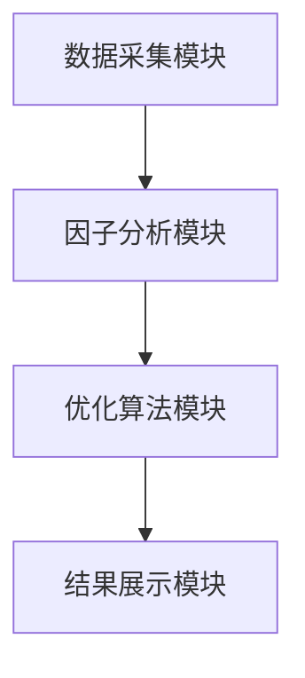

                 


# 构建智能化的个人投资风格因子暴露动态优化系统

## 关键词：智能化投资、风格因子、动态优化、人工智能、机器学习

## 摘要：本文将探讨如何利用人工智能和机器学习技术构建一个智能化的个人投资风格因子暴露动态优化系统。通过对投资风格因子的动态调整和优化，帮助投资者在不断变化的市场环境中实现风险控制和收益最大化。文章将从背景分析、核心概念、算法原理、系统架构到项目实战，全面阐述这一系统的构建过程。

---

# 第1章: 投资风格因子暴露的背景与问题背景

## 1.1 投资风格因子的定义与重要性

### 1.1.1 什么是投资风格因子

投资风格因子是指影响投资组合表现的关键因素，包括市场Beta、市值、价值、动量等。这些因子通过不同的权重组合，决定了投资组合的风险和收益特征。

### 1.1.2 投资风格因子在投资决策中的作用

投资风格因子帮助投资者理解组合的风险来源，并通过调整因子权重来优化投资结果。例如，增加成长因子的权重可以提高组合的成长性，减少价值因子的权重可以降低价值风险。

### 1.1.3 个人投资风格的多样性与复杂性

不同投资者有不同的风险承受能力和收益目标，导致他们的投资风格因子暴露存在显著差异。这种多样性使得个性化优化成为必要。

---

## 1.2 传统投资风格管理的局限性

### 1.2.1 传统因子分析方法的不足

传统方法通常采用静态分析，难以捕捉市场的动态变化。例如，固定因子权重可能导致在市场波动时无法及时调整，造成较大的回撤。

### 1.2.2 个人投资风格暴露的动态变化问题

市场的波动、政策变化和个人风险偏好的变化都会影响投资风格因子的暴露。传统方法难以实时跟踪和调整，导致优化效果不佳。

### 1.2.3 传统方法在应对市场变化中的局限性

传统方法通常依赖历史数据，忽视前瞻性预测。在极端市场条件下，如金融危机，传统方法可能失效，导致较大的损失。

---

## 1.3 智能化投资风格优化的必要性

### 1.3.1 人工智能在投资风格管理中的应用潜力

人工智能技术可以实时分析市场数据和投资者行为，提供动态优化的解决方案。例如，使用机器学习模型预测市场变化，动态调整因子权重。

### 1.3.2 动态优化在投资风格管理中的价值

动态优化能够根据市场变化和个人目标实时调整投资风格因子暴露，提高组合的适应性和收益能力。例如，在市场波动加剧时，动态优化可以降低高风险因子的权重，减少回撤。

### 1.3.3 智能化投资风格优化的未来发展趋势

随着技术的进步，智能化投资风格优化将更加个性化和自动化。投资者可以通过实时数据分析和智能算法，实现更精准的投资风格管理。

---

## 1.4 本章小结

本章从投资风格因子的定义和重要性入手，分析了传统投资风格管理的局限性，强调了智能化投资风格优化的必要性和未来发展趋势。通过智能化技术，投资者可以更好地应对市场变化，实现投资目标。

---

# 第2章: 个人投资风格因子暴露的核心概念

## 2.1 投资风格因子的构成与分类

### 2.1.1 常见的投资风格因子类型

- **市场Beta因子**：衡量投资组合相对于市场的波动性。
- **市值因子**：反映小盘股和大盘股的风险暴露。
- **价值因子**：衡量低市盈率、低市净率等价值股票的权重。
- **动量因子**：基于过去的价格趋势预测未来收益。

### 2.1.2 风险因子与收益因子的区别

风险因子（如Beta、波动率）衡量投资组合的风险，而收益因子（如动量、价值）则预测未来的收益潜力。

### 2.1.3 个人投资风格因子的动态变化特征

投资风格因子的权重会根据市场环境和个人目标的变化而动态调整。例如，在市场上涨时，可能增加Beta因子的权重；在市场下跌时，可能增加防御性因子的权重。

---

## 2.2 投资风格暴露的度量方法

### 2.2.1 风险敞口的定义与计算

风险敞口是指投资组合对某一风险因子的敏感程度。例如，Beta系数衡量市场风险敞口，Vega系数衡量波动率风险敞口。

### 2.2.2 因子暴露的量化指标

因子暴露通常通过因子载荷或权重来量化。例如，使用回归分析可以计算每个因子对组合收益的贡献度。

### 2.2.3 动态优化中的因子权重调整方法

动态优化通过实时调整因子权重，使投资组合的风险和收益暴露与目标一致。例如，使用均值-方差优化方法调整因子权重。

---

## 2.3 投资风格优化的目标与边界

### 2.3.1 投资风格优化的主要目标

- **风险控制**：降低投资组合的非系统性风险。
- **收益最大化**：在风险可控的前提下，提高组合收益。
- **个性化目标**：根据投资者的偏好调整因子权重。

### 2.3.2 优化过程中的边界条件

- **可投资性**：调整后的因子权重必须对应实际可投资的资产。
- **流动性约束**：避免调整过于激进导致流动性风险。
- **交易成本**：考虑权重调整的交易成本。

### 2.3.3 优化结果的可解释性与实用性

优化后的因子权重应具有良好的可解释性，便于投资者理解和调整。同时，优化结果应具有实际操作性，能够在实际交易中实现。

---

## 2.4 本章小结

本章详细介绍了投资风格因子的构成与分类，讨论了因子暴露的度量方法，并分析了优化的目标与边界条件。通过这些内容，读者可以更好地理解投资风格因子暴露的核心概念。

---

# 第3章: 智能化投资风格优化的核心算法原理

## 3.1 动态优化算法的原理与流程

### 3.1.1 动态优化的基本原理

动态优化算法通过实时分析市场数据和投资者目标，调整因子权重以实现优化目标。例如，使用遗传算法或粒子群算法进行动态优化。

### 3.1.2 算法的输入与输出

- **输入**：市场数据、投资者目标、当前因子权重。
- **输出**：优化后的因子权重。

### 3.1.3 算法的执行步骤与流程

1. 数据采集：获取市场数据和投资者目标。
2. 因子分析：计算当前因子权重和风险敞口。
3. 目标设定：明确优化目标（如最小化风险、最大化收益）。
4. 模型构建：建立优化模型，如均值-方差模型。
5. 参数调整：优化因子权重，满足目标。
6. 结果输出：输出优化后的因子权重。

---

## 3.2 基于机器学习的因子选择与权重调整

### 3.2.1 机器学习在因子选择中的应用

使用机器学习算法（如Lasso回归）选择重要的因子，去除冗余因子。

### 3.2.2 基于回归分析的权重调整方法

通过回归分析确定每个因子对组合收益的贡献度，调整因子权重。

### 3.2.3 基于聚类分析的因子动态调整策略

将相似的因子归为一类，动态调整聚类内的因子权重，降低组合的波动性。

---

## 3.3 基于强化学习的投资风格优化

### 3.3.1 强化学习在投资风格优化中的应用

使用强化学习算法（如Q-Learning）在不同市场状态下调整因子权重，最大化累计收益。

### 3.3.2 强化学习算法的基本框架

1. 状态定义：市场环境（如市场趋势、波动率）。
2. 动作选择：调整因子权重。
3. 奖励机制：收益超过目标时给予奖励。
4. 策略优化：通过试错优化策略。

### 3.3.3 强化学习的局限性

强化学习需要大量的历史数据和计算资源，且策略可能存在过拟合风险。

---

## 3.4 本章小结

本章介绍了动态优化算法的原理与流程，详细讲解了基于机器学习和强化学习的因子选择与权重调整方法。通过这些算法，投资者可以实现投资风格因子暴露的动态优化。

---

# 第4章: 智能化投资风格优化系统的架构设计

## 4.1 问题场景介绍

投资者希望根据市场变化和自身目标，动态调整投资风格因子暴露。传统的静态分析方法难以满足需求。

## 4.2 系统功能设计

### 4.2.1 系统功能模块

- **数据采集模块**：获取市场数据和投资者目标。
- **因子分析模块**：计算因子权重和风险敞口。
- **优化算法模块**：动态调整因子权重。
- **结果展示模块**：输出优化结果。

### 4.2.2 系统功能流程

1. 数据采集：获取市场数据和投资者目标。
2. 因子分析：计算当前因子权重和风险敞口。
3. 优化算法：动态调整因子权重。
4. 结果展示：输出优化结果。

---

## 4.3 系统架构设计

### 4.3.1 系统架构图

使用Mermaid绘制系统架构图，展示各模块之间的关系。



### 4.3.2 系统接口设计

- **数据接口**：与数据源（如金融数据库）对接。
- **用户接口**：供投资者输入目标和查看结果。

### 4.3.3 系统交互流程

1. 投资者输入目标和当前因子权重。
2. 数据采集模块获取市场数据。
3. 因子分析模块计算风险敞口。
4. 优化算法模块动态调整因子权重。
5. 结果展示模块输出优化结果。

---

## 4.4 本章小结

本章通过系统架构设计，展示了智能化投资风格优化系统的整体框架和各模块的功能。通过合理的设计，系统能够实现动态优化目标。

---

# 第5章: 项目实战——构建智能化投资风格优化系统

## 5.1 环境安装与配置

### 5.1.1 安装Python环境

安装Anaconda或Miniconda，配置Python 3.8及以上版本。

### 5.1.2 安装依赖库

安装numpy、pandas、scikit-learn、pyfolio等库。

```bash
pip install numpy pandas scikit-learn pyfolio
```

---

## 5.2 核心代码实现

### 5.2.1 数据采集模块

```python
import pandas as pd

def get_market_data(start_date, end_date):
    # 示例：从数据库获取市场数据
    return pd.DataFrame()
```

### 5.2.2 因子分析模块

```python
from sklearn.linear_model import Lasso

def factor_analysis(factor_data, target):
    model = Lasso(alpha=0.1)
    model.fit(factor_data, target)
    return model.coef_
```

### 5.2.3 优化算法模块

```python
import numpy as np

def optimize_weights(factor_weights, risk_target):
    # 示例：均值-方差优化
    cov_matrix = np.cov(factor_weights)
    inv_cov = np.linalg.inv(cov_matrix)
    target_weights = inv_cov.dot(risk_target)
    return target_weights
```

### 5.2.4 结果展示模块

```python
import matplotlib.pyplot as plt

def plot_results(optimized_weights):
    plt.bar(range(len(optimized_weights)), optimized_weights)
    plt.title('Optimized Factor Weights')
    plt.show()
```

---

## 5.3 实际案例分析

### 5.3.1 数据准备

```python
market_data = get_market_data('2020-01-01', '2023-12-31')
factor_data = market_data[['Beta', 'Momentum', 'Value']]
target = market_data['Return']
```

### 5.3.2 因子分析

```python
factor_weights = factor_analysis(factor_data, target)
print(factor_weights)
```

### 5.3.3 动态优化

```python
risk_target = np.array([0.05, 0.05, 0.05])  # 示例目标
optimized_weights = optimize_weights(factor_weights, risk_target)
print(optimized_weights)
```

### 5.3.4 结果展示

```python
plot_results(optimized_weights)
```

---

## 5.4 本章小结

本章通过实际案例，详细展示了智能化投资风格优化系统的实现过程。从数据采集到结果展示，每个步骤都进行了详细的代码实现和分析。

---

# 第6章: 最佳实践与小结

## 6.1 最佳实践 tips

- **数据质量**：确保数据的准确性和完整性。
- **模型选择**：根据实际情况选择合适的优化算法。
- **风险管理**：设置合理的边界条件，避免过度优化。

## 6.2 小结

本文详细探讨了智能化投资风格因子暴露动态优化系统的构建过程，从背景分析到项目实战，全面介绍了相关的核心概念和算法原理。通过实践案例，展示了系统的实际应用价值。

## 6.3 注意事项

- 优化结果需结合市场实际情况进行调整。
- 注意模型的可解释性和实用性。

## 6.4 拓展阅读

- 《机器学习在金融中的应用》
- 《动态资产配置策略》

---

# 作者：AI天才研究院/AI Genius Institute & 禅与计算机程序设计艺术 /Zen And The Art of Computer Programming

---

以上是本书的详细目录大纲和部分内容，涵盖了从背景分析到项目实战的各个方面。通过系统的构建和实践，读者可以掌握智能化投资风格因子暴露动态优化的核心技术。

