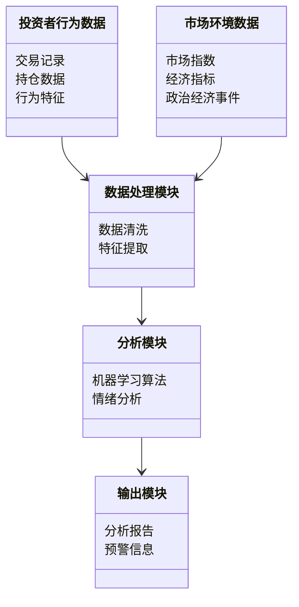

                 


```markdown
# 构建智能化的个人投资风格漂移原因分析系统

> 关键词：投资风格漂移，智能化分析，系统架构，算法原理，项目实战

> 摘要：本文详细探讨了构建智能化的个人投资风格漂移原因分析系统的背景、核心概念、算法原理、系统架构设计及项目实战。通过对投资者行为数据和市场环境数据的分析，结合机器学习算法，提出了一种智能化的投资风格漂移分析系统，旨在帮助投资者更好地理解和管理投资行为。

---

# 第一部分: 智能化投资风格漂移分析的背景与核心概念

## 第1章: 投资风格漂移的背景与问题描述

### 1.1 投资风格漂移的定义与特征

#### 1.1.1 投资风格漂移的定义
投资风格漂移是指投资者在实际投资过程中，由于市场环境变化、投资者情绪波动或策略调整等因素，导致其实际投资行为与初始投资策略发生偏离的现象。

#### 1.1.2 投资风格漂移的核心特征
- **时间序列性**：漂移通常表现为一段时间内的持续偏离。
- **多因素驱动**：包括市场波动、投资者情绪、外部环境变化等。
- **可测量性**：通过数据分析可以量化漂移的程度和原因。

#### 1.1.3 投资风格漂移的边界与外延
- 边界：漂移与正常的策略调整之间的区分。
- 外延：包括投资者心理分析、市场行为分析等多个维度。

### 1.2 投资者行为与市场环境的关联

#### 1.2.1 投资者行为分析的必要性
- 理解投资者行为有助于优化投资策略。
- 通过分析投资者行为，可以预测市场波动。

#### 1.2.2 市场环境对投资风格的影响
- 市场波动：如经济衰退、市场暴涨等。
- 利率变化：影响资产配置。
- 政治经济事件：如政策变化、战争等。

### 1.3 问题背景与研究意义

#### 1.3.1 当前投资风格漂移分析的痛点
- 数据量大：难以手动分析。
- 因素复杂：需要多维度分析。
- 实时性要求高：需要及时调整策略。

#### 1.3.2 智能化分析的必要性与优势
- 自动化处理：提高效率。
- 多维度分析：全面捕捉漂移原因。
- 实时监控：及时预警和调整。

#### 1.3.3 本书的研究目标与意义
- 提供一套智能化的投资风格漂移分析方法。
- 帮助投资者优化决策，降低风险。

---

## 第2章: 投资风格漂移的核心概念与系统架构

### 2.1 投资风格漂移分析的核心要素

#### 2.1.1 投资者行为数据
- 交易记录：买入、卖出时间及金额。
- 持仓数据：资产配置比例。
- 行为特征：交易频率、风险偏好。

#### 2.1.2 市场环境数据
- 市场指数：如股票指数、债券指数。
- 经济指标：如GDP增长率、通货膨胀率。
- 政治经济事件：如政策变化、国际局势。

#### 2.1.3 投资风格漂移的驱动因素
- 市场波动：如市场剧烈波动导致投资者恐慌性抛售。
- 投资者情绪：如贪婪和恐惧导致的行为偏差。
- 策略调整：如根据市场变化调整投资策略。

### 2.2 投资风格漂移分析的系统架构

#### 2.2.1 系统功能模块划分
- 数据采集模块：收集投资者行为数据和市场数据。
- 数据处理模块：清洗、转换和整合数据。
- 分析模块：通过算法分析漂移原因。
- 输出模块：生成报告和预警信息。

#### 2.2.2 数据流与信息流分析
- 数据流：从数据源到处理模块，再到分析模块，最后输出结果。
- 信息流：从数据采集到分析结果的反馈。

#### 2.2.3 系统核心算法与实现
- 使用机器学习算法，如回归分析、聚类分析。
- 结合自然语言处理分析投资者情绪。

### 2.3 投资风格漂移分析的ER实体关系图

```mermaid
erDiagram
    actor 投资者
    actor 市场环境
    actor 系统
    投资者 --> 投资者行为数据
    市场环境 --> 市场数据
    系统 --> 数据处理模块
    数据处理模块 --> 分析模块
    分析模块 --> 输出模块
```

---

## 第3章: 投资风格漂移分析的算法原理

### 3.1 数据预处理与特征提取

#### 3.1.1 数据清洗与标准化
- 去除异常值。
- 填补缺失值。
- 标准化处理：如归一化。

#### 3.1.2 特征选择与降维
- 使用特征重要性分析选择关键特征。
- 应用主成分分析（PCA）进行降维。

#### 3.1.3 时间序列数据处理
- 处理时间序列数据，提取趋势和周期性。

### 3.2 投资风格漂移原因

#### 3.2.1 市场波动分析
- 使用时间序列模型预测市场趋势。

#### 3.2.2 投资者情绪分析
- 通过自然语言处理分析投资者情绪。

#### 3.2.3 策略调整分析
- 分析投资者在不同市场环境下的策略调整。

---

## 第4章: 系统分析与架构设计方案

### 4.1 系统功能设计

#### 4.1.1 领域模型设计



### 4.2 系统架构设计

#### 4.2.1 系统架构图


---

## 第5章: 项目实战

### 5.1 环境安装与配置

#### 5.1.1 安装Python环境
- 安装Python 3.x。
- 安装必要的库：如pandas、numpy、scikit-learn。

#### 5.1.2 数据获取与预处理

#### 5.1.3 编写代码实现

```python
import pandas as pd
import numpy as np
from sklearn.ensemble import RandomForestClassifier
from sklearn.metrics import accuracy_score

# 数据加载
data = pd.read_csv('investment_style_drift.csv')

# 数据预处理
# 假设 drift 是目标变量，其他是特征
X = data.drop('drift', axis=1)
y = data['drift']

# 特征选择
selector = RandomForestClassifier(max_depth=2, random_state=0).fit(X, y)
selected_features = selector.feature_importances_

# 模型训练
model = RandomForestClassifier().fit(X, y)

# 预测与评估
y_pred = model.predict(X)
print(f'Accuracy: {accuracy_score(y, y_pred)}')
```

### 5.2 代码实现与解读

#### 5.2.1 数据加载与预处理
- 加载数据并处理缺失值和异常值。

#### 5.2.2 特征选择与模型训练
- 使用随机森林进行特征选择。
- 训练模型并评估准确性。

### 5.3 实际案例分析

#### 5.3.1 案例背景
- 假设某投资者在2020年疫情后的投资行为。

#### 5.3.2 数据分析
- 使用模型分析其投资行为的漂移原因。

### 5.4 项目小结

---

## 第6章: 系统实现与优化

### 6.1 系统实现细节

#### 6.1.1 系统接口设计
- 定义数据接口和算法接口。

#### 6.1.2 系统交互设计
- 设计用户与系统之间的交互流程。

### 6.2 系统优化与改进

#### 6.2.1 算法优化
- 使用更复杂的模型，如深度学习。

#### 6.2.2 系统性能优化
- 优化数据处理流程，提高计算效率。

---

## 第7章: 总结与展望

### 7.1 全文总结
- 总结本书的主要内容和研究成果。

### 7.2 未来展望
- 智能化投资分析的未来发展方向。
- 更多算法和技术的结合应用。

---

# 作者：AI天才研究院/AI Genius Institute & 禅与计算机程序设计艺术 /Zen And The Art of Computer Programming
```

