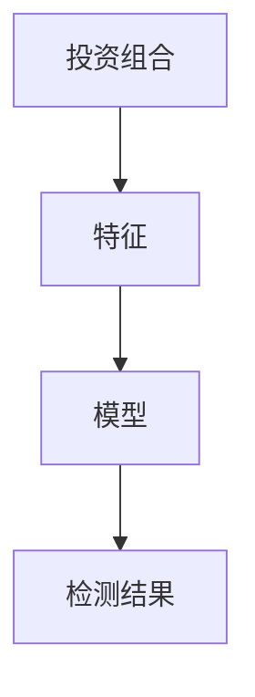
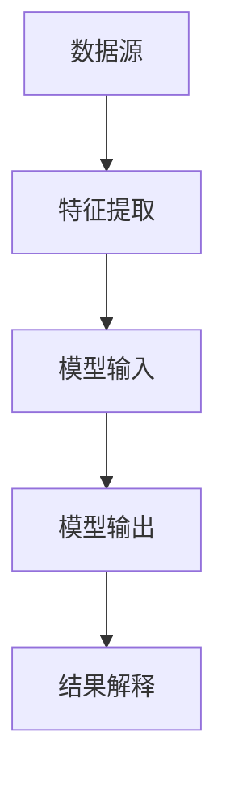
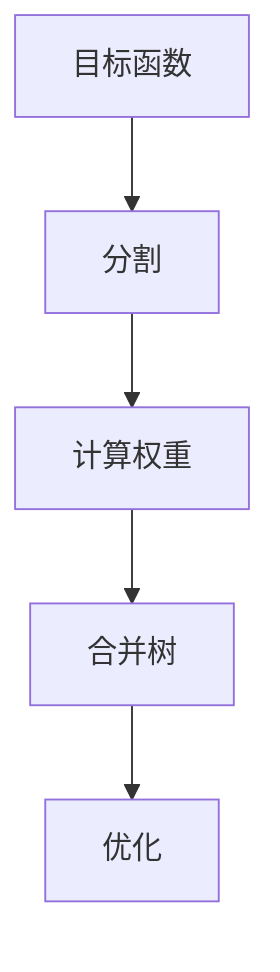
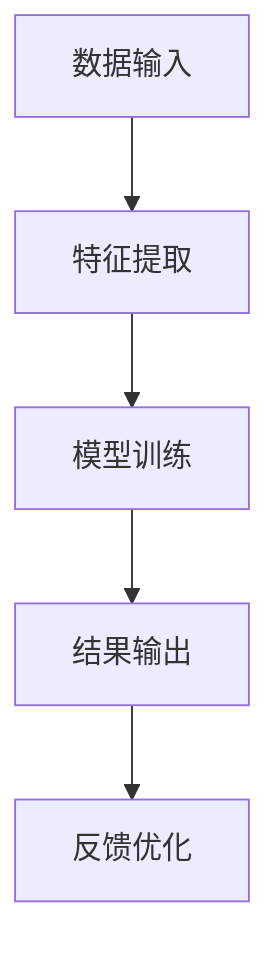
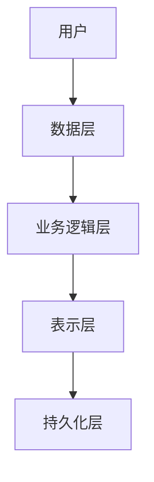
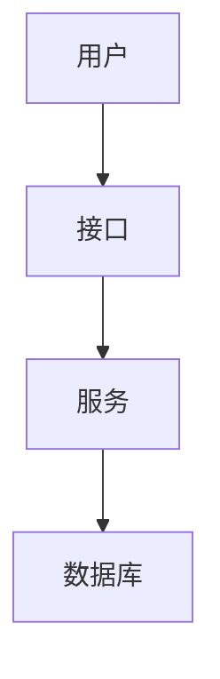

                 


# 构建智能化的个人投资风格漂移检测系统

> 关键词：投资风格漂移检测，机器学习，特征工程，系统架构，金融数据分析

> 摘要：投资风格漂移是指投资组合的实际表现偏离预期投资策略的现象，智能化的检测系统能够帮助投资者及时发现并调整策略。本文将从背景介绍、核心概念、算法原理、系统架构到项目实战，详细讲解如何构建一个智能化的个人投资风格漂移检测系统。

---

# 第一部分: 背景介绍与核心概念

## 第1章: 投资风格漂移检测的背景与问题定义

### 1.1 投资风格漂移的背景介绍

#### 1.1.1 投资风格的定义与重要性

投资风格是指投资者在进行资产配置时所遵循的一套系统化的方法和策略。它通常基于市场环境、风险偏好和投资目标等因素，帮助投资者选择合适的资产组合。例如，一种常见的投资风格是“价值投资”，即寻找被市场低估的股票；另一种是“成长投资”，即投资于高增长潜力的公司。

投资风格的重要性在于它决定了投资组合的风险和收益特征。如果一个投资者的投资风格发生了变化（即漂移），其风险和收益可能会偏离预期，从而影响投资目标的实现。

#### 1.1.2 投资风格漂移的定义与现象

投资风格漂移是指投资组合的实际表现偏离预期的投资策略的现象。这种漂移可能是由于市场环境变化、投资者情绪波动或策略执行偏差等多种因素引起的。例如，原本计划投资于高增长股票的投资者可能在市场波动时转向防御性资产，导致投资风格发生漂移。

#### 1.1.3 漂移检测的必要性与应用场景

漂移检测的必要性在于及时发现投资策略的偏离，帮助投资者调整策略以避免潜在风险。其应用场景包括：  
1. **风险管理**：及时发现和纠正漂移，降低投资组合的意外风险。  
2. **策略优化**：通过分析漂移的原因，优化投资策略。  
3. **业绩评估**：准确评估投资表现，区分策略有效性和外部环境影响。  

---

### 1.2 个人投资风格漂移检测的定义与范围

#### 1.2.1 核心概念的结构化定义

投资风格漂移检测系统通过分析投资组合的历史表现和预期策略，判断其是否偏离预定风格。其核心在于将实际表现与预期策略进行对比，识别出风格漂移的信号。

#### 1.2.2 漂移检测的边界与外延

漂移检测的边界在于区分正常的市场波动和策略调整与真正的风格漂移。例如，投资者在市场下跌时调整持仓比例，可能是正常的策略调整，而不一定是风格漂移。外延则包括将检测结果应用于风险控制、投资决策优化等领域。

#### 1.2.3 概念的核心要素与组成

投资风格漂移检测的核心要素包括：  
1. **投资组合数据**：包括持仓、权重等信息。  
2. **预期策略模型**：如CAPM、APT等资产定价模型。  
3. **市场数据**：如市场指数、行业表现等。  
4. **检测算法**：如机器学习模型、统计检验等。  

---

## 第2章: 智能化投资风格漂移检测的技术基础

### 2.1 数据驱动的金融分析方法

#### 2.1.1 数据驱动与传统金融分析的对比

传统金融分析依赖于经验和市场直觉，而数据驱动方法则利用大数据和机器学习技术，通过统计分析和模式识别发现投资机会和风险。数据驱动方法的优势在于能够处理海量数据，发现复杂市场中的潜在规律。

#### 2.1.2 数据驱动在投资风格分析中的优势

数据驱动方法的优势包括：  
1. **高效性**：能够快速处理大量数据，发现潜在模式。  
2. **客观性**：减少人为情绪对决策的影响。  
3. **可扩展性**：适用于大规模数据和复杂场景。  

---

### 2.2 机器学习在金融领域的应用

#### 2.2.1 机器学习在投资风格分析中的作用

机器学习在投资风格分析中的作用包括：  
1. **特征提取**：从海量数据中提取有用的特征。  
2. **模式识别**：识别投资风格的变化模式。  
3. **预测与分类**：预测投资风格是否会发生漂移。  

#### 2.2.2 常见的机器学习算法与技术

常用的算法包括：  
1. **监督学习**：如随机森林、支持向量机（SVM）。  
2. **无监督学习**：如聚类分析、主成分分析（PCA）。  
3. **深度学习**：如神经网络、长短期记忆网络（LSTM）。  

---

### 2.3 投资风格漂移检测的智能化路径

#### 2.3.1 数据采集与处理

数据采集包括从市场数据、持仓数据等多源数据中获取信息。数据处理包括清洗、标准化和特征工程等步骤。

#### 2.3.2 特征提取与模型训练

特征提取是将原始数据转换为能够反映投资风格的特征向量。模型训练则是利用这些特征训练分类器，识别投资风格是否发生漂移。

#### 2.3.3 结果解释与反馈优化

模型输出的结果需要进行解释，以帮助投资者理解漂移的原因，并根据反馈优化投资策略。

---

# 第二部分: 核心概念与联系

## 第3章: 投资风格漂移检测的核心概念与联系

### 3.1 核心概念的原理与特征

#### 3.1.1 投资风格漂移的特征工程

特征工程是将原始数据转换为能够反映投资风格的特征向量。常见的特征包括：  
- **资产权重**：各资产在组合中的权重变化。  
- **风险指标**：如波动率、VaR（在险值）。  
- **收益指标**：如夏普比率、最大回撤。  

#### 3.1.2 数据特征的属性对比

以下是对几种常见数据特征的对比：

| 特征类型   | 描述                     | 优点                   | 缺点                   |
|------------|--------------------------|------------------------|------------------------|
| 资产权重    | 各资产在组合中的比例     | 直观反映投资偏好       | 易受市场波动影响       |
| 风险指标    | 衡量投资组合的风险程度   | 客观性高               | 依赖假设和模型         |
| 收益指标    | 衡量投资组合的收益表现   | 可比性高               | 受市场周期影响         |

#### 3.1.3 模型选择的特征分析

模型选择时需要考虑特征的显著性、相关性和冗余性。例如，使用LASSO回归进行特征选择，以剔除冗余特征。

---

### 3.2 核心概念的联系与对比

#### 3.2.1 投资风格漂移与风险控制的关系

漂移检测是风险控制的重要环节，通过及时发现漂移，可以采取措施降低风险。例如，当检测到投资组合的风险指标偏离预期时，可以调整持仓以降低风险。

#### 3.2.2 数据特征与模型性能的对比分析

数据特征的质量直接影响模型的性能。例如，使用低相关性的特征可以提高模型的泛化能力，而高冗余的特征可能导致过拟合。

#### 3.2.3 不同模型在漂移检测中的表现

以下是几种常见模型在漂移检测中的表现对比：

| 模型类型   | 优点                       | 缺点                       |
|------------|----------------------------|---------------------------|
| 随机森林   | 高准确性，易于解释         | 对特征工程依赖较大       |
| XGBoost    | 高精度，支持特征重要性分析 | �易过拟合                   |
| LSTM       | 能捕捉时间序列中的模式     | 训练时间长，计算复杂       |

---

## 第4章: 投资风格漂移检测的ER实体关系图

### 4.1 实体关系图的构建

以下是投资风格漂移检测系统的实体关系图：



### 4.2 实体关系的流程图

以下是系统的主要流程：



---

# 第三部分: 算法原理

## 第4章: 投资风格漂移检测的算法原理

### 4.1 算法的选择与原理

#### 4.1.1 算法选择

基于漂移检测的分类任务，我们选择XGBoost作为分类算法。XGBoost具有高精度和可解释性，适合处理投资数据。

#### 4.1.2 算法原理

XGBoost是一种基于树的集成算法，通过多棵树的组合来提高模型的准确性和鲁棒性。其核心思想是通过优化目标函数和正则化来防止过拟合。

#### 4.1.3 算法流程

以下是XGBoost的算法流程图：



---

### 4.2 算法的数学模型与公式

#### 4.2.1 损失函数

XGBoost的目标是最小化损失函数，常见的损失函数包括：

$$
\text{损失函数} = \sum_{i=1}^{n} \left( y_i - \hat{y}_i \right)^2
$$

#### 4.2.2 正则化

正则化用于防止过拟合，常用的正则化项包括L1和L2正则化：

$$
\text{正则化项} = \lambda \sum_{j=1}^{m} \theta_j^2
$$

---

### 4.3 算法实现与代码示例

以下是XGBoost的Python代码示例：

```python
import xgboost as xgb

# 训练数据
X_train, y_train = prepare_data()

# 创建DMatrix
dtrain = xgb.DMatrix(X_train, label=y_train)

# 参数设置
params = {
    'objective': 'binary:logistic',
    'max_depth': 6,
    'learning_rate': 0.3,
    'n_estimators': 100
}

# 训练模型
model = xgb.train(params, dtrain)

# 预测
X_test, y_test = test_data()
dtest = xgb.DMatrix(X_test)
y_pred = model.predict(dtest)
```

---

# 第四部分: 系统分析与架构设计

## 第5章: 投资风格漂移检测系统的架构设计

### 5.1 系统功能设计

以下是系统的功能模块图：



### 5.2 系统架构设计

以下是系统的分层架构图：



---

## 第6章: 系统实现与接口设计

### 6.1 系统实现

以下是系统实现的主要步骤：

1. 数据预处理：清洗、特征工程。  
2. 模型训练：使用XGBoost进行训练。  
3. 结果解释：输出检测结果并进行反馈优化。  

### 6.2 接口设计

以下是系统的接口设计：



---

# 第五部分: 项目实战

## 第7章: 投资风格漂移检测系统的实现

### 7.1 项目环境安装

安装必要的库：

```bash
pip install xgboost pandas numpy scikit-learn
```

### 7.2 系统核心实现

以下是核心代码：

```python
import pandas as pd
import numpy as np
import xgboost as xgb

# 数据加载
data = pd.read_csv('investment_data.csv')

# 特征工程
features = data[['asset_weight', 'risk', 'return']]
labels = data['drift']

# 模型训练
dtrain = xgb.DMatrix(features, label=labels)
params = {
    'objective': 'binary:logistic',
    'max_depth': 6,
    'learning_rate': 0.3,
    'n_estimators': 100
}
model = xgb.train(params, dtrain)

# 预测与解释
X_test = features.iloc[:10]
dtest = xgb.DMatrix(X_test)
y_pred = model.predict(dtest)
```

### 7.3 案例分析与结果解读

通过实际案例分析，解释模型的输出结果。例如，当预测结果为1时，表示检测到投资风格漂移，需要进行调整。

---

## 第8章: 总结与展望

### 8.1 总结

本文详细介绍了如何构建智能化的个人投资风格漂移检测系统，包括背景、核心概念、算法原理、系统架构和项目实战等内容。通过数据驱动和机器学习技术，能够有效检测投资风格的漂移，帮助投资者优化策略。

### 8.2 展望

未来，随着人工智能技术的发展，漂移检测系统将更加智能化和自动化。例如，可以结合强化学习技术，实现动态调整和自适应优化。

---

# 附录

## 附录A: 数据集描述

数据集包括投资组合的持仓数据、市场数据和标签数据。

## 附录B: 工具安装指南

安装Python和相关库的指南。

## 附录C: 参考文献

相关文献和资料的参考。

---

# 作者

作者：AI天才研究院/AI Genius Institute & 禅与计算机程序设计艺术 /Zen And The Art of Computer Programming

