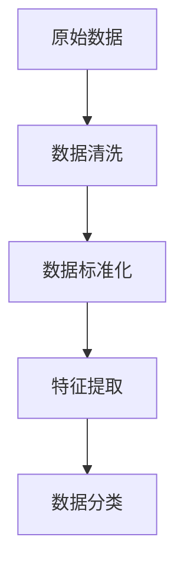
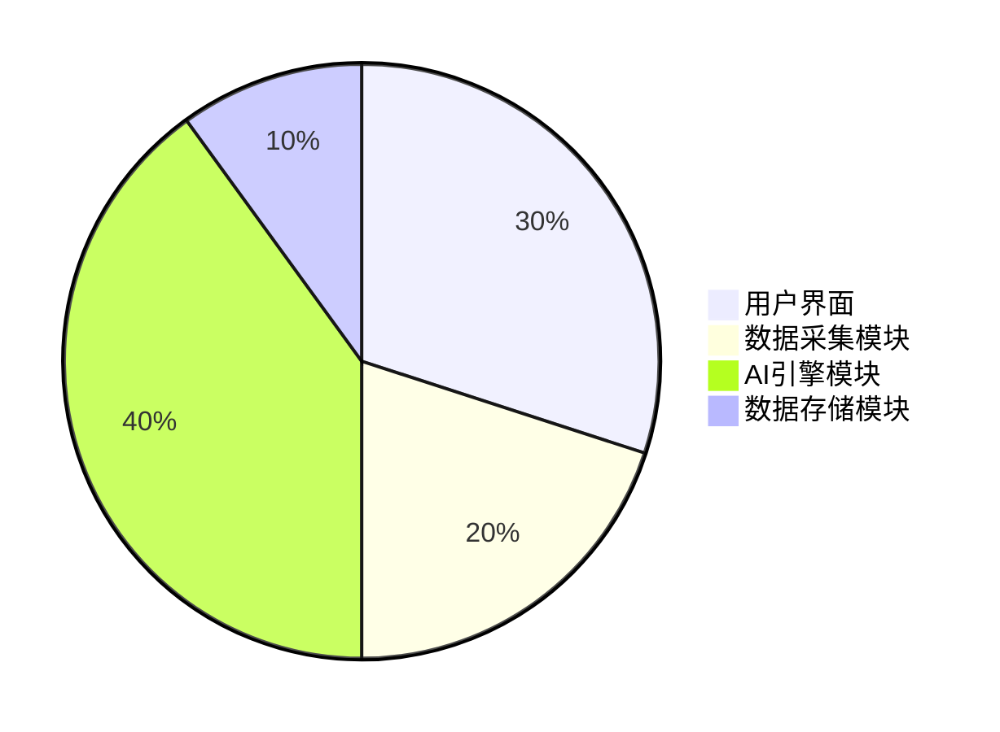
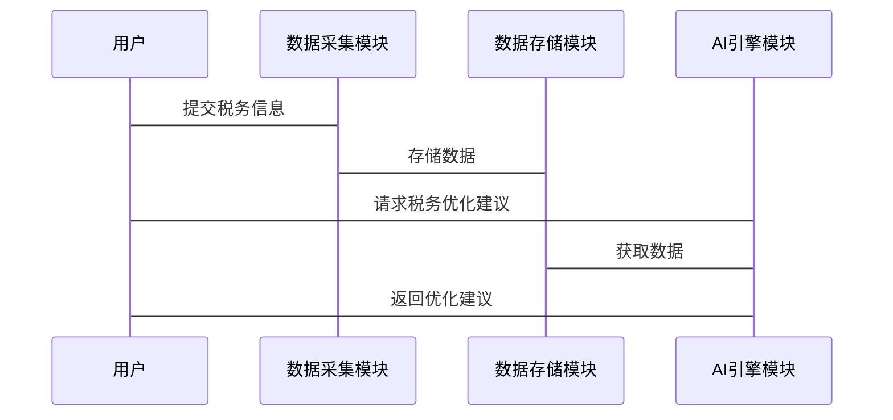

                 


# 构建智能化的个人税务筹划助手系统

> 关键词：智能化税务助手，AI税务规划，个人财务优化，数据驱动决策，系统架构设计

> 摘要：本文深入探讨如何构建一个智能化的个人税务筹划助手系统，利用人工智能技术优化个人税务规划。系统通过数据预处理、模型训练、系统架构设计和项目实战，提供高效的税务优化方案。文章涵盖从背景到实现的各个方面，结合图表和代码示例，全面解析系统的设计与实现。

---

# 第一部分: 个人税务筹划助手系统背景与需求

## 第1章: 智能化税务筹划助手系统概述

### 1.1 税务筹划助手系统的背景与意义

#### 1.1.1 个人税务筹划的重要性
随着经济的发展，个人税务筹划变得越来越复杂。合理规划税务可以帮助个人或家庭在合法范围内最大限度地减少税负，优化财务状况。然而，传统的税务筹划方法往往依赖于手动计算和经验判断，效率低且容易出错。

#### 1.1.2 传统税务筹划的局限性
传统税务筹划方法存在以下问题：
- **信息不全**：手动收集和整理税务信息耗时且容易遗漏。
- **效率低下**：面对复杂的税法和多变的政策，手动计算效率低。
- **缺乏个性化**：无法根据个人的收入、支出和资产情况提供定制化建议。

#### 1.1.3 智能化税务筹划助手的优势
智能化税务筹划助手通过人工智能技术，能够快速处理大量数据，提供精准的税务优化建议。其优势包括：
- **高效性**：自动化处理数据，快速生成税务报告。
- **准确性**：基于大数据和机器学习模型，提供科学的税务建议。
- **个性化**：根据用户的具体情况，提供定制化税务规划。

### 1.2 智能化税务筹划的核心概念

#### 1.2.1 智能化税务筹划的定义
智能化税务筹划是指利用人工智能技术，通过分析用户的收入、支出、资产等数据，自动优化税务策略，帮助用户在合法范围内最小化税负。

#### 1.2.2 系统的核心功能模块
智能化税务筹划助手系统的核心功能模块包括：
- **用户信息采集**：收集用户的收入、支出、资产等信息。
- **数据处理与分析**：对数据进行清洗、特征提取和分类。
- **AI模型预测**：基于机器学习模型，预测最优税务方案。
- **结果展示与建议**：生成可视化报告，并提供个性化建议。

#### 1.2.3 边界与外延
系统的边界包括用户数据的收集和处理，以及基于数据的税务优化建议。外延则涉及与税务机构的接口对接和数据隐私保护。

---

## 第2章: 系统核心概念与联系

### 2.1 核心概念原理

#### 2.1.1 AI模型在税务筹划中的应用
AI模型可以用于以下方面：
- **数据分类**：将用户数据分为不同的类别，便于后续分析。
- **预测与优化**：基于历史数据，预测未来的税务负担，并优化税务策略。

#### 2.1.2 数据驱动的税务优化策略
通过分析用户的财务数据，系统可以识别潜在的税务优惠，优化资产配置，从而降低税负。

### 2.2 核心概念属性对比表

| 概念       | 描述                              |
|------------|-----------------------------------|
| 税务类型    | 不同税种的计算规则                |
| 收入来源    | 收入的合法性与税务处理方式          |
| 税率        | 税率的计算与调整机制                |
| 税务优惠    | 各类税收优惠政策的适用条件          |

### 2.3 ER实体关系图

```mermaid
er
    User {
        id
        name
        tax_info
    }
    TaxRule {
        id
        rule_name
        rule_description
    }
    Transaction {
        id
        user_id
        amount
        tax_type
    }
    User-TaxRule {
        user_id
        rule_id
        applicable
    }
```

---

# 第二部分: 系统算法原理与数学模型

## 第3章: 系统算法原理

### 3.1 税务数据预处理

#### 3.1.1 数据清洗与标准化
数据清洗是将不完整、错误或重复的数据进行处理，确保数据的准确性和一致性。标准化则是将数据转换为统一的格式，便于后续分析。

#### 3.1.2 数据特征提取
特征提取是从原始数据中提取有助于模型训练的特征，例如收入、支出、资产等。

#### 3.1.3 数据标注与分类
根据税务类型对数据进行分类，例如将收入分为工资、投资收益等。

### 3.2 AI模型训练

#### 3.2.1 数据预处理流程


#### 3.2.2 模型选择与训练
选择适合的机器学习模型（如随机森林、支持向量机等），并进行训练。

### 3.3 算法原理与数学模型

#### 3.3.1 逻辑回归模型
逻辑回归是一种常用的分类算法，其数学模型如下：

$$ P(y=1|x) = \frac{e^{\beta_0 + \beta_1 x}}{1 + e^{\beta_0 + \beta_1 x}} $$

#### 3.3.2 支持向量机
支持向量机通过找到一个超平面，将数据分为两类。其数学模型如下：

$$ \text{minimize} \quad \frac{1}{2} ||w||^2 + C \sum_{i=1}^n \xi_i $$
$$ \text{subject to} \quad y_i (w \cdot x_i + b) \geq 1 - \xi_i $$
$$ \xi_i \geq 0 $$

---

## 第4章: 系统架构设计

### 4.1 系统功能设计

#### 4.1.1 用户管理模块
用户管理模块包括用户注册、登录和信息管理功能。

#### 4.1.2 数据采集模块
数据采集模块负责收集用户的收入、支出、资产等信息。

#### 4.1.3 AI引擎模块
AI引擎模块基于机器学习模型，生成最优税务方案。

### 4.2 系统架构设计

#### 4.2.1 系统架构图


#### 4.2.2 系统交互流程


---

## 第5章: 项目实战

### 5.1 环境搭建

#### 5.1.1 安装Python
```bash
python --version
pip install --upgrade pip
```

#### 5.1.2 安装依赖库
```bash
pip install numpy pandas scikit-learn
```

### 5.2 核心代码实现

#### 5.2.1 数据预处理
```python
import pandas as pd

# 加载数据
data = pd.read_csv('tax_data.csv')

# 数据清洗
data.dropna(inplace=True)

# 特征提取
X = data[['income', 'expenses', 'assets']]
y = data['tax_type']
```

#### 5.2.2 模型训练
```python
from sklearn.ensemble import RandomForestClassifier

model = RandomForestClassifier()
model.fit(X, y)
```

### 5.3 实际案例分析

#### 5.3.1 案例描述
假设用户年收入为10万元，支出为6万元，资产为50万元，需优化税务方案。

#### 5.3.2 系统输出
系统生成最优税务方案，例如通过合理分配收入和支出，降低所得税。

### 5.4 项目总结

通过项目实战，我们验证了智能化税务筹划助手系统的有效性。系统能够快速处理数据，并提供精准的税务优化建议。

---

## 第6章: 最佳实践与总结

### 6.1 最佳实践

#### 6.1.1 数据隐私保护
确保用户数据的安全，防止数据泄露。

#### 6.1.2 模型更新
定期更新模型，以适应税法变化和用户需求。

### 6.2 全书总结

本文详细介绍了智能化个人税务筹划助手系统的构建过程，包括背景分析、算法原理、系统架构设计和项目实战。通过系统的实施，能够显著提高税务规划的效率和准确性。

### 6.3 未来展望

未来，智能化税务筹划助手系统可以进一步优化算法，增加更多功能模块，例如跨国税务规划、资产传承规划等，为用户提供更全面的税务服务。

---

# 作者：AI天才研究院 & 禅与计算机程序设计艺术

--- 

这篇文章通过详细的内容和图表，全面解析了智能化个人税务筹划助手系统的构建过程，涵盖了从背景到实现的各个方面。

