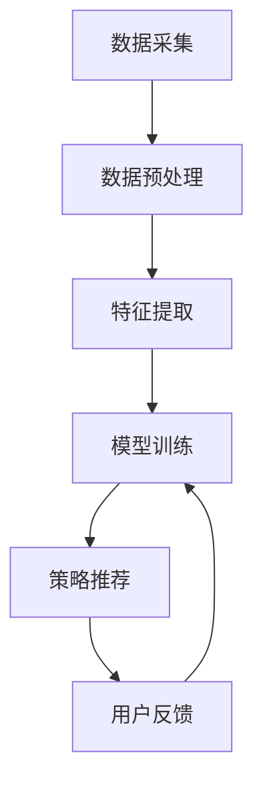
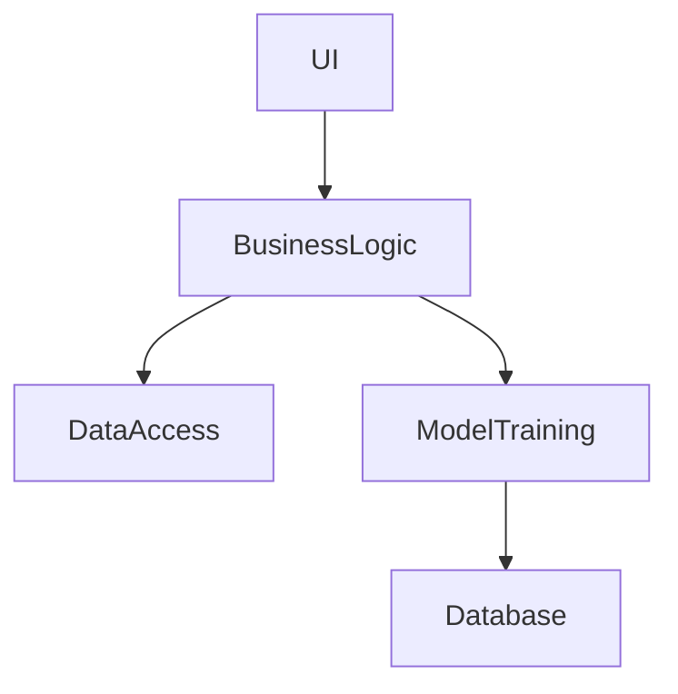

                 


# 构建智能化的个人税务筹划多场景模拟助手

> 关键词：智能化税务筹划、多场景模拟、AI算法、系统架构设计、税务优化策略

> 摘要：本文详细探讨了如何利用人工智能技术构建智能化的个人税务筹划多场景模拟助手。通过分析税务筹划的核心概念、算法原理、系统架构设计以及项目实战，展示了如何利用AI技术实现多场景下的税务优化策略推荐和风险评估。文章内容涵盖了从背景介绍到系统实现的全过程，旨在为读者提供一个全面的技术指导。

---

## 第1章: 智能化税务筹划助手的背景与问题描述

### 1.1 税务筹划的基本概念

#### 1.1.1 税务筹划的定义与核心目标
税务筹划是指通过合法合规的方式，优化个人或企业的税务负担，最大化经济利益。其核心目标在于降低税负、规避税务风险，并确保符合相关法律法规。

#### 1.1.2 税务筹划的法律边界与风险
税务筹划必须在法律允许的范围内进行，否则可能面临法律风险。常见的税务风险包括税务不合规、税务争议、罚款等。

#### 1.1.3 传统税务筹划的局限性
传统税务筹划依赖人工分析，效率低下且容易出错。此外，传统方法难以应对复杂多变的税务政策和多场景模拟需求。

### 1.2 智能化税务筹划的必要性

#### 1.2.1 数据驱动的税务分析优势
通过大数据分析，智能化税务筹划助手能够快速处理海量数据，发现潜在的税务优化机会。

#### 1.2.2 AI技术在税务筹划中的应用潜力
人工智能技术（如机器学习、自然语言处理）能够帮助税务筹划助手实现自动化、智能化的税务分析和优化。

#### 1.2.3 多场景模拟助手的用户需求
用户需要在不同场景下（如投资、购房、创业等）进行税务模拟，以找到最优的税务筹划方案。

### 1.3 多场景模拟助手的核心目标

#### 1.3.1 场景化税务筹划的需求分析
分析不同场景下的税务需求，例如：投资收益优化、房产税计算、企业税务规划等。

#### 1.3.2 助手功能的设计目标
实现税务数据采集、分析、预测、优化和推荐功能，帮助用户做出最优税务决策。

#### 1.3.3 边界与外延的定义
明确系统的功能边界，例如：不涉及具体税务申报，仅提供优化建议。

#### 1.4 核心概念与联系

##### 1.4.1 核心概念原理
智能化税务筹划助手通过数据采集、模型训练和用户交互，提供个性化的税务优化方案。

##### 1.4.2 核心概念属性特征对比表格
| 概念 | 描述 | 特性 |
|------|------|------|
| 数据采集 | 收集税务相关数据 | 高效性、准确性 |
| 模型训练 | 基于数据训练预测模型 | 可解释性、高精度 |
| 用户交互 | 提供用户友好的界面 | 易用性、实时性 |

##### 1.4.3 ER实体关系图架构的 Mermaid 流程图
```mermaid
erd
    股东 --> 投资收益
    股东 --> 收入支出
    股东 --> 税务政策
    投资收益 --> 税后收益
    收入支出 --> 净利润
    税务政策 --> 税率计算
```

---

## 第2章: 智能化税务筹划助手的核心算法与数学模型

### 2.1 税务数据预处理与特征提取

#### 2.1.1 数据清洗与标准化
对税务数据进行去重、缺失值处理、异常值剔除等操作，确保数据质量。

#### 2.1.2 特征选择与降维
通过特征重要性分析选择关键特征，并使用主成分分析（PCA）进行降维。

#### 2.1.3 数据增强技术
对数据进行归一化、标准化等处理，提升模型的泛化能力。

### 2.2 税务预测模型的构建

#### 2.2.1 线性回归模型
用于预测税务负担的变化趋势。

##### 数学公式
$$ y = \beta_0 + \beta_1 x + \epsilon $$

#### 2.2.2 支持向量机（SVM）模型
用于分类问题，如税务风险评估。

#### 2.2.3 随机森林与梯度提升树模型
用于复杂的非线性税务预测问题。

### 2.3 税务风险评估模型

#### 2.3.1 风险评分模型
基于特征的加权评分，评估税务风险等级。

#### 2.3.2 风险概率计算公式
$$ P(\text{风险}) = \frac{\text{高风险特征数}}{\text{总特征数}} $$

#### 2.3.3 风险评估的数学模型
使用逻辑回归模型进行风险概率预测：
$$ P(y=1) = \frac{1}{1 + e^{-\beta x}} $$

### 2.4 税务优化策略推荐算法

#### 2.4.1 基于聚类的策略推荐
将用户需求分为不同类别，推荐最优策略。

#### 2.4.2 基于强化学习的策略优化
通过强化学习不断优化税务策略，提升收益。

#### 2.4.3 策略推荐的数学公式
$$ \text{收益} = \sum_{i=1}^{n} (\text{收入}_i - \text{税负}_i) $$

### 2.5 算法实现的 Mermaid 流程图


---

## 第3章: 智能化税务筹划助手的系统架构设计

### 3.1 系统功能模块划分

#### 3.1.1 数据采集模块
负责收集用户的税务相关数据，如收入、支出、资产等。

#### 3.1.2 数据处理模块
对数据进行清洗、转换和增强处理。

#### 3.1.3 模型训练模块
基于处理后的数据训练预测模型，生成税务优化策略。

#### 3.1.4 用户交互模块
提供友好的用户界面，展示分析结果和优化建议。

### 3.2 系统架构设计

#### 3.2.1 分层架构设计
将系统划分为数据层、业务逻辑层和用户界面层，确保各层职责分离。

#### 3.2.2 系统架构的 Mermaid 图


---

## 第4章: 项目实战

### 4.1 环境安装与配置
安装Python、机器学习库（如scikit-learn、XGBoost）和数据处理工具（如Pandas、NumPy）。

### 4.2 核心代码实现

#### 4.2.1 数据预处理代码
```python
import pandas as pd
import numpy as np

# 数据加载
data = pd.read_csv('tax_data.csv')

# 数据清洗
data.dropna(inplace=True)
data = data.drop_duplicates()

# 特征提取
features = data[['收入', '支出', '资产']]
labels = data['税负']
```

#### 4.2.2 模型训练代码
```python
from sklearn.ensemble import RandomForestRegressor

model = RandomForestRegressor(n_estimators=100)
model.fit(features, labels)
```

#### 4.2.3 策略推荐代码
```python
def recommend_strategy(income, expense, assets):
    # 预测税负
    predicted_tax = model.predict([[income, expense, assets]])
    # 返回优化策略
    return "建议进行资产配置优化，预计税负为：{}%".format(predicted_tax[0])

print(recommend_strategy(100000, 50000, 500000))
```

### 4.3 案例分析
以一个年收入10万元的用户为例，模拟投资收益和税务优化策略。

---

## 第5章: 最佳实践与小结

### 5.1 最佳实践
- 数据清洗与特征选择是关键，确保模型的准确性。
- 定期更新模型，适应变化的税务政策。

### 5.2 小结
智能化税务筹划助手通过AI技术实现了多场景下的税务优化，为个人和企业提供了一种高效、准确的税务管理方式。

### 5.3 注意事项
- 确保数据的合法性和隐私性。
- 定期验证模型的准确性，避免过时。

### 5.4 拓展阅读
推荐阅读《机器学习实战》和《税务筹划实务指南》。

---

# 作者：AI天才研究院 & 禅与计算机程序设计艺术

---

通过以上结构，文章详细介绍了智能化税务筹划助手的背景、核心算法、系统架构以及项目实战，帮助读者全面理解如何构建这样一个系统。

