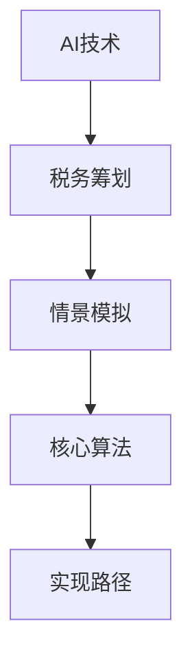

                 


# 构建智能化的个人税务筹划情景模拟助手

> 关键词：智能化、税务筹划、情景模拟、人工智能、机器学习

> 摘要：本文探讨如何利用人工智能技术构建一个智能化的个人税务筹划情景模拟助手，通过分析税务筹划的核心问题、提出基于机器学习和深度学习的解决方案，并结合实际案例进行详细讲解，帮助读者理解如何利用AI技术提升税务筹划的效率与准确性。

---

# 第一部分：背景介绍与核心概念

## 第1章：个人税务筹划情景模拟助手的背景与问题背景

### 1.1 问题背景

#### 1.1.1 个人税务筹划的复杂性与挑战

个人税务筹划是一个复杂的过程，涉及多个税种（如所得税、增值税、遗产税等）以及多种税收优惠政策。随着税收政策的不断变化和优化，个人需要面对的税务问题也日益复杂。传统的税务筹划方式主要依赖人工计算和经验判断，这种方式效率低、易出错，难以应对复杂多变的税收政策。

#### 1.1.2 传统税务筹划方式的局限性

- **信息不对称**：个人难以全面了解最新的税收政策和优惠政策。
- **计算复杂性**：不同税种的计算方式不同，手动计算容易出错。
- **缺乏个性化**：每个人的收入来源、资产配置和家庭状况不同，需要个性化的税务筹划方案。
- **效率低下**：传统方式需要大量手动计算和分析，效率低下。

#### 1.1.3 AI技术在税务筹划中的应用潜力

人工智能技术，特别是机器学习和深度学习，能够通过数据分析和模式识别，帮助个人快速制定最优的税务筹划方案。AI技术可以处理海量数据，提供个性化的建议，并实时更新税收政策的变化。

### 1.2 问题描述

#### 1.2.1 个人税务筹划的核心问题

个人税务筹划的核心问题在于如何在合法合规的前提下，最大限度地降低税负。这需要综合考虑多种因素，包括收入来源、资产配置、家庭状况、税收优惠政策等。

#### 1.2.2 税务筹划情景模拟的关键要素

税务筹划情景模拟的关键要素包括：
- 收入来源：工资、投资收益、租金收入等。
- 资产配置：房产、股票、银行存款等。
- 家庭状况：家庭成员数量、婚姻状况等。
- 税收政策：税率变化、优惠政策等。

#### 1.2.3 智能化助手的目标与功能定位

智能化的个人税务筹划情景模拟助手的目标是通过AI技术，帮助个人快速制定最优的税务筹划方案。其功能定位包括：
- 数据收集与分析：收集用户的收入、资产等信息，并分析税收政策。
- 情景模拟：根据不同的假设条件，模拟不同情景下的税负情况。
- 优化建议：基于模拟结果，提供个性化的优化建议。

### 1.3 问题解决

#### 1.3.1 AI技术如何辅助税务筹划

AI技术可以通过以下方式辅助税务筹划：
- **数据处理**：利用大数据技术，处理海量税收政策和用户数据。
- **模式识别**：通过机器学习算法，识别税收政策的变化规律。
- **智能推荐**：基于用户数据和税收政策，推荐最优的税务筹划方案。

#### 1.3.2 情景模拟的核心算法与实现

情景模拟的核心算法包括：
- 机器学习算法：用于分析税收政策和用户数据。
- 深度学习算法：用于预测税收政策的变化趋势。

#### 1.3.3 智能化助手的实现路径

智能化助手的实现路径包括：
1. 数据收集与预处理。
2. 税收政策分析与建模。
3. 用户数据输入与情景模拟。
4. 优化建议生成与输出。

### 1.4 边界与外延

#### 1.4.1 系统的边界定义

系统的边界定义为：
- 输入：用户的收入、资产、家庭状况等数据。
- 输出：最优的税务筹划方案。

#### 1.4.2 系统的外延与扩展

系统的外延与扩展包括：
- 支持更多税种和税收优惠政策。
- 提供更多的优化建议类型。
- 实现实时数据更新。

#### 1.4.3 辅助工具的功能范围

辅助工具的功能范围包括：
- 数据输入与管理。
- 情景模拟与分析。
- 优化建议生成。

### 1.5 核心概念与联系

#### 1.5.1 核心概念原理

核心概念原理包括：
- 数据驱动的税务分析。
- 机器学习算法的应用。
- 智能化辅助决策。

#### 1.5.2 核心概念属性特征对比表格

| 核心概念 | 属性 | 特征 |
|----------|------|------|
| 数据驱动 | 数据来源 | 用户数据、税收政策数据 |
| 机器学习 | 算法类型 | 决策树、随机森林 |
| 智能化辅助 | 功能 | 数据分析、情景模拟、优化建议 |

#### 1.5.3 ER实体关系图架构

```mermaid
erd
    客户
        id: int
        收入: float
        资产: float
        家庭状况: string
    税收政策
        税种: string
        税率: float
        优惠政策: string
```

---

# 第二部分：核心概念与联系

## 第2章：AI技术与税务筹划的核心概念

### 2.1 AI技术在税务筹划中的应用

#### 2.1.1 机器学习在税务预测中的应用

机器学习在税务预测中的应用包括：
- 税收预测：基于历史数据，预测未来的税收情况。
- 税务风险评估：通过机器学习模型，评估税务筹划方案的合规性。

#### 2.1.2 自然语言处理在税务文档分析中的应用

自然语言处理在税务文档分析中的应用包括：
- 税收政策解析：自动解析税收政策文件，提取关键信息。
- 文本分类：分类税收政策的类型和适用范围。

#### 2.1.3 深度学习在税务模拟中的应用

深度学习在税务模拟中的应用包括：
- 时间序列预测：预测税收政策的变化趋势。
- 图像识别：识别税务文档中的关键信息。

### 2.2 税务筹划情景模拟的核心算法

#### 2.2.1 机器学习算法在税务模拟中的应用

机器学习算法在税务模拟中的应用包括：
- 决策树：用于分类税收政策的类型。
- 随机森林：用于预测税收政策的变化趋势。
- 支持向量机：用于税收风险评估。

#### 2.2.2 深度学习算法在税务模拟中的应用

深度学习算法在税务模拟中的应用包括：
- 神经网络：用于税收预测。
- 卷积神经网络：用于图像识别。
- 循环神经网络：用于时间序列预测。

#### 2.2.3 混合算法在税务模拟中的应用

混合算法在税务模拟中的应用包括：
- 结合机器学习和深度学习算法，提高预测精度。
- 组合不同算法，优化税收政策分析。

### 2.3 核心概念与联系的Mermaid流程图



---

# 第三部分：算法原理讲解

## 第3章：机器学习与深度学习算法原理

### 3.1 机器学习算法

#### 3.1.1 决策树算法

**决策树算法**是一种基于树状结构的分类算法，适用于处理数据中的分类问题。

- **优势**：
  - 易于理解和解释。
  - 适用于小规模数据集。
  
- **劣势**：
  - 对噪声数据敏感。
  - 易于过拟合。

**决策树的熵公式**：
$$
\text{熵} = -\sum p_i \log_2 p_i
$$

**决策树的Python代码实现**：
```python
from sklearn.tree import DecisionTreeClassifier
model = DecisionTreeClassifier()
model.fit(X, y)
```

#### 3.1.2 随机森林算法

**随机森林算法**是一种基于决策树的集成学习算法，通过构建多棵决策树并取其平均，提高模型的准确性和鲁棒性。

- **优势**：
  - 抗过拟合能力强。
  - 适用于大规模数据集。
  
- **劣势**：
  - 计算复杂度高。

**随机森林的Python代码实现**：
```python
from sklearn.ensemble import RandomForestClassifier
model = RandomForestClassifier(n_estimators=100)
model.fit(X, y)
```

#### 3.1.3 支持向量机算法

**支持向量机算法**是一种基于几何的分类算法，适用于高维数据集。

- **优势**：
  - 分类精度高。
  - 适用于高维数据。
  
- **劣势**：
  - 参数选择敏感。
  - 不适用于大规模数据集。

**支持向量机的Python代码实现**：
```python
from sklearn.svm import SVC
model = SVC(kernel='rb

