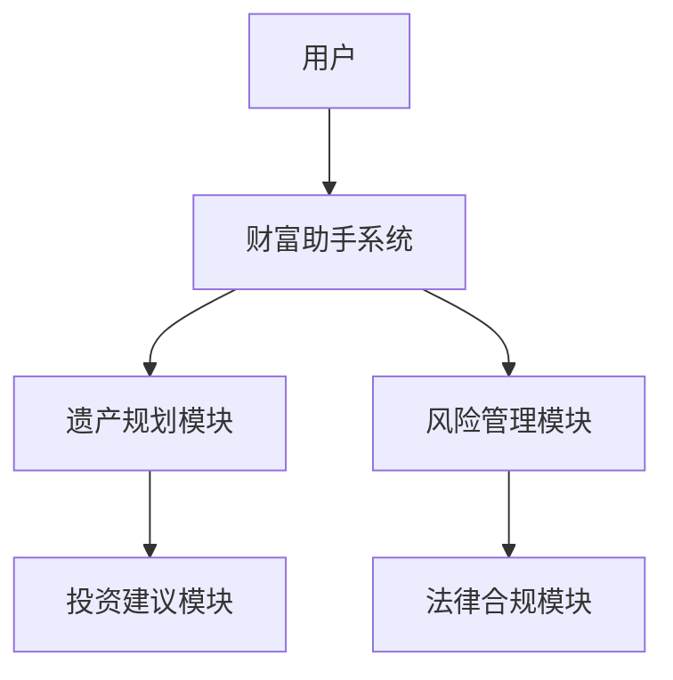
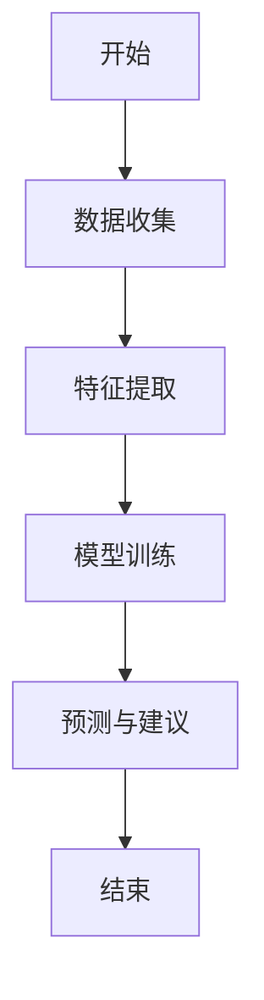
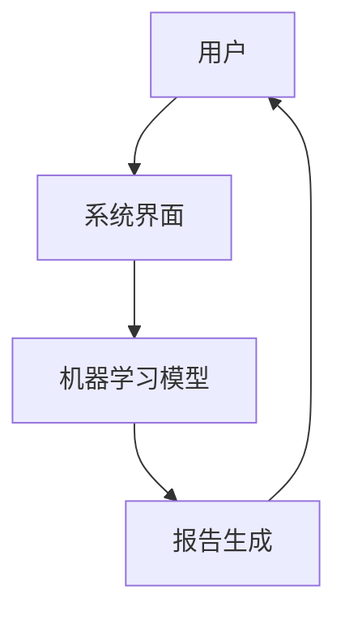

                 


# 构建智能化的个人财富传承规划助手

## 关键词：人工智能, 财富传承, 智能助手, 机器学习, 大数据分析

## 摘要：智能化的个人财富传承规划助手利用人工智能和大数据分析技术，为用户提供个性化的财富传承建议。通过机器学习模型和自然语言处理，系统能够分析用户资产、风险偏好等信息，制定最佳传承策略，帮助用户实现财富的高效、安全传承。

## 目录

### 第1章：智能化财富传承规划的背景

#### 1.1 问题背景与描述
- 1.1.1 传统财富传承的挑战
- 1.1.2 数字化与智能化的兴起
- 1.1.3 个人财富传承的智能化需求

#### 1.2 问题解决与技术应用
- 1.2.1 AI在财富管理中的应用
- 1.2.2 大数据与财富传承的结合
- 1.2.3 智能化助手的优势

#### 1.3 概念结构与核心要素
- 1.3.1 核心概念：财富传承助手
- 1.3.2 边界与外延
- 1.3.3 核心要素分析

### 第2章：AI在财富传承中的核心应用

#### 2.1 AI技术原理
- 2.1.1 机器学习模型简介
- 2.1.2 深度学习在财富预测中的应用
- 2.1.3 自然语言处理在遗产规划中的作用

#### 2.2 核心概念对比表
- AI模型与传统模型对比
- 数据分析方法对比
- 系统架构对比

#### 2.3 实体关系图


### 第3章：财富传承规划算法

#### 3.1 算法流程


#### 3.2 代码实现
```python
# 示例代码
import numpy as np
from sklearn import linear_model

# 数据准备
X = np.array([[1], [2], [3], ...])
y = np.array([2, 4, 6, ...])

# 模型训练
model = linear_model.LinearRegression()
model.fit(X, y)

# 预测
new_data = np.array([[4]])
print(model.predict(new_data))
```

#### 3.3 数学模型
财富传承模型可以表示为：
$$
y = \beta_0 + \beta_1x_1 + \beta_2x_2 + \epsilon
$$
其中，y是目标变量，x1和x2是特征变量，β表示回归系数。

### 第4章：系统分析与架构设计

#### 4.1 问题场景
用户通过系统输入资产、家庭结构等信息，系统生成传承计划。

#### 4.2 系统功能设计
- 用户界面：收集用户信息
- 后台处理：运行AI模型
- 报告生成：输出传承建议

#### 4.3 系统架构图


### 第5章：项目实战

#### 5.1 环境安装
安装Python、机器学习库（如scikit-learn）。

#### 5.2 核心代码实现
```python
from sklearn.ensemble import RandomForestClassifier
import pandas as pd

# 加载数据
data = pd.read_csv('wealth_data.csv')

# 特征工程
features = data[['age', 'income', 'assets']]
labels = data['risk']

# 训练模型
model = RandomForestClassifier()
model.fit(features, labels)

# 预测
new_case = [[30, 100000, 500000]]
print(model.predict(new_case))
```

#### 5.3 案例分析
通过实际案例展示系统如何为用户制定传承计划。

### 第6章：最佳实践与总结

#### 6.1 最佳实践
- 数据隐私保护
- 模型持续优化

#### 6.2 小结
总结系统设计和实现的关键点。

#### 6.3 注意事项
- 数据安全
- 模型更新

#### 6.4 拓展阅读
推荐相关技术书籍和资源。

## 作者：AI天才研究院/AI Genius Institute & 禅与计算机程序设计艺术 /Zen And The Art of Computer Programming

