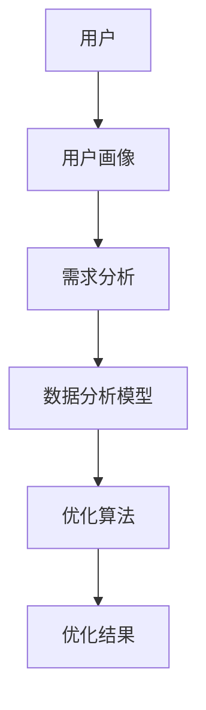
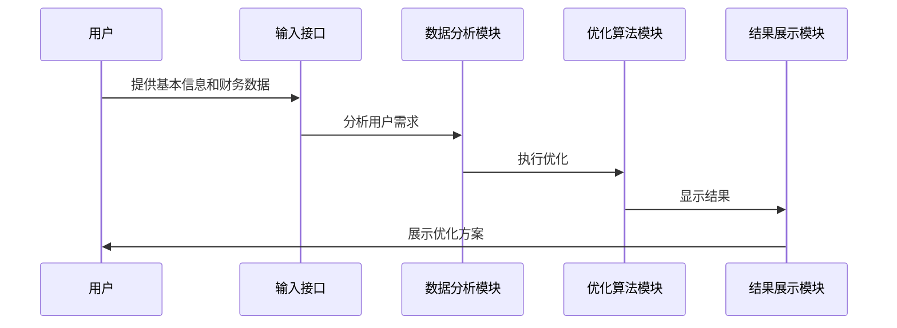

                 


# 构建智能化的个人退休规划优化助手

> 关键词：退休规划、人工智能、数据驱动、优化算法、系统架构

> 摘要：本文旨在探讨如何利用人工智能和数据驱动的方法构建一个智能化的个人退休规划优化助手。通过分析退休规划的核心要素、构建用户画像、设计数据分析模型和优化算法，结合系统架构设计和项目实战，本文详细阐述了如何实现一个高效、智能的退休规划优化系统。

---

## 第一章：背景介绍

### 1.1 问题背景

#### 1.1.1 人口老龄化与退休规划的重要性
随着全球人口老龄化的加剧，个人退休规划的重要性日益凸显。如何在有限的资源下实现最优的退休生活，成为许多人关注的焦点。

#### 1.1.2 当前退休规划的主要问题
传统的退休规划方法依赖于简单的财务计算，缺乏对复杂市场环境和个体需求变化的适应性。此外，用户的需求多样且动态变化，传统方法难以满足个性化需求。

#### 1.1.3 智能化退休规划的必要性
人工智能和大数据技术的发展为退休规划提供了新的可能性。通过智能化的方法，可以实时分析市场变化和用户需求，提供个性化的优化方案。

### 1.2 问题描述

#### 1.2.1 退休规划的核心要素
退休规划涉及资金需求、投资回报、通货膨胀、寿命预测等多个因素，需要综合考虑。

#### 1.2.2 用户需求的多样性
不同用户的收入、支出、风险承受能力各不相同，退休规划需要根据个体情况量身定制。

#### 1.2.3 数据驱动的退休规划优势
通过收集和分析大量数据，可以更准确地预测市场趋势和用户需求，从而制定更科学的规划。

### 1.3 问题解决

#### 1.3.1 数据分析与预测在退休规划中的应用
利用历史数据和机器学习模型，预测未来的市场走势和通货膨胀率，为规划提供数据支持。

#### 1.3.2 智能算法在退休规划优化中的作用
通过优化算法，寻找最优的投资组合和消费计划，最大化用户的退休生活质量。

#### 1.3.3 多目标优化的实现路径
在满足基本生活需求的前提下，平衡风险和收益，实现资产的最优配置。

### 1.4 边界与外延

#### 1.4.1 退休规划的边界条件
包括资金限制、时间范围、风险承受能力等。

#### 1.4.2 相关领域的外延
涉及金融、保险、税务等多个领域，需要综合考虑。

#### 1.4.3 边界条件对优化的影响
边界条件限制了优化的范围，但合理设定边界条件可以提高规划的可行性。

### 1.5 核心要素组成

#### 1.5.1 用户画像与需求分析
通过问卷调查和数据分析，构建用户的财务状况、风险偏好等画像。

#### 1.5.2 财务数据与市场环境
包括当前资产、收入支出、市场利率、通货膨胀率等数据。

#### 1.5.3 优化目标与约束条件
目标是最大化退休收入，约束条件包括资金限制、风险承受能力等。

---

## 第二章：核心概念与联系

### 2.1 用户画像与需求分析

#### 2.1.1 用户画像的构建
通过收集用户的基本信息、财务状况、风险偏好等，构建用户画像。

#### 2.1.2 需求分析的方法
利用数据分析技术，识别用户的隐性需求，如对安全感的需求等。

#### 2.1.3 用户画像与需求分析的关系
用户画像是需求分析的基础，需求分析指导画像的优化。

### 2.2 数据分析模型

#### 2.2.1 数据分析模型的分类
包括回归分析、聚类分析、时间序列分析等。

#### 2.2.2 数据分析模型的构建
基于历史数据，选择合适的模型进行预测和分类。

#### 2.2.3 数据分析模型的应用
用于市场预测、需求分析和风险评估。

### 2.3 优化算法

#### 2.3.1 优化算法的分类
包括线性规划、动态规划、遗传算法等。

#### 2.3.2 优化算法的原理
通过迭代和搜索，找到问题的最优解。

#### 2.3.3 优化算法的实现
结合具体问题，选择合适的算法并实现。

## 第3章: 核心概念对比分析

### 3.1 核心概念属性特征对比

| 核心概念 | 属性 | 特征 |
|----------|------|------|
| 用户画像 | 数据来源 | 调查问卷、历史数据 |
| 需求分析 | 方法 | 定量分析、定性分析 |
| 数据分析模型 | 类型 | 回归、聚类、时间序列 |
| 优化算法 | 分类 | 线性规划、遗传算法 |

### 3.2 Mermaid流程图



---

## 第三章: 算法原理讲解

### 5.1 遗传算法

#### 5.1.1 遗传算法的原理
遗传算法模拟自然选择的过程，通过变异、交叉和选择操作，逐步优化解。

#### 5.1.2 遗传算法的实现步骤
1. 初始化种群。
2. 计算适应度。
3. 选择父代。
4. 交叉和变异。
5. 生成新种群。
6. 重复直到收敛。

#### 5.1.3 遗传算法的优缺点
优点：全局搜索能力强。缺点：收敛速度慢，参数设置敏感。

### 5.2 模拟退火算法

#### 5.2.1 模拟退火算法的原理
模拟退火算法通过模拟金属退火的过程，逐步降低温度，找到全局最优解。

#### 5.2.2 模拟退火算法的实现步骤
1. 初始化当前解。
2. 计算目标函数。
3. 随机选择下一个解。
4. 根据温度接受或拒绝解。
5. 降温。
6. 重复直到收敛。

#### 5.2.3 模拟退火算法的优缺点
优点：可以跳出局部最优。缺点：计算复杂度高。

---

## 第四章: 系统分析与架构设计

### 4.1 问题场景介绍

#### 4.1.1 问题场景
构建一个智能化的个人退休规划优化助手，帮助用户制定个性化的退休计划。

### 4.2 系统功能设计

#### 4.2.1 领域模型图


### 4.3 系统架构设计


### 4.4 系统接口设计

#### 4.4.1 接口描述
- 输入接口：用户输入基本信息和财务数据。
- 输出接口：展示优化结果和建议。

#### 4.4.2 接口交互流程图


---

## 第五章: 项目实战

### 5.1 环境安装

#### 5.1.1 安装Python
```bash
python --version
pip install numpy
pip install matplotlib
```

### 5.2 系统核心实现源代码

#### 5.2.1 遗传算法实现
```python
import random

def fitness(x):
    return -x**2 + 4*x

def mutate(x):
    return x + random.gauss(0, 1)

def crossover(x, y):
    return (x + y)/2

def genetic_algorithm(pop_size, iters):
    population = [random.uniform(0,4) for _ in range(pop_size)]
    best = min(population, key=fitness)
    for _ in range(iters):
        new_population = []
        for _ in range(pop_size):
            parent1 = random.choice(population)
            parent2 = random.choice(population)
            child = crossover(parent1, parent2)
            child = mutate(child)
            new_population.append(child)
        population = new_population
        best = min(population, key=fitness)
    return best

print(genetic_algorithm(10, 10))
```

#### 5.2.2 模拟退火算法实现
```python
import math

def objective(x):
    return -x**2 + 4*x

def neighbor(x):
    return x + random.gauss(0, 0.5)

def simulated_annealing(T=1000, cooling=0.99):
    current = random.uniform(0,4)
    best = current
    for i in range(T):
        T_current = T * (1 - i/T)
        candidate = neighbor(current)
        if objective(candidate) > objective(current):
            current = candidate
            if objective(candidate) > objective(best):
                best = candidate
    return best

print(simulated_annealing())
```

### 5.3 代码应用解读与分析

#### 5.3.1 遗传算法应用
上述代码实现了简单的遗传算法，用于最大化目标函数。通过多次迭代，逐步优化解。

#### 5.3.2 模拟退火算法应用
模拟退火算法用于避免陷入局部最优，通过降温过程，逐步找到全局最优解。

### 5.4 实际案例分析

#### 5.4.1 案例背景
用户A，35岁，年收入10万，现有资产50万，希望在退休时实现资产最大化。

#### 5.4.2 数据分析与优化
通过数据分析模型预测市场趋势，利用遗传算法优化投资组合。

#### 5.4.3 结果展示
最终优化方案：投资组合配置为60%股票、30%债券、10%现金，每年调整一次。

### 5.5 项目小结

#### 5.5.1 项目成果
成功构建了一个智能化的退休规划优化助手，能够根据用户需求和市场环境，提供个性化的优化方案。

#### 5.5.2 项目经验
- 数据分析模型的选择和优化至关重要。
- 优化算法的参数设置影响结果，需要多次试验。

---

## 第六章: 最佳实践

### 6.1 最佳实践 Tips

#### 6.1.1 数据采集与处理
确保数据的准确性和完整性，避免偏差。

#### 6.1.2 模型选择与优化
根据具体情况选择合适的模型，并不断优化。

#### 6.1.3 算法调优
通过参数调整和模型优化，提高算法性能。

### 6.2 小结

通过智能化的方法，可以显著提高退休规划的效率和准确性。本文详细介绍了构建智能化退休规划助手的各个方面，包括核心概念、算法原理和系统架构设计。

### 6.3 注意事项

- 确保数据隐私和安全。
- 定期更新模型和算法，以适应市场变化。
- 提供清晰的解释和建议，帮助用户理解结果。

### 6.4 拓展阅读

- 遗传算法在金融领域的应用。
- 时间序列分析在市场预测中的应用。
- 多目标优化在投资组合中的应用。

---

## 作者

作者：AI天才研究院 & 禅与计算机程序设计艺术

