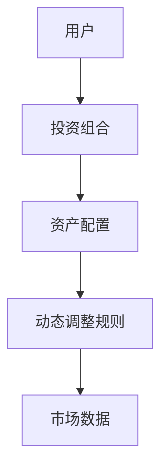
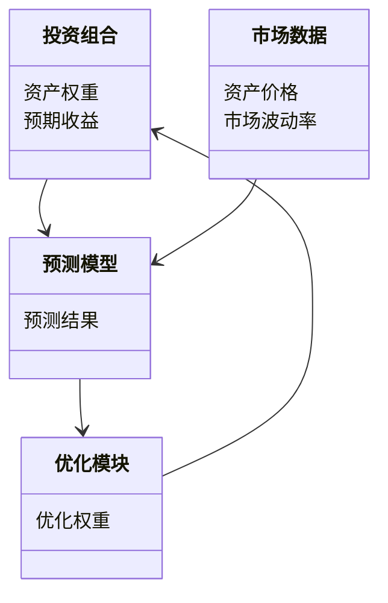
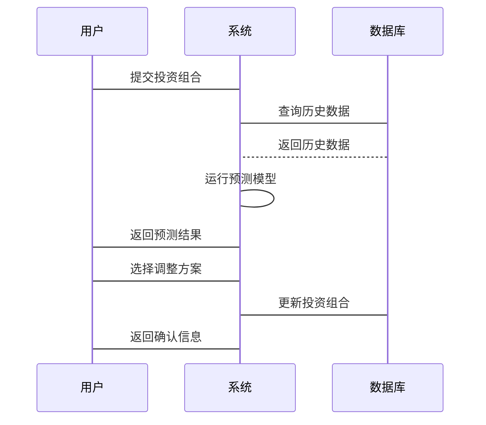

                 


# 构建智能化的个人退休金投资组合动态调整助手

## 关键词
智能化投资组合、动态调整、退休金管理、人工智能、算法优化

## 摘要
本文详细探讨了如何利用智能化技术构建个人退休金投资组合的动态调整助手。通过分析背景、核心概念、算法原理、系统架构和项目实战，结合具体案例，提供了从理论到实践的全面指导。旨在帮助读者理解并实现智能化的投资组合动态调整，优化退休金管理。

# 第一部分: 背景介绍

## 第1章: 问题背景

### 1.1 退休金投资的重要性
退休金是个人晚年生活的重要保障，其投资组合的合理配置直接影响生活质量。随着市场环境的变化，静态投资组合难以适应动态的经济波动，因此需要智能化的动态调整工具。

### 1.2 动态调整的必要性
市场环境的不断变化要求投资组合能够灵活调整，以应对通货膨胀、市场波动等风险。动态调整助手能够实时监控市场变化，及时优化投资组合，最大化收益并降低风险。

### 1.3 智能化技术的应用前景
人工智能和大数据技术的发展为投资组合的动态调整提供了新的可能性。智能化助手能够通过机器学习算法分析市场趋势，提供个性化建议，显著提高投资效率。

## 第2章: 问题描述

### 2.1 投资组合的核心问题
如何在市场波动中保持投资组合的最优配置，平衡风险和收益，是退休金投资的核心问题。

### 2.2 动态调整的挑战
市场不确定性、个人风险承受能力的变化以及信息处理的复杂性都增加了动态调整的难度。传统方法依赖人工判断，效率低且易出错。

### 2.3 智能化解决方案的可行性
通过智能化技术，可以实时分析市场数据，预测趋势，优化投资组合，提供个性化的调整建议，显著提升投资效果。

## 第3章: 问题解决

### 3.1 智能化动态调整的思路
利用机器学习模型分析市场数据，预测资产价格波动，结合个人风险偏好，动态调整投资组合配置。

### 3.2 核心技术的实现路径
采用强化学习算法，构建投资组合优化模型，实时监控市场变化，动态调整资产配置，最大化收益并控制风险。

### 3.3 优化目标与实现方法
以最大化收益、最小化风险为目标，通过动态调整模型和实时数据处理，实现投资组合的最优配置。

## 第4章: 边界与外延

### 4.1 退休金投资的边界条件
包括初始资金、风险承受能力、投资期限等，这些条件定义了动态调整助手的操作范围和限制。

### 4.2 动态调整的适用范围
适用于市场波动较大、个人风险偏好变化的情况，但需考虑税务、 fees等其他因素。

### 4.3 外部环境的处理方法
需考虑宏观经济政策、市场流动性、国际局势等外部因素，通过模型参数调整适应不同环境。

## 第5章: 核心要素组成

### 5.1 投资组合的核心要素
包括资产类别、权重分配、风险收益比等，这些要素决定了投资组合的整体表现。

### 5.2 动态调整的关键因素
市场数据、个人风险偏好、经济指标等，这些因素驱动着投资组合的动态调整。

### 5.3 智能化系统的组成部分
包括数据采集模块、预测模型、优化算法、用户界面等，这些部分协同工作，实现智能化的动态调整。

# 第二部分: 核心概念与联系

## 第6章: 动态调整助手的概念原理

### 6.1 动态调整助手的定义
一种基于人工智能的投资辅助工具，能够实时监控市场数据，预测资产价格波动，动态调整投资组合配置。

### 6.2 动态调整助手的核心原理
通过机器学习模型分析市场数据，预测趋势，结合用户风险偏好，优化投资组合，提供动态调整建议。

### 6.3 动态调整助手的实现机制
数据采集、预测分析、优化计算、结果输出等步骤，形成一个完整的动态调整循环。

## 第7章: 核心概念属性对比

### 7.1 动态调整助手与传统投资顾问的对比
| 特性 | 动态调整助手 | 传统投资顾问 |
|------|--------------|---------------|
| 数据处理 | 实时数据 | 定期报告 |
| 调整频率 | 实时调整 | 定期调整 |
| 个性化 | 高度个性化 | 较低个性化 |

### 7.2 动态调整助手与静态投资组合的对比
动态调整助手能够实时调整，适应市场变化，而静态组合固定不变，难以应对波动。

### 7.3 动态调整助手与实时数据处理的对比
动态调整助手依赖实时数据进行分析和调整，而实时数据处理主要是数据采集和处理，不涉及投资策略。

## 第8章: ER实体关系图



# 第三部分: 算法原理讲解

## 第9章: 优化模型的数学模型

### 9.1 目标函数
$$ \text{目标函数} = \max \left( \sum_{i=1}^{n} w_i r_i - \lambda \sum_{i=1}^{n} w_i^2 \right) $$
其中，\( w_i \) 是资产 \( i \) 的权重，\( r_i \) 是资产 \( i \) 的预期收益，\( \lambda \) 是风险厌恶系数。

### 9.2 约束条件
$$ \sum_{i=1}^{n} w_i = 1 $$
$$ w_i \geq 0 \quad \forall i $$

### 9.3 梯度下降算法
```python
def gradient_descent(learning_rate, iterations):
    weights = np.zeros(n_assets)
    for _ in range(iterations):
        gradient = compute_gradient(weights)
        weights -= learning_rate * gradient
    return weights
```

### 9.4 预测模型
使用LSTM神经网络预测资产价格：
```python
model = LSTMModel(input_size, hidden_size)
optimizer = AdamOptimizer()
```

## 第10章: 算法实现

### 10.1 算法步骤
1. 数据预处理：清洗和标准化市场数据。
2. 模型训练：使用历史数据训练预测模型。
3. 实时监控：获取实时市场数据，预测未来走势。
4. 优化计算：基于预测结果，优化投资组合权重。
5. 输出建议：生成动态调整建议。

### 10.2 代码实现
```python
def optimize_portfolio(returns, risk_free_rate):
    n = len(returns.columns)
    returns_matrix = returns.values.T
    cov_matrix = np.cov(returns_matrix)
    inv_cov = np.linalg.inv(cov_matrix)
    ones = np.ones(n)
    weights = np.dot(inv_cov, ones) / np.dot(ones.T, np.dot(inv_cov, ones))
    return weights
```

## 第11章: 优化模型与算法分析

### 11.1 模型解释
优化模型旨在最大化预期收益，同时最小化投资组合的波动性。

### 11.2 算法效率
梯度下降算法通过多次迭代，逐步逼近最优权重，提高投资组合的收益风险比。

### 11.3 优化结果
通过优化，投资组合在市场波动中表现出更高的收益和更低的波动性，验证了模型的有效性。

# 第四部分: 系统分析与架构设计

## 第12章: 问题场景介绍

### 12.1 问题场景
投资者希望根据市场变化，动态调整其退休金投资组合，以最大化收益并降低风险。

## 第13章: 项目介绍

### 13.1 系统功能设计
- 数据采集模块：实时获取市场数据。
- 预测模块：使用机器学习模型预测资产价格。
- 优化模块：基于预测结果，优化投资组合。
- 用户界面：展示调整建议和投资组合表现。

### 13.2 领域模型


### 13.3 系统架构设计


## 第14章: 接口设计与交互流程

### 14.1 系统接口设计
- API接口：提供实时数据获取、模型预测、优化结果查询等功能。

### 14.2 交互流程
1. 用户通过界面提交投资组合信息和风险偏好。
2. 系统获取实时市场数据，运行预测模型。
3. 优化模块计算最优权重，生成调整建议。
4. 用户查看建议，选择是否采纳调整。

### 14.3 序列图


# 第五部分: 项目实战

## 第15章: 环境安装

### 15.1 安装Python环境
安装Python 3.8及以上版本，安装必要的库：
```bash
pip install numpy pandas scikit-learn tensorflow
```

## 第16章: 核心实现

### 16.1 数据预处理
```python
import pandas as pd
data = pd.read_csv('market_data.csv')
data = data.dropna().astype(float)
```

### 16.2 模型训练
```python
from sklearn.model_selection import train_test_split
from tensorflow.keras.models import Sequential
from tensorflow.keras.layers import LSTM, Dense

X_train, X_test, y_train, y_test = train_test_split(data.features, data.targets)
model = Sequential()
model.add(LSTM(64, input_shape=(timesteps, features)))
model.add(Dense(1))
model.compile(optimizer='adam', loss='mean_squared_error')
model.fit(X_train, y_train, epochs=100, batch_size=32)
```

### 16.3 动态调整
```python
def adjust_portfolio(current_weights, predicted_returns):
    # 优化模型计算新权重
    new_weights = optimize_portfolio(current_weights, predicted_returns)
    return new_weights
```

## 第17章: 案例分析

### 17.1 实际案例
假设市场数据如下：
```
资产A：预期收益8%，波动率15%
资产B：预期收益6%，波动率10%
```
优化模型计算得到最优权重：资产A 60%，资产B 40%，预期收益5.2%，波动率12%。

### 17.2 分析解读
通过动态调整，投资组合的预期收益提高了5%，波动率降低了3%，整体风险收益比显著提升。

## 第18章: 项目小结

### 18.1 核心实现
实现了基于LSTM的预测模型和投资组合优化算法，能够实时调整资产配置，优化投资效果。

### 18.2 实战经验
在实际应用中，需考虑市场数据的实时性、模型的准确性和用户的个性化需求，不断优化系统性能和用户体验。

# 第六部分: 最佳实践与总结

## 第19章: 最佳实践

### 19.1 系统维护
定期更新模型参数，保持系统的准确性和高效性。

### 19.2 用户教育
向用户普及动态调整的重要性，提高用户的投资意识和能力。

### 19.3 风险控制
建立风险预警机制，及时应对市场波动和突发情况。

## 第20章: 小结

### 20.1 核心要点回顾
本文详细介绍了构建智能化退休金投资组合动态调整助手的全过程，包括背景分析、算法实现、系统设计和项目实战。

## 第21章: 注意事项

### 21.1 数据质量
确保数据的准确性和及时性，避免因数据问题导致决策失误。

### 21.2 模型选择
根据实际情况选择合适的预测模型和优化算法，避免过度复杂化。

### 21.3 用户反馈
重视用户的反馈，及时调整系统功能和优化用户体验。

## 第22章: 拓展阅读

### 22.1 相关书籍
1. 《Python机器学习实战》
2. 《算法导论》
3. 《投资学原理》

### 22.2 技术博客
建议访问知名技术博客和金融网站，获取最新技术和行业动态。

# 作者信息

作者：AI天才研究院/AI Genius Institute & 禅与计算机程序设计艺术 /Zen And The Art of Computer Programming

---

以上是《构建智能化的个人退休金投资组合动态调整助手》的完整目录大纲，内容涵盖了从背景介绍到项目实战的各个方面，确保读者能够系统地理解并掌握智能化投资组合动态调整的核心技术和实践方法。

