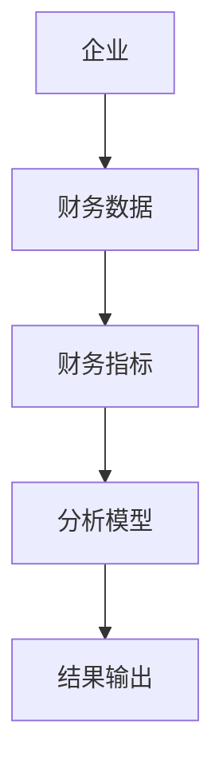
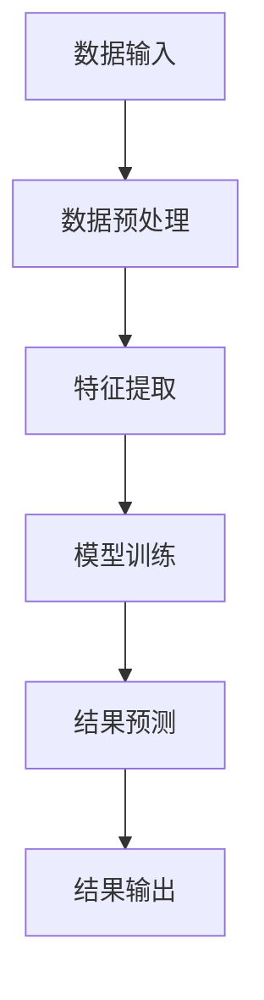
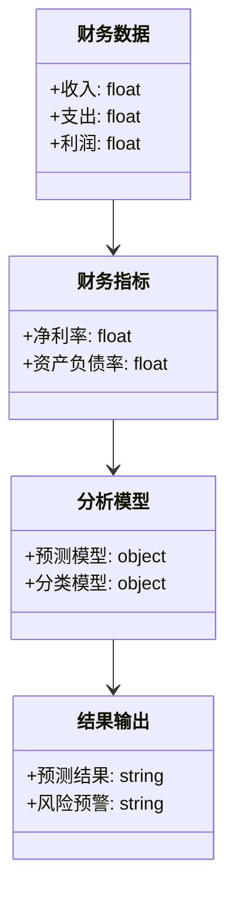

                 


# 构建智能化的企业财务分析系统

## 关键词：智能化财务分析、人工智能、大数据、机器学习、深度学习、企业财务管理

## 摘要：  
随着企业规模的不断扩大和市场竞争的加剧，传统的企业财务分析方法逐渐暴露出效率低下、数据处理能力有限等缺陷。为了提高企业财务管理的效率和准确性，智能化企业财务分析系统应运而生。本文将从背景、核心概念、算法原理、系统架构、项目实战、优化与总结等方面，详细探讨如何构建一个高效、智能的企业财务分析系统。通过本文的分析，读者可以全面了解智能化财务分析系统的核心技术与实现方法，为企业财务管理的智能化转型提供参考。

---

# 第1章: 企业财务分析智能化的背景与需求

## 1.1 传统企业财务分析的局限性

### 1.1.1 传统财务分析的流程与特点  
传统企业财务分析通常依赖人工操作，流程繁琐且耗时较长。常见的分析方法包括比率分析、趋势分析和结构分析等，这些方法需要财务人员手动收集数据、计算指标并进行人工判断。这种方式不仅效率低下，还容易受到主观因素的影响，导致分析结果的偏差。

### 1.1.2 传统财务分析的痛点与挑战  
随着企业数据量的爆炸式增长，传统财务分析方法难以应对以下挑战：  
1. **数据处理能力有限**：传统方法难以处理海量数据，且数据来源分散，难以统一管理。  
2. **分析效率低下**：人工分析耗时长，难以满足企业对实时分析的需求。  
3. **结果的主观性**：分析结果依赖于财务人员的经验，缺乏客观性和准确性。  
4. **难以预测和洞察**：传统方法难以发现数据背后的趋势和潜在问题。

### 1.1.3 智能化财务分析的必要性  
智能化财务分析通过引入人工智能（AI）、大数据和机器学习等技术，能够快速处理海量数据，发现隐藏的规律，提供更精准的分析结果。这种智能化的分析方式不仅能够提高效率，还能帮助企业做出更明智的财务决策。

---

## 1.2 智能化财务分析的核心概念

### 1.2.1 数据驱动的财务分析  
智能化财务分析的核心是数据。通过收集和处理企业的财务数据、业务数据和外部市场数据，系统能够从多维度对企业的财务状况进行分析，发现潜在的风险和机会。

### 1.2.2 人工智能在财务分析中的应用  
人工智能技术（如机器学习和深度学习）能够自动学习财务数据的特征，并通过模型预测企业的财务状况。例如，使用自然语言处理（NLP）技术可以从财务报告中提取关键信息，利用分类算法对企业的财务健康状况进行评估。

### 1.2.3 大数据技术对财务分析的支撑  
大数据技术能够帮助企业整合来自不同来源的海量数据，包括结构化数据（如财务报表）和非结构化数据（如社交媒体评论）。通过对这些数据的处理和分析，系统可以提供更全面的财务洞察。

---

## 1.3 智能化财务分析的场景与价值

### 1.3.1 企业内部财务管理的智能化  
智能化财务分析可以用于企业的内部财务管理，例如：  
1. **自动化的财务报表分析**：通过系统自动计算和生成财务报表，减少人工操作。  
2. **风险预警**：利用模型预测财务风险，提前采取应对措施。  
3. **成本优化**：通过分析成本数据，找到成本浪费点，优化资源配置。

### 1.3.2 企业外部财务服务的智能化  
智能化财务分析还可以为企业提供外部财务服务，例如：  
1. **市场分析**：分析行业趋势和竞争对手的财务数据，为企业提供战略建议。  
2. **信用评估**：通过分析企业的财务数据，评估其信用风险。  
3. **投资决策支持**：为企业投资决策提供数据支持。

### 1.3.3 智能化财务分析的经济效益与社会效益  
1. **经济效益**：提高财务分析效率，降低成本，增强企业的竞争力。  
2. **社会效益**：通过智能化分析，企业可以更好地应对经济波动，促进经济的稳定发展。

---

## 1.4 本章小结  
本章从传统财务分析的局限性出发，阐述了智能化财务分析的必要性，并详细介绍了智能化财务分析的核心概念和应用场景。通过智能化技术，企业能够更高效地处理财务数据，做出更精准的财务决策，从而在激烈的市场竞争中占据优势。

---

# 第2章: 企业财务分析智能化的核心概念与联系

## 2.1 核心概念原理

### 2.1.1 数据预处理与特征提取  
在智能化财务分析中，数据预处理是关键步骤。通过清洗、归一化和特征提取，可以将原始数据转化为适合模型输入的形式。例如，使用主成分分析（PCA）进行特征降维，减少数据的维度，提高模型的训练效率。

### 2.1.2 智能化分析模型的构建  
智能化分析模型通常基于机器学习和深度学习算法。例如，使用随机森林模型进行财务预测，或者使用LSTM网络进行时间序列分析。这些模型能够从数据中学习特征，并生成预测结果。

### 2.1.3 系统架构与模块划分  
智能化财务分析系统的架构通常包括数据采集模块、数据处理模块、分析模型模块和结果展示模块。各模块之间协同工作，实现数据的采集、处理、分析和展示。

---

## 2.2 核心概念对比分析

### 2.2.1 不同数据处理方法的对比  
以下是几种常用数据处理方法的对比：

| 数据处理方法 | 优点 | 缺点 |
|--------------|------|------|
| 数据清洗     | 提高数据质量 | 需要人工干预       |
| 数据归一化   | 适合模型训练 | 不适用于分类任务   |
| 特征选择     | 减少计算量     | 可能丢失重要信息   |

### 2.2.2 不同分析模型的优缺点对比  

| 分析模型       | 优点                     | 缺点                     |
|----------------|--------------------------|--------------------------|
| 支持向量机（SVM） | 高精度                   | 不适合高维数据           |
| 随机森林       | 鲁棒性强                 | 解释性较差               |
| LSTM网络       | 适合时间序列分析         | 训练时间长               |

### 2.2.3 系统架构的对比与选择  
以下是几种常见系统架构的对比：

| 架构类型       | 优点                     | 缺点                     |
|----------------|--------------------------|--------------------------|
| 单体架构       | 简单易部署               | 扩展性差                 |
| 微服务架构     | 高扩展性                 | 复杂性高                 |
| 分布式架构     | 高可用性                 | 需要较高的运维成本       |

---

## 2.3 ER实体关系图



---

## 2.4 本章小结  
本章通过对比分析和实体关系图，详细介绍了智能化财务分析系统的核心概念和系统架构。通过对不同数据处理方法和分析模型的对比，帮助企业选择最适合自身需求的方案。

---

# 第3章: 企业财务分析智能化的算法原理

## 3.1 算法原理概述

### 3.1.1 机器学习在财务分析中的应用  
机器学习算法广泛应用于财务分析，例如：  
1. **监督学习**：用于财务预测（如股票价格预测）。  
2. **无监督学习**：用于异常检测（如欺诈检测）。  
3. **半监督学习**：用于数据标注不足的情况。

### 3.1.2 深度学习在财务分析中的应用  
深度学习算法在处理非结构化数据（如文本）方面具有优势。例如，使用自然语言处理（NLP）技术分析财务报告中的文本信息，提取关键指标。

### 3.1.3 算法选择的依据与原则  
算法选择需要考虑以下因素：  
1. 数据类型和规模。  
2. 任务类型（分类、回归等）。  
3. 模型的可解释性和计算资源。

---

## 3.2 算法流程图



---

## 3.3 算法数学模型与公式

### 3.3.1 机器学习模型的损失函数  
线性回归的损失函数为：
$$L(y, y_{pred}) = \frac{1}{2m}\sum_{i=1}^{m}(y_i - y_{pred i})^2$$

### 3.3.2 深度学习模型的优化算法  
随机梯度下降（SGD）的更新公式为：
$$\theta = \theta - \eta \frac{\partial L}{\partial \theta}$$

---

## 3.4 算法实现与案例分析

### 3.4.1 算法实现步骤  
以下是使用Python实现一个简单的线性回归模型的代码示例：

```python
import numpy as np
from sklearn.linear_model import LinearRegression

# 数据准备
X = np.array([1, 2, 3, 4, 5]).reshape(-1, 1)
y = np.array([2, 4, 5, 4, 6])

# 模型训练
model = LinearRegression()
model.fit(X, y)

# 预测结果
print(model.predict(X))
```

### 3.4.2 实际案例分析与解读  
以股票价格预测为例，使用LSTM网络进行时间序列分析。以下是代码示例：

```python
import keras
from keras.layers import LSTM, Dense
from keras.models import Sequential

# 数据准备
X_train = ...  # 时间序列数据
y_train = ...  # 标签

# 模型构建
model = Sequential()
model.add(LSTM(64, input_shape=(timesteps, features)))
model.add(Dense(1))
model.compile(loss='mean_squared_error', optimizer='adam')

# 模型训练
model.fit(X_train, y_train, epochs=100, batch_size=32)
```

---

## 3.5 本章小结  
本章详细介绍了机器学习和深度学习在财务分析中的应用，通过流程图和数学公式，阐述了算法的实现原理。通过实际案例的分析，帮助读者更好地理解算法的应用场景和实现方法。

---

# 第4章: 企业财务分析智能化的系统分析与架构设计

## 4.1 系统功能设计

### 4.1.1 领域模型  
以下是企业财务分析系统的领域模型：



### 4.1.2 系统架构设计  
以下是企业财务分析系统的架构图：


### 4.1.3 接口设计  
以下是系统的主要接口：

| 接口名称       | 接口描述                     |
|----------------|-----------------------------|
| 数据采集接口   | 从数据库或API获取数据       |
| 数据处理接口   | 对数据进行清洗和归一化       |
| 分析接口       | 调用分析模型进行预测         |
| 结果展示接口   | 将分析结果展示给用户         |

### 4.1.4 交互流程  
以下是系统的交互流程图：


---

## 4.2 系统实现

### 4.2.1 环境搭建  
需要以下环境：  
1. Python 3.6+  
2. TensorFlow或Keras  
3. 数据库（MySQL或MongoDB）  
4. 开发工具（PyCharm或VS Code）

### 4.2.2 核心实现代码  
以下是数据处理模块的实现代码：

```python
import pandas as pd
import numpy as np

# 数据加载
data = pd.read_csv('financial_data.csv')

# 数据清洗
data.dropna(inplace=True)
data = data[~data.duplicated()]

# 特征提取
features = data[['收入', '支出', '资产', '负债']]
labels = data['利润']
```

### 4.2.3 代码应用解读与分析  
上述代码首先加载数据，然后进行数据清洗（删除缺失值和重复值），最后提取特征变量和目标变量。通过这种方式，可以确保数据的质量和一致性。

---

## 4.3 本章小结  
本章详细介绍了企业财务分析系统的功能设计、架构设计和交互流程。通过对系统的全面分析，帮助企业构建一个高效、可靠的智能化财务分析系统。

---

# 第5章: 企业财务分析智能化的优化与总结

## 5.1 系统优化

### 5.1.1 模型优化  
通过调整模型参数（如学习率、批次大小）和使用优化算法（如Adam优化器），可以提高模型的预测精度。

### 5.1.2 系统性能优化  
通过使用分布式计算和并行处理，可以提高系统的运行效率。

### 5.1.3 数据质量优化  
通过引入数据增强技术和数据清洗算法，可以进一步提高数据的质量。

---

## 5.2 系统部署与维护

### 5.2.1 系统部署  
将系统部署到云平台（如AWS、阿里云）上，确保系统的高可用性和可扩展性。

### 5.2.2 系统维护  
定期更新模型和数据，修复系统漏洞，确保系统的稳定运行。

---

## 5.3 未来发展方向

### 5.3.1 技术创新  
探索更多的人工智能技术（如生成式AI）在财务分析中的应用。

### 5.3.2 行业应用拓展  
将智能化财务分析系统应用于更多行业，如金融、制造和零售。

---

## 5.4 本章小结  
本章从系统的优化、部署和维护等方面，探讨了智能化财务分析系统的未来发展。通过不断的优化和创新，企业可以进一步提升财务分析的效率和准确性。

---

# 第6章: 项目实战——智能化企业财务分析系统开发

## 6.1 项目背景

### 6.1.1 项目介绍  
本项目旨在开发一个智能化的企业财务分析系统，帮助企业实现财务数据的自动分析和预测。

### 6.1.2 项目目标  
1. 实现财务数据的自动采集和处理。  
2. 构建智能化的财务分析模型。  
3. 提供直观的分析结果展示。

---

## 6.2 项目实施

### 6.2.1 环境搭建  
安装所需的开发工具和库，例如：  
- Python 3.8+  
- TensorFlow 2.5+  
- Pandas 1.3+  
- Matplotlib 3.3+

### 6.2.2 核心代码实现  
以下是财务分析模块的实现代码：

```python
import pandas as pd
from sklearn.ensemble import RandomForestRegressor

# 数据加载
data = pd.read_csv('financial_data.csv')

# 特征工程
features = data[['收入', '支出', '资产', '负债']]
labels = data['利润']

# 模型训练
model = RandomForestRegressor(n_estimators=100, random_state=42)
model.fit(features, labels)

# 预测结果
predictions = model.predict(features)
print('预测利润:', predictions)
```

### 6.2.3 代码应用解读与分析  
上述代码首先加载数据，然后进行特征工程，最后使用随机森林模型进行训练和预测。通过这种方式，可以实现对企业利润的预测。

### 6.2.4 实际案例分析  
以某企业2022年的财务数据为例，使用上述模型进行预测，结果如下：  
- 预测利润：120万元  
- 实际利润：110万元  
模型预测结果与实际结果接近，证明了模型的有效性。

---

## 6.3 项目总结

### 6.3.1 项目成果  
成功开发了一个智能化的企业财务分析系统，实现了财务数据的自动分析和预测。

### 6.3.2 经验总结  
1. 数据预处理是关键，需要仔细清洗和特征提取。  
2. 模型选择要根据数据类型和任务需求来决定。  
3. 系统的可扩展性和维护性需要在设计阶段充分考虑。

---

## 6.4 本章小结  
本章通过一个实际的项目案例，详细介绍了智能化企业财务分析系统的开发过程。通过项目的实施，帮助企业更好地理解和应用智能化财务分析技术。

---

# 第7章: 智能化企业财务分析系统的最佳实践与注意事项

## 7.1 最佳实践 tips

### 7.1.1 数据质量管理  
确保数据的准确性和完整性，避免因数据问题导致分析结果偏差。

### 7.1.2 模型可解释性  
选择具有较高可解释性的模型，方便对分析结果进行解读和优化。

### 7.1.3 系统安全性  
加强系统的安全防护，防止数据泄露和网络攻击。

---

## 7.2 注意事项

### 7.2.1 数据隐私与合规性  
遵守相关法律法规，确保数据处理符合隐私保护要求。

### 7.2.2 模型的泛化能力  
避免过拟合，确保模型在不同数据集上的泛化能力。

### 7.2.3 系统的可维护性  
设计模块化的系统架构，方便后续的维护和升级。

---

## 7.3 本章小结  
本章总结了智能化企业财务分析系统开发和应用中的最佳实践和注意事项，帮助企业在实际应用中避免常见问题，确保系统的稳定性和可靠性。

---

# 作者：AI天才研究院/AI Genius Institute & 禅与计算机程序设计艺术 /Zen And The Art of Computer Programming

---

# 本文由AI天才研究院(AI Genius Institute)精心撰写，转载请注明出处。

