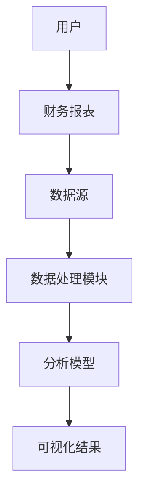

                 


# 构建智能化的企业财务报表分析系统

> 关键词：智能化、财务报表分析、机器学习、自然语言处理、数据可视化

> 摘要：本文详细介绍了如何构建智能化的企业财务报表分析系统。通过结合自然语言处理、机器学习和数据可视化等技术，我们能够更高效地从财务数据中提取有价值的信息，辅助企业做出更明智的决策。文章从系统背景、核心概念、算法原理、系统架构到项目实战进行了全面分析，为读者提供了构建智能化财务报表分析系统的详细指导。

---

## 第一章: 背景介绍与需求分析

### 1.1 传统财务报表分析的局限性
传统的财务报表分析主要依赖人工处理和简单的统计分析，存在以下问题：
- **数据量大，处理复杂**：企业财务数据日益复杂，人工分析效率低，容易出错。
- **信息孤岛**：财务数据分散在多个系统中，难以整合分析。
- **缺乏实时性**：传统分析多为事后分析，难以满足实时监控需求。
- **主观性强**：分析结果依赖分析师的经验和主观判断，缺乏客观性。

### 1.2 企业对智能化分析的需求
随着企业数字化转型的推进，智能化财务报表分析的需求日益迫切：
- **提高效率**：通过自动化技术快速处理和分析大量数据。
- **增强决策能力**：利用智能算法发现数据中的隐含信息，辅助决策。
- **实时监控**：实现财务数据的实时分析，及时发现异常情况。
- **非结构化数据处理**：能够处理财务报告中的非结构化文本信息。

### 1.3 智能化分析的技术基础
智能化财务报表分析依赖于以下核心技术：
- **数据采集与处理**：从多种数据源获取财务数据，并进行清洗和预处理。
- **自然语言处理（NLP）**：用于分析财务报告中的文本内容，提取关键信息。
- **机器学习与深度学习**：通过训练模型实现智能预测和分类。

---

## 第二章: 智能化财务报表分析系统的核心概念

### 2.1 系统定义与特点
智能化财务报表分析系统是一种结合人工智能技术的财务数据分析系统，具有以下特点：
- **自动化**：能够自动采集、处理和分析财务数据。
- **智能化**：通过机器学习和NLP技术，实现智能预测和文本分析。
- **实时性**：支持实时数据更新和分析，提供动态反馈。

### 2.2 核心模块组成
系统主要包括以下核心模块：
1. **数据采集模块**：负责从数据库、Excel文件、PDF报告等多种数据源获取财务数据。
2. **数据预处理模块**：对采集的数据进行清洗、转换和标准化处理。
3. **智能分析模块**：利用机器学习和NLP技术对数据进行建模和分析。
4. **可视化展示模块**：将分析结果以图表、仪表盘等形式直观展示。

### 2.3 实体关系图与类图
#### 实体关系图


#### 类图


---

## 第三章: 算法原理与数学模型

### 3.1 自然语言处理（NLP）在财务分析中的应用
#### 分词与词嵌入
- 使用分词技术将财务报告中的文本分割成词语。
- 通过词嵌入算法（如Word2Vec）生成词语的向量表示。

#### 基于Transformer的模型
- 使用Transformer模型对财务文本进行编码，提取上下文信息。
- 示例代码：
  ```python
  from transformers import AutoTokenizer, AutoModel
  tokenizer = AutoTokenizer.from_pretrained('bert-base-uncased')
  model = AutoModel.from_pretrained('bert-base-uncased')
  encoded_input = tokenizer.encode("公司2022年净利润增长10%", return_tensors='np')
  output = model(encoded_input)
  ```

#### 分句与分词技术
- 利用分句技术将财务报告拆分成独立的句子。
- 使用分词技术对每个句子进行词语分割。

### 3.2 机器学习算法在财务分析中的应用
#### 线性回归模型
- 用于预测财务指标（如收入、利润）。
- 数学模型：
  $$ y = \beta_0 + \beta_1 x_1 + \beta_2 x_2 + ... + \beta_n x_n + \epsilon $$
  其中，$y$ 是预测目标，$x_i$ 是自变量，$\beta_i$ 是系数，$\epsilon$ 是误差项。

#### 支持向量机（SVM）
- 用于分类任务，如财务状况分类（健康/不健康）。
- 示例代码：
  ```python
  from sklearn.svm import SVC
  model = SVC(kernel='rb

