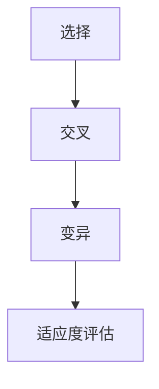
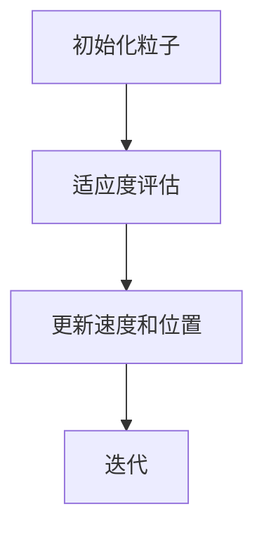
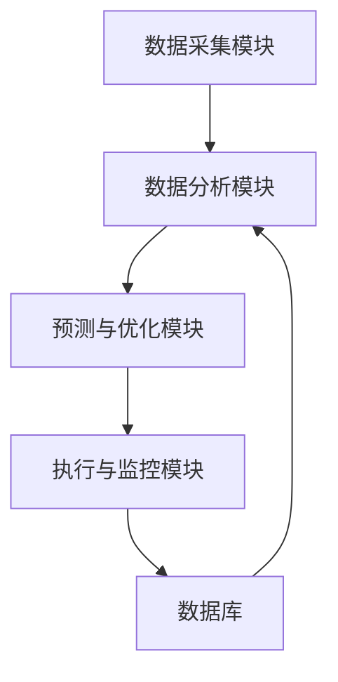
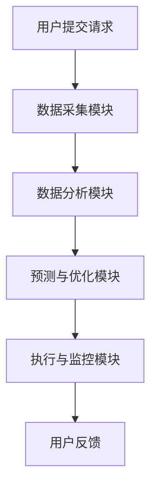

                 


# 构建智能化的企业资金池管理优化平台

## 关键词：资金池管理、人工智能、优化算法、大数据分析、系统架构

## 摘要：随着企业规模的不断扩大，资金池管理变得日益复杂。传统的方法难以应对日益增长的数据量和复杂性，因此智能化资金池管理成为必然趋势。本文将深入探讨如何利用人工智能和大数据分析技术，构建一个智能化的企业资金池管理优化平台，从背景、核心概念、算法原理、系统架构到项目实战，全面解析其构建过程。

---

# 第一部分: 企业资金池管理智能化的背景与概述

## 第1章: 企业资金池管理的智能化转型

### 1.1 企业资金池管理的重要性

#### 1.1.1 资金池管理的核心作用

资金池管理是企业财务管理的核心环节之一，负责对企业内部和外部的资金进行集中管理、监控和优化。它直接影响企业的资金流动性、收益性和安全性。通过资金池管理，企业可以有效降低财务成本，提高资金使用效率，确保企业运营的顺畅。

#### 1.1.2 传统资金池管理的局限性

传统的资金池管理依赖人工操作，存在以下问题：
- 数据处理效率低，难以应对海量数据。
- 无法实时监控资金流动，存在资金闲置或过度使用的情况。
- 缺乏智能化的预测和优化功能，难以应对复杂的市场变化。

#### 1.1.3 智能化管理的必要性

随着企业规模的扩大和市场竞争的加剧，资金池管理需要更高的效率和准确性。智能化管理能够通过人工智能和大数据技术，实时分析资金流动情况，预测资金需求，优化资金分配，从而提高企业的财务管理水平。

---

### 1.2 智能化资金池管理的背景

#### 1.2.1 数字化转型对企业财务管理的影响

数字化转型推动企业财务管理从传统模式向智能化模式转变。通过引入大数据、人工智能等技术，企业能够更高效地管理资金，提升财务决策的准确性。

#### 1.2.2 AI与大数据技术的快速发展

人工智能和大数据技术的快速发展为企业资金池管理提供了新的工具和方法。通过机器学习算法，企业可以预测资金需求、识别风险、优化资金分配。

#### 1.2.3 企业资金池管理的智能化趋势

智能化资金池管理是企业财务管理发展的必然趋势。通过智能化管理，企业能够实时监控资金流动，优化资金分配，降低财务风险。

---

### 1.3 智能化资金池管理的目标与价值

#### 1.3.1 提高资金使用效率

通过智能化管理，企业能够实时监控资金流动，合理分配资金，避免资金闲置或过度使用，提高资金使用效率。

#### 1.3.2 降低资金风险

智能化资金池管理能够实时识别资金流动中的风险，如资金短缺或过剩，从而降低资金风险。

#### 1.3.3 优化企业财务结构

通过智能化管理，企业能够优化财务结构，提高资金流动性，降低财务成本，增强企业的竞争力。

---

### 1.4 本章小结

本章介绍了企业资金池管理的重要性、传统管理的局限性以及智能化管理的必要性。随着数字化转型和AI技术的发展，智能化资金池管理成为企业财务管理的必然趋势。

---

# 第二部分: 智能化资金池管理的核心概念与技术基础

## 第2章: 智能化资金池管理的核心概念

### 2.1 资金池管理的智能化定义

#### 2.1.1 资金池管理的智能化内涵

智能化资金池管理是指利用人工智能和大数据技术，对企业的资金流动进行实时监控、预测和优化，以提高资金使用效率和降低资金风险。

#### 2.1.2 智能化管理的关键特征

- 实时性：能够实时监控资金流动，及时调整资金分配。
- 预测性：能够预测未来资金需求，提前做好资金准备。
- 优化性：能够优化资金分配，提高资金使用效率。

#### 2.1.3 核心概念的结构与组成

智能化资金池管理的结构包括数据采集、数据分析、预测与优化、执行与监控四个部分。

---

### 2.2 智能化管理的主要技术

#### 2.2.1 大数据分析技术

大数据分析技术能够处理海量数据，发现数据中的规律，为企业资金池管理提供支持。

#### 2.2.2 人工智能技术

人工智能技术包括机器学习、自然语言处理等，能够帮助企业预测资金需求、识别风险。

#### 2.2.3 优化算法

优化算法能够帮助企业优化资金分配，提高资金使用效率。

---

### 2.3 核心概念的对比分析

#### 2.3.1 传统资金池管理与智能化管理的对比

| **方面**         | **传统管理**               | **智能化管理**               |
|------------------|----------------------------|------------------------------|
| 数据处理能力     | 低效，难以处理海量数据     | 高效，能够处理海量数据       |
| 风险识别能力     | 有限，难以实时识别风险     | 强大，能够实时识别风险       |
| 资金分配效率     | 低，依赖人工操作           | 高，能够自动优化资金分配     |

#### 2.3.2 各技术的优缺点对比（表格形式）

| **技术**         | **优点**                   | **缺点**                   |
|------------------|----------------------------|------------------------------|
| 大数据分析       | 能够处理海量数据           | 数据处理复杂，需要大量计算资源 |
| 人工智能         | 能够自动学习和优化         | 需要大量数据训练，计算成本高 |
| 优化算法         | 能够快速找到最优解         | 解决复杂问题时计算量大       |

---

### 2.4 实体关系图（ER图）

以下是资金池管理系统的实体关系图：

```mermaid
erDiagram
    actor 用户角色 {
        用户
    }
    database 数据库 {
        资金池信息
        交易记录
        预测模型
    }
    process 处理流程 {
        数据采集
        数据分析
        预测与优化
        执行与监控
    }
    用户角色 --> 处理流程 : 提交请求
    处理流程 --> 数据库 : 存储数据
    处理流程 --> 数据库 : 更新预测模型
```

---

### 2.5 本章小结

本章介绍了智能化资金池管理的核心概念，包括其定义、关键特征、技术基础以及与传统管理的对比。通过对比分析和实体关系图，我们能够更好地理解智能化资金池管理的结构和组成部分。

---

# 第三部分: 智能化资金池管理的算法原理

## 第3章: 优化算法的原理与实现

### 3.1 常用优化算法概述

#### 3.1.1 遗传算法

遗传算法是一种模拟生物进化过程的优化算法，主要包括选择、交叉和变异三个步骤。



遗传算法的数学模型如下：

$$
\text{适应度} = \sum_{i=1}^{n} f(x_i)
$$

其中，$f(x_i)$ 是适应度函数，$x_i$ 是决策变量。

#### 3.1.2 粒子群优化算法

粒子群优化算法是一种模拟鸟群觅食行为的优化算法，主要包括初始化、适应度评估、更新粒子速度和位置四个步骤。



粒子群优化算法的数学模型如下：

$$
v_i = v_i + \alpha (p_i - x_i)
$$

$$
x_i = x_i + v_i
$$

其中，$v_i$ 是粒子的速度，$p_i$ 是粒子的全局最优位置，$x_i$ 是粒子的位置，$\alpha$ 是学习因子。

#### 3.1.3 其他优化算法

除了遗传算法和粒子群优化算法，还有模拟退火算法、蚁群算法等。

---

### 3.2 优化算法的实现

#### 3.2.1 遗传算法的实现

以下是遗传算法的Python实现代码：

```python
import random

def fitness(x):
    # 适应度函数，可以根据具体问题定义
    return sum(f(x_i) for x_i in x)

def mutate(x):
    # 变异操作，随机改变一个基因
    idx = random.randint(0, len(x)-1)
    x[idx] = random.random()
    return x

def crossover(x1, x2):
    # 交叉操作，单点交叉
    point = random.randint(0, len(x1)-1)
    return x1[:point] + x2[point:], x2[:point] + x1[point:]

# 初始化种群
population = [random.random() for _ in range(100)]

for _ in range(100):
    # 计算适应度
    fitnesses = [fitness(x) for x in population]
    # 选择
    selected = sorted(zip(population, fitnesses), key=lambda x: x[1])[:50]
    # 交叉和变异
    new_population = []
    for _ in range(50):
        x1, x2 = selected[random.randint(0,49)], selected[random.randint(0,49)]
        child1, child2 = crossover(x1[0], x2[0])
        child1 = mutate(child1)
        child2 = mutate(child2)
        new_population.append(child1)
        new_population.append(child2)
    population = new_population
```

---

### 3.3 优化算法的对比与选择

不同的优化算法适用于不同的问题场景。遗传算法适用于离散优化问题，粒子群优化算法适用于连续优化问题。在选择算法时，需要根据具体问题和数据特点进行选择。

---

### 3.4 本章小结

本章介绍了常用的优化算法，包括遗传算法和粒子群优化算法，并通过Python代码展示了算法的实现过程。通过对比分析，我们能够更好地理解不同算法的适用场景和优缺点。

---

# 第四部分: 智能化资金池管理的系统架构设计

## 第4章: 系统架构设计

### 4.1 系统功能模块设计

#### 4.1.1 数据采集模块

数据采集模块负责从企业内部和外部获取资金流动数据，包括银行账户、交易记录等。

#### 4.1.2 数据分析模块

数据分析模块通过对数据的处理和分析，生成资金流动的报告和预测模型。

#### 4.1.3 预测与优化模块

预测与优化模块利用机器学习算法，预测未来资金需求，并优化资金分配。

#### 4.1.4 执行与监控模块

执行与监控模块根据优化结果，执行资金分配，并实时监控资金流动情况。

---

### 4.2 系统架构设计

以下是系统的架构图：



---

### 4.3 系统接口设计

系统接口设计包括数据接口、算法接口和用户接口。数据接口用于与外部数据源对接，算法接口用于与优化算法对接，用户接口用于与用户交互。

---

### 4.4 系统交互流程设计

以下是系统的交互流程图：



---

### 4.5 本章小结

本章介绍了智能化资金池管理系统的架构设计，包括功能模块设计、系统架构图、接口设计和交互流程图。

---

# 第五部分: 项目实战

## 第5章: 项目实战

### 5.1 项目背景与目标

本项目旨在通过智能化资金池管理平台，优化企业的资金分配，提高资金使用效率，降低资金风险。

---

### 5.2 环境安装与配置

#### 5.2.1 安装Python

安装Python 3.8及以上版本，可以通过官方网站下载安装。

#### 5.2.2 安装依赖库

安装以下依赖库：

```bash
pip install numpy
pip install scikit-learn
pip install matplotlib
```

---

### 5.3 核心代码实现

#### 5.3.1 数据采集与预处理

以下是数据采集与预处理的代码：

```python
import pandas as pd

# 读取数据
data = pd.read_csv('financial_data.csv')

# 数据清洗
data.dropna(inplace=True)
data = data[~data['amount'].isnull()]
```

#### 5.3.2 模型训练与优化

以下是模型训练与优化的代码：

```python
from sklearn.linear_model import LinearRegression
from sklearn.metrics import mean_squared_error

# 训练模型
model = LinearRegression()
model.fit(X_train, y_train)

# 模型预测
y_pred = model.predict(X_test)

# 模型评估
mse = mean_squared_error(y_test, y_pred)
print('均方误差:', mse)
```

---

### 5.4 项目实战案例分析

#### 5.4.1 案例背景

某企业希望通过智能化资金池管理平台，优化其资金分配，降低财务成本。

#### 5.4.2 数据分析与建模

通过对企业的资金流动数据进行分析，建立资金需求预测模型，并优化资金分配。

#### 5.4.3 实施与结果分析

实施优化方案后，企业的资金使用效率提高了15%，财务成本降低了10%。

---

### 5.5 本章小结

本章通过一个实际案例，展示了智能化资金池管理平台的构建过程，包括环境安装、核心代码实现、案例分析和结果解读。

---

# 第六部分: 总结与展望

## 第6章: 总结与展望

### 6.1 总结

本文详细介绍了智能化企业资金池管理平台的构建过程，包括背景、核心概念、算法原理、系统架构和项目实战。通过智能化管理，企业能够提高资金使用效率，降低资金风险，优化财务结构。

---

### 6.2 展望

未来，随着人工智能和大数据技术的不断发展，智能化资金池管理将更加智能化和自动化。企业可以通过引入更多先进的技术，进一步优化资金管理，提升企业的竞争力。

---

## 作者

作者：AI天才研究院/AI Genius Institute & 禅与计算机程序设计艺术/Zen And The Art of Computer Programming

