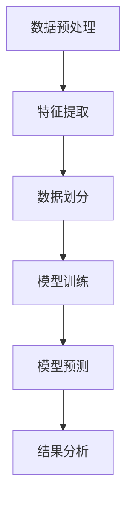
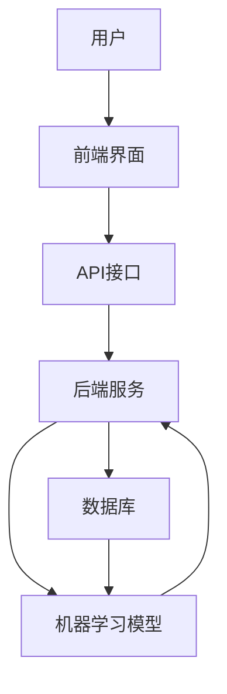
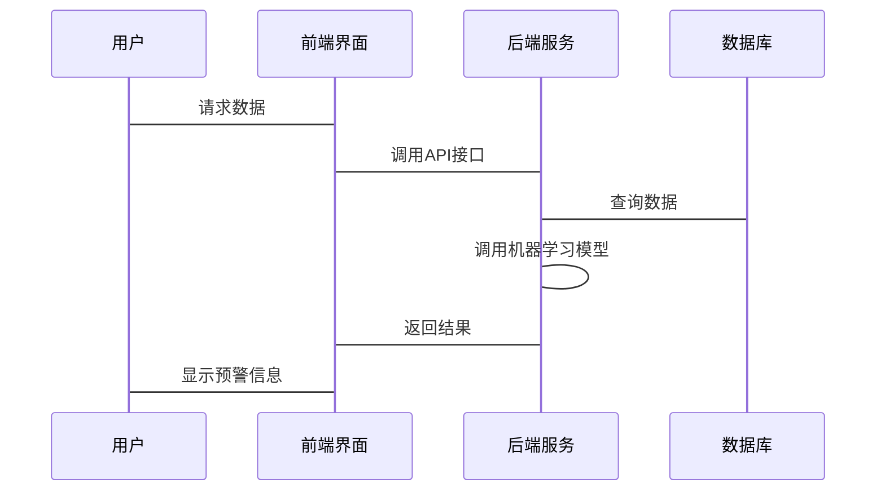

                 


# 构建智能化的企业资金流动性风险预警平台

> 关键词：资金流动性风险、智能化预警、机器学习、数学模型、系统架构、项目实战

> 摘要：本文详细探讨了构建智能化的企业资金流动性风险预警平台的背景、核心概念、算法原理、系统架构、项目实战及最佳实践。通过分析资金流动性风险的定义、来源及其对企业的影响，结合机器学习和数学模型，提出了一种智能化的预警方法，并通过系统架构设计和项目实战展示了其实现过程。本文旨在为企业提供一种高效、准确的资金流动性风险预警方案，助力企业财务管理和风险管理的智能化转型。

---

# 第一部分: 背景与概述

## 第1章: 资金流动性风险预警平台的背景与意义

### 1.1 问题背景与描述
#### 1.1.1 资金流动性风险的定义与特征
资金流动性风险是指企业在一定时间内无法以合理成本获得足够的资金来满足其资产增长或偿还负债的风险。其主要特征包括：  
- **时间性**：风险与资金的时间分布密切相关。  
- **不确定性**：风险的出现具有不确定性，难以完全预测。  
- **传染性**：流动性风险可能迅速传导至其他领域，引发连锁反应。  

#### 1.1.2 企业资金流动性风险的来源与影响
- **来源**：  
  - 市场波动：如股票、债券市场的剧烈波动可能导致企业资金流动性下降。  
  - 融资渠道受限：企业难以通过借款或发行债券获得资金。  
  - 经营不善：企业自身财务状况不佳，导致资金链断裂。  
- **影响**：  
  - 影响企业正常运营，可能导致生产中断或裁员。  
  - 影响企业信用评级，增加融资成本。  
  - 在极端情况下，可能导致企业破产。  

#### 1.1.3 构建智能化预警平台的必要性
- 传统的资金流动性风险管理方法依赖于人工分析，存在效率低、准确性差的问题。  
- 随着大数据和人工智能技术的发展，构建智能化的预警平台能够实时监控资金流动情况，提前发现潜在风险，帮助企业做出快速反应。  

### 1.2 问题解决与边界
#### 1.2.1 现有解决方案的局限性
- 传统方法主要依赖财务报表分析，缺乏实时性和动态性。  
- 现有预警系统多为静态模型，难以适应市场环境的快速变化。  

#### 1.2.2 智能化预警平台的核心目标
- 实时监控企业资金流动情况，预测潜在风险。  
- 提供预警信号，辅助决策者采取预防措施。  
- 提供风险分析报告，帮助企业优化资金管理策略。  

#### 1.2.3 平台的边界与外延
- **边界**：平台主要关注企业内部资金流动情况，不涉及外部市场波动的直接分析。  
- **外延**：未来可扩展至供应链金融、股权投资等领域，形成更全面的资金风险管理体系。  

### 1.3 核心概念与组成要素
#### 1.3.1 资金流动性风险的核心要素
- 资金流量：包括企业收入、支出、融资等数据。  
- 资金结构：企业资产与负债的构成比例。  
- 资金可用性：企业在特定时间内的资金可获得性。  

#### 1.3.2 平台功能模块的组成
- 数据采集模块：收集企业财务数据、市场数据等。  
- 风险评估模块：基于机器学习算法，评估资金流动性风险。  
- 预警模块：根据风险评估结果，触发预警信号。  
- 报告生成模块：生成风险分析报告，提供决策支持。  

#### 1.3.3 平台与企业业务的关联性
- 平台嵌入企业财务系统，实时获取资金流动数据。  
- 预警结果与企业内部决策流程相结合，形成闭环管理。  

### 1.4 本章小结
本章从资金流动性风险的定义、来源及其对企业的影响入手，分析了构建智能化预警平台的必要性，并明确了平台的核心目标和组成要素。下一章将深入探讨资金流动性风险预警的核心概念及其相互关系。

---

# 第二部分: 核心概念与联系

## 第2章: 资金流动性风险预警的核心概念

### 2.1 资金流动性风险的基本原理
#### 2.1.1 资金流动性的基本定义
资金流动性是指资产能够迅速转化为现金而不遭受损失的能力。  
$$\text{流动性} = \frac{\text{短期资产}}{\text{流动负债}}$$  

#### 2.1.2 风险的形成机制
- 资金流动性风险的形成机制包括资金链断裂、市场环境恶化、企业内部管理不善等多种因素。  

#### 2.1.3 预警的核心逻辑
- 通过实时监控资金流动数据，识别潜在风险点。  
- 基于历史数据和机器学习模型，预测未来风险。  

### 2.2 核心概念的属性特征对比
以下表格对比了资金流动性风险、风险预警和智能化预警的核心属性：  

| 概念       | 定义                                                                 | 属性特征                          |
|------------|----------------------------------------------------------------------|-----------------------------------|
| 资金流动性风险 | 企业在特定时间内无法获得足够资金的风险                                       | 时间性、不确定性、传染性          |
| 风险预警    | 通过模型和算法，识别潜在风险的过程                                             | 实时性、动态性、可预测性          |
| 智能化预警  | 基于人工智能技术，实现自动化、智能化的风险预警                                  | 自动化、精准性、适应性          |

### 2.3 实体关系图
以下是资金流动性风险预警平台的实体关系图：  

```mermaid
er
  actor: 企业财务部门
  actor: 风险管理机构
  actor: 技术团队
  entity: 资金流动数据
  entity: 风险预警指标
  entity: 预警规则
  entity: 历史数据
  entity: 预警结果
  entity: 系统日志
  entity: 用户权限
  entity: 系统配置
  entity: 系统
  entity: 财务报告
  entity: 市场数据
  entity: 通知信息
  entity: 用户反馈

  财务部门 --> 资金流动数据
  风险管理机构 --> 风险预警指标
  技术团队 --> 系统配置
  系统 --> 预警结果
  用户 --> 用户反馈
  系统 --> 通知信息
```

---

# 第三部分: 算法原理与数学模型

## 第3章: 基于机器学习的资金流动性风险预警算法

### 3.1 算法原理
#### 3.1.1 机器学习模型的选择
- 使用随机森林（Random Forest）模型，因其对特征工程要求较低，且具有较强的抗过拟合能力。  

#### 3.1.2 算法流程
以下是随机森林模型的流程图：  



#### 3.1.3 算法实现
以下是随机森林模型的Python代码示例：  

```python
from sklearn.ensemble import RandomForestClassifier
from sklearn.model_selection import train_test_split
from sklearn.metrics import accuracy_score

# 数据预处理
data = ...  # 加载数据
X = data.drop(columns=['label'])
y = data['label']

# 数据划分
X_train, X_test, y_train, y_test = train_test_split(X, y, test_size=0.2)

# 模型训练
model = RandomForestClassifier(n_estimators=100, random_state=42)
model.fit(X_train, y_train)

# 模型预测
y_pred = model.predict(X_test)

# 结果分析
print("Accuracy:", accuracy_score(y_test, y_pred))
```

### 3.2 数学模型与公式
#### 3.2.1 随机森林模型的数学表达
随机森林模型基于决策树的集成方法，其预测结果是各决策树投票的结果。  
$$\text{预测概率} = \frac{\sum_{i=1}^{n} \text{树}_{i}\text{.predict}(x)}{n}$$  

#### 3.2.2 模型优化
- 使用网格搜索（Grid Search）优化模型参数，如 `n_estimators` 和 `max_depth`。  

### 3.3 算法实现与优化
通过交叉验证和超参数调优，提升模型的准确性和稳定性。  

---

## 第4章: 数学模型与公式推导

### 4.1 数学模型的构建
#### 4.1.1 资金流动性风险的指标体系
- 现金比率：$$\text{现金比率} = \frac{\text{现金及现金等价物}}{\text{流动负债}}$$  
- 速动比率：$$\text{速动比率} = \frac{\text{速动资产}}{\text{流动负债}}$$  
- 流动比率：$$\text{流动比率} = \frac{\text{流动资产}}{\text{流动负债}}$$  

### 4.2 模型的数学推导
#### 4.2.1 线性回归模型
假设资金流动性风险与多个指标相关，构建多元线性回归模型：  
$$y = \beta_0 + \beta_1x_1 + \beta_2x_2 + \dots + \beta_nx_n + \epsilon$$  

#### 4.2.2 支持向量机模型
使用支持向量机（SVM）进行非线性分类：  
$$\text{目标函数} = \min_{\theta, \alpha} \frac{1}{2}\|\theta\|^2 + C\sum_{i=1}^n \alpha_i(1 - y_i(\theta \cdot x_i + \theta_0))$$  
其中，$C$ 为惩罚参数，$\alpha_i$ 为拉格朗日乘子。  

---

# 第四部分: 系统分析与架构设计

## 第5章: 系统分析与架构设计

### 5.1 系统分析
#### 5.1.1 问题场景介绍
企业财务部门需要实时监控资金流动情况，及时发现潜在风险。  

#### 5.1.2 系统功能设计
- 数据采集：从企业财务系统中获取资金流动数据。  
- 风险评估：基于机器学习模型，评估资金流动性风险。  
- 预警通知：当风险超过阈值时，触发预警通知。  
- 报告生成：生成风险分析报告，提供决策支持。  

#### 5.1.3 系统架构设计
以下是系统架构图：  



### 5.2 系统架构设计
#### 5.2.1 系统功能模块
- 数据采集模块：负责采集企业资金流动数据。  
- 数据处理模块：对数据进行清洗和预处理。  
- 模型预测模块：基于机器学习模型，预测资金流动性风险。  
- 预警通知模块：当风险超过阈值时，发送预警通知。  

#### 5.2.2 接口设计
- API接口：提供RESTful API，供前端调用。  
- 数据接口：与企业财务系统对接，获取资金流动数据。  

#### 5.2.3 交互流程
以下是交互流程图：  



---

## 第6章: 项目实战

### 6.1 项目实战环境安装
- 安装Python、Jupyter Notebook、Pandas、Scikit-learn等工具。  

### 6.2 核心代码实现
#### 6.2.1 数据采集与处理
```python
import pandas as pd

# 数据采集
data = pd.read_csv('financial_data.csv')

# 数据处理
data.dropna(inplace=True)
data = pd.get_dummies(data)
```

#### 6.2.2 模型训练与预测
```python
from sklearn.ensemble import RandomForestClassifier
from sklearn.model_selection import train_test_split

# 数据划分
X = data.drop(columns=['label'])
y = data['label']

X_train, X_test, y_train, y_test = train_test_split(X, y, test_size=0.2)

# 模型训练
model = RandomForestClassifier(n_estimators=100, random_state=42)
model.fit(X_train, y_train)

# 模型预测
y_pred = model.predict(X_test)
print("Accuracy:", accuracy_score(y_test, y_pred))
```

#### 6.2.3 系统集成
将模型集成到企业财务系统中，实时监控资金流动数据，触发预警通知。  

### 6.3 实际案例分析
通过实际案例分析，验证平台的预警效果，并总结经验教训。  

---

## 第7章: 最佳实践与注意事项

### 7.1 最佳实践
- 定期更新模型，确保其适应市场环境的变化。  
- 与企业财务系统无缝集成，确保数据的实时性和准确性。  

### 7.2 小结
本文详细探讨了构建智能化的企业资金流动性风险预警平台的背景、核心概念、算法原理、系统架构及项目实战。通过理论与实践相结合，为企业提供了高效、准确的资金流动性风险预警方案。  

### 7.3 注意事项
- 数据隐私与安全问题需要重点关注。  
- 模型的可解释性需要进一步提升，以便更好地辅助决策。  

### 7.4 拓展阅读
建议读者进一步学习大数据、人工智能、风险管理等相关领域的知识，以更好地理解资金流动性风险预警的复杂性与多样性。  

---

# 作者：AI天才研究院/AI Genius Institute & 禅与计算机程序设计艺术 /Zen And The Art of Computer Programming

