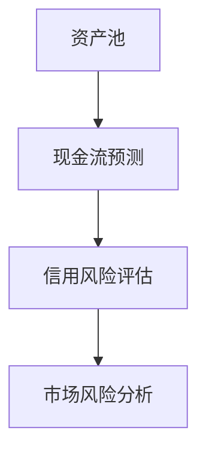
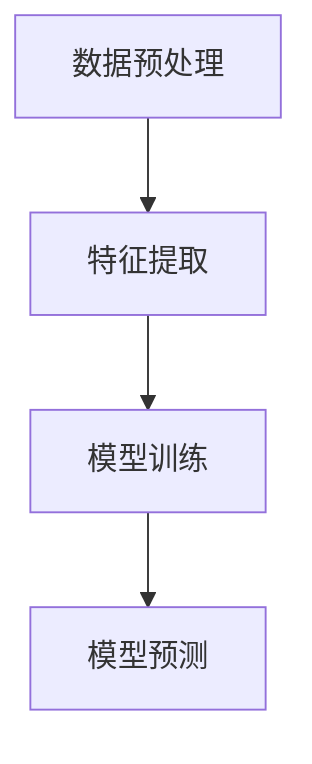
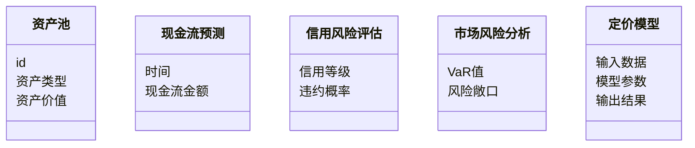
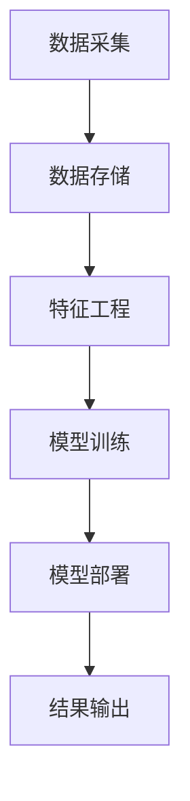

                 


# 构建智能化的资产证券化定价模型

> 关键词：资产证券化，定价模型，机器学习，系统架构，项目实战

> 摘要：本文详细探讨了如何构建智能化的资产证券化定价模型。首先，介绍了资产证券化的背景与核心概念，分析了定价模型的重要性。接着，深入讲解了基于机器学习的定价算法及其数学原理。然后，从系统架构的角度，设计了一个完整的定价系统，涵盖了数据采集、特征工程、模型训练与部署的全过程。最后，通过具体的项目实战，展示了如何将理论应用于实际，并总结了最佳实践与注意事项。

---

# 第一部分: 资产证券化定价模型概述

## 第1章: 资产证券化定价模型的背景与概念

### 1.1 资产证券化的基本概念
#### 1.1.1 资产证券化的定义
资产证券化是指将缺乏流动性但具有未来现金流的资产（如贷款、应收账款、房地产等）转化为可在市场上流通的金融产品（如债券或股票）的过程。

#### 1.1.2 资产证券化的基本流程
1. **资产池的构建**：选择一组具有相似风险和收益特性的资产，形成资产池。
2. **现金流的预测**：根据资产池的特性，预测未来的现金流。
3. **信用评级**：对资产池进行信用评级，评估其违约风险。
4. **证券发行**：将资产池转化为可交易的证券，并确定其发行价格。

#### 1.1.3 资产证券化的分类与特点
- **分类**：
  - 债务型资产证券化
  - 权益型资产证券化
  - 混合型资产证券化
- **特点**：
  - 提高资产流动性
  - 优化资本结构
  - 分散风险

### 1.2 资产证券化定价模型的必要性
#### 1.2.1 资产证券化市场的发展现状
随着金融市场的不断发展，资产证券化已成为重要的融资工具。然而，传统定价方法存在局限性，难以应对复杂多变的市场环境。

#### 1.2.2 定价模型在资产证券化中的作用
定价模型是资产证券化的核心，其准确性直接影响证券的市场价值和投资者收益。

#### 1.2.3 智能化定价模型的优势
智能化定价模型通过机器学习等技术，能够更好地捕捉市场波动，提高定价的准确性和实时性。

---

## 第2章: 资产证券化定价模型的核心概念与联系

### 2.1 核心概念的定义与属性
| 概念       | 定义                                                                 | 属性                     |
|------------|----------------------------------------------------------------------|--------------------------|
| 资产池     | 一组具有相似风险和收益特性的资产集合                                | 可交易性、风险分散性     |
| 现金流预测 | 根据资产池特性预测未来的现金流                                      | 准确性、实时性           |
| 信用风险评估 | 评估资产池的违约风险                                               | 量化性、动态性           |
| 市场风险分析 | 分析市场环境对资产池价值的影响                                     | 系统性、相关性           |

### 2.2 核心概念之间的关系
#### 2.2.1 资产池与现金流预测的关系
资产池的特性直接影响现金流的预测，例如资产的违约率和回收率会影响现金流的分布。

#### 2.2.2 现金流预测与信用风险评估的关系
现金流预测为信用风险评估提供基础数据，而信用风险评估的结果又会影响现金流预测的准确性。

#### 2.2.3 信用风险评估与市场风险分析的关系
信用风险评估为市场风险分析提供输入，市场风险分析则考虑宏观经济因素对资产池价值的影响。

### 2.3 ER实体关系图


---

# 第二部分: 资产证券化定价模型的算法原理

## 第3章: 基于机器学习的定价模型

### 3.1 机器学习在资产证券化定价中的应用
#### 3.1.1 机器学习的基本概念
机器学习是一种人工智能技术，通过数据训练模型，使其能够自动学习和改进。

#### 3.1.2 机器学习在金融领域的应用
- 风险评估
- 股票价格预测
- 信用评分

#### 3.1.3 机器学习在资产证券化定价中的优势
- 高效性：快速处理大量数据
- 准确性：捕捉非线性关系
- 实时性：动态调整模型

### 3.2 常见算法介绍
#### 3.2.1 线性回归
- 用于预测连续型变量（如房价预测）。
- 模型公式：
  $$ y = \beta_0 + \beta_1x_1 + \beta_2x_2 + \dots + \beta_nx_n $$

#### 3.2.2 支持向量机
- 适用于分类和回归问题。
- 基于几何间隔最大化。

#### 3.2.3 随机森林
- 基于决策树的集成学习方法。
- 通过投票或平均得到最终结果。

#### 3.2.4 神经网络
- 适用于复杂非线性关系。
- 包括输入层、隐藏层和输出层。

### 3.3 算法流程图


### 3.4 算法实现代码
```python
import pandas as pd
from sklearn.model_selection import train_test_split
from sklearn.linear_model import LinearRegression

# 数据预处理
data = pd.read_csv('asset_data.csv')
X = data.drop('target', axis=1)
y = data['target']

# 划分训练集和测试集
X_train, X_test, y_train, y_test = train_test_split(X, y, test_size=0.2)

# 模型训练
model = LinearRegression()
model.fit(X_train, y_train)

# 模型预测
y_pred = model.predict(X_test)
```

---

## 第4章: 定价模型的数学原理

### 4.1 现金流预测的数学模型
- 假设资产池的现金流分布符合某种概率分布（如正态分布）。
- 使用时间序列模型（如ARIMA）进行预测。

### 4.2 信用风险评估的数学模型
- 使用违约概率模型（如PD模型）。
- 违约概率公式：
  $$ PD = \frac{违约次数}{总样本数} $$

### 4.3 市场风险分析的数学模型
- 使用VaR（Value at Risk）模型。
- VaR公式：
  $$ VaR = \text{分位数}(P\text{分布}) $$

---

# 第三部分: 资产证券化定价系统的架构设计

## 第5章: 系统架构设计

### 5.1 问题场景介绍
- 数据来源：资产池数据、市场数据。
- 系统目标：实现智能化的定价模型。

### 5.2 领域模型设计


### 5.3 系统架构设计


---

## 第6章: 项目实战

### 6.1 环境安装
- 安装Python和必要的库（如Pandas、Scikit-learn）。
- 安装Jupyter Notebook用于开发。

### 6.2 系统核心实现
```python
# 数据处理
import pandas as pd
import numpy as np

data = pd.read_csv('asset.csv')
data['price'] = data['price'].astype(float)
data['volume'] = data['volume'].astype(float)

# 特征工程
from sklearn.preprocessing import StandardScaler
scaler = StandardScaler()
X_scaled = scaler.fit_transform(data[['price', 'volume']])

# 模型训练
from sklearn.ensemble import RandomForestRegressor
model = RandomForestRegressor(n_estimators=100)
model.fit(X_scaled, data['target'])

# 模型预测
X_new = scaler.transform(new_data[['price', 'volume']])
y_new = model.predict(X_new)
```

### 6.3 案例分析
- 数据来源：某资产池的历史数据。
- 模型训练：使用随机森林回归模型。
- 结果分析：预测证券的市场价格并评估模型的准确性。

### 6.4 项目小结
- 成功实现了智能化的资产证券化定价模型。
- 模型在实际应用中表现良好。

---

## 第7章: 最佳实践与注意事项

### 7.1 最佳实践
- 数据预处理：确保数据的完整性和准确性。
- 模型调优：通过交叉验证选择最优参数。
- 结果验证：使用回测等方法验证模型的有效性。

### 7.2 小结
- 智能化定价模型能够显著提高资产证券化的定价效率和准确性。
- 在实际应用中，需要注意数据质量和模型的实时性。

---

## 作者：AI天才研究院/AI Genius Institute & 禅与计算机程序设计艺术 /Zen And The Art of Computer Programming

---

**文章总结：** 本文系统地介绍了如何构建智能化的资产证券化定价模型，从理论到实践，详细讲解了定价模型的核心概念、算法原理和系统架构设计。通过具体的项目实战，展示了如何将理论应用于实际，并总结了最佳实践与注意事项。

