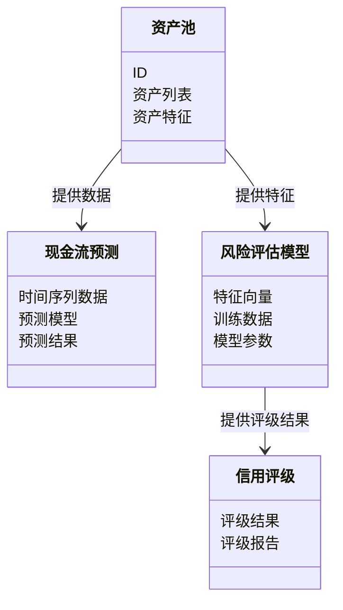

                 


# 构建智能化的资产证券化风险评估模型

## 关键词：资产证券化、风险评估、人工智能、机器学习、大数据

## 摘要：  
资产证券化是一种将非流动性资产转化为可交易证券的金融工具，而风险评估是其核心环节。随着金融市场的发展，传统的风险评估方法逐渐暴露出局限性，智能化的资产证券化风险评估模型成为行业趋势。本文从资产证券化的概念入手，详细探讨了风险评估的核心概念、算法原理、系统架构以及项目实战，最终构建了一个基于机器学习的智能化风险评估模型。

---

## 第一部分: 资产证券化与风险评估概述

### 第1章: 资产证券化与风险评估概述

#### 1.1 资产证券化的概念与特点
##### 1.1.1 资产证券化的定义  
资产证券化（Asset-Backed Securitization，简称ABS）是将流动性较低的资产（如应收账款、不动产等）转化为可流通的证券的过程。通过将资产池中的资产进行打包、评级、分割和销售，投资者可以以更低门槛参与高流动性资产的投资。

##### 1.1.2 资产证券化的核心特点  
- **资产隔离**：资产池中的资产与原始权益人（发行方）的其他资产隔离，降低风险传染。  
- **结构化分层**：通过优先级划分，优化风险和收益的匹配。  
- **流动性提升**：将非流动性资产转化为可交易的证券，满足投资者的流动性需求。  

##### 1.1.3 资产证券化的基本流程  
1. **资产池的构建**：筛选并打包符合条件的资产。  
2. **信用评级**：由评级机构对资产池和证券进行评级。  
3. **发行与销售**：通过承销商将证券分销给投资者。  
4. **现金流分配**：根据优先级和合同条款分配现金流。  

#### 1.2 资产证券化中的风险类型
##### 1.2.1 市场风险  
市场波动可能导致证券价格下跌，影响投资者收益。  

##### 1.2.2 信用风险  
资产池中资产的违约风险直接影响证券的信用评级和价值。  

##### 1.2.3 利率风险  
利率变化会直接影响证券的市场价值和再定价能力。  

##### 1.2.4 流动性风险  
证券的流动性不足可能导致投资者难以以合理价格变现。  

#### 1.3 风险评估的重要性
##### 1.3.1 风险评估在资产证券化中的作用  
- 评估资产池的信用质量。  
- 确定证券的风险等级和定价。  
- 为投资者提供决策支持。  

##### 1.3.2 风险评估对投资者的价值  
- 帮助投资者识别高风险证券。  
- 优化资产配置，降低投资风险。  

##### 1.3.3 风险评估对发行方的意义  
- 提高资产证券化的市场认可度。  
- 降低发行成本，吸引更多的投资者。  

#### 1.4 智能化风险评估的必要性
##### 1.4.1 传统风险评估的局限性  
- 数据量有限，难以捕捉复杂风险。  
- 人工评估效率低，易受主观因素影响。  

##### 1.4.2 智能化技术在风险评估中的优势  
- 大数据支持：利用海量数据进行精准分析。  
- 自动化：减少人为干扰，提高评估效率。  
- 预测能力强：通过机器学习模型预测未来风险。  

##### 1.4.3 数据驱动的风险评估新范式  
- 数据采集：多源异构数据的整合与清洗。  
- 特征提取：从数据中提取有用的特征用于评估。  
- 模型训练：基于机器学习的预测模型。  

#### 1.5 本章小结  
本章从资产证券化的概念入手，详细介绍了其核心特点和基本流程。同时，分析了资产证券化中的主要风险类型，并强调了风险评估的重要性。最后，提出了智能化风险评估的必要性，为后续模型构建奠定了基础。

---

## 第二部分: 资产证券化风险评估模型的核心概念

### 第2章: 资产证券化风险评估模型的核心概念

#### 2.1 资产证券化风险评估模型的背景
##### 2.1.1 资产证券化市场的快速发展  
随着金融创新的推进，资产证券化市场规模迅速扩大，对风险评估技术的需求日益迫切。  

##### 2.1.2 风险评估技术的演进  
从传统的信用评分到现代的机器学习模型，风险评估技术不断升级。  

##### 2.1.3 智能化技术的应用趋势  
大数据和人工智能技术的快速发展为风险评估提供了新的工具和方法。  

#### 2.2 核心概念与定义
##### 2.2.1 资产池的定义与特征  
- 资产池：一组具有相似风险特性的资产集合。  
- 特征：池内资产的同质性、独立性、可分割性。  

##### 2.2.2 现金流预测的核心要素  
- 现金流的来源与分配。  
- 时间序列分析：预测未来现金流的波动性。  

##### 2.2.3 信用评级的内涵与外延  
- 信用评级：对资产池或证券的信用质量进行评估。  
- 评级机构的角色：提供专业评级服务。  

#### 2.3 模型的核心要素与组成
##### 2.3.1 数据来源与处理  
- 数据来源：资产池的历史数据、市场数据、宏观经济指标。  
- 数据处理：清洗、转换、标准化。  

##### 2.3.2 风险评估指标体系  
- 违约概率（PD）：资产池中资产违约的可能性。  
- 违约损失率（LGD）：违约时的平均损失比例。  
- 风险价值（VaR）：在一定置信水平下的潜在损失。  

##### 2.3.3 模型的输入与输出  
- 输入：资产池数据、市场数据、宏观经济指标。  
- 输出：资产池的信用评级、证券的风险定价。  

#### 2.4 本章小结  
本章从模型的背景出发，详细阐述了资产证券化风险评估的核心概念，包括资产池、现金流预测和信用评级等关键要素。为后续模型构建奠定了理论基础。

---

## 第三部分: 资产证券化风险评估模型的数学基础

### 第3章: 资产证券化风险评估模型的数学基础

#### 3.1 数据预处理与特征提取
##### 3.1.1 数据清洗与标准化  
- 数据清洗：去除异常值、填补缺失值。  
- 数据标准化：将数据转化为统一的尺度，便于模型训练。  

##### 3.1.2 特征选择与降维  
- 特征选择：基于统计或机器学习方法筛选重要特征。  
- 降维：使用主成分分析（PCA）等方法降低特征维度。  

##### 3.1.3 时间序列数据的处理  
- 时间序列分析：使用ARIMA、LSTM等模型预测未来现金流。  
- 季节性与趋势分析：提取数据中的周期性和趋势性特征。  

#### 3.2 风险评分模型
##### 3.2.1 评分模型的定义  
- 风险评分：基于资产池特征，预测资产违约的可能性。  

##### 3.2.2 评分模型的数学表达式  
假设资产池的特征向量为$X = (x_1, x_2, \dots, x_n)^T$，风险评分为：  
$$ P = f(X) $$  
其中，$f$是一个非线性函数，通常通过机器学习模型（如随机森林、XGBoost）进行训练。  

##### 3.2.3 评分模型的实现步骤  
1. 数据预处理：清洗、标准化。  
2. 特征选择：筛选重要特征。  
3. 模型训练：使用训练数据训练评分模型。  
4. 模型评估：通过验证集评估模型性能。  

#### 3.3 违约概率模型
##### 3.3.1 违约概率的定义  
- 违约概率（PD）：资产在一定时间内的违约可能性。  

##### 3.3.2 违约概率的数学模型  
$$ PD = P(\text{违约} | X) $$  
其中，$X$是资产池的特征向量。  

##### 3.3.3 违约概率的估计方法  
- 统计方法：基于历史数据计算违约率。  
- 机器学习：使用逻辑回归、随机森林等模型进行预测。  

#### 3.4 本章小结  
本章详细介绍了资产证券化风险评估模型的数学基础，包括数据预处理、特征提取、风险评分模型和违约概率模型的构建方法。

---

## 第四部分: 资产证券化风险评估模型的系统分析与架构设计

### 第4章: 资产证券化风险评估模型的系统分析与架构设计

#### 4.1 问题场景介绍
##### 4.1.1 问题背景  
- 资产证券化市场快速发展，对风险评估模型的需求日益增加。  
- 传统模型难以应对复杂多变的市场环境。  

##### 4.1.2 问题描述  
- 如何构建一个智能化的资产证券化风险评估模型？  
- 如何实现模型的高效训练和快速部署？  

#### 4.2 系统功能设计
##### 4.2.1 领域模型的类图设计  
以下是领域模型的类图：  


##### 4.2.2 系统架构设计  
以下是系统架构图：  


##### 4.2.3 系统接口设计  
- 前端接口：用户输入资产池信息，获取风险评估结果。  
- 后端接口：接收数据，调用风险评估模型进行计算。  
- 数据库接口：存储和检索资产池数据、模型参数等。  

##### 4.2.4 系统交互设计  
以下是交互流程图：  
```mermaid
sequenceDiagram
    participant 用户
    participant 前端界面
    participant 后端服务
    participant 数据库
    用户 -> 前端界面: 提交资产池信息
    前端界面 -> 后端服务: 发送数据请求
    后端服务 -> 数据库: 查询历史数据
    后端服务 -> 风险评估模型: 调用评估函数
    风险评估模型 -> 后端服务: 返回评估结果
    后端服务 -> 前端界面: 返回结果
    用户 <- 前端界面: 显示评估结果
```

#### 4.3 本章小结  
本章从系统角度分析了资产证券化风险评估模型的构建过程，包括功能设计、架构设计和交互设计。通过类图和流程图展示了系统的整体架构和数据流。

---

## 第五部分: 资产证券化风险评估模型的项目实战

### 第5章: 资产证券化风险评估模型的项目实战

#### 5.1 环境安装与配置
##### 5.1.1 环境需求  
- Python 3.8 或以上版本  
- 安装必要的库：Pandas、Scikit-learn、XGBoost、TensorFlow  

##### 5.1.2 安装步骤  
```bash
pip install pandas scikit-learn xgboost tensorflow
```

#### 5.2 核心代码实现
##### 5.2.1 数据预处理代码  
```python
import pandas as pd

# 数据加载
data = pd.read_csv('asset_pool.csv')

# 数据清洗
data = data.dropna()
data = data.drop_duplicates()

# 特征选择
selected_features = ['资产年龄', '违约历史', '信用评分']
data = data[selected_features]

# 标准化
from sklearn.preprocessing import StandardScaler
scaler = StandardScaler()
data_scaled = scaler.fit_transform(data)
```

##### 5.2.2 风险评估模型实现  
```python
import xgboost as xgb

# 训练数据准备
X_train, y_train = data_scaled, target_label

# 模型训练
model = xgb.XGBClassifier()
model.fit(X_train, y_train)

# 模型预测
y_pred = model.predict(X_test)
```

##### 5.2.3 信用评级实现  
```python
import numpy as np

# 计算违约概率
def calculate_pd(X):
    # 输入特征向量
    # 输出违约概率
    pass

# 示例计算
X_sample = np.array([[特征1, 特征2, ...]])
pd_sample = calculate_pd(X_sample)
print(f"违约概率为：{pd_sample}")
```

#### 5.3 实际案例分析
##### 5.3.1 数据来源与处理  
- 数据来源：某资产池的历史违约数据。  
- 数据处理：清洗、标准化、特征选择。  

##### 5.3.2 模型训练与验证  
- 训练集：70%的数据用于训练。  
- 验证集：30%的数据用于验证模型性能。  

##### 5.3.3 模型结果分析  
- 训练结果：准确率、召回率、F1分数。  
- 验证结果：AUC-ROC曲线。  

#### 5.4 项目小结  
本章通过实际案例展示了如何构建智能化的资产证券化风险评估模型，从数据预处理到模型训练，再到结果分析，详细讲解了每一步的操作和实现。

---

## 第六部分: 资产证券化风险评估模型的最佳实践

### 第6章: 资产证券化风险评估模型的最佳实践

#### 6.1 数据清洗与特征选择的注意事项
##### 6.1.1 数据清洗的技巧  
- 使用合理的填充方法处理缺失值。  
- 去除异常值时要结合业务背景。  

##### 6.1.2 特征选择的策略  
- 基于领域知识选择特征。  
- 使用特征重要性分析方法筛选特征。  

#### 6.2 模型调优的技巧
##### 6.2.1 参数调优  
- 使用网格搜索（Grid Search）优化模型参数。  
- 调整学习率、树深等超参数。  

##### 6.2.2 模型融合  
- 使用集成学习方法（如Bagging、Boosting）提升模型性能。  

#### 6.3 模型部署与监控
##### 6.3.1 模型部署  
- 将模型封装为API，便于调用。  
- 使用Docker容器化部署，保证环境一致性。  

##### 6.3.2 模型监控  
- 定期监控模型性能，及时发现数据漂移。  
- 更新模型参数，保持模型的适应性。  

#### 6.4 本章小结  
本章总结了构建智能化资产证券化风险评估模型的最佳实践，包括数据处理、模型调优和部署监控等方面的经验和技巧。

---

## 总结与展望

### 总结  
本文详细介绍了资产证券化风险评估模型的构建过程，从理论到实践，逐步深入。通过机器学习算法和大数据技术，构建了一个智能化的风险评估模型，为资产证券化市场的风险控制提供了新的思路。

### 展望  
未来，随着人工智能技术的不断发展，资产证券化风险评估模型将更加智能化和个性化。深度学习技术的应用将进一步提升模型的预测能力，而联邦学习等技术则有望在保护数据隐私的前提下，实现跨机构的风险评估合作。

---

## 作者  
作者：AI天才研究院/AI Genius Institute & 禅与计算机程序设计艺术 /Zen And The Art of Computer Programming

