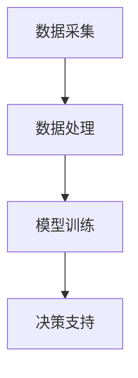
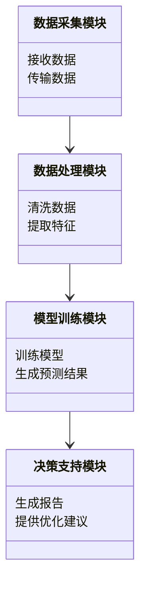

                 


# 构建智能化的资产负债管理系统

## 关键词：智能化、资产负债、AI、大数据、风险管理、系统架构

## 摘要：  
随着金融市场的快速发展和复杂性增加，传统的资产负债管理方法已难以满足现代企业的需求。本文将详细探讨如何利用人工智能（AI）和大数据技术构建智能化的资产负债管理系统，以实现对资产和负债的智能化监控、预测和优化管理。通过结合机器学习、深度学习和大数据分析等技术，本文将从系统架构设计、算法实现、项目实战等多个维度，全面解析智能化资产负债管理的核心原理和实践应用。

---

## 第1章：智能化资产负债管理的背景与核心概念

### 1.1 资产负债管理的背景
#### 1.1.1 资产负债管理的基本概念  
资产负债管理是企业财务管理的重要组成部分，旨在通过对资产和负债的科学配置和管理，实现企业价值最大化和风险最小化。  

#### 1.1.2 传统资产负债管理的局限性  
传统资产负债管理依赖人工操作，存在效率低、风险预测能力弱、数据处理能力有限等问题。  

#### 1.1.3 智能化资产负债管理的必要性  
随着金融市场波动加剧，企业对实时风险监控和智能化决策的需求日益迫切。智能化资产负债管理能够通过AI和大数据技术，实现对资产和负债的动态监控和智能优化。  

### 1.2 智能化资产负债管理的核心概念
#### 1.2.1 AI与大数据在资产负债管理中的应用  
AI和大数据技术可以用于风险评估、资产定价、市场预测等关键环节。  

#### 1.2.2 智能化资产负债管理的关键技术  
包括机器学习、深度学习、自然语言处理、图神经网络等技术。  

#### 1.2.3 系统架构与功能模块  
智能化资产负债管理系统通常包含数据采集、数据处理、模型训练、决策支持等功能模块。  

---

## 第2章：智能化资产负债管理的核心技术

### 2.1 AI技术在资产负债管理中的应用
#### 2.1.1 机器学习在风险评估中的应用  
通过机器学习算法，可以对资产和负债的风险进行实时评估和预测。  

#### 2.1.2 自然语言处理在财务报告分析中的应用  
NLP技术可以用于自动解析财务报告，提取关键信息并生成风险评估报告。  

#### 2.1.3 图神经网络在资产关联性分析中的应用  
图神经网络可以用于分析资产之间的关联性，发现潜在风险点。  

### 2.2 大数据分析在资产负债管理中的应用
#### 2.2.1 数据采集与处理  
通过数据采集工具，获取资产和负债相关的多源数据，并进行清洗和预处理。  

#### 2.2.2 数据挖掘与预测  
利用数据挖掘技术，发现数据中的潜在规律，并进行风险预测和资产定价。  

#### 2.2.3 数据可视化与决策支持  
通过数据可视化工具，将分析结果以直观的方式呈现，支持决策者进行智能化决策。  

---

## 第3章：智能化资产负债管理的技术基础

### 3.1 机器学习与深度学习基础
#### 3.1.1 机器学习基础  
机器学习的基本概念、常见算法（如线性回归、支持向量机、随机森林等）及其在风险评估中的应用。  

#### 3.1.2 深度学习基础  
深度学习的基本概念、常见模型（如神经网络、卷积神经网络、循环神经网络等）及其在资产定价中的应用。  

### 3.2 数学模型与算法实现
#### 3.2.1 机器学习模型的数学公式  
例如，线性回归模型的公式：  
$$ y = \beta_0 + \beta_1x + \epsilon $$  

#### 3.2.2 深度学习模型的数学公式  
例如，神经网络的前向传播公式：  
$$ a^{[l+1]} = \sigma(w^{[l]}a^{[l]} + b^{[l]}) $$  

---

## 第4章：智能化资产负债管理的系统架构

### 4.1 系统模块划分
#### 4.1.1 数据采集模块  
负责采集资产和负债相关的多源数据。  

#### 4.1.2 数据处理模块  
对数据进行清洗、转换和特征提取。  

#### 4.1.3 模型训练模块  
基于机器学习或深度学习算法，训练风险评估模型。  

#### 4.1.4 决策支持模块  
根据模型预测结果，生成风险报告和优化建议。  

### 4.2 系统架构图  


### 4.3 数据库设计
#### 4.3.1 数据表结构  
- 资产表：id, asset_name, asset_value, asset_type  
- 负债表：id, liability_name, liability_value  

#### 4.3.2 数据关系图  
```mermaid
erd
    entity 资产表 {
        id: int
        asset_name: string
        asset_value: float
        asset_type: string
    }
    entity 负债表 {
        id: int
        liability_name: string
        liability_value: float
    }
```

---

## 第5章：智能化资产负债管理的项目实战

### 5.1 项目背景与目标
#### 5.1.1 项目背景  
某企业希望构建一个智能化的资产负债管理系统，以优化资产配置和风险控制。  

#### 5.1.2 项目目标  
实现资产和负债的实时监控、风险预测和智能优化。  

### 5.2 系统功能设计
#### 5.2.1 功能模块设计  
- 数据采集模块：对接企业财务系统，获取实时数据。  
- 数据处理模块：清洗数据并提取特征。  
- 模型训练模块：训练风险评估模型。  
- 决策支持模块：生成风险报告和优化建议。  

#### 5.2.2 系统功能图  


### 5.3 系统实现
#### 5.3.1 环境配置  
- 安装Python、TensorFlow、Pandas、Matplotlib等工具。  

#### 5.3.2 核心代码实现  
```python
import pandas as pd
import numpy as np
from sklearn.linear_model import LinearRegression

# 数据加载
data = pd.read_csv('balance_sheet.csv')

# 特征提取
X = data[['asset_value', 'asset_type']]
y = data['risk_score']

# 模型训练
model = LinearRegression()
model.fit(X, y)

# 模型预测
new_asset = np.array([[1000000, '固定资产']])
predicted_risk = model.predict(new_asset)
print(f'预测风险值为：{predicted_risk[0][0]:.2f}')
```

### 5.4 项目小结
通过该项目，我们可以看到智能化资产负债管理系统的强大功能和实际应用价值。  

---

## 第6章：智能化资产负债管理的系统优化与扩展

### 6.1 系统优化
#### 6.1.1 模型优化  
通过调整算法参数、引入更复杂的模型（如XGBoost、LSTM）来提高预测精度。  

#### 6.1.2 系统性能优化  
通过优化数据库查询效率、引入缓存机制等方法，提升系统的运行效率。  

### 6.2 系统扩展
#### 6.2.1 多源数据接入  
支持更多数据源（如外部市场数据、第三方API）的接入，提升系统的数据处理能力。  

#### 6.2.2 多语言支持  
支持多种语言的财务报告解析，增强系统的国际化能力。  

---

## 第7章：智能化资产负债管理的总结与展望

### 7.1 总结
智能化资产负债管理系统通过AI和大数据技术，显著提高了企业资产和负债管理的效率和准确性。  

### 7.2 展望
未来，随着AI技术的不断发展，智能化资产负债管理系统将更加智能化、自动化，并在更多领域得到广泛应用。  

---

## 作者：AI天才研究院/AI Genius Institute & 禅与计算机程序设计艺术 /Zen And The Art of Computer Programming

