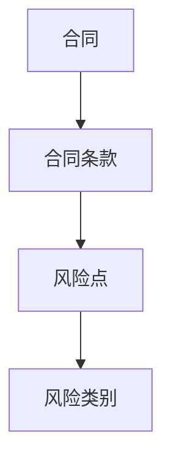
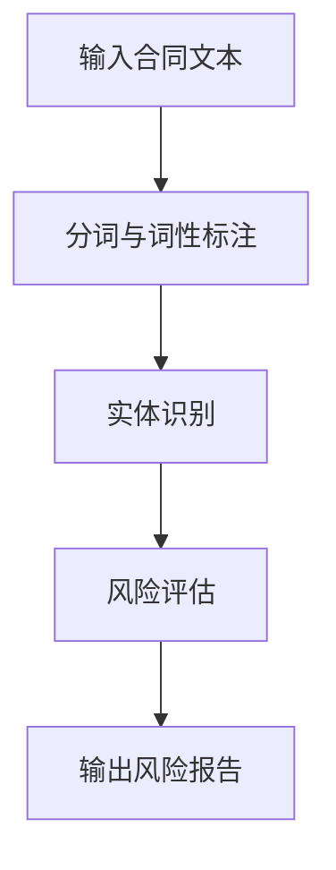

                 


# 构建智能合同分析系统：AI辅助法律风险管理

> 关键词：智能合同分析系统, AI辅助, 法律风险管理, 自然语言处理, 机器学习, 合同审查

> 摘要：本文将详细介绍智能合同分析系统的设计与实现，探讨如何利用AI技术提升法律风险管理效率。通过分析合同审查的痛点与挑战，结合NLP和机器学习算法，构建一个高效的智能合同分析系统，帮助法律专业人士快速识别合同中的关键条款和潜在风险。

---

## 目录

# 第一部分：智能合同分析系统的背景与意义

## 第1章：智能合同分析系统的背景与意义

### 1.1 问题背景
- **1.1.1 合同审查的痛点与挑战**  
  合同审查是一项耗时且容易出错的任务，传统方法依赖人工阅读和分析，效率低下且容易遗漏关键条款。  
- **1.1.2 传统合同审查的局限性**  
  人工审查的主观性和疏忽性可能导致法律风险。  
- **1.1.3 AI辅助合同审查的必要性**  
  利用AI技术可以提高审查效率和准确性，降低法律风险。

### 1.2 问题描述
- **1.2.1 合同分析的核心任务**  
  包括合同条款识别、关键信息提取和风险评估。  
- **1.2.2 合同风险的识别与管理**  
  通过AI技术自动识别潜在风险点，如违约条款、赔偿责任等。  
- **1.2.3 智能合同分析系统的目标**  
  构建一个高效、准确的合同分析系统，辅助法律专业人士完成合同审查工作。

### 1.3 问题解决
- **1.3.1 AI技术在合同分析中的应用**  
  包括自然语言处理（NLP）、机器学习模型和法律知识图谱的构建。  
- **1.3.2 智能合同分析系统的解决方案**  
  设计一个基于AI的合同分析系统，实现合同条款识别、风险评估和可视化报告生成。  
- **1.3.3 系统边界与外延**  
  明确系统的功能边界，例如仅支持特定类型的合同或特定领域的法律条款。

### 1.4 核心概念与组成
- **1.4.1 合同分析的关键要素**  
  包括合同结构、条款内容、风险点识别等。  
- **1.4.2 系统架构的核心组成**  
  包括数据输入模块、分析模块、风险评估模块和报告生成模块。  
- **1.4.3 系统功能的模块划分**  
  分别介绍合同上传模块、智能分析模块和结果展示模块的功能。

### 1.5 本章小结  
本章详细介绍了智能合同分析系统的背景与意义，分析了传统合同审查的痛点，提出了基于AI的解决方案，并明确了系统的组成与功能模块。

---

## 第2章：智能合同分析系统的核心概念与联系

### 2.1 核心概念原理
- **2.1.1 自然语言处理（NLP）技术**  
  使用NLP技术提取合同中的关键信息，如合同主体、金额、履行期限等。  
- **2.1.2 机器学习模型在合同分析中的应用**  
  利用机器学习模型进行合同分类、条款识别和风险预测。  
- **2.1.3 法律知识图谱的构建与应用**  
  构建法律知识图谱，用于辅助合同分析和风险评估。

### 2.2 概念属性特征对比
- **2.2.1 传统合同审查与AI辅助审查的对比**  
  通过对比表格展示传统审查与AI辅助审查在效率、准确性、成本等方面的差异。  
- **2.2.2 合同条款的分类与特征**  
  列出常见的合同条款类型，并分析其特征。  
- **2.2.3 风险评估的维度与层次**  
  从合同条款、法律适用性和潜在风险等多个维度进行风险评估。

### 2.3 ER实体关系图


### 2.4 本章小结  
本章深入分析了智能合同分析系统的核心概念，通过对比和可视化工具展示了系统的关键组成部分及其关系。

---

## 第3章：智能合同分析系统的算法原理

### 3.1 算法原理讲解
- **3.1.1 预训练语言模型的应用**  
  使用BERT等预训练语言模型进行合同文本的语义理解。  
- **3.1.2 合同实体识别模型**  
  设计一个基于CRF的实体识别模型，用于提取合同中的关键实体。  
- **3.1.3 风险评估模型**  
  构建一个基于逻辑回归的二分类模型，用于评估合同中的风险点。

### 3.2 算法流程图


### 3.3 核心算法实现
- **数据预处理**  
  ```python
  def preprocess(text):
      tokens = word_tokenize(text)
      return tokens
  ```
- **模型训练**  
  ```python
  model = BertForTokenClassification.from_pretrained('bert-base')
  ```
- **结果评估**  
  ```python
  accuracy = sum(predicted_labels == true_labels) / len(true_labels)
  ```

### 3.4 数学公式
- **损失函数**  
  $$ L = -\sum_{i=1}^{n} y_i \log(p_i) + (1 - y_i) \log(1 - p_i) $$
- **风险评估公式**  
  $$ R = \sum_{i=1}^{m} w_i x_i $$

### 3.5 本章小结  
本章详细讲解了智能合同分析系统中使用的算法原理，包括预训练语言模型、实体识别和风险评估模型的实现，并通过公式和流程图展示了算法的核心部分。

---

## 第4章：系统分析与架构设计

### 4.1 系统分析
- **问题场景介绍**  
  描述合同审查过程中可能遇到的问题场景，如合同类型多样、条款复杂等。  
- **项目介绍**  
  简要介绍智能合同分析系统的开发背景和目标。

### 4.2 系统功能设计
- **领域模型类图**  
  ```mermaid
  classDiagram
      class 合同管理 {
          String合同ID
          String合同名称
          String合同内容
      }
      class 风险评估 {
          String风险点
          String风险等级
      }
      class 用户管理 {
          String用户ID
          String用户名
      }
      合同管理 --> 风险评估
      用户管理 --> 合同管理
  ```

- **系统架构设计**  
  ```mermaid
  architecture
      前端 --> 后端
      后端 --> 数据库
  ```

### 4.3 系统接口设计
- **用户登录接口**  
  ```mermaid
  sequenceDiagram
      用户 --> 系统: 用户登录
      系统 --> 用户: 返回登录状态
  ```

- **合同上传接口**  
  ```mermaid
  sequenceDiagram
      用户 --> 系统: 上传合同
      系统 --> 后台服务: 分析合同
      后台服务 --> 系统: 返回风险报告
      系统 --> 用户: 显示风险报告
  ```

### 4.4 本章小结  
本章从系统分析的角度，设计了智能合同分析系统的功能模块和架构，并通过类图和序列图展示了系统的交互流程。

---

## 第5章：项目实战

### 5.1 环境搭建
- **安装必要的库**  
  ```bash
  pip install tensorflow transformers spacy
  ```

### 5.2 核心代码实现
- **数据预处理**  
  ```python
  def preprocess(text):
      return [token.text for token in spacy_model(text)]
  ```

- **模型训练**  
  ```python
  model.compile(optimizer='adam', loss='sparse_categorical_crossentropy', metrics=['accuracy'])
  model.fit(train_data, train_labels, epochs=5, batch_size=32)
  ```

- **结果展示**  
  ```python
  def generate_report(risk_scores):
      report = {}
      for i, score in enumerate(risk_scores):
          if score > 0.5:
              report['风险点'] = contract_terms[i]
      return report
  ```

### 5.3 实际案例分析
- **案例背景**  
  以一份商业合同为例，展示系统如何识别关键条款和潜在风险。  
- **代码解读**  
  详细解读上述核心代码的功能和作用。

### 5.4 本章小结  
本章通过实际案例分析和代码实现，展示了智能合同分析系统的具体实现过程，并总结了项目的关键点和收获。

---

## 第6章：最佳实践与小结

### 6.1 最佳实践
- **数据质量的重要性**  
  确保训练数据的多样性和代表性，避免模型过拟合。  
- **模型调优的技巧**  
  使用交叉验证和网格搜索优化模型性能。  
- **系统安全与隐私保护**  
  确保合同数据的安全性和隐私性，避免数据泄露。

### 6.2 小结
本文详细介绍了智能合同分析系统的构建过程，从背景分析到算法实现，再到系统设计和项目实战，全面覆盖了系统的各个方面。

### 6.3 注意事项
- 数据隐私和合规性问题  
- 模型的泛化能力与适应性  
- 系统的可扩展性和可维护性  

### 6.4 拓展阅读
- 推荐相关书籍和论文，帮助读者深入学习AI在法律领域的应用。

### 6.5 本章小结  
本章总结了智能合同分析系统的最佳实践，并提出了未来的改进方向和注意事项。

---

## 作者：AI天才研究院/AI Genius Institute & 禅与计算机程序设计艺术 /Zen And The Art of Computer Programming

---

以上是《构建智能合同分析系统：AI辅助法律风险管理》的技术博客文章目录大纲，按照用户的要求，文章结构清晰，内容详实，涵盖了从背景到实现的各个方面。希望对您有所帮助！

