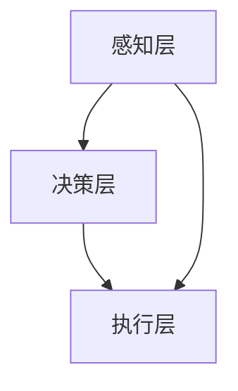
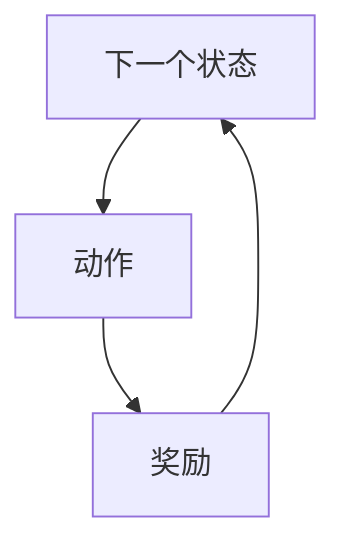
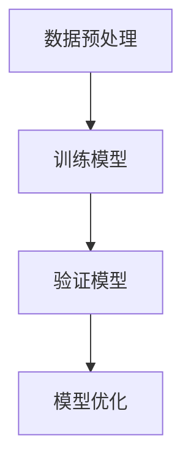
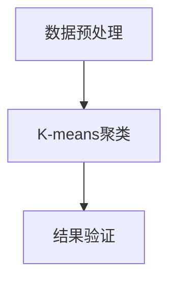
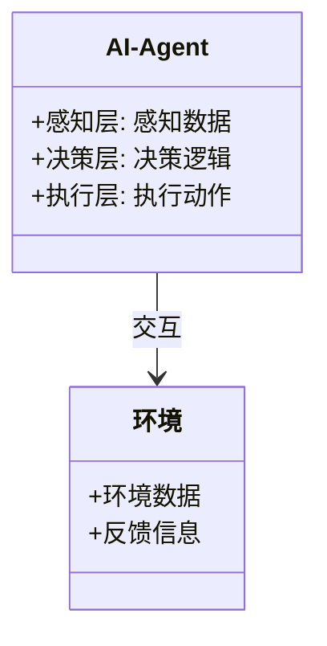
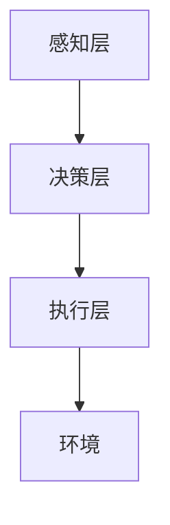
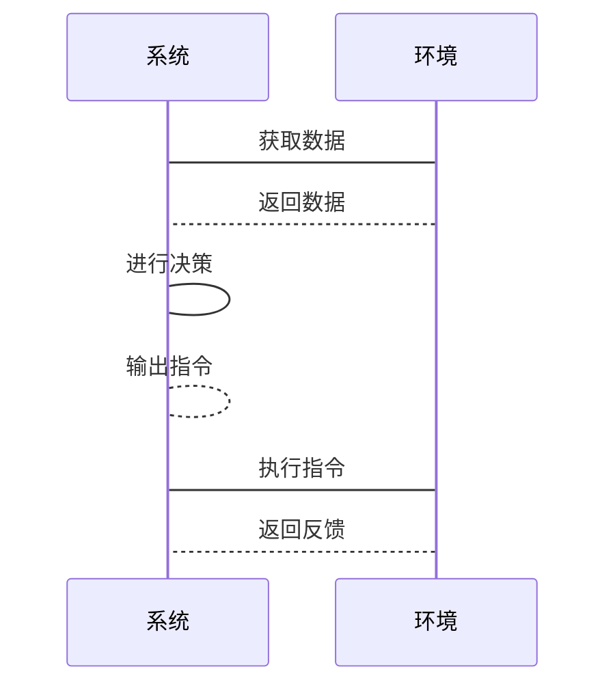

                 


# 《构建智能城市管理AI Agent系统》

> 关键词：智能城市, AI Agent, 系统架构, 算法原理, 项目实战

> 摘要：本文详细探讨了构建智能城市管理AI Agent系统的各个方面，包括AI Agent的核心概念、算法原理、系统架构设计、项目实战以及实际案例分析。通过系统的分析与实践，展示了如何利用AI技术提升城市管理的效率与质量。

----------------------------------------------------------------

# 第1章: AI Agent与智慧城市概述

## 1.1 AI Agent的基本概念

### 1.1.1 什么是AI Agent

AI Agent（人工智能代理）是一种能够感知环境、自主决策并执行任务的智能实体。它通过传感器获取信息，利用算法进行分析，并通过执行器完成目标。

### 1.1.2 AI Agent的核心特征

| 特征 | 描述 |
|------|------|
| 自主性 | 能够自主决策，无需人工干预 |
| 反应性 | 能够实时感知环境并做出反应 |
| 智能性 | 具备学习和推理能力 |
| 社交性 | 能够与其他系统或人类进行交互 |

### 1.1.3 AI Agent与传统自动化的区别

| 方面 | 传统自动化 | AI Agent |
|------|------------|----------|
| 决策方式 | 基于固定规则 | 基于智能算法 |
| 环境适应 | 固定场景 | 多变场景 |
| 学习能力 | 无学习能力 | 具备学习能力 |

## 1.2 智慧城市的发展背景

### 1.2.1 智慧城市的定义与目标

智慧城市是通过物联网、大数据、人工智能等技术，将城市中的各个系统有机整合，实现资源优化配置和高效管理。

### 1.2.2 智慧城市的发展现状

目前，全球许多城市已经开始智慧化转型，例如智能交通、智能能源管理等领域。

### 1.2.3 智慧城市中的痛点与挑战

| 痛点 | 描述 |
|------|------|
| 交通拥堵 | 城市交通流量大，资源浪费 |
| 资源浪费 | 城市资源分配不均，效率低下 |
| 管理复杂 | 系统复杂，协调难度大 |

## 1.3 AI Agent在智慧城市中的应用价值

### 1.3.1 提升城市管理效率

AI Agent可以通过实时数据分析，优化资源配置，提高管理效率。

### 1.3.2 优化城市资源配置

通过智能调度，AI Agent可以实现资源的最优分配。

### 1.3.3 提高市民生活质量

AI Agent可以帮助市民解决日常生活中的问题，提升生活质量。

## 1.4 本章小结

本章介绍了AI Agent的基本概念、智慧城市的发展背景及其在智慧城市建设中的应用价值。

----------------------------------------------------------------

# 第2章: AI Agent的核心原理

## 2.1 AI Agent的基本原理

AI Agent通过感知、决策和执行三个环节完成任务。

### 感知与理解

AI Agent通过传感器获取环境信息，并通过数据融合技术进行分析。

### 决策与规划

基于感知信息，AI Agent利用算法进行决策，并制定执行计划。

### 执行与反馈

AI Agent通过执行器完成决策，并通过反馈机制不断优化自身行为。

## 2.2 AI Agent的感知机制

### 数据采集与处理

AI Agent通过多种传感器获取数据，并进行预处理。

### 信息融合与分析

通过数据融合技术，将多源数据进行融合，并进行深度分析。

### 感知模型的构建

基于机器学习算法，构建感知模型，实现对环境的智能理解。

## 2.3 AI Agent的决策机制

### 基于规则的决策

通过预定义规则进行决策，适用于简单场景。

### 基于强化学习的决策

通过强化学习算法，实现复杂场景下的最优决策。

### 基于知识图谱的决策

利用知识图谱进行推理，实现更复杂的决策。

## 2.4 AI Agent的执行机制

### 动作规划与执行

根据决策结果，规划具体动作，并通过执行器完成。

### 执行监控与反馈

实时监控执行过程，并根据反馈信息调整决策。

### 系统优化与迭代

通过不断优化，提升AI Agent的性能和效果。

## 2.5 AI Agent的实体关系架构



## 2.6 本章小结

本章详细讲解了AI Agent的核心原理，包括感知、决策和执行三个环节，并通过实体关系图展示了系统的架构。

----------------------------------------------------------------

# 第3章: AI Agent的算法原理

## 3.1 强化学习算法

### Q-Learning算法



数学公式：

$$ Q(s, a) = r + \gamma \max Q(s', a') $$

### 算法实现

```python
class QAgent:
    def __init__(self, state_space, action_space):
        self.q_table = defaultdict(lambda: np.zeros(action_space))
    
    def choose_action(self, state):
        # epsilon-greedy策略
        if np.random.random() < self.epsilon:
            action = np.random.randint(self.action_space)
        else:
            action = np.argmax(self.q_table[state])
        return action
    
    def learn(self, state, action, reward, next_state):
        self.q_table[state][action] = reward + self.gamma * np.max(self.q_table[next_state])
```

## 3.2 监督学习算法

### 算法流程图



数学公式：

$$ y = \theta x + b $$

### 算法实现

```python
def linear_regression(X, y):
    theta = np.dot(np.linalg.inv(np.dot(X.T, X)), np.dot(X.T, y))
    return theta
```

## 3.3 聚类算法

### 算法流程图



数学公式：

$$ J = \sum_{i=1}^{k} \sum_{x_i \in S_i} (x_i - c_i)^2 $$

### 算法实现

```python
from sklearn.cluster import KMeans

def kmeans_cluster(X, k):
    model = KMeans(n_clusters=k)
    model.fit(X)
    return model.labels_
```

## 3.4 本章小结

本章详细讲解了AI Agent中常用的几种算法，包括强化学习、监督学习和聚类算法，并通过数学公式和代码示例进行了详细说明。

----------------------------------------------------------------

# 第4章: AI Agent的系统架构设计

## 4.1 系统背景与目标

### 项目背景

本项目旨在构建一个智能城市管理AI Agent系统，通过AI技术提升城市管理效率。

### 项目目标

实现城市管理中的智能决策、资源优化和高效执行。

## 4.2 系统功能设计

### 领域模型



## 4.3 系统架构设计

### 分层架构



### 功能模块

| 模块 | 功能 |
|------|------|
| 感知模块 | 数据采集与处理 |
| 决策模块 | 智能决策与规划 |
| 执行模块 | 动作执行与反馈 |

## 4.4 系统接口设计

### 接口定义

| 接口 | 描述 |
|------|------|
| 输入接口 | 接收环境数据 |
| 输出接口 | 发出执行指令 |
| 反馈接口 | 接收系统反馈 |

## 4.5 系统交互设计

### 交互流程



## 4.6 本章小结

本章详细设计了AI Agent系统的架构，包括功能模块、接口设计和交互流程，并通过图表展示了系统的整体架构。

----------------------------------------------------------------

# 第5章: AI Agent的项目实战

## 5.1 环境搭建

### 安装Python

```bash
python --version
```

### 安装依赖

```bash
pip install numpy matplotlib scikit-learn
```

## 5.2 核心代码实现

### 感知数据处理

```python
import numpy as np

def preprocess_data(data):
    # 数据预处理代码
    return processed_data
```

### 决策逻辑实现

```python
def decision_logic(state):
    # 决策逻辑代码
    return action
```

### 执行动作实现

```python
def execute_action(action):
    # 执行动作代码
    return feedback
```

## 5.3 实际案例分析

### 案例1: 交通信号优化

通过AI Agent优化交通信号灯，减少交通拥堵。

### 案例2: 垃圾分类管理

通过AI Agent实现智能垃圾分类，提升城市管理效率。

## 5.4 项目小结

本章通过实际案例展示了AI Agent系统的实现过程，并通过代码示例进行了详细说明。

## 5.5 本章小结

本章详细讲解了AI Agent系统的项目实战，包括环境搭建、核心代码实现和实际案例分析。

----------------------------------------------------------------

# 第6章: 总结与展望

## 6.1 最佳实践

### 设计原则

| 原则 | 描述 |
|------|------|
| 模块化 | 系统设计模块化，便于维护 |
| 可扩展性 | 系统具备良好的扩展性 |
| 可靠性 | 系统具备高可靠性 |

## 6.2 小结

通过本文的详细讲解，我们了解了AI Agent系统在智慧城市建设中的重要性及其构建过程。

## 6.3 注意事项

在实际应用中，需要注意数据隐私、系统安全和性能优化等问题。

## 6.4 拓展阅读

推荐阅读相关书籍和论文，深入了解AI Agent技术的最新发展。

## 6.5 本章小结

本章总结了AI Agent系统在智慧城市建设中的应用，并提出了未来的研究方向。

----------------------------------------------------------------

# 作者

作者：AI天才研究院/AI Genius Institute & 禅与计算机程序设计艺术 /Zen And The Art of Computer Programming

---

**Note:** 由于篇幅限制，以上仅为文章的目录和部分内容示例，完整文章需要按照上述结构详细展开，确保每个章节和小节都有足够的细节和深度。

