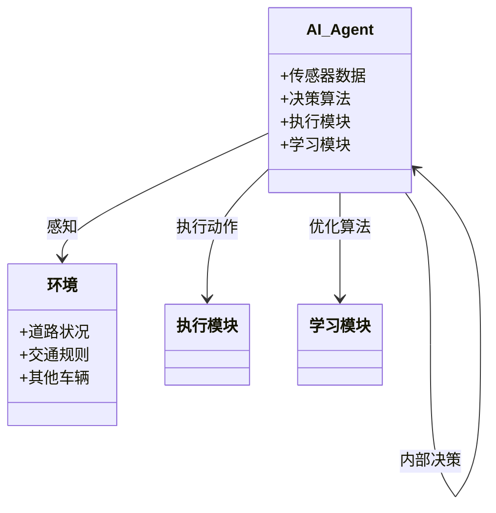
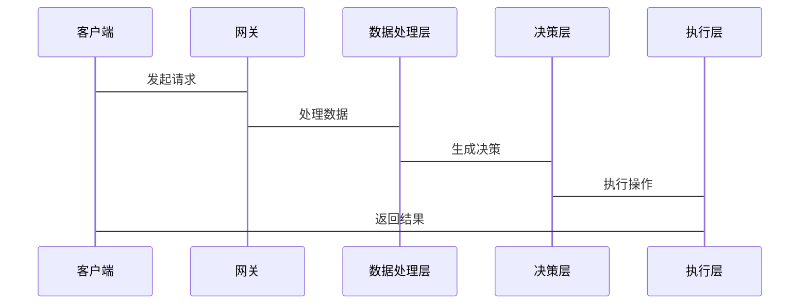

                 


# 构建符合道德准则的AI Agent

## 关键词：AI Agent，道德准则，人工智能，算法，系统架构

## 摘要：  
在人工智能迅速发展的今天，AI Agent（智能代理）作为一类能够自主决策和行动的智能体，正在被广泛应用于各个领域。然而，AI Agent的决策过程可能会带来伦理和道德上的挑战。如何在AI Agent的设计和实现中融入道德准则，确保其行为符合人类社会的伦理规范，成为当前技术领域的重要课题。本文从AI Agent的基本概念出发，深入探讨其核心算法、系统架构以及道德准则的实现，结合实际案例，为构建符合道德准则的AI Agent提供系统的理论支持和实践指导。

---

## 第1章：AI Agent的基本概念与问题背景

### 1.1 从传统AI到AI Agent的演进

#### 1.1.1 AI Agent的定义与核心要素
AI Agent（智能代理）是指能够感知环境、自主决策并采取行动的智能系统。与传统AI不同，AI Agent具有更强的自主性和适应性，能够在动态环境中完成复杂任务。其核心要素包括：
- **感知能力**：通过传感器或数据输入获取环境信息。
- **决策能力**：基于感知信息，通过算法做出决策。
- **行动能力**：根据决策执行具体操作。
- **学习能力**：通过经验优化自身行为。

#### 1.1.2 AI Agent与传统AI的区别
传统AI主要依赖规则和预设程序完成任务，而AI Agent具备更强的自主性和适应性，能够根据环境动态调整行为。例如，传统的语音识别系统只是将声音转化为文字，而AI Agent则能够理解上下文并提供相应的服务，如智能音箱可以根据用户的指令执行多种操作。

#### 1.1.3 AI Agent在现代技术中的地位
AI Agent在现代技术中扮演着重要角色，尤其是在自动驾驶、智能客服、机器人助手等领域。它们不仅需要完成特定任务，还需要在复杂环境中与人类和其他系统协同工作。

### 1.2 道德准则在AI Agent中的重要性

#### 1.2.1 为什么AI Agent需要符合道德准则
AI Agent的决策可能对人类产生重大影响。例如，自动驾驶汽车需要在紧急情况下做出决策，可能涉及人员的生命安全。如果AI Agent缺乏道德准则，可能导致不可接受的后果。

#### 1.2.2 道德缺失对AI Agent的潜在风险
- **责任归属**：当AI Agent出现问题时，责任难以界定。
- **社会接受度**：缺乏道德约束的AI Agent可能被社会排斥。
- **伦理风险**：AI Agent可能做出违背人类伦理的行为。

#### 1.2.3 道德准则在AI Agent设计中的作用
- **规范行为**：确保AI Agent的行为符合社会规范。
- **提升信任度**：用户更愿意与符合道德准则的AI Agent交互。
- **降低风险**：通过道德约束减少潜在的负面后果。

### 1.3 本章小结
本章从AI Agent的基本概念出发，分析了其与传统AI的区别，强调了道德准则在AI Agent设计中的重要性。接下来的章节将深入探讨AI Agent的核心算法和系统架构，并结合实际案例，详细阐述如何将道德准则融入AI Agent的构建过程中。

---

## 第2章：AI Agent的核心概念与道德原则

### 2.1 AI Agent的结构与功能

#### 2.1.1 AI Agent的感知与决策机制
AI Agent的感知机制包括数据采集、信息处理和状态识别。决策机制则依赖于算法模型，根据感知信息生成行动计划。

#### 2.1.2 AI Agent的行为模式
AI Agent的行为模式可以分为**反应式**和**规划式**两种。反应式AI Agent基于当前感知做出即时反应，而规划式AI Agent则会根据长期目标制定详细计划。

#### 2.1.3 AI Agent的自主性与依赖性
AI Agent的自主性体现在其能够独立完成任务，而依赖性则体现在其需要依赖外部数据和计算资源。

### 2.2 道德准则的核心要素

#### 2.2.1 道德准则的分类与特征
道德准则可以分为**责任**、**透明性**、**公正性**、**隐私保护**等核心要素。每个要素都有其独特的特征和实现方式。

#### 2.2.2 AI Agent中的责任分配
AI Agent在决策过程中需要明确责任归属。例如，在自动驾驶中，责任可能需要在制造商、软件开发者和用户之间分配。

#### 2.2.3 透明性与可解释性
AI Agent的行为需要透明和可解释，以便用户和监管机构能够理解其决策过程。例如，智能音箱需要向用户解释其操作逻辑。

### 2.3 AI Agent与人类伦理的对比分析

#### 2.3.1 人类伦理与AI Agent道德的异同
人类伦理基于复杂的文化和社会规范，而AI Agent的道德准则则是通过算法和规则明确定义的。两者在目标上相似，但在实现方式上存在显著差异。

#### 2.3.2 道德准则在AI Agent中的具体应用
通过制定明确的道德规则，AI Agent可以在决策过程中遵循伦理规范。例如，智能客服在处理用户请求时，需要遵循隐私保护和数据安全的道德准则。

#### 2.3.3 道德框架的构建与优化
构建道德框架需要结合具体应用场景，通过多方利益相关者的参与，不断优化道德准则。例如，在医疗AI Agent中，需要考虑患者隐私和数据安全。

### 2.4 本章小结
本章详细分析了AI Agent的核心概念和道德准则的核心要素，探讨了AI Agent与人类伦理的异同。接下来的章节将重点讲解AI Agent的算法原理和系统架构，并结合实际案例，展示如何将道德准则融入AI Agent的设计和实现中。

---

## 第3章：AI Agent的算法原理

### 3.1 AI Agent的核心算法概述

#### 3.1.1 强化学习在AI Agent中的应用
强化学习是一种通过试错机制优化决策的算法。例如，自动驾驶汽车可以通过强化学习不断优化其驾驶策略。

#### 3.1.2 监督学习与无监督学习的结合
在某些场景下，AI Agent可能需要结合监督学习和无监督学习。例如，在自然语言处理任务中，AI Agent可以利用监督学习进行分类，同时通过无监督学习发现数据中的潜在模式。

#### 3.1.3 深度学习在AI Agent中的作用
深度学习通过多层神经网络模型，能够从大量数据中提取复杂特征。例如，在图像识别任务中，深度学习可以帮助AI Agent准确识别环境中的物体。

### 3.2 道德准则在算法中的体现

#### 3.2.1 道德评分机制的设计
为了确保AI Agent的行为符合道德准则，可以在算法中引入道德评分机制。例如，可以通过定义一组道德评分规则，对AI Agent的决策进行评分。

#### 3.2.2 道德约束在算法中的实现
在强化学习中，可以通过定义奖励函数来实现道德约束。例如，当AI Agent的行为违反道德准则时，其奖励会受到惩罚。

#### 3.2.3 道德决策树的构建
为了帮助AI Agent在复杂场景中做出符合道德的决策，可以构建道德决策树。例如，在自动驾驶中，当面临紧急情况时，AI Agent可以根据决策树选择最优的行动方案。

### 3.3 算法中的道德冲突与解决方案

#### 3.3.1 道德冲突的典型案例
例如，在自动驾驶中，AI Agent可能需要在保护乘客和保护行人的利益之间做出选择。

#### 3.3.2 道德优先级的排序方法
为了处理道德冲突，可以预先定义道德优先级。例如，可以将生命安全放在首位，其次是财产损失。

#### 3.3.3 道德权衡的数学模型
可以通过数学模型量化道德权衡。例如，可以通过定义一个权衡系数，将不同的道德准则进行加权求和。

---

## 第4章：AI Agent的系统分析与架构设计

### 4.1 问题场景介绍
以自动驾驶为例，设计一个AI Agent需要考虑复杂的环境因素和道德决策。

### 4.2 系统功能设计

#### 4.2.1 领域模型设计
通过领域模型（mermaid类图）展示AI Agent的功能模块及其相互关系。



### 4.3 系统架构设计

#### 4.3.1 系统架构图（mermaid架构图）
展示AI Agent的系统架构，包括感知层、决策层和执行层。


### 4.4 系统交互设计

#### 4.4.1 系统交互序列图（mermaid序列图）
展示AI Agent与环境和其他系统的交互过程。



### 4.5 本章小结
本章通过实际案例，详细分析了AI Agent的系统架构和交互设计。接下来的章节将结合项目实战，展示如何将道德准则融入AI Agent的具体实现中。

---

## 第5章：AI Agent的项目实战

### 5.1 环境安装
需要安装Python、TensorFlow、Keras等开发工具。

### 5.2 系统核心实现源代码

#### 5.2.1 道德评分机制的实现
```python
def moral_score(action):
    # 根据道德准则评估动作的道德得分
    if action == 'save_passenger':
        return 0.8
    elif action == 'save_pedestrian':
        return 0.7
    else:
        return 0.0
```

#### 5.2.2 强化学习算法的实现
```python
import numpy as np
import gym

env = gym.make('CartPole-v0')
model = ...
for episode in range(1000):
    state = env.reset()
    total_reward = 0
    done = False
    while not done:
        action = model.predict(state)
        next_state, reward, done, info = env.step(action)
        total_reward += reward
        env.render()
```

### 5.3 代码应用解读与分析
通过代码实现道德评分机制和强化学习算法，展示如何将道德准则融入AI Agent的决策过程中。

### 5.4 实际案例分析
以自动驾驶为例，分析AI Agent在不同场景下的道德决策。

### 5.5 本章小结
本章通过实际项目案例，展示了如何将道德准则融入AI Agent的具体实现。接下来的章节将总结最佳实践，并展望未来的发展方向。

---

## 第6章：AI Agent的总结与展望

### 6.1 最佳实践tips
- 在设计AI Agent时，始终将道德准则放在首位。
- 定期评估和优化道德评分机制。
- 保持透明和可解释性，提升用户信任度。

### 6.2 小结
本文从AI Agent的基本概念出发，深入探讨了其核心算法和系统架构，并结合实际案例，展示了如何将道德准则融入AI Agent的构建过程中。

### 6.3 注意事项
- 道德准则的实现需要结合具体应用场景。
- 道德评分机制需要不断优化和调整。
- 道德决策的透明性和可解释性是提升用户信任的关键。

### 6.4 拓展阅读
推荐阅读相关领域的最新研究论文和书籍，例如《道德算法：人工智能的伦理与设计》。

---

## 作者：AI天才研究院/AI Genius Institute & 禅与计算机程序设计艺术/Zen And The Art of Computer Programming

---

**本文通过详细分析AI Agent的核心概念、算法原理和系统架构，结合实际案例，展示了如何将道德准则融入AI Agent的构建过程中。从理论到实践，为构建符合道德准则的AI Agent提供了系统的理论支持和实践指导。**

