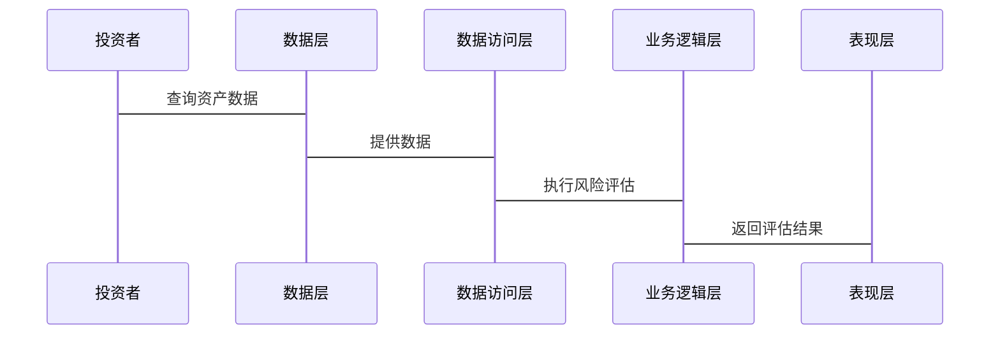

                 


# 构建精准的投资风险评估模型

> **关键词**：投资风险，评估模型，机器学习，金融数据分析，风险管理，投资决策优化

> **摘要**：本文详细探讨了如何通过数据分析和机器学习构建精准的投资风险评估模型，帮助投资者优化决策，降低风险。文章从背景介绍、核心概念、算法原理到系统架构和项目实战，全面解析了模型构建的全过程。

---

## 第1章：投资风险评估模型的背景与概念

### 1.1 投资风险的基本概念

#### 1.1.1 风险的定义与分类

投资风险是指在投资过程中，由于市场波动、经济变化等因素，可能导致投资收益低于预期甚至出现损失的可能性。投资风险可以分为以下几类：

- **市场风险**：由于市场整体波动引起的资产价格波动风险。
- **信用风险**：债券发行人或借款方无法按时偿还本金和利息的风险。
- **流动性风险**：资产在短时间内难以以合理价格变现的风险。
- **操作风险**：由于操作失误或内部控制系统不足导致的损失风险。

#### 1.1.2 投资风险评估的重要性

在投资决策中，准确评估风险是投资者制定合理投资策略的基础。通过风险评估，投资者可以了解潜在损失的可能性，从而制定相应的风险管理策略，如分散投资、设置止损等。

#### 1.1.3 投资风险评估模型的定义与作用

投资风险评估模型是通过数学和统计方法，对投资项目或资产的风险进行量化和预测的工具。其作用包括：

- 量化风险：将抽象的风险概念转化为具体的数据指标。
- 辅助决策：为投资者提供科学的风险分析结果，帮助制定投资策略。
- 监控风险：实时监控投资组合的风险变化，及时调整投资策略。

### 1.2 投资风险评估的背景与现状

#### 1.2.1 当前投资环境的复杂性

随着全球经济一体化和金融市场的多样化，投资环境日益复杂。经济波动、政策变化、地缘政治等多重因素交织，增加了投资风险的不确定性。

#### 1.2.2 投资风险评估模型的发展历程

投资风险评估从传统的财务比率分析，逐步发展到利用大数据和机器学习算法进行预测。早期模型主要基于历史数据分析，而现代模型则引入了复杂算法和实时数据，提高了预测的准确性。

#### 1.2.3 当前模型的优缺点

- **优点**：
  - 数据驱动：基于大量历史数据，提供客观的分析结果。
  - 高准确性：通过机器学习算法，模型预测精度较高。
  
- **缺点**：
  - 数据依赖：模型的准确性依赖于数据的完整性和质量。
  - 黑箱问题：部分复杂算法的可解释性较差，影响决策者的理解。

---

## 第2章：投资风险评估的核心概念

### 2.1 风险因素分析

#### 2.1.1 风险因素的特征

风险因素具有以下特征：

- **相关性**：不同风险因素之间可能存在相关性，影响整体风险评估。
- **动态性**：风险因素会随时间变化，需要持续监控和更新。
- **不确定性**：风险因素的未来变化难以完全预测，增加了评估的难度。

### 2.2 风险评估的关键指标

#### 2.2.1 风险价值（VaR）

VaR是指在一定置信水平下，投资组合在一定时间内的最大可能损失。例如，95%置信水平下的1天VaR表示在95%的概率下，投资组合在一天内不会超过该损失。

#### 2.2.2 预期损失（EL）

EL是指在正常市场条件下，投资组合的平均损失。它通常用于信用风险评估。

#### 2.2.3 违约概率（PD）

PD是债务人在未来一定时间内违约的概率，通常用于信用评分模型。

#### 2.2.4 违约损失率（LGD）

LGD是违约情况下，债权人实际损失的比例。

### 2.3 核心概念的原理与联系

#### 2.3.1 风险因素的关联性分析

风险因素之间可能存在正相关或负相关关系。例如，市场风险和信用风险在经济下行周期可能同时增加。

#### 2.3.2 风险评估模型的构建逻辑

模型构建逻辑包括：

1. **数据收集**：收集历史市场数据、财务数据、行业数据等。
2. **特征选择**：筛选对风险影响较大的特征变量。
3. **模型选择**：选择适合的机器学习算法。
4. **模型训练**：利用训练数据拟合模型。
5. **模型验证**：使用测试数据评估模型性能。
6. **模型优化**：调整参数，提升预测精度。

---

## 第3章：投资风险评估模型的算法原理

### 3.1 常用的风险评估算法

#### 3.1.1 线性回归模型

线性回归用于预测连续型变量，如股票价格。其基本假设是自变量与因变量之间存在线性关系。

**数学公式**：

$$ y = \beta_0 + \beta_1 x_1 + \beta_2 x_2 + \dots + \beta_n x_n + \epsilon $$

其中，$y$ 是目标变量，$\beta$ 是系数，$x$ 是自变量，$\epsilon$ 是误差项。

#### 3.1.2 逻辑回归模型

逻辑回归用于分类问题，如预测债券违约与否。其输出结果为概率值，通过sigmoid函数将线性回归结果映射到0到1之间。

**数学公式**：

$$ P(y=1) = \frac{1}{1 + e^{- (\beta_0 + \beta_1 x_1 + \dots + \beta_n x_n)}} $$

#### 3.1.3 决策树模型

决策树是一种树状结构，通过特征分裂来划分数据，最终到达叶节点进行预测。

#### 3.1.4 随机森林模型

随机森林是一种集成学习方法，通过构建多棵决策树并行投票或平均结果来提高预测准确性和鲁棒性。

---

## 第4章：系统分析与架构设计方案

### 4.1 系统功能设计

#### 4.1.1 领域模型

使用mermaid类图展示领域模型，包括投资者、资产、风险因素等实体及其关系。


#### 4.1.2 系统架构设计

使用mermaid架构图展示系统架构，包括数据层、业务逻辑层和表现层。


### 4.2 接口与交互设计

使用mermaid序列图展示系统交互流程。



---

## 第5章：项目实战

### 5.1 环境安装

- **Python**：安装Anaconda或Miniconda。
- **机器学习库**：安装scikit-learn、XGBoost、TensorFlow等。
- **数据处理工具**：安装pandas、numpy、matplotlib。

### 5.2 核心实现

#### 5.2.1 数据预处理

```python
import pandas as pd
import numpy as np

# 假设data是加载好的数据
data = pd.read_csv('investment_risk.csv')

# 处理缺失值
data = data.dropna()

# 标准化处理
from sklearn.preprocessing import StandardScaler
scaler = StandardScaler()
data_scaled = scaler.fit_transform(data)
```

#### 5.2.2 模型训练

```python
from sklearn.model_selection import train_test_split
from sklearn.ensemble import RandomForestClassifier

# 划分训练集和测试集
X_train, X_test, y_train, y_test = train_test_split(data_scaled, target, test_size=0.2)

# 训练随机森林模型
model = RandomForestClassifier()
model.fit(X_train, y_train)
```

#### 5.2.3 结果分析

```python
from sklearn.metrics import classification_report

# 预测结果
y_pred = model.predict(X_test)

# 输出评估结果
print(classification_report(y_test, y_pred))
```

### 5.3 案例分析

以股票市场为例，利用历史价格、市盈率、市净率等特征，构建风险评估模型，预测股票的投资风险等级。

---

## 第6章：未来趋势与挑战

### 6.1 技术进步与新方法

- **深度学习**：如LSTM用于时间序列预测。
- **强化学习**：用于动态投资决策优化。
- **大数据分析**：利用实时数据提高预测精度。

### 6.2 挑战与应对

- **数据质量**：确保数据的完整性和准确性。
- **模型解释性**：提高模型的可解释性，便于决策者理解。
- **计算能力**：优化算法，提高计算效率。

---

## 结语

构建精准的投资风险评估模型是一个复杂而重要的任务。通过结合数据分析、机器学习和系统架构设计，投资者可以更科学地进行决策，降低风险。未来，随着技术的发展，模型将更加精准和智能化，为投资领域带来更大的价值。

---

**作者：AI天才研究院/AI Genius Institute & 禅与计算机程序设计艺术 /Zen And The Art of Computer Programming**

