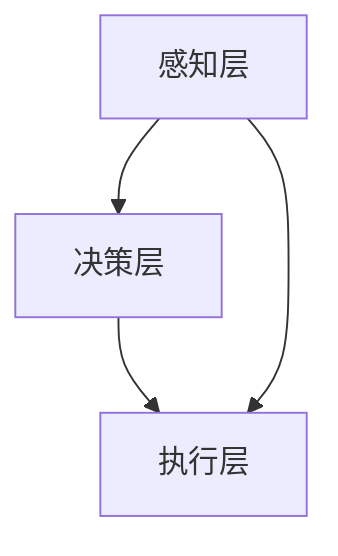

                 


# 《构建自主学习型AI Agent》

---

## 关键词

- 自主学习型AI Agent
- 强化学习
- 系统架构设计
- 项目实战
- 数学模型

---

## 摘要

本文将详细介绍如何构建一个自主学习型AI Agent，从概念、算法到系统架构，再到实际项目实现，层层深入。通过本文，读者将了解自主学习的核心机制、数学模型、系统架构设计，以及如何通过项目实战将理论应用于实践。

---

# 第一部分: 自主学习型AI Agent的背景与概念

## 第1章: AI Agent的基本概念

### 1.1 什么是AI Agent

AI Agent（人工智能代理）是一种能够感知环境、自主决策并执行任务的智能实体。它能够根据环境反馈不断优化自己的行为，以实现特定目标。

#### 1.1.1 AI Agent的定义与特点

- **定义**: AI Agent是指具备感知、推理、规划和执行能力的智能系统。
- **特点**:
  - 自主性：能够独立决策。
  - 反应性：能够实时感知环境并做出反应。
  - 目标导向：以实现特定目标为导向。

#### 1.1.2 自主学习型AI Agent的内涵

- 自主学习型AI Agent能够在没有外部干预的情况下，通过与环境的交互，不断优化自身的知识和行为策略。

#### 1.1.3 自主学习与传统AI的区别

| **特性**       | **传统AI**               | **自主学习型AI Agent**         |
|----------------|--------------------------|--------------------------------|
| 决策方式       | 基于规则或预设程序       | 基于环境反馈进行策略优化       |
| 学习能力       | 无法自主学习             | 具备自主学习能力               |
| 环境适应性     | 适应性较弱               | 具备强环境适应性               |

---

### 1.2 自主学习的必要性

#### 1.2.1 AI Agent面临的挑战

- **动态环境**: 环境复杂且不断变化，传统AI难以适应。
- **不确定性**: 环境中的信息不完整或模糊。
- **任务多样性**: 需要处理多种不同类型的任务。

#### 1.2.2 自主学习的核心价值

- **提高适应性**: 能够在复杂环境中自主调整策略。
- **降低维护成本**: 无需人工频繁更新规则。
- **增强灵活性**: 可以快速适应新任务和新环境。

#### 1.2.3 自主学习在实际场景中的应用

- **游戏AI**: 如MOBA游戏中的智能NPC。
- **机器人控制**: 工业机器人在复杂环境中的自主操作。
- **智能推荐系统**: 根据用户行为动态调整推荐策略。

---

## 第2章: 自主学习型AI Agent的背景与现状

### 2.1 自主学习的背景分析

#### 2.1.1 当前AI技术的发展趋势

- **从规则驱动到数据驱动**: 传统AI依赖规则，现代AI依赖大数据和深度学习。
- **从单一任务到多任务学习**: 现代AI需要处理更多复杂任务。
- **从被动执行到自主决策**: AI需要具备自主决策能力。

#### 2.1.2 自主学习在AI Agent中的地位

- 自主学习是AI Agent实现高度智能的核心技术。
- 自主学习能够使AI Agent具备更强的环境适应能力和问题解决能力。

#### 2.1.3 自主学习与人类学习的类比

- **人类学习**: 通过试错和经验积累，不断优化自己的知识和技能。
- **自主学习型AI Agent**: 通过与环境交互，不断优化自身的策略和知识。

---

### 2.2 自主学习型AI Agent的研究进展

#### 2.2.1 学术界的研究现状

- **强化学习**: 如DeepMind的Alpha系列算法。
- **无监督学习**: 如生成对抗网络（GAN）。
- **迁移学习**: 如将学习成果应用于不同任务。

#### 2.2.2 产业界的实践案例

- **游戏AI**: 如OpenAI的Dota 2 AI。
- **机器人控制**: 如波士顿动力的机器人。
- **智能助手**: 如Siri、Alexa等。

#### 2.2.3 自主学习的关键技术挑战

- **算法效率**: 如何提高学习效率，减少训练时间。
- **环境复杂性**: 如何处理复杂多变的环境。
- **安全与伦理**: 如何确保自主学习的AI Agent行为符合伦理规范。

---

## 第3章: 自主学习的核心机制

### 3.1 自主学习的基本原理

#### 3.1.1 知识表示与推理

- **知识表示**: 使用符号逻辑或概率图模型表示知识。
- **推理**: 基于知识库进行逻辑推理，得出新的结论。

#### 3.1.2 目标设定与优化

- **目标设定**: 确定AI Agent的长期和短期目标。
- **优化**: 使用强化学习等方法优化目标函数。

#### 3.1.3 环境感知与决策

- **环境感知**: 通过传感器或数据源获取环境信息。
- **决策**: 基于感知信息和当前状态，选择最优动作。

---

### 3.2 自主学习的核心算法

#### 3.2.1 强化学习算法

- **Q-learning**: 通过Q值函数学习最优策略。
- **Deep Q-Network (DQN)**: 使用深度神经网络近似Q值函数。
- **策略梯度法**: 直接优化策略的梯度。

#### 3.2.2 监督学习与无监督学习的结合

- **监督学习**: 用于有标签数据的学习任务。
- **无监督学习**: 用于无标签数据的聚类或生成任务。

#### 3.2.3 迁移学习与自适应学习

- **迁移学习**: 将已学知识应用于新任务。
- **自适应学习**: 在新环境中动态调整学习策略。

---

## 第4章: 自主学习的数学模型与公式

### 4.1 基本数学模型

#### 4.1.1 状态空间与动作空间的定义

- **状态空间**: 所有可能的状态集合。
- **动作空间**: 所有可能的动作集合。

#### 4.1.2 奖励函数的数学表达

$$ R(s, a) = \begin{cases} 
r_1 & \text{如果动作 } a \text{ 在状态 } s \text{ 下有效} \\
r_0 & \text{否则}
\end{cases} $$

#### 4.1.3 策略函数的数学表示

$$ \pi(a | s) = P(\text{选择动作 } a \mid \text{状态 } s) $$

---

### 4.2 关键算法的数学推导

#### 4.2.1 强化学习的数学公式

- **Q-learning更新公式**:

$$ Q(s, a) = Q(s, a) + \alpha [r + \gamma \max Q(s', a') - Q(s, a)] $$

其中，$\alpha$是学习率，$\gamma$是折扣因子。

- **策略梯度法的数学表达**:

$$ \nabla \theta J(\theta) = E[\nabla \log \pi(a | s; \theta) Q(s, a; \theta)] $$

---

## 第5章: 自主学习的系统架构与设计

### 5.1 系统架构概述

#### 5.1.1 系统整体架构



---

#### 5.1.2 感知层、决策层与执行层的划分

- **感知层**: 负责获取环境信息。
- **决策层**: 负责制定策略和决策。
- **执行层**: 负责执行决策并输出结果。

#### 5.1.3 各层之间的交互关系

- 感知层向决策层提供环境信息。
- 决策层根据信息制定决策并发送给执行层。
- 执行层执行决策并反馈结果给感知层。

---

### 5.2 系统功能设计

#### 5.2.1 知识库的构建与管理

- **知识库**: 包含AI Agent的所有知识和经验。
- **知识表示**: 使用符号逻辑或概率图模型。

#### 5.2.2 系统功能模块

- **感知模块**: 负责获取环境信息。
- **决策模块**: 负责制定策略。
- **执行模块**: 负责执行决策。

---

## 第6章: 项目实战

### 6.1 环境配置

- **工具安装**: 安装Python、TensorFlow、Keras等工具。
- **环境设置**: 配置开发环境，如Jupyter Notebook。

---

### 6.2 系统核心实现源代码

```python
import numpy as np
import gym

# 初始化环境
env = gym.make('CartPole-v0')
env.seed(42)

# 定义策略函数
def policy(s, theta):
    return np.tanh(np.dot(s, theta))

# 定义价值函数
def value_function(s, w):
    return np.tanh(np.dot(s, w))

# 初始化参数
theta = np.random.randn(4, 1)
w = np.random.randn(4, 1)

# 训练过程
for episode in range(1000):
    s = env.reset()
    for step in range(100):
        a = np.tanh(np.dot(s, theta)) + np.random.randn(1)
        s_next, r, done, _ = env.step(a)
        if done:
            break
        # 更新价值函数
        v = value_function(s, w)
        v_next = value_function(s_next, w)
        delta = r + 0.99*v_next - v
        w += 0.1*delta*np.tanh(s)
        s = s_next
```

---

### 6.3 代码应用解读与分析

- **代码功能**: 实现一个简单的强化学习算法，用于控制CartPole环境。
- **关键代码解析**:
  - `policy(s, theta)`: 定义策略函数。
  - `value_function(s, w)`: 定义价值函数。
  - `theta`和`w`：网络参数。
  - 训练循环：通过与环境交互，更新网络参数。

---

## 第7章: 扩展与实践

### 7.1 最佳实践 tips

- **算法选择**: 根据任务需求选择合适的算法。
- **参数调优**: 通过实验找到最优参数。
- **环境设计**: 设计合理的环境以提高训练效率。

---

### 7.2 小结

通过本文的讲解，读者可以深入了解如何构建自主学习型AI Agent，从理论到实践，逐步掌握相关技术。

---

### 7.3 注意事项

- **数据安全**: 确保数据的安全性和隐私性。
- **算法选择**: 根据具体任务选择合适的算法。
- **系统优化**: 不断优化系统架构和算法性能。

---

### 7.4 拓展阅读

- **推荐书籍**: 《强化学习（深入浅出）》。
- **推荐论文**: DeepMind的Alpha系列论文。
- **在线资源**: OpenAI的官方文档和教程。

---

## 作者

作者：AI天才研究院/AI Genius Institute & 禅与计算机程序设计艺术/Zen And The Art of Computer Programming

--- 

希望这个思考过程对你有所帮助！如果需要进一步调整或补充，请随时告知！

