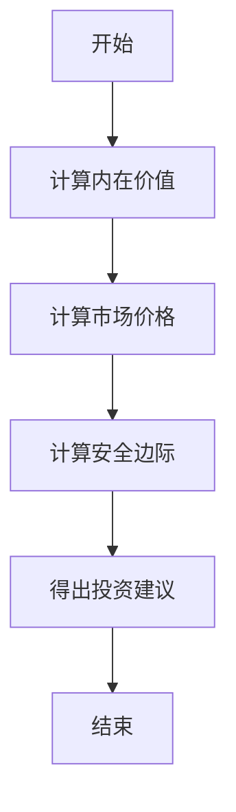
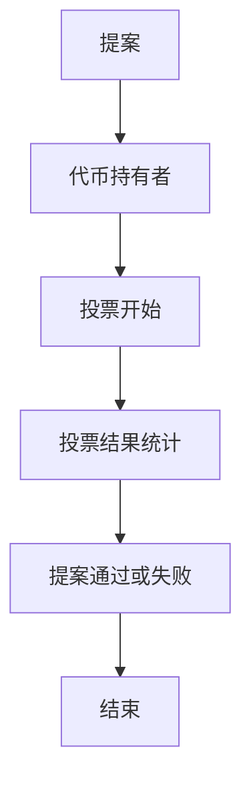
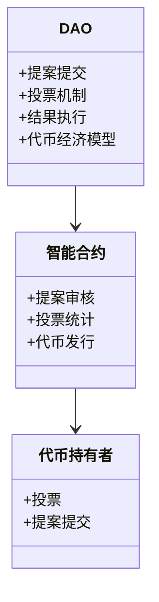

                 


# 格雷厄姆特价股票理论在去中心化自治组织(DAO)时代的新思考

> 关键词：格雷厄姆特价股票理论、去中心化自治组织、价值投资、DAO治理、安全边际

> 摘要：本文探讨了格雷厄姆价值投资理论在去中心化自治组织（DAO）时代的新应用。通过分析DAO的治理机制、经济模型和投资策略，提出结合格雷厄姆的安全边际理论来优化DAO的价值评估和投资决策。文章从背景介绍、理论结合、算法实现、系统架构、项目实战等多个维度展开，为DAO时代的投资决策提供新的思路。

---

## 第一部分：背景介绍

### 第1章：格雷厄姆特价股票理论的背景与核心概念

#### 1.1 格雷厄姆特价股票理论的起源与发展

- **价值投资的起源**  
  价值投资起源于20世纪初，由本杰明·格雷厄姆和他的学生戴维德·多德共同提出。格雷厄姆强调以低于内在价值的价格买入股票，关注企业的基本面，而非市场波动。

- **格雷厄姆的投资理念**  
  格雷厄姆提出“安全边际”概念，认为投资者应以低于估算价值的价格买入资产，以降低风险并确保收益。

- **安全边际的定义与作用**  
  安全边际是资产的内在价值与市场价格之间的差额，用以缓冲市场的不确定性。公式如下：
  $$ \text{安全边际} = \text{内在价值} - \text{市场价格} $$

#### 1.2 去中心化自治组织（DAO）的基本概念

- **DAO的定义与特点**  
  DAO是基于区块链技术的去中心化组织，通过智能合约实现自动化的治理和价值交换。其特点包括透明性、去中心化和无需信任。

- **DAO的治理机制**  
  DAO采用代币治理模式，代币持有者通过投票决定组织的重大决策，如资金分配和项目方向。

- **DAO的经济模型**  
  DAO通常发行治理代币，用于激励社区参与和分配收益。代币的价值与项目的成功密切相关。

---

### 第2章：格雷厄姆理论与DAO的结合

#### 2.1 格雷厄姆理论在DAO中的应用

- **价值投资与DAO的契合点**  
  格雷厄姆的价值投资理念与DAO的长期价值创造目标一致，DAO需要通过内在价值的增长吸引投资。

- **安全边际在DAO中的体现**  
  在DAO中，安全边际可以通过项目基本面和代币经济模型的稳定性来体现。投资者应关注DAO的治理效率和社区凝聚力。

- **格雷厄姆理论对DAO治理的启示**  
  格雷厄姆的安全边际理念可以用于评估DAO的治理风险，确保投资决策的稳健性。

#### 2.2 DAO时代投资策略的新变化

- **传统投资与DAO投资的对比**  
  传统投资依赖于中心化机构，而DAO投资强调去中心化的治理和透明性。

- **DAO时代的价值评估标准**  
  除了项目技术，投资者还需关注治理效率、社区活跃度和代币经济模型的合理性。

- **新型投资工具与策略**  
  DAO的治理代币和流动性挖矿机制为投资者提供了新的投资工具，但需结合格雷厄姆的安全边际理论进行风险控制。

---

## 第二部分：价值评估与投资决策

### 第3章：DAO中的价值评估与投资决策

#### 3.1 价值评估的核心指标

- **项目基本面分析**  
  包括技术实现、团队能力、市场需求等因素。通过分析这些因素，评估项目的长期价值。

- **社区治理能力评估**  
  治理效率和社区凝聚力是DAO成功的关键。需评估提案通过率和社区活跃度。

- **代币经济模型分析**  
  经济模型需具备可持续性和激励相容性，确保代币的价值与项目发展同步增长。

#### 3.2 投资决策的数学模型

- **安全边际的计算公式**  
  $$ \text{安全边际} = \frac{\text{内在价值} - \text{市场价格}}{\text{市场价格}} $$  
  公式中的内在价值可以通过项目基本面和技术评估得出，而市场价格则由市场供需决定。

- **DAO项目风险评估模型**  
  $$ \text{风险评分} = \sum (\text{权重}_i \times \text{指标}_i) $$  
  指标包括治理效率、技术风险、市场需求等，权重根据项目特点调整。

#### 3.3 投资决策的算法实现



---

### 第4章：DAO治理中的投票机制与算法

#### 4.1 DAO治理的基本流程

- **提案提交**  
  任何治理决策都需要通过提案形式提交，通常由代币持有者发起。

- **投票过程**  
  提案提交后，代币持有者根据持有的代币数量进行投票，多数决策通过。

- **结果执行**  
  提案通过后，由智能合约自动执行，确保治理决策的透明性和可执行性。

#### 4.2 投票机制的数学模型



---

## 第三部分：系统分析与架构设计

### 第5章：系统分析与架构设计方案

#### 5.1 问题场景介绍

- **问题背景**  
  DAO治理需要高效的投票机制和透明的代币经济模型，以确保组织的长期发展。

- **系统功能设计**  
  包括提案提交、投票机制、结果执行和代币经济模型管理。

#### 5.2 系统架构设计



---

## 第四部分：项目实战

### 第6章：项目实战

#### 6.1 环境安装

- **工具准备**  
  需要安装Solidity编译器和以太坊节点，如Ganache或Hardhat。

#### 6.2 系统核心实现源代码

```solidity
// 治理机制合约
contract Governance {
    uint public totalSupply;
    mapping(address => uint) public balances;

    function propose(bytes memory _proposal) external {
        // 提案提交逻辑
    }

    function vote(bytes memory _proposal, uint _vote) external {
        // 投票逻辑
    }

    function execute(bytes memory _proposal) external {
        // 提案执行逻辑
    }
}
```

#### 6.3 代码应用解读与分析

- **提案提交**  
  提案提交者需持有足够的代币，并将提案内容写入智能合约。

- **投票机制**  
  投票者根据持有的代币数量进行加权投票，多数通过的提案将被执行。

- **代币经济模型**  
  代币的发行和销毁需符合经济模型，确保代币价值与项目发展同步。

---

## 第五部分：总结与展望

### 第7章：总结与展望

#### 7.1 核心观点回顾

- 格雷厄姆的价值投资理念与DAO的治理机制具有高度契合点。
- 安全边际理论为DAO投资提供了风险控制的工具。

#### 7.2 未来研究方向

- 进一步优化DAO的治理算法，提升投票效率和决策透明度。
- 研究多链环境下DAO的跨链治理机制，扩展DAO的应用场景。

---

## 作者信息

作者：AI天才研究院/AI Genius Institute & 禅与计算机程序设计艺术/Zen And The Art of Computer Programming

