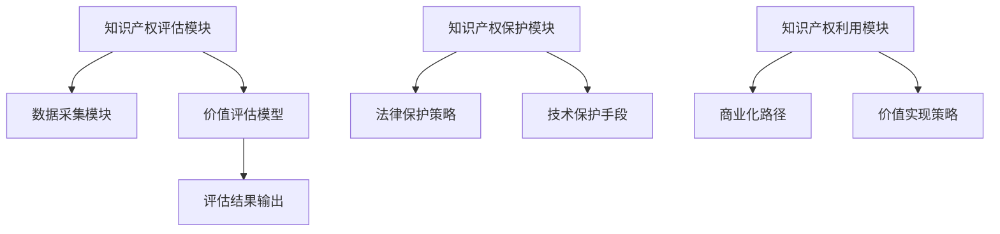

                 


```markdown
# 格雷厄姆特价股票理论对公司数字知识产权生态系统战略的影响

> 关键词：格雷厄姆投资理论，数字知识产权，价值评估模型，生态系统战略，算法实现，系统架构设计

> 摘要：本文从格雷厄姆的价值投资理论出发，探讨其对公司数字知识产权生态系统战略的影响。通过分析数字知识产权的特性、价值评估方法及生态系统构建，结合数学模型和算法实现，提出基于格雷厄姆理论的数字知识产权战略优化路径，并通过实际案例验证其可行性。

---

# 第一部分: 格雷厄姆特价股票理论与数字知识产权概述

## 第1章: 格雷厄姆特价股票理论的核心概念

### 1.1 价值投资的基本原理

#### 1.1.1 价值投资的定义与历史发展

- 价值投资的定义
- 格雷厄姆投资理论的起源与演变
- 价值投资的核心理念：寻找市场低估的股票

#### 1.1.2 格雷厄姆投资策略的核心原则

- 安全边际的概念
- 股票内在价值的计算方法
- 长期投资与价值发现

#### 1.1.3 特价股票的识别与评估方法

- 特价股票的定义
- 格雷厄姆的选股标准
- 市盈率、市净率等估值指标的运用

---

### 1.2 数字知识产权的特性与挑战

#### 1.2.1 数字知识产权的定义与分类

- 知识产权的内涵与外延
- 数字知识产权的特殊性
- 软件、数据、算法等的知识产权保护

#### 1.2.2 数字化时代知识产权的保护难点

- 数字化带来的知识产权保护挑战
- 知识产权的快速贬值风险
- 全球化背景下的跨国知识产权管理

#### 1.2.3 数字知识产权的价值评估

- 知识产权的价值构成
- 数字资产的经济价值评估方法
- 知识产权对企业的战略价值

---

## 第2章: 格雷厄姆理论与数字知识产权的联系

### 2.1 价值投资与数字知识产权评估的关系

#### 2.1.1 知识产权的经济价值评估

- 知识产权的市场价值与内在价值
- 格雷厄姆模型在知识产权定价中的应用
- 知识产权的生命周期与价值波动

#### 2.1.2 格雷厄姆策略在知识产权投资中的应用

- 知识产权投资的长期视角
- 识别被低估的知识产权资产
- 知识产权组合的投资策略

#### 2.1.3 企业知识产权战略的优化路径

- 建立基于价值投资的知识产权管理体系
- 优化知识产权布局与保护策略
- 知识产权的价值挖掘与利用

---

# 第二部分: 数字知识产权生态系统战略的设计与实现

## 第3章: 数字知识产权生态系统的核心架构

### 3.1 系统功能模块划分

#### 3.1.1 知识产权评估模块

- 知识产权价值的多维度评估
- 数据采集与特征提取
- 价值评估模型的构建与优化

#### 3.1.2 知识产权保护模块

- 知识产权的法律保护策略
- 技术手段在知识产权保护中的应用
- 全球化背景下的知识产权管理

#### 3.1.3 知识产权利用模块

- 知识产权的商业化路径
- 知识产权的价值实现策略
- 知识产权的动态管理与优化

---

## 第4章: 系统架构设计与实现

### 4.1 系统架构图



### 4.2 模块之间的关系与数据流

- 数据采集模块：负责收集知识产权相关的数据
- 价值评估模型：基于格雷厄姆理论进行评估
- 保护模块：制定法律和技术保护策略
- 利用模块：优化知识产权的商业化路径

---

## 第5章: 系统接口与交互设计

### 5.1 系统接口定义

#### 5.1.1 数据接口

- 数据输入格式与规范
- 数据清洗与预处理
- 数据存储与管理

#### 5.1.2 用户接口

- 用户权限管理
- 知识产权评估结果的可视化展示
- 保护策略的定制化配置

#### 5.1.3 系统交互流程

- 用户登录与权限验证
- 数据提交与处理
- 结果展示与反馈

---

# 第三部分: 数字知识产权生态系统战略的优化与实践

## 第6章: 项目实战与案例分析

### 6.1 环境搭建与数据准备

#### 6.1.1 开发环境安装

- Python与相关库的安装（如Pandas、NumPy、Scikit-learn）
- 数据库搭建与配置
- 网络与接口测试

#### 6.1.2 数据采集与预处理

- 数据来源与采集方法
- 数据清洗与特征提取
- 数据存储与管理

### 6.2 核心代码实现

#### 6.2.1 价值评估模块实现

```python
import pandas as pd
import numpy as np

# 数据加载
data = pd.read_csv('ip_data.csv')

# 特征提取
features = data[['专利数量', '研发投入', '市场占有率']]
target = data['知识产权价值']

# 模型训练
from sklearn.linear_model import LinearRegression
model = LinearRegression()
model.fit(features, target)

# 价值评估
new_data = pd.DataFrame({
    '专利数量': [100],
    '研发投入': [50],
    '市场占有率': [20]
})
predicted_value = model.predict(new_data)
print(f'预测知识产权价值：{predicted_value[0]:.2f}')
```

#### 6.2.2 保护策略模块实现

```python
def protect_strategy(patent_count, market_share):
    if patent_count > 100 and market_share > 20:
        return "强化保护策略"
    elif patent_count > 50 and market_share > 10:
        return "一般保护策略"
    else:
        return "基础保护策略"

print(protect_strategy(150, 25))  # 输出：强化保护策略
```

### 6.3 案例分析与优化

#### 6.3.1 案例分析

- 某科技公司知识产权评估与保护的案例
- 案例分析结果与策略优化
- 优化后的知识产权管理体系

---

## 第7章: 总结与展望

### 7.1 核心结论

- 格雷厄姆理论在数字知识产权评估中的应用价值
- 数字知识产权生态系统战略的优化路径
- 价值投资理念对企业知识产权管理的启示

### 7.2 展望与建议

- 数字知识产权管理的未来发展趋势
- 格雷厄姆理论的进一步应用与创新
- 知识产权生态系统战略的全球化扩展

---

# 作者：AI天才研究院 & 禅与计算机程序设计艺术
```

