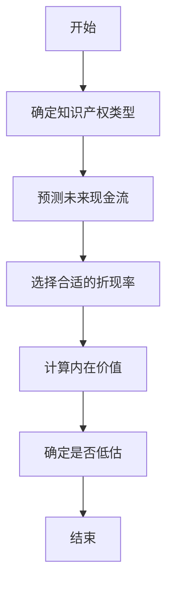

                 


# 格雷厄姆特价股票理论对公司知识产权战略的影响

## 关键词：
- 格雷厄姆特价股票理论
- 知识产权战略
- 价值投资
- 内在价值评估
- 安全边际

## 摘要：
本文探讨了格雷厄姆的价值投资理论如何影响公司的知识产权战略。通过分析特价股票的核心理念，如内在价值和安全边际，本文展示了如何将这些原则应用于知识产权的评估和管理，从而优化企业的知识产权布局，提升其市场竞争力。

---

## 第一部分: 格雷厄姆特价股票理论基础

### 第1章: 格雷厄姆特价股票理论概述

#### 1.1 格雷厄姆特价股票理论的核心概念
- **价值投资**：格雷厄姆倡导以低于内在价值的价格购买股票，长期持有，等待其价值回归。
- **内在价值**：企业未来现金流的现值，公式为：
  $$ V = \frac{E}{k} $$
  其中，\( V \) 是内在价值，\( E \) 是预期收益，\( k \) 是折现率。
- **安全边际**：市场价格与内在价值的差距，确保投资的安全性：
  $$ \text{安全边际} = \text{市场价格} \times (1 - \text{安全边际率}) $$

#### 1.2 格雷厄姆投资理论的数学模型与公式
- **内在价值计算公式**：
  $$ V = \frac{E}{k} $$
  示例：若预期收益 \( E = 100 \) 万元，折现率 \( k = 0.1 \)，则内在价值 \( V = 1000 \) 万元。
- **安全边际计算方法**：
  若市场价格为 800 万元，安全边际率为 20%，则安全边际为：
  $$ 800 \times (1 - 0.2) = 640 \text{万元} $$

#### 1.3 格雷厄姆投资理论的算法原理
- **流程图**：
  ```mermaid
  graph TD
    A[开始] --> B[计算企业预期收益]
    B --> C[确定合适的折现率]
    C --> D[计算内在价值]
    D --> E[比较市场价格与内在价值]
    E --> F[确定是否为特价股票]
    F --> G[结束]
  ```

#### 1.4 格雷厄姆投资理论与现代投资理论的对比
- **与有效市场假说的对比**：格雷厄姆认为市场存在非效率，投资者可通过分析发现价值低估的股票；有效市场假说认为市场价格反映所有信息，不存在长期价值低估。
- **与技术分析的对比**：格雷厄姆注重基本面分析，技术分析则依赖价格和成交量走势。

---

## 第二部分: 公司知识产权战略基础

### 第2章: 知识产权的定义与分类

#### 2.1 知识产权的核心概念
- **知识产权**：保护智力成果的法律权利，包括专利、商标、版权等。
- **专利**：保护发明，通常为20年有效。
- **商标**：区分商品或服务的标志，可无限续展。
- **版权**：保护文学、艺术作品，通常为作者 lifetime + 50 年。

#### 2.2 知识产权的法律框架
- **专利法**：保护发明，防止他人未经许可使用。
- **商标法**：保护品牌，防止混淆。
- **版权法**：保护原创作品，自动保护。

---

## 第三部分: 格雷厄姆理论与知识产权战略的结合

### 第3章: 知识产权的内在价值评估

#### 3.1 内在价值评估的核心要素
- **未来现金流**：知识产权带来的预期收益，如专利许可收入。
- **折现率**：考虑时间和风险的贴现率。

#### 3.2 知识产权内在价值计算案例
- 某专利的预期收益 \( E = 500 \) 万元，折现率 \( k = 0.1 \)，则内在价值 \( V = 5000 \) 万元。

#### 3.3 知识产权评估的流程图


---

## 第四部分: 实际应用与案例分析

### 第4章: 知识产权战略中的价值投资策略

#### 4.1 知识产权投资组合优化
- **分散投资**：通过持有不同类型知识产权降低风险。
- **价值发现**：寻找被市场低估的知识产权。

#### 4.2 知识产权收购与保护
- **收购时机**：当市场价格低于内在价值时买入。
- **风险管理**：评估收购风险，确保安全边际。

#### 4.3 知识产权的市场竞争力分析
- **对比分析表格**：
  | 知识产权类型 | 内在价值（万元） | 市场价格（万元） | 安全边际（万元） |
  |--------------|------------------|------------------|------------------|
  | 专利 A      | 1000             | 800              | 200              |
  | 专利 B      | 800              | 700              | 100              |

---

## 第五部分: 结论与展望

### 第5章: 格雷厄姆理论对知识产权战略的影响

#### 5.1 核心影响
- **价值评估**：引入内在价值评估方法，优化知识产权管理。
- **风险控制**：通过安全边际降低投资风险。

#### 5.2 未来展望
- **技术发展**：人工智能在知识产权评估中的应用。
- **全球化**：跨国知识产权管理的趋势。

---

## 附录: 工具与资源

### 附录A: 知识产权评估工具

#### 1. 内在价值计算器
```python
def calculate_intrinsic_value(expected_revenue, discount_rate):
    return expected_revenue / discount_rate
```

#### 2. 安全边际计算器
```python
def calculate_margin_of_safety(market_price, safety_rate):
    return market_price * (1 - safety_rate)
```

---

## 作者：AI天才研究院/AI Genius Institute & 禅与计算机程序设计艺术 /Zen And The Art of Computer Programming

---

通过本文的分析，我们展示了如何将格雷厄姆的特价股票理论应用于公司知识产权战略，为企业的知识产权管理提供了新的视角和方法。

