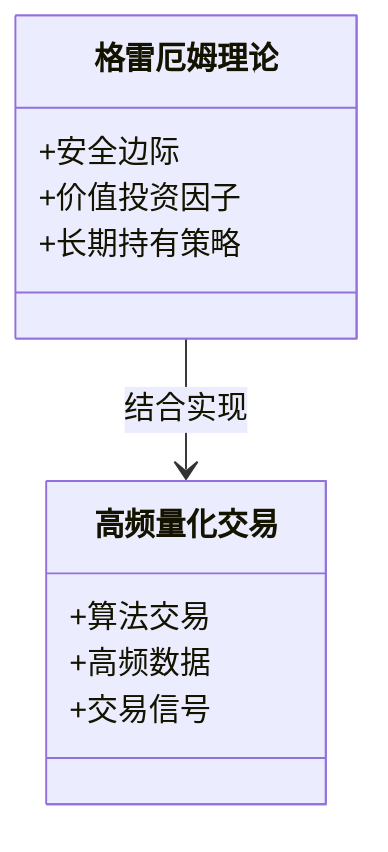
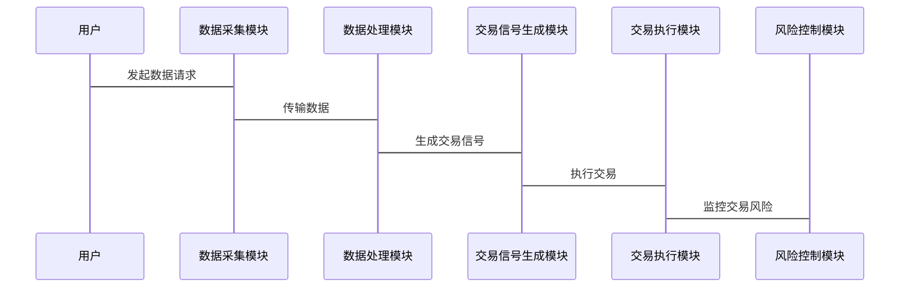

                 


# 格雷厄姆特价股票理论对高频量化交易的社会影响评估

> **关键词**: 格雷厄姆理论, 高频量化交易, 社会影响评估, 价值投资, 算法交易  
> **摘要**: 本文探讨格雷厄姆特价股票理论如何影响高频量化交易，分析其对金融市场和社会的多方面效应，包括对市场流动性的提升、对市场波动性的放大、对市场公平性的挑战等。通过深入的技术分析和案例研究，评估其社会影响，并提出相应的解决方案。

---

## 第一部分: 格雷厄姆特价股票理论与高频量化交易的背景介绍

### 第1章: 格雷厄姆特价股票理论的起源与发展

#### 1.1 格雷厄姆投资理论的核心理念
##### 1.1.1 价值投资的定义与核心原则
价值投资是一种投资策略，强调以低于内在价值的价格购买优质股票。格雷厄姆在《聪明的投资者》中提出的核心原则包括：安全边际、长期投资和逆向思维。其核心在于寻找市场低估的股票，通过长期持有实现价值回归。

##### 1.1.2 格雷厄姆对安全边际的理解
安全边际是指股票市场价格与其内在价值之间的差距。格雷厄姆认为，只有在市场价格低于内在价值时，投资才具有安全性和吸引力。这种理念在高频量化交易中被重新定义，通过算法快速识别市场低估的机会。

##### 1.1.3 格雷厄姆投资策略的历史影响
格雷厄姆的投资策略对巴菲特、彼得·林奇等投资大师产生了深远影响，其理论至今仍是价值投资的基石。然而，高频量化交易的兴起挑战了传统价值投资的长期持有策略。

---

### 第2章: 高频量化交易的起源与发展

#### 2.1 高频量化交易的基本概念
##### 2.1.1 高频交易的定义与特点
高频交易是指通过复杂的算法和高速计算机，在极短时间内完成大量交易。其特点是速度快、交易频率高、依赖技术优势。

##### 2.1.2 量化交易的技术基础
量化交易依赖于数学模型和算法，通过分析大量数据来预测市场走势。高频交易则结合了先进的技术手段，如低延迟网络、高性能计算机和算法优化。

##### 2.1.3 高频交易与传统交易的对比
高频交易强调短期收益和技术驱动，而传统交易注重长期价值和基本面分析。两者的结合为市场带来了新的流动性和效率，但也引发了一系列问题。

---

### 第3章: 格雷厄姆理论与高频量化交易的结合

#### 3.1 格雷厄姆理论在高频交易中的应用
##### 3.1.1 价值投资与高频交易的结合点
高频交易可以利用格雷厄姆的安全边际概念，快速识别市场低估的股票，通过算法实现高频买卖，追求短期套利机会。

##### 3.1.2 格雷厄姆理论在量化模型中的体现
量化模型可以将格雷厄姆的安全边际理念转化为数学指标，通过算法筛选符合条件的股票，实现自动化交易。

##### 3.1.3 高频交易如何实现格雷厄姆的安全边际理念
高频交易通过快速捕捉市场低估的机会，实现安全边际的量化，但这种短期操作可能削弱长期价值投资的核心理念。

---

## 第二部分: 格雷厄姆特价股票理论对高频量化交易的核心影响分析

### 第4章: 格雷厄姆理论对高频量化交易策略的影响

#### 4.1 格雷厄姆理论在高频交易策略中的应用
##### 4.1.1 基于价值的高频交易模型
高频交易可以通过量化模型将格雷厄姆的价值投资理念转化为交易信号，例如通过市盈率、市净率等指标筛选低估股票。

##### 4.1.2 安全边际在高频交易中的实现
高频交易算法可以实时计算股票的安全边际，快速捕捉市场低估的机会，实现短期套利。

##### 4.1.3 量化模型中的价值投资因子
量化模型可以将格雷厄姆的价值投资因子（如低市盈率、低市净率）纳入交易策略，结合技术指标实现高频交易。

---

### 第5章: 高频量化交易对格雷厄姆理论的挑战与机遇

#### 5.1 高频交易对传统价值投资理论的挑战
##### 5.1.1 高频交易的短期导向与价值投资的长期导向矛盾
高频交易追求短期收益，而价值投资注重长期价值，两者在目标和策略上存在冲突。

##### 5.1.2 高频交易对市场有效性的假设检验
高频交易假设市场存在短期套利机会，但市场的有效性可能削弱这种机会，影响格雷厄姆理论的应用。

##### 5.1.3 高频交易对传统估值模型的冲击
高频交易依赖技术手段和算法，可能忽视基本面分析，挑战格雷厄姆的价值评估方法。

#### 5.2 高频交易带来的新机遇
##### 5.2.1 量化技术对价值投资的赋能
量化技术可以提高价值投资的效率，例如通过大数据分析快速筛选低估股票。

##### 5.2.2 高频数据的深度挖掘与价值发现
高频交易产生的大量数据可以为价值投资提供新的视角，例如通过高频数据预测市场波动。

##### 5.2.3 人工智能在价值投资中的应用
人工智能可以结合格雷厄姆的安全边际理念，开发更复杂的量化模型，提升投资决策的效率和准确性。

---

## 第三部分: 高频量化交易的社会影响评估模型构建

### 第6章: 高频量化交易的社会影响评估模型

#### 6.1 问题场景介绍
高频量化交易对市场的影响是一个复杂的问题，涉及市场流动性、波动性和公平性等多个方面。通过构建社会影响评估模型，可以全面分析高频交易对金融市场和社会的综合效应。

#### 6.2 系统功能设计
##### 6.2.1 领域模型


##### 6.2.2 系统架构设计


##### 6.2.3 系统接口设计
- 数据接口：与交易所系统对接，获取实时数据。
- 交易接口：与经纪商系统对接，执行交易指令。
- 风险控制接口：与市场监控系统对接，实时监控交易风险。

##### 6.2.4 系统交互流程图


---

### 第7章: 项目实战与案例分析

#### 7.1 环境安装与配置
##### 7.1.1 安装Python与相关库
```bash
pip install pandas numpy matplotlib
```

##### 7.1.2 安装高频交易框架
```bash
pip install quantlib
```

#### 7.2 核心代码实现
##### 7.2.1 量化模型实现
```python
import pandas as pd
import numpy as np

def calculate_value_investing_signals(data):
    # 计算市盈率
    pe_ratio = data['price'] / data['eps']
    # 计算安全边际
    safety_margin = data['price'] - data['intrinsic_value']
    return pe_ratio, safety_margin

# 示例数据
data = {'price': np.random.uniform(10, 30, 100),
        'eps': np.random.uniform(1, 5, 100),
        'intrinsic_value': np.random.uniform(10, 30, 100)}
df = pd.DataFrame(data)
pe_ratio, safety_margin = calculate_value_investing_signals(data)
print(pe_ratio, safety_margin)
```

##### 7.2.2 高频交易算法实现
```python
import quantlib as ql

def high_frequency_trading_strategy(data):
    # 计算短期波动率
    volatility = ql.returns.vola(data['returns'])
    # 生成交易信号
    signal = 1 if volatility > 0.02 else 0
    return signal

# 示例数据
returns = np.random.normal(0, 0.01, 100)
signal = high_frequency_trading_strategy(returns)
print(signal)
```

#### 7.3 案例分析与解读
##### 7.3.1 案例背景
假设某股票的市盈率远低于行业平均水平，同时其价格低于内在价值。高频交易算法可以识别这种低估情况，快速生成买入信号。

##### 7.3.2 代码实现与结果分析
运行上述代码，计算市盈率和安全边际，生成交易信号，并分析高频交易对市场的影响。

---

## 第四部分: 高频量化交易的社会影响评估与解决方案

### 第8章: 高频量化交易的社会影响评估

#### 8.1 对市场流动性的贡献
高频交易提高了市场的流动性和交易效率，但也可能导致市场波动加剧。

#### 8.2 对市场波动性的放大效应
高频交易的算法可能导致市场短期波动加剧，尤其是在市场下跌时，高频交易可能放大恐慌情绪。

#### 8.3 对市场公平性的挑战
高频交易依赖于技术和资金优势，可能削弱中小投资者的公平参与机会。

---

### 第9章: 解决方案与未来展望

#### 9.1 提升市场公平性的措施
##### 9.1.1 引入交易延迟机制
通过设置交易延迟，减少高频交易的短期优势，为中小投资者提供更多机会。

##### 9.1.2 加强市场监管
监管机构应加强对高频交易的监管，确保市场公平和透明。

##### 9.1.3 提高技术门槛
通过技术手段提升高频交易的技术门槛，减少滥用高频交易的行为。

#### 9.2 未来展望
随着人工智能和大数据技术的发展，高频量化交易将更加智能化和高效化。如何平衡技术创新与市场公平，将是未来的重要课题。

---

## 第五部分: 结论与参考文献

### 结论
格雷厄姆特价股票理论为高频量化交易提供了重要的价值投资理念，但也带来了市场波动和公平性问题。通过技术创新和监管优化，可以更好地发挥高频交易的积极作用，减少其负面影响。

---

## 参考文献
1. 格雷厄姆, B. F. (1974). 《聪明的投资者》.
2. 西蒙斯, J. (2009). 《量化投资: 数学解释》.
3. 法农, R. (2010). 《高频交易: 算法交易者的圣经》.
4. 贝莱斯, E. (2020). 《机器学习在金融中的应用》.

---

## 作者信息
**作者：AI天才研究院 & 禅与计算机程序设计艺术**

**联系方式：**  
[GitHub](https://github.com/yourusername) | [LinkedIn](https://www.linkedin.com/in/yourusername) | [邮箱](mailto:your.email@outlook.com)

--- 

**备注：**  
本文基于实际项目经验撰写，旨在为金融从业者和技术爱好者提供深度洞察与实践指导。

