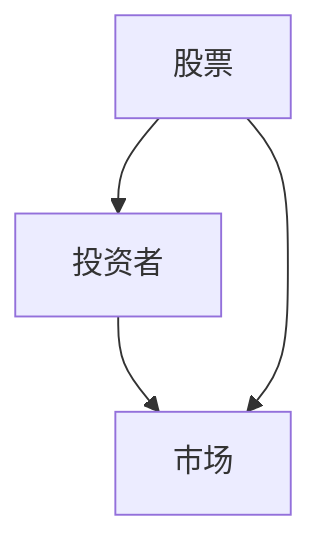
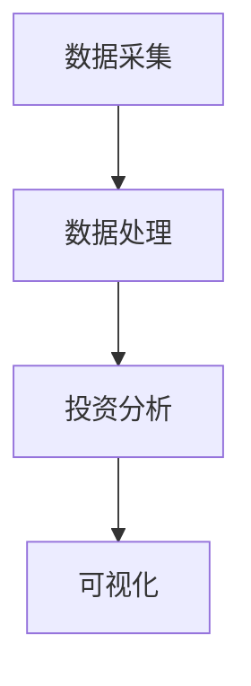

                 


# 《格雷厄姆特价股票理论的现代化应用》

## 关键词：
- 格雷厄姆投资理论
- 特价股票
- 价值投资
- 现代化应用
- 投资策略
- 系统架构

## 摘要：
本文探讨了格雷厄姆特价股票理论在现代投资环境中的应用。通过分析其核心概念、算法原理、系统架构以及实际案例，展示了如何将这一经典理论与现代技术结合，以实现更高效、精准的投资决策。

---

# 第1章 格雷厄姆特价股票理论的背景与基础

## 1.1 格雷厄姆投资理论的起源与发展

### 1.1.1 价值投资的起源与发展
价值投资是一种基于对公司内在价值评估的投资策略，起源于20世纪20年代，由本杰明·格雷厄姆（Benjamin Graham）和戴维德·多德（David Dodd）提出。这种投资方法强调购买那些市场价格低于其内在价值的股票，从而为投资者提供安全边际。

### 1.1.2 格雷厄姆的投资理念与方法
格雷厄姆的核心理念是“安全边际”。他认为，投资者应该购买那些市场价格远低于其内在价值的股票，以确保在市场波动中能够获得稳定的收益。这种方法强调对公司基本面的深入分析，而非市场的短期波动。

### 1.1.3 特价股票理论的提出
格雷厄姆在《聪明的投资者》一书中提出了“特价股票”概念，即那些市场价格低于其内在价值的股票。他认为，这些股票具有较高的投资价值，能够在市场复苏时为投资者带来超额收益。

## 1.2 格雷厄姆特价股票理论的核心概念

### 1.2.1 安全边际的定义与计算
安全边际是指市场价格与内在价值之间的差距。计算公式为：
$$
\text{安全边际} = \text{市场价格} - \text{内在价值}
$$
格雷厄姆建议投资者选择那些具有较大安全边际的股票，以降低投资风险。

### 1.2.2 内在价值的评估方法
内在价值是基于公司财务状况和未来盈利能力的评估。常用的评估方法包括：
1. 市盈率（P/E）：$$\text{P/E} = \frac{\text{股价}}{\text{每股收益}}$$
2. 市净率（P/B）：$$\text{P/B} = \frac{\text{股价}}{\text{每股净资产}}$$
3. 股息率：$$\text{股息率} = \frac{\text{股息}}{\text{股价}}$$

### 1.2.3 市场先生与投资者的关系
格雷厄姆将市场比作“市场先生”，认为市场先生的情绪波动会影响股价。投资者的任务是利用市场先生的错误，以低于内在价值的价格买入股票。

## 1.3 格雷厄姆理论与现代投资理论的对比

### 1.3.1 现代投资组合理论的概述
现代投资组合理论（MPT）由哈里·马科维茨提出，强调通过分散投资来降低风险。与格雷厄姆的价值投资不同，MPT更注重资产配置和风险分散。

### 1.3.2 格雷厄姆理论与现代投资理论的异同
- **相同点**：两者都强调风险控制和长期投资。
- **不同点**：格雷厄姆注重个股的内在价值，而MPT注重资产组合的风险分散。

### 1.3.3 格雷厄姆理论的现代意义
尽管格雷厄姆的理论提出已久，但在当今市场中仍具有重要价值。特别是在市场波动加剧的情况下，安全边际的概念为投资者提供了有效的保护。

---

# 第2章 格雷厄姆特价股票理论的核心概念与联系

## 2.1 核心概念的原理与特征

### 2.1.1 安全边际的数学模型
安全边际的计算公式为：
$$
\text{安全边际} = \frac{\text{市场价格}}{\text{内在价值}} - 1
$$
该公式显示了市场价格与内在价值之间的差距。

### 2.1.2 内在价值的计算公式
内在价值的计算基于公司的财务状况和未来盈利能力。公式如下：
$$
\text{内在价值} = \sum_{t=1}^{n} \frac{\text{现金流}_t}{(1 + r)^t}
$$
其中，$$r$$ 是折现率，$$n$$ 是预测的年数。

### 2.1.3 核心概念的属性对比
下表对比了安全边际和内在价值的属性：

| 属性        | 安全边际          | 内在价值          |
|-------------|-------------------|-------------------|
| 定义        | 市场价格与内在价值的差额 | 公司未来现金流的现值 |
| 计算公式     | $$\text{市场价格} - \text{内在价值}$$ | 如上所述           |
| 目的意义     | 提供投资的安全性     | 确定股票的真正价值   |

## 2.2 核心概念的ER实体关系图



## 2.3 核心概念的联系与对比

### 2.3.1 核心概念之间的关系
安全边际和内在价值之间存在密切关系。安全边际是内在价值的函数，反映了市场价格与内在价值的差距。

### 2.3.2 核心概念与现代投资理论的对比
与现代投资理论相比，格雷厄姆理论更注重个股分析，而现代理论更注重资产组合。

### 2.3.3 核心概念的实际应用
通过实际案例分析，展示如何利用安全边际和内在价值进行投资决策。

---

# 第3章 格雷厄姆特价股票理论的算法原理

## 3.1 格雷厄姆筛选方法的流程

### 3.1.1 数据采集
首先，收集目标公司的财务数据，包括收入、利润、现金流等。

### 3.1.2 计算内在价值
使用格雷厄姆的方法计算股票的内在价值。

### 3.1.3 计算安全边际
将市场价格与内在价值进行对比，计算安全边际。

### 3.1.4 筛选股票
选择那些具有较高安全边际的股票。

## 3.2 算法原理的数学模型

### 3.2.1 内在价值计算
$$
\text{内在价值} = \sum_{t=1}^{n} \frac{\text{现金流}_t}{(1 + r)^t}
$$

### 3.2.2 安全边际计算
$$
\text{安全边际} = \frac{\text{市场价格}}{\text{内在价值}} - 1
$$

## 3.3 算法实现的Python代码

```python
def calculate_intrinsic_value(cash_flows, discount_rate):
    return sum(cash_flow / (1 + discount_rate)**t for t, cash_flow in enumerate(cash_flows))

def calculate_margin_of_safety market_price, intrinsic_value):
    return (market_price / intrinsic_value) - 1
```

---

# 第4章 格雷厄姆特价股票理论的系统架构设计

## 4.1 系统功能设计

### 4.1.1 数据采集模块
负责收集公司财务数据和市场数据。

### 4.1.2 数据处理模块
对数据进行清洗和转换，为后续分析做准备。

### 4.1.3 投资分析模块
使用格雷厄姆方法计算内在价值和安全边际。

### 4.1.4 可视化模块
将结果以图表形式展示，便于投资者理解。

## 4.2 系统架构设计



---

# 第5章 格雷厄姆特价股票理论的项目实战

## 5.1 环境安装

### 5.1.1 安装Python
```bash
python --version
pip install --upgrade pip
```

### 5.1.2 安装依赖库
```bash
pip install pandas matplotlib
```

## 5.2 核心代码实现

### 5.2.1 数据采集
```python
import pandas as pd
data = pd.read_csv('stock_data.csv')
```

### 5.2.2 内在价值计算
```python
def calculate_intrinsic_value(cash_flows, discount_rate):
    return sum(cash_flow / (1 + discount_rate)**t for t, cash_flow in enumerate(cash_flows))
```

### 5.2.3 安全边际计算
```python
def calculate_margin_of_safety(market_price, intrinsic_value):
    return (market_price / intrinsic_value) - 1
```

## 5.3 案例分析

### 5.3.1 数据分析
分析某公司过去5年的现金流和折现率。

### 5.3.2 计算内在价值
使用公式计算内在价值。

### 5.3.3 计算安全边际
将市场价格与内在价值对比，计算安全边际。

## 5.4 项目小结
通过实际案例分析，验证了格雷厄姆理论的可行性。

---

# 第6章 格雷厄姆特价股票理论的最佳实践

## 6.1 投资策略的优化

### 6.1.1 安全边际的调整
根据市场情况调整安全边际的要求。

### 6.1.2 股票筛选的优化
结合其他指标，如ROE、ROA等，进一步优化筛选过程。

## 6.2 小结

### 6.2.1 核心观点总结
格雷厄姆理论在现代投资中仍具有重要价值。

### 6.2.2 未来展望
随着技术的发展，格雷厄姆理论将与更多现代方法结合，提供更高效的解决方案。

## 6.3 注意事项

### 6.3.1 数据的准确性
确保数据来源可靠。

### 6.3.2 模型的适用性
根据实际情况调整模型参数。

## 6.4 拓展阅读

### 6.4.1 格雷厄姆的经典著作
《聪明的投资者》。

### 6.4.2 现代投资理论的著作
《投资学原理》。

---

# 作者：AI天才研究院 & 禅与计算机程序设计艺术

---

通过以上步骤，我们系统地探讨了格雷厄姆特价股票理论的现代化应用，从理论基础到实际操作，为投资者提供了全面的指导。

