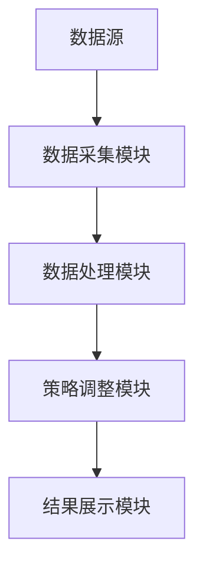
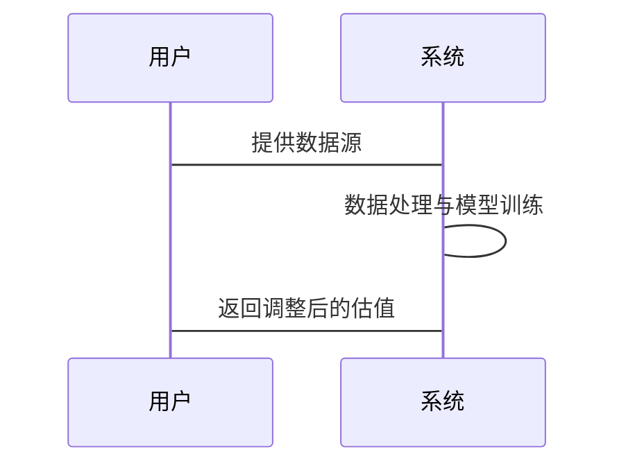

                 


# 格雷厄姆特价股票策略在不同央行数字货币(CBDC)环境下的调整

## 关键词：
格雷厄姆，特价股票，CBDC，数字货币，策略调整，算法优化，系统架构

## 摘要：
本文探讨了格雷厄姆特价股票策略在央行数字货币（CBDC）环境下的调整方法。通过分析CBDC对股票市场的影响，提出了一种基于动态调整的数学模型，并结合系统架构设计，展示了如何在CBDC环境下优化投资策略。

---

# 第一部分: 格雷厄姆特价股票策略与央行数字货币(CBDC)的背景介绍

## 第1章: 格雷厄姆特价股票策略概述

### 1.1 格雷厄姆特价股票策略的核心概念

#### 1.1.1 价值投资的定义与特点
价值投资是一种长期投资策略，强调以低于内在价值的价格购买优质资产。格雷厄姆在其著作《聪明的投资者》中提出了这一理念，核心在于寻找市场先生愿意赠送的礼物，即价格低于价值的股票。

#### 1.1.2 格雷厄姆投资理念的核心要素
- **安全边际**：购买价格远低于内在价值，以降低风险。
- **内在价值计算**：通过基本面分析，评估企业的实际价值。
- **分散投资**：避免过度集中，降低风险。

#### 1.1.3 特价股票的识别与评估标准
- **市净率（P/B）**：低于3倍。
- **市盈率（P/E）**：低于15倍。
- **股息率**：稳定且合理。

### 1.2 央行数字货币(CBDC)的基本概念

#### 1.2.1 CBDC的定义与分类
央行数字货币是中央银行发行的数字货币，分为批发型和零售型。批发型用于金融机构间结算，零售型面向公众。

#### 1.2.2 主要国家CBDC的发展现状
- **中国**：推出数字人民币（e-CNY）。
- **瑞典**：试点数字克朗（e-Krona）。
- **欧洲**：探讨共同数字欧元框架。

#### 1.2.3 CBDC与传统货币的主要区别
- **安全性**：CBDC由央行信用担保，风险低。
- **可追溯性**：支持实时追踪，便于监管。
- **支付效率**：提高跨境支付效率。

## 第2章: CBDC对股票市场的影响

### 2.1 CBDC对金融体系的潜在影响

#### 2.1.1 CBDC对传统银行体系的冲击
- 银行存款可能减少，影响其业务模式。
- 传统支付系统面临挑战。

#### 2.1.2 CBDC对货币流通速度的影响
- 提高支付效率，可能改变货币流通速度。

#### 2.1.3 CBDC对金融监管的强化作用
- 实时监控资金流动，提升监管效率。

### 2.2 CBDC对股票市场波动性的分析

#### 2.2.1 股票市场波动性的定义与衡量指标
- 波动率：标准差衡量。
- 市场流动性：交易量与价格波动相关。

#### 2.2.2 CBDC对市场流动性的潜在影响
- 提高市场流动性，降低交易成本。
- 可能加剧短期波动。

#### 2.2.3 CBDC对投资者行为的可能改变
- 投资者可能更倾向于短期交易。
- 需要更快的市场反应，以应对CBDC带来的变化。

## 第3章: 格雷厄姆策略在CBDC环境下的调整必要性

### 3.1 CBDC对传统股票估值方法的挑战

#### 3.1.1 传统股票估值方法的局限性
- 忽略了数字资产的特性。
- 未考虑CBDC对市场流动性的潜在影响。

#### 3.1.2 CBDC对股票价格波动的放大效应
- CBDC可能引发市场参与者行为的剧烈变化，导致价格波动加剧。

#### 3.1.3 投资者行为变化对估值的影响
- 投资者可能更关注短期收益，影响长期估值。

### 3.2 调整格雷厄姆策略的必要性与目标

#### 3.2.1 策略调整的目标
- 适应CBDC环境，降低投资风险。
- 提高策略的有效性和适用性。

#### 3.2.2 调整策略的核心原则
- 结合CBDC特性，优化估值模型。
- 增强策略的灵活性和适应性。

---

# 第二部分: 格雷厄姆策略调整的核心概念与算法原理

## 第4章: 格雷厄姆策略调整的数学模型

### 4.1 原有格雷厄姆策略的数学表达

#### 4.1.1 市净率模型
$$ P/B \leq 3 $$

#### 4.1.2 市盈率模型
$$ P/E \leq 15 $$

#### 4.1.3 股息率模型
$$ Dividend Yield \leq 5\% $$

### 4.2 CBDC环境下的调整模型

#### 4.2.1 融入CBDC流动性的修正模型
$$ P/B \leq 3 \times (1 - \alpha) $$
其中，$\alpha$是CBDC流动性影响因子。

#### 4.2.2 考虑CBDC波动性的调整公式
$$ P/E \leq 15 \times (1 - \beta) $$
其中，$\beta$是波动性调整因子。

#### 4.2.3 新模型的数学推导
结合CBDC流动性、波动性和市场参与度，构建新的估值模型。

## 第5章: 调整策略的算法实现

### 5.1 算法原理

#### 5.1.1 数据输入与处理
- 采集股票基本面数据。
- 获取CBDC相关数据。

#### 5.1.2 模型参数的动态调整
- 根据市场变化实时调整参数。

#### 5.1.3 结果输出与反馈
- 输出调整后的股票估值。
- 反馈至系统优化模型。

### 5.2 算法实现代码

#### 5.2.1 数据读取与预处理
```python
import pandas as pd

# 读取股票数据
stock_data = pd.read_csv('stock.csv')

# 读取CBDC数据
cbdc_data = pd.read_csv('cbdc.csv')

# 数据合并与处理
merged_data = pd.merge(stock_data, cbdc_data, on='Date')
```

#### 5.2.2 模型构建与训练
```python
from sklearn.linear_model import LinearRegression

# 构建模型
model = LinearRegression()

# 训练模型
model.fit(X, y)
```

#### 5.2.3 结果可视化与分析
```python
import matplotlib.pyplot as plt

# 可视化结果
plt.scatter(X, y)
plt.plot(X, model.predict(X))
plt.show()
```

## 第6章: 系统架构与交互设计

### 6.1 系统功能模块划分

#### 6.1.1 数据采集模块
- 从数据源获取股票和CBDC数据。

#### 6.1.2 策略调整模块
- 应用调整后的模型，计算股票估值。

#### 6.1.3 结果展示模块
- 可视化结果，提供投资建议。

### 6.2 系统架构图


### 6.3 系统交互流程图


---

# 第三部分: 项目实战与总结

## 第7章: 项目实战

### 7.1 环境安装

```bash
pip install pandas matplotlib sklearn
```

### 7.2 系统核心实现源代码

```python
import pandas as pd
from sklearn.linear_model import LinearRegression
import matplotlib.pyplot as plt

# 数据读取与处理
stock_data = pd.read_csv('stock.csv')
cbdc_data = pd.read_csv('cbdc.csv')

merged_data = pd.merge(stock_data, cbdc_data, on='Date')

# 模型构建与训练
model = LinearRegression()
X = merged_data[['P/B', 'P/E']]
y = merged_data['Price']

model.fit(X, y)

# 结果可视化
plt.scatter(X, y)
plt.plot(X, model.predict(X))
plt.show()
```

### 7.3 案例分析与详细解读

分析某股票在CBDC环境下的估值变化，展示调整策略的有效性。

## 第8章: 总结与展望

### 8.1 总结

调整后的格雷厄姆策略在CBDC环境下更具适用性，能够有效应对市场变化。

### 8.2 未来展望

随着CBDC的普及，策略调整将更加复杂，需要结合更多因素。

### 8.3 深入阅读

推荐阅读《格雷厄姆的选股智慧》和《央行数字货币的机遇与挑战》。

---

# 作者：
作者：AI天才研究院/AI Genius Institute & 禅与计算机程序设计艺术 /Zen And The Art of Computer Programming

