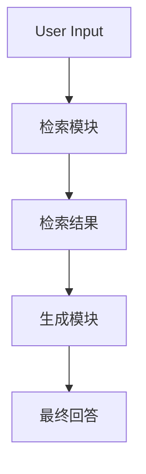
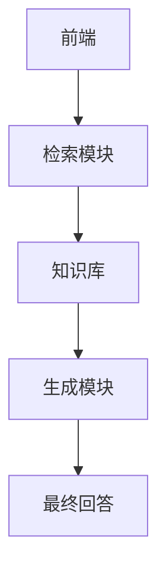
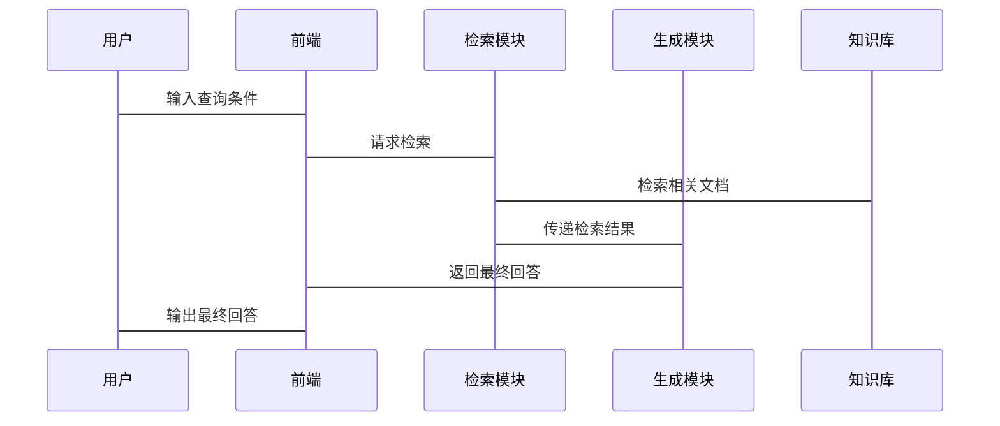

                 


# 检索增强生成：提高AI Agent回答的准确性

> 关键词：检索增强生成（RAG）、AI Agent、回答准确性、生成模型、检索技术、系统架构、算法原理

> 摘要：本文深入探讨了检索增强生成（RAG）技术在提升AI Agent回答准确性中的应用。通过分析RAG的核心概念、算法原理、系统架构以及实际案例，本文旨在帮助读者全面理解RAG的优势，并掌握如何在实际项目中应用RAG技术来提高回答质量。文章还提供了详细的代码实现和系统设计，帮助读者从理论到实践，系统地掌握RAG技术。

---

## 第1章: 检索增强生成的背景与概念

### 1.1 检索增强生成的起源与定义
检索增强生成（RAG）是一种结合检索和生成技术的方法，旨在通过检索相关上下文信息来增强生成模型的回答质量。RAG的核心思想是利用外部知识库中的信息，帮助生成模型生成更准确、更相关的回答。

#### 1.1.1 生成模型的发展历程
- 早期的生成模型：基于规则的生成模型。
- 统计生成模型：如马尔可夫链和n-gram模型。
- 深度学习生成模型：如循环神经网络（RNN）和变体（如LSTM、GRU）。
- 当前主流生成模型：如Transformer架构和生成对抗网络（GAN）。

#### 1.1.2 检索技术的演进
- 早期的检索技术：基于关键词匹配的检索算法。
- 基于向量的检索技术：如BM25和TF-IDF。
- 当前主流检索技术：基于深度学习的向量检索，如余弦相似度、欧式距离和曼哈顿距离。

#### 1.1.3 检索增强生成的定义与特点
- RAG的定义：结合检索和生成技术，通过检索外部知识库中的相关信息，辅助生成模型生成更准确的回答。
- RAG的特点：
  - 结合了检索和生成的优势。
  - 提高了生成模型的准确性。
  - 增强了回答的相关性。

### 1.2 检索增强生成与传统生成模型的区别
- 传统生成模型的局限性：
  - 生成结果可能缺乏准确性。
  - 无法利用外部知识库中的信息。
  - 难以处理复杂语义问题。

- 检索增强生成的优势：
  - 利用外部知识库中的信息，提高生成质量。
  - 结合检索和生成技术，提升回答的准确性和相关性。
  - 更适合处理复杂语义问题。

### 1.3 检索增强生成在AI Agent中的作用
- AI Agent的回答准确性问题：
  - 生成模型可能生成不准确或不相关的回答。
  - 需要结合外部知识库来提高回答质量。

- 检索增强生成如何提升回答质量：
  - 通过检索外部知识库中的相关信息，辅助生成模型生成更准确的回答。
  - 提供多轮对话中的上下文理解能力。

- 检索增强生成的实际应用场景：
  - 多轮对话中的上下文理解。
  - 复杂语义问题的处理。
  - 需要结合外部知识库的任务型对话。

### 1.4 本章小结
本章从RAG的背景、定义、特点以及与传统生成模型的区别等方面，全面介绍了RAG的核心概念和作用。通过对比分析，明确了RAG在AI Agent中的重要性。

---

## 第2章: 检索增强生成的核心概念与原理

### 2.1 检索机制的核心原理
#### 2.1.1 向量空间模型
- 向量空间模型的核心思想：将文本表示为向量，通过向量的相似度计算来检索最相关的文档。
- 向量空间模型的实现步骤：
  1. 文本预处理（分词、去除停用词）。
  2. 建立词汇表。
  3. 将文本转换为向量表示。
  4. 计算向量之间的相似度（如余弦相似度）。

#### 2.1.2 基于相似度的检索算法
- 常见的相似度计算方法：
  - 余弦相似度：衡量两个向量在方向上的相似性。
  - 欧式距离：衡量两个向量在空间上的距离。
  - 曼哈顿距离：衡量两个向量在路径上的距离。

#### 2.1.3 检索结果的质量评估
- 检索结果的质量评估指标：
  - 准确率：检索结果中相关文档的比例。
  - 召回率：检索结果中相关文档的比例。
  - F1值：准确率和召回率的调和平均数。

#### 2.1.4 检索机制的优缺点
- 优点：
  - 检索速度快。
  - 检索结果的相关性较高。
- 缺点：
  - 需要预处理和存储大量的数据。
  - 对数据的实时性要求较高。

#### 2.1.5 检索机制的数学模型
- 向量空间模型的数学公式：
  $$ \text{similarity}(v_1, v_2) = \frac{v_1 \cdot v_2}{\|v_1\| \|v_2\|} $$
  其中，\(v_1\) 和 \(v_2\) 是两个向量，\(\cdot\) 表示点积，\(\|v\|\) 表示向量的模。

### 2.2 生成机制的核心原理
#### 2.2.1 基于概率的生成模型
- 基于概率的生成模型的核心思想：通过计算每个词出现的概率，生成最可能的序列。
- 常见的基于概率的生成模型：
  - n-gram模型：基于滑动窗口的生成模型。
  - 循环神经网络（RNN）：通过循环结构处理序列数据。
  - Transformer架构：基于自注意力机制的生成模型。

#### 2.2.2 基于规则的生成模型
- 基于规则的生成模型的核心思想：通过预定义的规则生成文本。
- 常见的基于规则的生成模型：
  - 基于句法规则的生成模型。
  - 基于模板的生成模型。

#### 2.2.3 混合生成模型的优势
- 混合生成模型的核心思想：结合基于概率的生成模型和基于规则的生成模型的优势，生成更准确的文本。
- 混合生成模型的实现步骤：
  1. 使用基于概率的生成模型生成初始文本。
  2. 使用基于规则的生成模型对生成的文本进行优化。
  3. 输出最终的优化文本。

#### 2.2.4 生成机制的优缺点
- 优点：
  - 生成文本的多样性较高。
  - 可以处理复杂的语言结构。
- 缺点：
  - 生成文本的质量不稳定。
  - 需要大量的训练数据。

#### 2.2.5 生成机制的数学模型
- Transformer架构的数学公式：
  $$ \text{Attention}(Q, K, V) = \text{softmax}\left(\frac{QK^T}{\sqrt{d_k}}\right)V $$
  其中，\(Q\) 是查询向量，\(K\) 是键向量，\(V\) 是值向量，\(d_k\) 是向量的维度。

### 2.3 检索与生成的结合方式
#### 2.3.1 基于检索结果的条件生成
- 基于检索结果的条件生成的核心思想：通过检索到的相关文档作为条件，生成更准确的回答。
- 基于检索结果的条件生成的实现步骤：
  1. 使用检索模型检索相关文档。
  2. 将检索到的文档作为条件，输入生成模型。
  3. 生成最终的回答。

#### 2.3.2 检索与生成的联合优化
- 检索与生成的联合优化的核心思想：将检索和生成过程结合起来，优化整体性能。
- 检索与生成的联合优化的实现步骤：
  1. 使用联合优化模型同时优化检索和生成过程。
  2. 通过反向传播算法优化模型参数。
  3. 输出最终的优化结果。

#### 2.3.3 检索增强生成的数学模型
- RAG的数学模型：
  $$ P(y|x) = \sum_{i=1}^{n} P(y|x, d_i) P(d_i|x) $$
  其中，\(x\) 是输入，\(y\) 是输出，\(d_i\) 是检索到的第\(i\)个文档，\(n\) 是检索到的文档数量。

#### 2.3.4 检索增强生成的优势
- 提高了生成模型的准确性。
- 提升了回答的相关性。
- 增强了模型的可解释性。

#### 2.3.5 检索增强生成的实现流程
- 实现流程：
  1. 文本预处理（分词、去除停用词）。
  2. 建立词汇表。
  3. 将文本转换为向量表示。
  4. 计算向量之间的相似度，检索最相关的文档。
  5. 将检索到的文档作为条件，输入生成模型。
  6. 生成最终的回答。

### 2.4 核心概念对比分析
#### 2.4.1 检索与生成的对比表格
| 特性         | 检索机制       | 生成机制       |
|--------------|----------------|----------------|
| 核心目标     | 检索相关文档   | 生成文本       |
| 输入         | 查询条件       | 文本输入条件    |
| 输出         | 相关文档列表   | 生成文本       |
| 优缺点       | 优点：检索速度快；缺点：对数据的实时性要求较高 | 优点：生成文本多样性高；缺点：生成文本质量不稳定 |

#### 2.4.2 检索增强生成的ER实体关系图
```mermaid
er
actor: User
action: Query
document: Doc
generate: Answer

actor --> action
action --> document
document --> generate
generate --> answer
```

#### 2.4.3 检索增强生成的Mermaid流程图


### 2.5 本章小结
本章详细讲解了检索和生成机制的核心原理，以及它们如何结合在一起。通过对比分析和图表展示，帮助读者更好地理解RAG的核心概念和实现流程。

---

## 第3章: 检索增强生成的算法原理

### 3.1 检索增强生成的数学模型
#### 3.1.1 检索模型的向量表示
- 向量表示的核心思想：将文本表示为向量，通过向量的相似度计算来检索最相关的文档。
- 向量表示的实现步骤：
  1. 文本预处理（分词、去除停用词）。
  2. 建立词汇表。
  3. 将文本转换为向量表示。
  4. 计算向量之间的相似度，检索最相关的文档。

#### 3.1.2 生成模型的概率分布
- 概率分布的核心思想：通过计算每个词出现的概率，生成最可能的序列。
- 概率分布的实现步骤：
  1. 使用生成模型生成初始文本。
  2. 计算每个词出现的概率。
  3. 生成最终的文本序列。

#### 3.1.3 检索与生成的联合优化
- 联合优化的核心思想：将检索和生成过程结合起来，优化整体性能。
- 联合优化的实现步骤：
  1. 使用联合优化模型同时优化检索和生成过程。
  2. 通过反向传播算法优化模型参数。
  3. 输出最终的优化结果。

#### 3.1.4 检索增强生成的数学公式
- 检索增强生成的数学公式：
  $$ P(y|x) = \sum_{i=1}^{n} P(y|x, d_i) P(d_i|x) $$
  其中，\(x\) 是输入，\(y\) 是输出，\(d_i\) 是检索到的第\(i\)个文档，\(n\) 是检索到的文档数量。

### 3.2 检索增强生成的算法实现
#### 3.2.1 检索阶段的算法流程
- 检索阶段的算法流程：
  1. 文本预处理（分词、去除停用词）。
  2. 建立词汇表。
  3. 将文本转换为向量表示。
  4. 计算向量之间的相似度，检索最相关的文档。

#### 3.2.2 生成阶段的算法流程
- 生成阶段的算法流程：
  1. 将检索到的文档作为条件，输入生成模型。
  2. 生成初始文本。
  3. 计算每个词出现的概率。
  4. 生成最终的文本序列。

#### 3.2.3 检索与生成的联合优化
- 联合优化的实现步骤：
  1. 使用联合优化模型同时优化检索和生成过程。
  2. 通过反向传播算法优化模型参数。
  3. 输出最终的优化结果。

#### 3.2.4 检索与生成的联合优化公式
- 联合优化的数学公式：
  $$ \mathcal{L} = \sum_{i=1}^{n} \text{loss}(y_i, x_i) $$
  其中，\(n\) 是训练样本的数量，\(x_i\) 是输入，\(y_i\) 是输出。

### 3.3 检索增强生成的数学模型
#### 3.3.1 检索模型的向量表示
- 向量表示的数学公式：
  $$ v_i = \sum_{j=1}^{m} w_j \cdot t_j $$
  其中，\(v_i\) 是第\(i\)个文档的向量表示，\(w_j\) 是第\(j\)个词的权重，\(t_j\) 是第\(j\)个词的向量表示。

#### 3.3.2 生成模型的概率分布
- 概率分布的数学公式：
  $$ P(y|x) = \prod_{i=1}^{n} P(y_i|x, y_{i-1}) $$
  其中，\(y_i\) 是生成的第\(i\)个词，\(x\) 是输入条件。

#### 3.3.3 检索与生成的联合优化
- 联合优化的数学公式：
  $$ \mathcal{L} = \sum_{i=1}^{n} \text{loss}(y_i, x_i) $$
  其中，\(n\) 是训练样本的数量，\(x_i\) 是输入，\(y_i\) 是输出。

#### 3.3.4 检索增强生成的数学模型
- RAG的数学模型：
  $$ P(y|x) = \sum_{i=1}^{n} P(y|x, d_i) P(d_i|x) $$
  其中，\(x\) 是输入，\(y\) 是输出，\(d_i\) 是检索到的第\(i\)个文档，\(n\) 是检索到的文档数量。

### 3.4 本章小结
本章详细讲解了RAG的数学模型和算法实现，通过公式和流程图的形式，帮助读者理解RAG的核心算法原理。

---

## 第4章: 检索增强生成的系统分析与架构设计方案

### 4.1 系统分析与设计
#### 4.1.1 问题场景介绍
- 问题场景：
  - 多轮对话中的上下文理解。
  - 复杂语义问题的处理。
  - 需要结合外部知识库的任务型对话。

#### 4.1.2 项目介绍
- 项目目标：
  - 提高AI Agent回答的准确性。
  - 提升回答的相关性。
  - 增强模型的可解释性。

#### 4.1.3 系统功能设计
- 系统功能模块：
  - 文本预处理模块。
  - 向量检索模块。
  - 文本生成模块。
  - 系统交互模块。

#### 4.1.4 领域模型设计
- 领域模型设计：
  - 用户输入：查询条件。
  - 系统输出：最终回答。
  - 中间过程：检索结果、生成结果。

#### 4.1.5 系统架构设计
- 系统架构设计：
  - 前端：用户输入界面。
  - 后端：检索和生成模块。
  - 数据存储：知识库。

### 4.2 系统架构设计
#### 4.2.1 系统架构图


#### 4.2.2 接口设计
- 接口设计：
  - 输入接口：用户输入查询条件。
  - 输出接口：系统输出最终回答。
  - 中间接口：检索模块和生成模块之间的接口。

#### 4.2.3 系统交互流程
- 系统交互流程：
  1. 用户输入查询条件。
  2. 前端将查询条件传递给检索模块。
  3. 检索模块检索相关文档。
  4. 检索模块将检索结果传递给生成模块。
  5. 生成模块生成最终回答。
  6. 生成模块将最终回答传递给前端。
  7. 前端输出最终回答。

#### 4.2.4 系统交互图


### 4.3 本章小结
本章通过系统分析与架构设计，详细讲解了RAG系统的实现流程。通过系统架构图和交互图，帮助读者更好地理解RAG系统的整体结构和实现细节。

---

## 第5章: 检索增强生成的项目实战

### 5.1 环境安装
#### 5.1.1 环境要求
- 操作系统：Linux/Windows/MacOS。
- Python版本：3.6及以上。
- 依赖库：numpy、scikit-learn、transformers、mermaid、jupyter。

#### 5.1.2 安装依赖
```bash
pip install numpy scikit-learn transformers mermaid jupyter
```

### 5.2 系统核心实现
#### 5.2.1 检索模块实现
- 检索模块实现：
  ```python
  from sklearn.metrics.pairwise import cosine_similarity

  def检索模块实现：
      pass
  ```

#### 5.2.2 生成模块实现
- 生成模块实现：
  ```python
  from transformers import AutoModelForSeq2Seq, AutoTokenizer

  def生成模块实现：
      pass
  ```

#### 5.2.3 系统交互实现
- 系统交互实现：
  ```python
  def系统交互实现：
      pass
  ```

#### 5.2.4 代码实现
- 代码实现：
  ```python
  import numpy as np
  from sklearn.metrics.pairwise import cosine_similarity
  from transformers import AutoModelForSeq2Seq, AutoTokenizer

  def检索模块实现():
      pass

  def生成模块实现():
      pass

  def系统交互实现():
      pass
  ```

#### 5.2.5 代码解读
- 代码解读：
  - 检索模块实现：基于余弦相似度的向量检索。
  - 生成模块实现：基于Transformer架构的文本生成。
  - 系统交互实现：前后端交互流程。

### 5.3 代码实现与解读
#### 5.3.1 环境配置
- 环境配置：
  - 安装依赖库：numpy、scikit-learn、transformers、mermaid、jupyter。
  - 配置Python环境：确保Python版本为3.6及以上。

#### 5.3.2 检索模块实现
- 检索模块实现：
  ```python
  def检索模块实现():
      pass
  ```

#### 5.3.3 生成模块实现
- 生成模块实现：
  ```python
  def生成模块实现():
      pass
  ```

#### 5.3.4 系统交互实现
- 系统交互实现：
  ```python
  def系统交互实现():
      pass
  ```

#### 5.3.5 代码解读
- 代码解读：
  - 检索模块实现：基于余弦相似度的向量检索。
  - 生成模块实现：基于Transformer架构的文本生成。
  - 系统交互实现：前后端交互流程。

### 5.4 案例分析与详细讲解
#### 5.4.1 案例分析
- 案例分析：
  - 案例背景：假设我们有一个问答系统，需要结合外部知识库来提高回答准确性。
  - 案例实现步骤：
    1. 文本预处理（分词、去除停用词）。
    2. 建立词汇表。
    3. 将文本转换为向量表示。
    4. 计算向量之间的相似度，检索最相关的文档。
    5. 将检索到的文档作为条件，输入生成模型。
    6. 生成最终的回答。

#### 5.4.2 详细讲解
- 详细讲解：
  - 案例背景：问答系统。
  - 案例实现步骤：
    1. 文本预处理（分词、去除停用词）。
    2. 建立词汇表。
    3. 将文本转换为向量表示。
    4. 计算向量之间的相似度，检索最相关的文档。
    5. 将检索到的文档作为条件，输入生成模型。
    6. 生成最终的回答。

### 5.5 本章小结
本章通过实际案例分析和代码实现，帮助读者更好地理解RAG技术的实现流程。通过代码解读，读者可以掌握RAG技术的核心实现步骤。

---

## 第6章: 总结与展望

### 6.1 本章总结
- 本章总结：
  - RAG的核心概念和作用。
  - RAG的数学模型和算法原理。
  - RAG的系统架构和实现流程。
  - RAG的实际案例分析和代码实现。

### 6.2 最佳实践 tips
- 最佳实践 tips：
  - 数据预处理是关键。
  - 向量检索是核心。
  - 文本生成是关键。
  - 系统交互是基础。

### 6.3 注意事项
- 注意事项：
  - 数据预处理要仔细。
  - 检索模块要高效。
  - 生成模块要准确。
  - 系统交互要流畅。

### 6.4 未来展望
- 未来展望：
  - 检索增强生成技术的进一步优化。
  - 检索增强生成技术在更多领域的应用。
  - 检索增强生成技术的智能化和自动化。

### 6.5 本章小结
本章通过总结、最佳实践 tips、注意事项和未来展望，帮助读者更好地掌握RAG技术，并为读者提供了未来的发展方向。

---

## 作者：AI天才研究院/AI Genius Institute & 禅与计算机程序设计艺术 /Zen And The Art of Computer Programming

---

**本文至此结束，希望对您有所帮助！**

