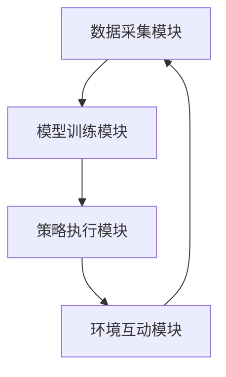

                 

# 模仿学习：从人类示范中学习的AI Agent

## 关键词：模仿学习，AI Agent，强化学习，深度学习，自然语言处理

## 摘要：模仿学习是一种通过观察和模仿人类行为来训练AI Agent的技术。本文从模仿学习的基本概念、算法原理、系统架构到实际应用案例，全面探讨了模仿学习的核心思想和实现方法。通过分析模仿学习的数学模型、算法实现和系统设计，本文为AI Agent的开发提供了理论基础和实践指导。

---

# 第一部分：模仿学习引言

## 第1章：模仿学习概述

### 1.1 模仿学习的背景与意义

#### 1.1.1 人工智能与模仿学习的起源
模仿学习（Imitation Learning）是人工智能领域的重要分支，起源于人类通过观察和模仿他人行为来学习的能力。在AI领域，模仿学习的目标是让AI Agent通过观察人类的行为示范，学习并模仿这些行为，从而实现类似人类的决策和操作能力。

#### 1.1.2 模仿学习的核心概念与目标
模仿学习的核心概念是通过观察专家的行为示范，学习其决策过程和操作方式。其目标是让AI Agent在没有明确规则的情况下，通过观察和模仿，掌握复杂任务的执行能力。模仿学习的关键在于如何将观察到的行为转化为可执行的策略。

#### 1.1.3 模仿学习在AI Agent中的应用价值
模仿学习在AI Agent中的应用广泛，包括机器人控制、自然语言处理、图像处理等领域。通过模仿学习，AI Agent能够快速学习人类的复杂行为，减少对大量试错的依赖，提高学习效率。

### 1.2 模仿学习的基本问题

#### 1.2.1 什么是模仿学习
模仿学习是一种通过观察和模仿他人行为来学习的技术。与监督学习和强化学习不同，模仿学习的输入是专家的行为示范，输出是模仿这些行为的策略。

#### 1.2.2 模仿学习的关键问题与挑战
模仿学习的核心挑战包括如何处理观察数据的不完全性、如何应对环境的不确定性，以及如何实现策略的泛化能力。

#### 1.2.3 模仿学习与其他学习范式的区别与联系
模仿学习与监督学习的区别在于，监督学习通过标签数据进行学习，而模仿学习通过观察专家行为进行学习。与强化学习的区别在于，强化学习通过与环境互动获得奖励，而模仿学习通过观察专家行为获得指导。

### 1.3 模仿学习的应用场景

#### 1.3.1 机器人控制与动作模仿
在机器人控制领域，模仿学习被广泛应用于机器人动作的模仿，例如教机器人如何抓取物体或移动手臂。

#### 1.3.2 自然语言处理中的模仿学习
在自然语言处理中，模仿学习被用于训练AI Agent进行对话生成，例如训练聊天机器人模仿人类对话方式。

#### 1.3.3 图像处理与视觉模仿
在图像处理领域，模仿学习被用于图像生成和图像分割任务，例如训练AI Agent模仿专家的手工标注行为。

#### 1.3.4 模仿学习在游戏AI中的应用
在游戏AI中，模仿学习被用于训练AI Agent模仿人类玩家的行为，例如训练AI在游戏中的策略制定和动作选择。

### 1.4 本章小结

#### 1.4.1 模仿学习的核心概念回顾
模仿学习是一种通过观察和模仿专家行为来学习的技术，其核心在于将观察到的行为转化为可执行的策略。

#### 1.4.2 模仿学习的关键问题与挑战
模仿学习的关键挑战包括数据的不完全性、环境的不确定性以及策略的泛化能力。

#### 1.4.3 模仿学习的应用前景展望
模仿学习在机器人控制、自然语言处理、图像处理和游戏AI等领域具有广泛的应用前景，未来将更加重要。

---

## 第2章：模仿学习的数学模型与算法原理

### 2.1 模仿学习的核心算法

#### 2.1.1 基于强化学习的模仿学习算法
基于强化学习的模仿学习算法通过与环境互动，模仿专家行为并获得奖励。典型算法包括Dagger算法。

#### 2.1.2 基于监督学习的模仿学习算法
基于监督学习的模仿学习算法通过监督信号，模仿专家行为并进行分类。典型算法包括模仿学习与监督学习结合的方法。

#### 2.1.3 基于对比学习的模仿学习算法
基于对比学习的模仿学习算法通过对比专家行为和非专家行为，学习专家行为的特征表示。

### 2.2 Dagger算法

#### 2.2.1 Dagger算法的基本原理
Dagger算法是一种基于强化学习的模仿学习算法，通过在专家指导下，逐步优化策略，最终实现专家行为的模仿。

#### 2.2.2 Dagger算法的数学模型
$$ J(\pi) = \mathbb{E}_{s,a \sim \rho_{\text{expert}}} \left[ \log \pi(a|s) \right] $$
其中，$\rho_{\text{expert}}$表示专家行为的概率分布，$\pi(a|s)$表示策略网络输出的动作概率。

#### 2.2.3 Dagger算法的步骤与流程
1. 初始化策略网络。
2. 通过专家指导收集行为数据。
3. 使用收集到的数据训练策略网络。
4. 使用策略网络与环境互动，收集新数据。
5. 重复训练和互动，直到策略网络收敛。

### 2.3 基于深度学习的模仿学习

#### 2.3.1 基于神经网络的模仿学习模型
基于神经网络的模仿学习模型通过深度神经网络学习专家行为的特征表示和决策策略。

#### 2.3.2 基于深度强化学习的模仿学习
基于深度强化学习的模仿学习结合深度神经网络和强化学习，通过与环境互动模仿专家行为。

#### 2.3.3 基于生成对抗网络的模仿学习
基于生成对抗网络的模仿学习通过生成对抗网络，学习专家行为的生成模型。

### 2.4 模仿学习的数学推导与公式解释

#### 2.4.1 模仿学习的损失函数
$$ L = -\sum_{i=1}^n \log p(a_i|x_i) $$
其中，$p(a_i|x_i)$表示策略网络输出的动作概率，$x_i$表示输入状态，$a_i$表示专家动作。

#### 2.4.2 模仿学习的梯度下降过程
通过计算损失函数的梯度，更新策略网络的参数：
$$ \theta \leftarrow \theta - \eta \frac{\partial L}{\partial \theta} $$
其中，$\eta$表示学习率。

#### 2.4.3 模仿学习的收敛性分析
模仿学习算法的收敛性依赖于数据质量、模型复杂度和环境特性。通过合理的算法设计和参数调整，模仿学习可以逐步收敛到专家策略。

---

## 第3章：基于深度学习的模仿学习算法

### 3.1 基于神经网络的模仿学习模型

#### 3.1.1 模型结构与输入输出
基于神经网络的模仿学习模型通常采用卷积神经网络或循环神经网络，输入为状态或观测，输出为动作或策略。

#### 3.1.2 神经网络的训练过程
1. 收集专家行为数据。
2. 使用专家数据训练神经网络。
3. 使用训练好的神经网络指导AI Agent与环境互动。
4. 使用新的数据进一步优化模型。

#### 3.1.3 模型的评估与优化
通过与专家行为的对比，评估模型的模仿效果，并通过调整网络结构和超参数优化模型性能。

### 3.2 基于强化学习的模仿学习

#### 3.2.1 强化学习的基本原理
强化学习通过与环境互动，获得奖励信号，逐步优化策略。

#### 3.2.2 模仿学习在强化学习中的应用
通过模仿专家行为，强化学习算法可以更快地收敛到最优策略。

#### 3.2.3 基于策略梯度的模仿学习
基于策略梯度的模仿学习通过梯度下降优化策略网络，使其输出的动作概率接近专家行为。

### 3.3 基于对比学习的模仿学习

#### 3.3.1 对比学习的基本原理
对比学习通过对比正样本和负样本，学习数据的特征表示。

#### 3.3.2 对比学习在模仿学习中的应用
通过对比专家行为和非专家行为，学习专家行为的特征表示，提高模型的区分能力。

#### 3.3.3 对比学习的优势
对比学习可以有效提高模型的泛化能力，增强模型对不同环境的适应性。

---

## 第4章：模仿学习的实际应用案例

### 4.1 机器人控制与动作模仿

#### 4.1.1 机器人控制中的模仿学习
通过模仿学习，机器人可以快速学习人类的动作，例如抓取物体、移动手臂等。

#### 4.1.2 模仿学习在机器人控制中的优势
模仿学习可以减少机器人训练的时间和成本，提高训练效率。

### 4.2 自然语言处理中的模仿学习

#### 4.2.1 对话生成中的模仿学习
通过模仿人类对话方式，训练AI Agent进行自然语言对话。

#### 4.2.2 模仿学习在自然语言处理中的应用
模仿学习可以用于文本生成、机器翻译等任务，提高生成结果的自然性和流畅性。

### 4.3 图像处理与视觉模仿

#### 4.3.1 图像生成中的模仿学习
通过模仿专家的手工标注行为，训练AI Agent进行图像分割和图像生成。

#### 4.3.2 模仿学习在图像处理中的优势
模仿学习可以提高图像处理的精度和准确性，减少人工标注的工作量。

### 4.4 游戏AI中的模仿学习

#### 4.4.1 游戏AI中的模仿学习应用
通过模仿人类玩家的行为，训练AI Agent进行游戏策略的制定和动作的选择。

#### 4.4.2 模仿学习在游戏AI中的优势
模仿学习可以提高游戏AI的智能性和可玩性，增强游戏体验。

---

## 第5章：模仿学习的系统架构设计

### 5.1 系统功能设计

#### 5.1.1 系统模块划分
模仿学习系统通常包括数据采集模块、模型训练模块、策略执行模块和环境互动模块。

#### 5.1.2 系统功能流程
1. 数据采集模块收集专家行为数据。
2. 模型训练模块训练模仿学习模型。
3. 策略执行模块将模型应用于实际环境。
4. 环境互动模块与环境进行实时互动，调整模型参数。

### 5.2 系统架构设计

#### 5.2.1 系统架构图

#### 5.2.2 系统模块交互
数据采集模块负责收集专家行为数据，模型训练模块负责训练模仿学习模型，策略执行模块负责将模型应用于实际环境，环境互动模块负责与环境进行实时互动。

---

## 第6章：模仿学习的挑战与未来方向

### 6.1 模仿学习的挑战

#### 6.1.1 数据需求与多样性
模仿学习需要大量高质量的专家行为数据，数据的多样性和代表性直接影响模型的性能。

#### 6.1.2 环境的不确定性和动态性
模仿学习面临的环境不确定性较高，模型的泛化能力是其应用中的主要挑战。

#### 6.1.3 策略的可解释性与安全性
模仿学习的策略通常缺乏可解释性，安全性问题也需要进一步研究。

### 6.2 模仿学习的未来方向

#### 6.2.1 模仿学习与强化学习的结合
未来的研究方向包括将模仿学习与强化学习结合，提高模型的适应性和智能性。

#### 6.2.2 多模态模仿学习
多模态模仿学习将结合多种感知方式，提高模型的综合能力。

#### 6.2.3 模仿学习的实时性与效率
未来的研究将致力于提高模仿学习的实时性和效率，使其能够应用于更多实时任务。

---

## 第7章：总结与展望

### 7.1 本章总结

#### 7.1.1 模仿学习的核心概念回顾
模仿学习是一种通过观察和模仿专家行为来学习的技术，其核心在于将观察到的行为转化为可执行的策略。

#### 7.1.2 模仿学习的关键问题与挑战
模仿学习的关键挑战包括数据的不完全性、环境的不确定性以及策略的泛化能力。

#### 7.1.3 模仿学习的应用前景展望
模仿学习在机器人控制、自然语言处理、图像处理和游戏AI等领域具有广泛的应用前景，未来将更加重要。

### 7.2 未来展望

#### 7.2.1 模仿学习的进一步研究方向
未来的研究方向包括模仿学习与强化学习的结合、多模态模仿学习以及提高策略的可解释性和安全性。

#### 7.2.2 模仿学习在更多领域的应用
模仿学习将在更多领域得到应用，例如医疗、教育、服务机器人等。

---

## 作者：AI天才研究院/AI Genius Institute & 禅与计算机程序设计艺术 /Zen And The Art of Computer Programming

