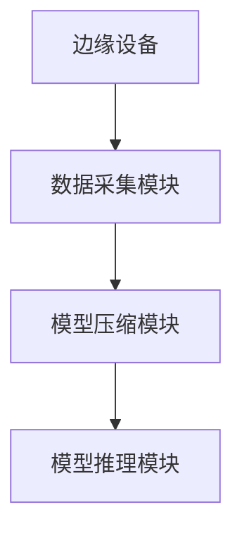

                 


# 模型压缩：在边缘设备部署轻量级AI Agent

> 关键词：模型压缩，边缘设备，轻量级AI Agent，量化，剪枝，知识蒸馏

> 摘要：随着人工智能技术的快速发展，边缘设备上的计算需求不断增加。然而，边缘设备的计算资源有限，部署大型AI模型面临诸多挑战。模型压缩技术成为解决这一问题的关键。本文将详细介绍模型压缩的核心原理、算法实现、系统架构设计及项目实战，帮助读者在边缘设备上成功部署轻量级AI Agent。

---

## 第一章：模型压缩概述

### 1.1 模型压缩的背景与意义

#### 1.1.1 边缘设备的计算资源限制
边缘设备（如物联网设备、移动终端等）通常具有计算资源有限、存储空间不足、网络带宽受限等特点。这些限制使得直接在边缘设备上部署大型AI模型（如深度学习模型）变得困难。

#### 1.1.2 大模型在边缘部署的挑战
大型AI模型（如BERT、GPT等）在云端运行表现优异，但在边缘设备上面临以下问题：
- **计算能力不足**：边缘设备的CPU和GPU性能有限，难以处理复杂的深度学习模型。
- **存储空间不足**：大型模型的参数数量庞大，难以在边缘设备的有限存储空间中部署。
- **网络延迟**：将所有计算任务发送到云端会导致延迟增加，影响实时性。

#### 1.1.3 模型压缩的目标与价值
模型压缩的目标是通过减少模型的计算量和存储需求，使其能够在边缘设备上高效运行。具体价值包括：
- **降低资源消耗**：减少计算、存储和带宽资源的使用。
- **提升部署效率**：快速在边缘设备上部署AI模型。
- **增强实时性**：减少对云端的依赖，提升本地推理速度。

---

### 1.2 模型压缩的核心概念

#### 1.2.1 模型压缩的定义与分类
模型压缩是指通过减少模型的参数数量、简化模型结构或降低模型精度等方法，使得模型在保持性能的同时，能够在资源受限的设备上高效运行。常见的模型压缩方法包括：
- **量化**：降低模型参数的位宽（如从32位浮点数降低到8位整数）。
- **剪枝**：移除模型中冗余的神经元或连接。
- **知识蒸馏**：通过教师模型指导学生模型，减少学生模型的参数数量。

#### 1.2.2 轻量级AI Agent的特征
轻量级AI Agent是指在边缘设备上运行的、资源占用低且性能优越的AI模型。其主要特征包括：
- **低计算复杂度**：模型推理速度快，适合实时任务。
- **小存储 footprint**：模型参数占用空间少。
- **高准确性**：在压缩后仍能保持较高的预测准确率。

#### 1.2.3 模型压缩与AI Agent的关系
模型压缩是实现轻量级AI Agent的核心技术。通过模型压缩，AI Agent可以在资源受限的边缘设备上高效运行，满足实时性、响应速度和本地计算的需求。

---

## 第二章：模型压缩的核心原理

### 2.1 模型压缩的核心技术

#### 2.1.1 量化压缩原理
量化是一种通过降低数值位宽来减少模型参数数量的技术。例如，将32位浮点数参数压缩到8位整数，可以显著减少模型的存储需求。

#### 2.1.2 神经网络剪枝原理
剪枝是一种通过移除模型中冗余的神经元或连接来减少模型复杂度的技术。例如，移除那些对模型输出影响较小的神经元。

#### 2.1.3 知识蒸馏压缩原理
知识蒸馏是一种通过教师模型指导学生模型的技术。教师模型通常是一个大模型，而学生模型是一个小模型。通过蒸馏过程，学生模型可以继承教师模型的知识，同时保持较小的参数规模。

---

### 2.2 模型压缩的数学模型

#### 2.2.1 量化压缩的数学公式
量化过程可以表示为：
$$
y = \text{quantize}(x, \text{bit-width})
$$
其中，$x$ 是原始数值，$y$ 是量化后的数值，$\text{bit-width}$ 是量化位数。

#### 2.2.2 剪枝的数学模型
剪枝通常基于模型参数的重要性进行排序，移除重要性最低的参数。例如，可以使用LASSO回归（L1正则化）来衡量参数的重要性：
$$
\text{损失函数} = \text{交叉熵损失} + \lambda \sum |w|
$$
其中，$\lambda$ 是正则化系数，$w$ 是模型参数。

#### 2.2.3 知识蒸馏的数学表达
知识蒸馏通常使用软目标标签（Soft Label）来指导学生模型的训练。软目标标签可以通过对教师模型的输出进行概率分布平滑得到。

---

### 2.3 模型压缩的算法流程

#### 2.3.1 模型压缩的通用流程
1. **训练教师模型**：训练一个大型模型作为教师。
2. **提取特征或概率分布**：从教师模型中提取特征或软标签。
3. **训练学生模型**：使用提取的特征或软标签训练一个小型模型。
4. **量化或剪枝**：进一步压缩学生模型的参数。

#### 2.3.2 常用模型压缩算法对比
| 技术 | 优点 | 缺点 |
|------|------|------|
| 量化 | 参数减少，存储空间小 | 精度可能下降 |
| 剪枝 | 计算复杂度降低 | 部分功能可能受限 |
| 蒸馏 | 模型性能较好 | 训练时间较长 |

---

## 第三章：模型压缩算法实现

### 3.1 模型压缩算法的选择与实现

#### 3.1.1 基于量化压缩的实现
量化实现的关键在于选择合适的量化位数和优化量化后的模型精度。例如，使用8位整数量化可以显著减少模型参数的存储需求。

#### 3.1.2 基于剪枝压缩的实现
剪枝实现的关键在于如何有效地识别和移除冗余参数。通常可以使用L1正则化来衡量参数的重要性。

#### 3.1.3 基于蒸馏压缩的实现
蒸馏实现的关键在于如何设计教师模型和学生模型的交互。通常，学生模型的架构要比教师模型简单。

---

### 3.2 模型压缩的代码实现

#### 3.2.1 Python代码实现
以下是一个简单的量化压缩示例（使用PyTorch）：
```python
import torch

def quantize_model(model, bits=8):
    for param in model.parameters():
        scale = 2 ** (bits - 1)
        param.data = param.data / scale
        param.data = param.data.round() * scale
    return model
```

#### 3.2.2 模型压缩算法的优化
优化量化压缩算法可以通过动态调整量化位数和自适应量化策略来提升模型性能。

#### 3.2.3 压缩后的模型评估
评估压缩后的模型性能时，需要关注以下几个指标：
- **准确率**：模型在压缩后的测试集上的准确率。
- **推理速度**：模型在边缘设备上的推理速度。
- **存储需求**：模型参数的存储空间。

---

## 第四章：模型压缩的系统架构设计

### 4.1 系统架构设计

#### 4.1.1 问题场景介绍
边缘设备上部署AI Agent的典型场景包括图像识别、语音识别、自然语言处理等。

#### 4.1.2 系统功能设计
- **数据采集**：从边缘设备采集数据。
- **模型压缩**：对模型进行压缩，使其适应边缘设备的资源限制。
- **模型部署**：将压缩后的模型部署到边缘设备上。
- **模型推理**：在边缘设备上进行实时推理。

#### 4.1.3 系统架构设计图


---

## 第五章：模型压缩的项目实战

### 5.1 项目实战：图像分类模型的压缩与部署

#### 5.1.1 环境配置
- 操作系统：Linux
- 深度学习框架：TensorFlow或PyTorch
- 边缘设备： Raspberry Pi

#### 5.1.2 代码实现
```python
import tensorflow as tf

# 加载预训练模型
model = tf.keras.applications.VGG16(weights='imagenet', include_top=True)

# 定义量化函数
def quantize_model(model, bits=8):
    for layer in model.layers:
        if isinstance(layer, tf.keras.layers.Dense):
            weights = layer.get_weights()
            scale = 2 ** (bits - 1)
            weights[0] = weights[0] / scale
            weights[0] = weights[0].round() * scale
            layer.set_weights(weights)
    return model

# 压缩模型
quantized_model = quantize_model(model, bits=8)
```

#### 5.1.3 测试与优化
- **测试准确率**：压缩后的模型在测试集上的准确率。
- **优化建议**：根据测试结果调整量化位数或剪枝策略。

---

## 第六章：模型压缩的优化与展望

### 6.1 优化策略

#### 6.1.1 动态量化
动态量化可以根据输入数据的特性自适应地调整量化位数。

#### 6.1.2 自适应剪枝
自适应剪枝可以根据模型的结构动态地选择剪枝策略。

#### 6.1.3 模型蒸馏的优化
通过优化教师模型和学生模型的交互，可以进一步提升蒸馏的效果。

---

### 6.2 未来展望

#### 6.2.1 模型压缩技术的进一步发展
随着AI技术的不断进步，模型压缩技术将更加智能化和自动化。

#### 6.2.2 边缘设备的未来发展
边缘设备的计算能力将不断提升，为模型压缩技术提供更多可能性。

---

## 第七章：总结与致谢

### 7.1 总结
模型压缩是实现边缘设备上轻量级AI Agent的核心技术。通过量化、剪枝和蒸馏等方法，可以在保证模型性能的同时，显著降低模型的计算和存储需求。

### 7.2 致谢
感谢读者的耐心阅读，感谢所有在模型压缩领域做出贡献的 researchers 和 developers。

---

**作者：AI天才研究院 & 禅与计算机程序设计艺术**

